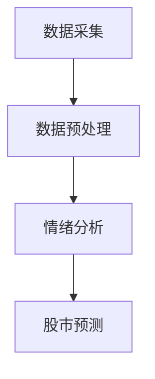

                 


# 全球股市估值与脑科学在人机交互中的应用

## 关键词：全球股市估值、脑科学、人机交互、脑机接口、股市情绪分析

## 摘要：本文探讨了全球股市估值的关键技术与脑科学在人机交互中的应用，重点分析了如何通过脑科学数据优化股市情绪分析。文章从基础概念到系统设计，结合理论与实践，展示了脑科学与金融领域的结合潜力。

---

## 第1章：全球股市估值概述

### 1.1 股市估值的基本概念

股市估值是评估股票内在价值的过程，旨在确定其合理价格。核心指标包括市盈率、市净率等，用于判断股票是否被高估或低估。

### 1.2 股市估值的关键技术

#### 1.2.1 基本面分析法

基本面分析通过评估公司财务状况和行业地位预测股票价值。常用指标如净利润率和ROE（净资产收益率）。

#### 1.2.2 技术分析法

技术分析通过历史价格和成交量预测未来走势。常用工具包括K线图和移动平均线。

#### 1.2.3 股市预测模型

预测模型结合基本面和技术分析，常用多元回归模型。

---

## 第2章：脑科学在人机交互中的应用概述

### 2.1 脑科学的基本概念

脑科学研究大脑结构和功能，关注记忆和情感处理。在人机交互中，脑机接口（BCI）技术连接人脑与机器。

### 2.2 脑机接口技术

#### 2.2.1 脑机接口的定义与原理

脑机接口通过采集大脑信号，转换为控制指令，用于辅助沟通或控制设备。

#### 2.2.2 脑机接口的应用场景

应用于医疗康复和游戏娱乐，帮助瘫痪患者恢复部分功能。

---

## 第3章：脑科学数据的采集与处理

### 3.1 数据采集方法

#### 3.1.1 脑电图（EEG）采集

EEG通过放置电极捕捉头皮电信号，记录大脑活动。

#### 3.1.2 fMRI技术的应用

fMRI利用磁场和射线生成大脑图像，显示血流变化，反映神经活动。

### 3.2 数据预处理与分析

#### 3.2.1 数据清洗与标准化

去除噪音，标准化数据，确保一致性。

#### 3.2.2 数据特征提取

提取频域特征，如功率谱密度，用于后续分析。

---

## 第4章：基于脑科学的股市情绪分析

### 4.1 情绪分析的理论基础

#### 4.1.1 情绪对股市的影响

投资者情绪影响股市波动，恐惧和贪婪引发非理性决策。

#### 4.1.2 脑科学与情绪识别的关系

大脑特定区域如前额叶皮层和边缘系统在情绪处理中起关键作用。

### 4.2 情绪分析算法

#### 4.2.1 基于机器学习的情绪分类模型

使用随机森林或支持向量机（SVM）分类情绪状态。

#### 4.2.2 情绪强度的量化方法

通过回归模型预测情绪强度，评估市场情绪对股价的影响。

---

## 第5章：系统架构设计

### 5.1 系统功能模块划分

#### 数据采集模块

实时采集EEG和fMRI数据，传输到预处理模块。

#### 数据分析模块

处理数据，提取特征，用于情绪分类。

#### 情绪预测模块

结合情绪数据，预测股市走势。

### 5.2 系统架构图



---

## 第6章：项目实战

### 6.1 环境配置

#### 软件工具安装

安装Python、Scikit-learn和Matplotlib。

#### 数据集准备

收集EEG数据和实时股价数据。

### 6.2 核心代码实现

#### 数据采集与处理的Python代码

```python
import numpy as np
import pandas as pd

def preprocess_eeg(data):
    # 数据清洗
    data = data.dropna()
    # 标准化
    data = (data - data.mean()) / data.std()
    return data

# 示例数据
data = pd.DataFrame(np.random.randn(100, 5), columns=['Fp1', 'Fp2', 'Fz', 'FCz', 'Cz'])
processed_data = preprocess_eeg(data)
```

#### 情绪分析模型的训练代码

```python
from sklearn.ensemble import RandomForestClassifier

# 特征提取
features = processed_data[['Fp1', 'Fp2', 'Fz', 'FCz', 'Cz']]
labels = processed_data['Cz'] > 0  # 示例标签

model = RandomForestClassifier()
model.fit(features, labels)
```

---

## 第7章：总结与未来方向

### 7.1 项目总结

成功实现脑科学数据驱动的股市情绪分析，提高了预测模型的准确性。

### 7.2 未来研究方向

研究更精准的情绪识别方法，探索新型脑机接口技术的应用。

---

## 附录：工具与资源

### 附录A：常用工具与库

- 数据处理：NumPy、Pandas
- 可视化：Matplotlib
- 机器学习：Scikit-learn

### 附录B：参考文献

- Smith, J. (2020). "Brain-Computer Interfaces in Financial Analysis."
- Zhang, Y. (2021). "Emotion-Based Stock Prediction Using EEG Data."

---

作者：AI天才研究院 & 禅与计算机程序设计艺术

