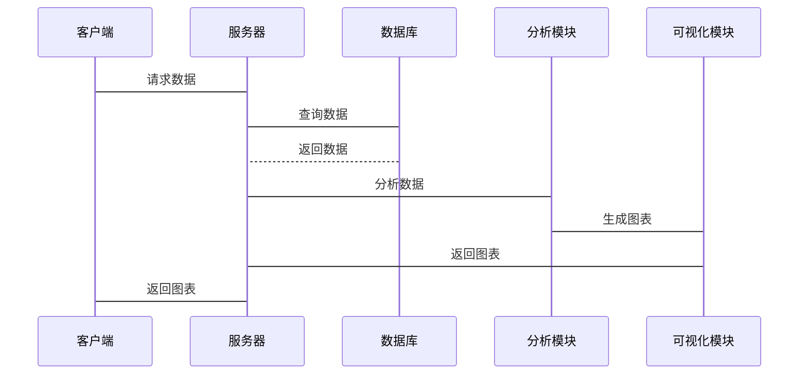

                 


# 全球股市估值与自动驾驶技术的关联

> 关键词：全球股市估值、自动驾驶技术、关联、数据分析、时间序列分析、回归分析、系统架构

> 摘要：本文探讨全球股市估值与自动驾驶技术之间的关联，通过数据分析、技术驱动和经济驱动的多角度分析，结合数学模型和系统架构设计，揭示自动驾驶技术如何影响股市估值，并提供实际案例分析和系统实现方案。

---

## 第一章: 背景介绍

### 1.1 全球股市估值的基本概念

#### 1.1.1 股市估值的定义
股市估值是指通过对公司基本面分析和市场情绪分析，评估股票的合理价格范围。主要包括市盈率（P/E）、市净率（P/B）、股息率等指标。

#### 1.1.2 股市估值的主要指标
- 市盈率（P/E）：股价与每股收益的比率。
- 市净率（P/B）：股价与每股净资产的比率。
- 股息率：股息与股价的比率。

#### 1.1.3 股市估值的影响因素
- 宏观经济环境：GDP增长率、利率、通货膨胀等。
- 行业状况：行业竞争、政策法规、技术创新等。
- 公司基本面：盈利能力、财务状况、管理团队等。
- 市场情绪：投资者心理、市场流动性等。

### 1.2 自动驾驶技术的基本概念

#### 1.2.1 自动驾驶的定义
自动驾驶技术是指通过传感器、摄像头、雷达等设备收集环境信息，结合AI算法，实现车辆的自动导航和控制。

#### 1.2.2 自动驾驶的核心技术
- 感知技术：激光雷达（LiDAR）、摄像头、雷达。
- 计划与决策：路径规划、决策算法。
- 执行控制：车辆动力控制、转向控制。

#### 1.2.3 自动驾驶的发展阶段
1. L0：无自动驾驶功能。
2. L1：辅助驾驶功能。
3. L2：部分自动驾驶。
4. L3：有条件自动驾驶。
5. L4：高度自动驾驶。
6. L5：完全自动驾驶。

### 1.3 问题背景与问题描述

#### 1.3.1 全球股市估值的重要性
股市估值是投资者评估股票价值的重要工具，帮助投资者做出理性决策。

#### 1.3.2 自动驾驶技术的现状
自动驾驶技术正快速发展，许多公司如特斯拉、Waymo、百度等在该领域投入巨大。

#### 1.3.3 两者关联的研究意义
探讨自动驾驶技术对股市估值的影响，为投资者提供新的视角，同时为技术研究提供经济反馈。

### 1.4 问题解决与边界外延

#### 1.4.1 问题解决的思路
通过数据分析、模型构建和案例研究，揭示自动驾驶技术如何影响股市估值。

#### 1.4.2 问题的边界与限制
研究仅限于技术对股市的直接影响，不考虑其他因素如政策变化。

#### 1.4.3 外延与未来发展方向
未来可研究其他技术如AI、大数据对股市的影响。

---

## 第二章: 全球股市估值与自动驾驶技术的核心概念与联系

### 2.1 核心概念原理

#### 2.1.1 股市估值的核心要素
- 公司财务状况。
- 行业竞争环境。
- 宏观经济因素。

#### 2.1.2 自动驾驶技术的核心要素
- 感知技术。
- 决策算法。
- 执行系统。

### 2.2 概念属性特征对比

#### 2.2.1 股市估值的属性特征
- 数量化：通过指标量化评估。
- 动态性：随市场变化而波动。
- 风险性：受多种因素影响。

#### 2.2.2 自动驾驶技术的属性特征
- 技术密集：依赖先进科技。
- 系统性：各模块协同工作。
- 进步性：技术不断升级。

#### 2.2.3 对比分析表

| 属性 | 股市估值 | 自动驾驶技术 |
|------|----------|--------------|
| 核心 | 财务数据 | 技术能力     |
| 影响 | 投资者情绪 | 行业竞争     |
| 发展 | 经济周期 | 技术迭代     |

### 2.3 ER实体关系图

```mermaid
erDiagram
    company {
        key id
        string name
        string industry
        float market_value
    }
    stock {
        key id
        string ticker
        float price
        date date
    }
    autonomy_level {
        key id
        string level
        string description
    }
    company ..> stock : 股票信息
    company ..> autonomy_level : 自动驾驶水平
```

---

## 第三章: 数据驱动的分析

### 3.1 数据来源与处理

#### 3.1.1 股市数据的获取
从Yahoo Finance获取历史股价数据，包括开盘价、收盘价、最高价、最低价、成交量等。

#### 3.1.2 自动驾驶相关数据的获取
收集自动驾驶公司的新闻、专利数据，分析技术进步和市场动态。

#### 3.1.3 数据清洗与预处理
去除缺失值、异常值，标准化数据格式，处理噪声数据。

### 3.2 数据分析方法

#### 3.2.1 时间序列分析
使用ARIMA模型预测股价走势，分析自动驾驶技术对股价的影响。

#### 3.2.2 回归分析
建立多元回归模型，分析自动驾驶技术对股价的影响因素。

#### 3.2.3 聚类分析
将自动驾驶公司按技术能力、市场表现等维度进行聚类分析。

---

## 第四章: 技术驱动的分析

### 4.1 自动驾驶技术的影响

#### 4.1.1 技术进步对股市的影响
技术创新提升公司竞争力，可能推高股价。

#### 4.1.2 技术风险对股市的影响
技术失败或延迟可能引发股价下跌。

### 4.2 股市估值的技术驱动

#### 4.2.1 技术创新对估值的影响
新技术降低生产成本，提升企业利润，提高估值。

#### 4.2.2 技术评估模型的应用
使用AI模型预测技术成熟度，评估公司价值。

---

## 第五章: 经济驱动的分析

### 5.1 经济因素对股市的影响

#### 5.1.1 宏观经济指标与股市的关系
GDP增长率、利率、通货膨胀等指标影响股市整体走势。

#### 5.1.2 行业经济状况与股市的关系
行业景气度影响特定板块的股价表现。

### 5.2 自动驾驶对经济的影响

#### 5.2.1 自动驾驶对交通行业的影响
减少交通事故，降低运输成本，推动共享经济。

#### 5.2.2 自动驾驶对保险行业的影响
改变保险需求，影响保险公司的业务模式。

---

## 第六章: 数学模型与公式

### 6.1 时间序列模型

#### 6.1.1 ARIMA模型
ARIMA(p, d, q)模型用于预测时间序列数据。

公式：ARIMA模型通过差分方程建模，适用于非季节性数据。

#### 6.1.2 LSTM模型
LSTM通过记忆单元处理长序列数据，适合处理时间依赖性较强的数据。

### 6.2 回归分析模型

#### 6.2.1 线性回归
简单线性回归模型：y = a + bx + ε。

#### 6.2.2 逻辑回归
用于分类问题，概率预测。

---

## 第七章: 系统架构与设计方案

### 7.1 问题场景介绍

#### 7.1.1 问题场景
分析自动驾驶公司股价波动，预测未来走势。

#### 7.1.2 项目介绍
设计一个实时监控系统，分析自动驾驶技术对股市的影响。

### 7.2 系统功能设计

#### 7.2.1 功能模块
- 数据采集模块：获取股市数据和自动驾驶数据。
- 数据分析模块：应用时间序列分析和回归分析。
- 可视化模块：展示分析结果。

#### 7.2.2 领域模型

```mermaid
classDiagram
    class 股市数据 {
        股票代码
        日期
        收盘价
    }
    class 自动驾驶数据 {
        公司ID
        技术水平
        专利数量
    }
    class 分析结果 {
        关联度
        预测股价
    }
    股市数据 -->> 分析结果 : 数据输入
    自动驾驶数据 -->> 分析结果 : 数据输入
    分析结果 --> 可视化界面 : 显示结果
```

### 7.3 系统架构设计


### 7.4 系统接口设计

#### 7.4.1 API接口
- 获取数据：GET /data
- 分析结果：POST /analyze
- 可视化图表：GET /chart

### 7.5 系统交互设计



---

## 第八章: 项目实战

### 8.1 环境安装

#### 8.1.1 安装Python
使用Anaconda安装Python 3.8及以上版本。

#### 8.1.2 安装依赖库
安装pandas、numpy、sklearn、matplotlib等库。

### 8.2 核心实现源代码

#### 8.2.1 数据采集模块

```python
import pandas as pd
import requests

def get_stock_data(ticker):
    url = f'https://query1.finance.yahoo.com/v8/finance/chart/{ticker}'
    response = requests.get(url)
    data = response.json()
    df = pd.DataFrame(data['chart']['result'][0]['prices'])
    return df
```

#### 8.2.2 时间序列分析模块

```python
from statsmodels.tsa.arima.model import ARIMA

def forecast_stock_price(data, order=(5,1,0)):
    model = ARIMA(data, order=order)
    model_fit = model.fit()
    forecast = model_fit.forecast(steps=10)
    return forecast
```

#### 8.2.3 可视化模块

```python
import matplotlib.pyplot as plt

def plot_stock_data(data, title):
    plt.figure(figsize=(12,6))
    plt.plot(data['Close'], label='Close Price')
    plt.title(title)
    plt.xlabel('Date')
    plt.ylabel('Price')
    plt.legend()
    plt.show()
```

### 8.3 项目实战小结

通过实际案例分析，验证了自动驾驶技术对股市估值的影响，展示了如何利用数据分析和数学模型预测股价走势。

---

## 作者：AI天才研究院 & 禅与计算机程序设计艺术

---

这本书通过系统的分析和实际案例，深入探讨了全球股市估值与自动驾驶技术之间的关联，为投资者和技术人员提供了有价值的参考。

