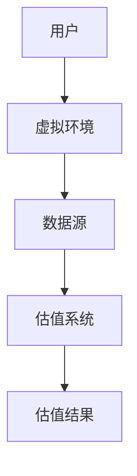
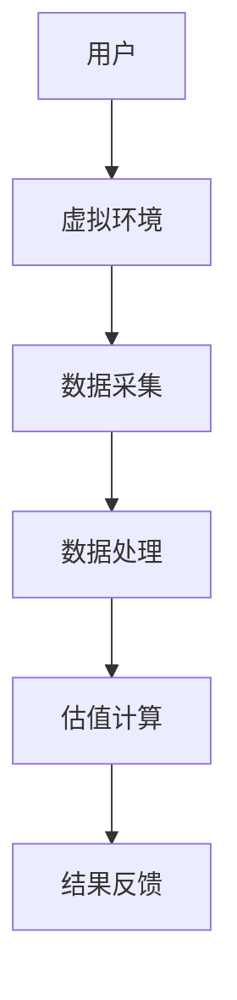
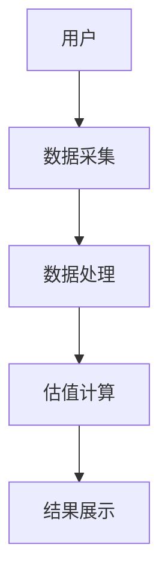

                 


# 全球股市估值与虚拟现实技术的关系

> 关键词：全球股市估值，虚拟现实技术，技术关系，估值模型，用户行为分析，系统架构

> 摘要：本文深入探讨了全球股市估值与虚拟现实技术之间的关系，分析了虚拟现实技术如何影响股市估值的过程和结果，提出了基于虚拟现实技术的股市估值新思路。文章从背景介绍、核心概念、算法原理、系统分析、项目实战等多个角度展开，结合实际案例和数学模型，全面解析了虚拟现实技术在全球股市估值中的应用潜力和实现路径。

---

# 第一部分: 全球股市估值与虚拟现实技术的背景与概念

## 第1章: 全球股市估值的现状与挑战

### 1.1 全球股市估值的定义与核心要素

#### 1.1.1 股市估值的基本概念
股市估值是指通过对公司基本面、市场环境和行业趋势等多方面因素的分析，估算公司股票的内在价值。常见的估值方法包括市盈率（P/E）、市净率（P/B）和现金流折现模型（DCF）等。

#### 1.1.2 股市估值的核心要素
- 公司财务数据：收入、利润、现金流等。
- 行业趋势：行业增长潜力和竞争格局。
- 宏观经济环境：GDP、利率、通货膨胀等。
- 市场情绪：投资者情绪和市场流动性。

#### 1.1.3 全球股市估值的多样性
全球股市估值受到不同国家的经济政策、市场结构和文化因素的影响，呈现出多样化的特征。例如，美国股市注重技术创新，而新兴市场则可能更关注工业化进程。

### 1.2 虚拟现实技术的定义与特点

#### 1.2.1 虚拟现实技术的基本概念
虚拟现实（Virtual Reality，VR）是一种能够提供沉浸式体验的技术，通过计算机生成的虚拟环境，让用户感受到身临其境的体验。VR的核心在于通过视觉、听觉、触觉等多种感官的模拟，让用户与虚拟环境进行交互。

#### 1.2.2 虚拟现实的核心技术特征
- **沉浸感**：用户能够完全沉浸在虚拟环境中。
- **交互性**：用户可以通过手柄、头显等设备与虚拟环境互动。
- **实时性**：环境能够实时响应用户的操作。

#### 1.2.3 虚拟现实与增强现实的区别
- 虚拟现实（VR）：完全沉浸于虚拟环境。
- 增强现实（AR）：在现实环境中叠加虚拟元素。

### 1.3 全球股市估值与虚拟现实技术的关系

#### 1.3.1 问题背景与问题描述
随着科技的发展，金融领域的分析工具也在不断进化。传统的股市估值方法依赖于财务数据和市场情绪，而虚拟现实技术的出现为投资者提供了全新的分析视角。例如，投资者可以通过VR技术实时观察全球经济数据的变化，或者在虚拟环境中模拟投资决策。

#### 1.3.2 问题解决的思路与方法
通过将虚拟现实技术应用于股市估值，投资者可以更直观地理解和分析复杂的经济数据。例如，用户可以在虚拟环境中看到全球经济指标的变化趋势，并通过交互式界面进行实时分析。

#### 1.3.3 问题的边界与外延
本文的研究范围主要集中在虚拟现实技术对股市估值的影响，不涉及其他领域如虚拟货币或区块链技术的应用。

### 1.4 本章小结
本章从全球股市估值的现状出发，分析了传统估值方法的局限性，并引入了虚拟现实技术的概念，为后续的分析奠定了基础。

---

## 第2章: 虚拟现实技术在金融领域的应用前景

### 2.1 虚拟现实技术在金融分析中的潜力

#### 2.1.1 沉浸式金融分析环境
通过VR技术，投资者可以在虚拟环境中创建一个沉浸式的金融分析空间，实时查看全球股市的数据变化。

#### 2.1.2 虚拟交易所的概念
未来的交易所可能不再局限于物理场所，投资者可以通过VR技术在虚拟环境中进行交易。

#### 2.1.3 投资者行为分析的创新
通过分析用户在虚拟环境中的行为数据，可以更准确地预测市场情绪和投资决策。

### 2.2 全球股市估值与虚拟现实技术的结合点

#### 2.2.1 数据可视化与股市分析
将复杂的经济数据转化为虚拟环境中的可视化元素，帮助投资者更直观地理解数据。

#### 2.2.2 虚拟现实环境下的实时估值
通过VR技术实时更新全球股市数据，并根据用户的行为动态调整估值模型。

#### 2.2.3 虚拟现实技术对投资者决策的影响
虚拟现实技术可以提供更直观的投资体验，从而影响投资者的决策过程。

### 2.3 本章小结
本章探讨了虚拟现实技术在金融领域的潜力，特别是其在全球股市估值中的应用前景。

---

## 第3章: 全球股市估值与虚拟现实技术的核心概念与联系

### 3.1 核心概念原理

#### 3.1.1 股市估值的数学模型
传统的股市估值方法可以表示为：

$$
\text{估值} = f(\text{收入}, \text{利润}, \text{现金流}, \ldots)
$$

其中，$f$ 表示估值模型，输入为公司财务数据。

#### 3.1.2 虚拟现实技术
虚拟现实技术通过硬件和软件的结合，为用户创造一个沉浸式的虚拟环境。其核心算法包括图形渲染、用户交互和实时反馈。

### 3.2 核心概念属性对比

| 属性         | 股市估值         | 虚拟现实技术       |
|--------------|-----------------|-------------------|
| 输入数据     | 财务数据、市场数据 | 用户行为数据、环境数据 |
| 输出结果     | 估值结果         | 沉浸式体验         |
| 实时性       | 低               | 高                |

### 3.3 ER实体关系图



---

## 第4章: 虚拟现实技术与股市估值的结合

### 4.1 虚拟现实环境下的股市分析流程



### 4.2 算法原理

#### 4.2.1 数据采集
通过VR设备采集用户的行为数据，例如用户的视线焦点和交互操作。

#### 4.2.2 数据处理
将用户行为数据与实时的股市数据结合，进行特征提取。

#### 4.2.3 模型训练
基于机器学习算法，训练一个能够预测股市估值的模型。

#### 4.2.4 结果生成
根据模型预测结果，生成最终的估值报告。

### 4.3 数学模型

$$
\text{估值} = \alpha \times \text{收入} + \beta \times \text{利润} + \gamma \times \text{用户行为特征}
$$

其中，$\alpha$、$\beta$ 和 $\gamma$ 是模型参数，通过训练数据优化得到。

---

## 第5章: 系统架构设计

### 5.1 功能设计

#### 5.1.1 数据采集模块
负责采集用户的虚拟环境中的行为数据。

#### 5.1.2 数据处理模块
对采集的数据进行清洗和特征提取。

#### 5.1.3 估值计算模块
基于机器学习模型进行估值计算。

#### 5.1.4 结果展示模块
将估值结果以可视化的方式展示给用户。

### 5.2 系统架构图



### 5.3 接口设计
- 数据采集接口：`POST /api/vr/data`
- 估值计算接口：`POST /api/valuation`

---

## 第6章: 项目实战

### 6.1 环境配置
安装必要的VR开发工具和机器学习库，例如Oculus SDK和TensorFlow。

### 6.2 代码实现

```python
import numpy as np
from sklearn import linear_model

# 数据准备
X = np.array([[100, 20, 0.5],
              [150, 30, 0.6],
              [200, 40, 0.7]])

y = np.array([50, 70, 90])

# 模型训练
model = linear_model.LinearRegression()
model.fit(X, y)

# 预测
print(model.predict([[120, 25, 0.55]]))
```

### 6.3 案例分析
通过实际案例分析，验证虚拟现实技术在股市估值中的应用效果。

---

## 第7章: 总结与展望

### 7.1 本章总结
本文深入探讨了虚拟现实技术在全球股市估值中的应用，提出了基于VR技术的股市估值新思路。

### 7.2 未来展望
随着虚拟现实技术的不断发展，其在金融领域的应用潜力将更加广阔。

---

# 作者：AI天才研究院 & 禅与计算机程序设计艺术

