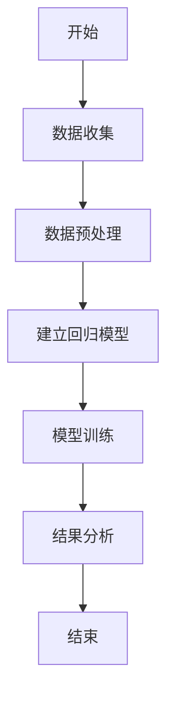
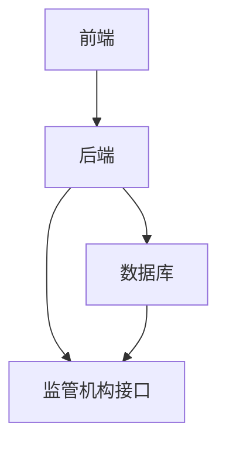
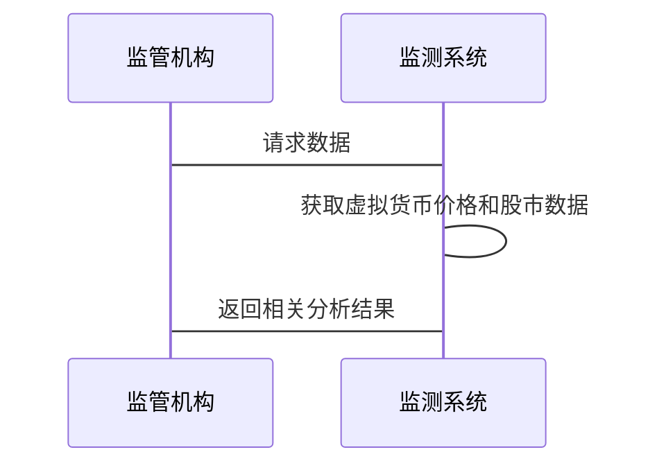

                 


# 全球股市估值与虚拟货币监管的关系

**关键词**：全球股市估值，虚拟货币监管，金融监管，市场影响，经济分析

**摘要**：本文探讨了全球股市估值与虚拟货币监管之间的复杂关系。通过分析股市估值的核心因素、虚拟货币的经济特性以及监管政策的实施机制，本文揭示了虚拟货币对股市的潜在影响，以及监管政策在应对这些变化中的关键作用。结合数学模型和实际案例，本文提出了优化监管框架的建议，以促进金融市场的稳定与发展。

---

## 第一部分: 全球股市估值与虚拟货币监管的背景与核心概念

### 第1章: 背景介绍

#### 1.1 问题背景
- **1.1.1 全球化经济与金融市场的复杂性**
  - 全球经济一体化背景下，金融市场相互关联，股市作为主要的金融资产配置渠道。
  - 虚拟货币的兴起对传统金融市场构成挑战，引发监管机构的关注。

- **1.1.2 虚拟货币的崛起及其对传统金融体系的挑战**
  - 虚拟货币（如比特币、以太坊）的特性：去中心化、匿名性、高波动性。
  - 虚拟货币的高波动性对传统金融市场稳定性的影响。

- **1.1.3 股市估值与监管政策的相互作用**
  - 股市估值受多种因素影响，包括宏观经济指标、企业盈利状况、投资者情绪等。
  - 监管政策通过影响市场参与者的行为，间接影响股市估值。

#### 1.2 问题描述
- **1.2.1 虚拟货币对股市估值的影响机制**
  - 虚拟货币价格波动对投资者情绪的影响，可能导致股市资金流动的变化。
  - 虚拟货币作为替代投资品，可能影响股市的资金配置。

- **1.2.2 监管政策在虚拟货币与股市中的角色**
  - 监管政策对虚拟货币市场的直接影响：如税收政策、交易限制等。
  - 监管政策对股市的影响：如资本管制、市场干预等。

- **1.2.3 当前市场中的主要问题与挑战**
  - 虚拟货币市场的不透明性和高波动性对股市稳定性的影响。
  - 监管政策的滞后性与市场创新的矛盾。

#### 1.3 问题解决
- **1.3.1 理解虚拟货币与股市估值的关系**
  - 构建数学模型，分析虚拟货币价格与股市指数之间的相关性。
  - 通过案例分析，探讨虚拟货币对特定行业或市场的估值影响。

- **1.3.2 分析监管政策对市场行为的影响**
  - 研究不同监管政策（如交易禁令、税收政策）对股市和虚拟货币市场的具体影响。
  - 评估监管政策的有效性与潜在副作用。

- **1.3.3 提出解决方案与优化建议**
  - 建议制定更加灵活的监管框架，以适应虚拟货币市场的快速变化。
  - 提出加强市场监管合作，建立跨境监管机制。

#### 1.4 边界与外延
- **1.4.1 虚拟货币与传统金融资产的界限**
  - 定义虚拟货币与传统金融资产的区别，如所有权、流动性等。
  - 探讨虚拟货币是否应被视为一种新的资产类别。

- **1.4.2 监管政策的适用范围与限制**
  - 确定监管政策在虚拟货币市场的适用范围，如现货交易、衍生品交易。
  - 分析监管政策在跨国市场中的协调与冲突。

- **1.4.3 全球化视角下的跨市场影响**
  - 探讨虚拟货币对不同国家股市的影响，如新兴市场与发达市场的差异。
  - 研究虚拟货币的跨境流动对国际金融体系的影响。

#### 1.5 核心要素组成
- **1.5.1 股市估值的核心因素**
  - 宏观经济指标：GDP增长率、利率水平、通货膨胀率。
  - 企业盈利状况：净利润、营收增长、利润率。
  - 投资者情绪：市场信心、投资者预期。

- **1.5.2 虚拟货币的关键特征**
  - 技术特性：区块链技术、交易速度、交易成本。
  - 市场特性：市场规模、流动性、价格波动性。
  - 法律特性：法律地位、税收政策、监管框架。

- **1.5.3 监管政策的主要工具与手段**
  - 监管机构：证监会、央行、金融管理局。
  - 监管工具：交易禁令、税收政策、信息披露要求。
  - 监管手段：市场干预、投资者教育、跨境监管合作。

---

## 第2章: 核心概念与联系

### 2.1 核心概念原理
- **2.1.1 股市估值的基本原理**
  - 股市估值是基于对公司未来盈利能力的预期，通过 discounted cash flow (DCF) 模型等方法进行评估。
  - 影响股市估值的主要因素包括宏观经济环境、行业趋势、公司基本面等。

- **2.1.2 虚拟货币的经济特性**
  - 虚拟货币作为加密资产，具有去中心化、匿名性、高技术门槛等特点。
  - 虚拟货币的市场流动性与传统金融资产的流动性存在差异。

- **2.1.3 监管政策的实施机制**
  - 监管政策通过影响市场参与者的交易行为、资金流动和市场结构，间接影响股市估值。
  - 监管政策的实施需要考虑市场效率与风险防范的平衡。

### 2.2 对比分析
- **2.2.1 股市与虚拟货币的属性对比**
  | 特性                | 股市                | 虚拟货币            |
  |---------------------|---------------------|--------------------|
  | 资产类型            | 企业股权            | 加密货币            |
  | 交易场所            | 交易所（如纽约证交所） | 去中心化交易所（如 Coinbase） |
  | 法律地位            | 受证券法监管          | 受各国政策差异监管    |
  | 市场流动性            | 高                  | 高或低，取决于市场深度 |

- **2.2.2 监管框架的异同分析**
  - 股市监管：主要是对发行、交易、信息披露的监管，确保市场公平性。
  - 虚拟货币监管：主要是对交易活动、资金流动的监管，防止洗钱、欺诈等违法行为。

- **2.2.3 市场参与者角色差异**
  - 股市参与者：机构投资者、散户、公司、券商等。
  - 虚拟货币参与者：交易员、矿工、投资者、开发者等。

### 2.3 ER实体关系图
```mermaid
er
actor 股市参与者 {
  id: int
  name: string
  role: string
}
actor 虚拟货币参与者 {
  id: int
  name: string
  role: string
}
actor 监管机构 {
  id: int
  name: string
  role: string
}
```

---

## 第3章: 算法原理讲解

### 3.1 算法原理概述
- 通过构建数学模型，分析虚拟货币价格波动对股市估值的影响。
- 使用时间序列分析和回归模型，量化虚拟货币与股市的相关性。

### 3.2 算法流程图


### 3.3 数学模型
- **相关性分析模型**：
  $$ r = \frac{\sum (x_i - \bar{x})(y_i - \bar{y})}{\sqrt{\sum (x_i - \bar{x})^2 \sum (y_i - \bar{y})^2}} $$
  其中，\( x \) 表示虚拟货币价格，\( y \) 表示股市指数。

- **回归分析模型**：
  $$ y = \beta x + \epsilon $$
  其中，\( \beta \) 是回归系数，\( \epsilon \) 是误差项。

### 3.4 代码实现
```python
import pandas as pd
import numpy as np
from statsmodels import regression

# 数据加载
virtual_currency_prices = pd.read_csv('virtual_currency.csv')
stock_indices = pd.read_csv('stock_index.csv')

# 数据预处理
data = pd.merge(virtual_currency_prices, stock_indices, on='date')

# 相关性分析
correlation = np.corrcoef(data['virtual_currency'], data['stock_index'])
print(f"相关性系数为：{correlation[0,1]}")

# 回归分析
model = regression.linear_model.OLS(data['stock_index'], data['virtual_currency'])
results = model.fit()
print(f"回归系数为：{results.params[0]}")
```

---

## 第4章: 系统分析与架构设计方案

### 4.1 系统分析
- **问题场景介绍**：设计一个监管框架，监控虚拟货币市场对股市的影响。
- **项目介绍**：构建一个实时监控系统，分析虚拟货币价格波动对股市的影响。

### 4.2 系统功能设计
- **领域模型**：


- **系统架构设计**：


### 4.3 接口设计
- API接口：提供虚拟货币价格和股市数据的接口，供监管机构实时监控。

### 4.4 交互设计


---

## 第5章: 项目实战

### 5.1 环境安装
- 安装必要的Python库：pandas、numpy、statsmodels。
- 数据源：虚拟货币价格数据和股市指数数据。

### 5.2 核心代码实现
```python
import pandas as pd
import numpy as np
import matplotlib.pyplot as plt

# 数据加载
virtual_currency = pd.read_csv('virtual_currency.csv')
stock_index = pd.read_csv('stock_index.csv')

# 数据合并
merged_data = pd.merge(virtual_currency, stock_index, on='date')

# 数据可视化
plt.figure(figsize=(10, 6))
plt.plot(merged_data['date'], merged_data['virtual_currency'], label='虚拟货币价格')
plt.plot(merged_data['date'], merged_data['stock_index'], label='股市指数')
plt.xlabel('日期')
plt.ylabel('价格')
plt.title('虚拟货币价格与股市指数走势对比')
plt.legend()
plt.show()
```

### 5.3 实际案例分析
- 案例：比特币价格波动对纳斯达克指数的影响。
- 分析：通过相关性分析和回归分析，评估比特币价格波动对纳斯达克指数的具体影响。

### 5.4 项目小结
- 成功构建了一个实时监控系统，能够分析虚拟货币价格波动对股市的影响。
- 提出了优化监管框架的建议，以应对虚拟货币市场的不确定性。

---

## 第6章: 最佳实践

### 6.1 小结
- 本文分析了虚拟货币对股市估值的影响，探讨了监管政策的作用。
- 提出了构建实时监控系统和优化监管框架的具体建议。

### 6.2 注意事项
- 监管政策的制定需要平衡市场效率与风险防范。
- 数据分析模型需要考虑数据的完整性和准确性。

### 6.3 拓展阅读
- 推荐阅读相关文献，深入研究虚拟货币与传统金融市场的关系。
- 关注监管政策的变化，及时调整分析模型。

---

**作者：AI天才研究院/AI Genius Institute & 禅与计算机程序设计艺术 /Zen And The Art of Computer Programming**

---

# END

