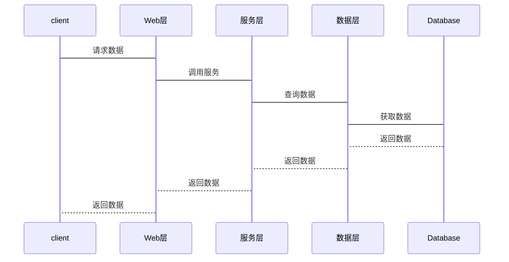

                 


# 全球股市估值与货币政策的关系

## 关键词：全球股市，货币政策，估值模型，经济周期，量化宽松

## 摘要：本文系统探讨了全球股市估值与货币政策之间的复杂关系，分析了货币政策工具如何影响股市估值，以及经济周期、通货膨胀等其他因素在其中的作用。通过具体案例分析和系统架构设计，构建了完整的分析框架，并提供了实际操作的项目实战指南。

---

## 第一部分：背景与理论基础

### 第1章：全球股市估值的基本概念

#### 1.1 股市估值的定义与核心要素

- **定义**：股市估值是指通过对上市公司的财务数据、市场环境等因素进行分析，确定其股票的合理价格。
- **核心指标**：
  - **市盈率（P/E）**：股票价格与每股收益的比率。
  - **市净率（P/B）**：股票价格与每股净资产的比率。
  - **股息率**：每年派发的股息与股票价格的比率。

#### 1.2 货币政策的基本原理

- **定义**：货币政策是由中央银行制定的控制货币供应量和利率的政策，以实现经济目标。
- **主要工具**：
  - **利率政策**：调整基准利率，影响市场资金成本。
  - **量化宽松**：通过购买国债或其他资产，增加市场流动性。
  - **存款准备金率**：调整商业银行必须持有的准备金比例。

#### 1.3 股市估值与货币政策的关系

- **直接关系**：利率下降通常会降低股票的分红再投资成本，提升股价。
- **间接关系**：货币政策影响企业融资成本和投资意愿，进而影响股市表现。

---

### 第2章：货币政策工具与股市估值

#### 2.1 利率政策对股市的影响

- **直接影响**：降低利率会降低借贷成本，刺激企业投资和消费者支出，提升股市估值。
- **间接影响**：通过影响债券收益率，改变资金在股债之间的分配。

#### 2.2 货币宽松政策对股市的影响

- **流动性增加**：量化宽松政策通过增加市场流动性，推高资产价格。
- **资产价格效应**：宽松政策降低了投资门槛，吸引更多资金流入股市。

#### 2.3 其他货币政策工具的影响

- **存款准备金率**：调整准备金率会影响银行的信贷能力，进而影响股市。
- **公开市场操作**：通过买卖政府债券调节市场流动性。

---

### 第3章：经济周期与股市估值

#### 3.1 经济周期对股市估值的影响

- **扩张期**：企业盈利增长，股市估值上升。
- **衰退期**：企业盈利下降，股市估值下跌。

#### 3.2 通货膨胀与股市估值

- **温和通胀**：提升企业盈利能力，利好股市。
- **高通胀**：可能导致央行加息，抑制股市表现。

#### 3.3 市场情绪与股市估值

- **投资者情绪**：市场情绪波动会影响股市估值，通常表现为短期波动。

---

## 第二部分：系统分析与架构设计

### 第4章：系统架构设计

#### 4.1 问题场景介绍

- **目标**：构建一个分析全球股市估值与货币政策关系的系统。

#### 4.2 领域模型设计

```mermaid
classDiagram
    class 股市估值 {
        市盈率
        市净率
        股息率
    }
    class 货币政策 {
        利率
        货币供应量
        货币政策工具
    }
    class 经济周期 {
        扩张期
        衰退期
    }
    股市估值 <--( 货币政策 )
    股市估值 <--( 经济周期 )
```

#### 4.3 系统架构设计


#### 4.4 接口设计与交互



---

### 第5章：项目实战

#### 5.1 环境配置

```bash
pip install pandas numpy matplotlib
```

#### 5.2 数据获取

```python
import pandas as pd
import numpy as np

# 获取全球主要股指数据
def get_stock_indices():
    indices = pd.read_csv('global_indices.csv')
    return indices

# 获取货币政策数据
def get货币政策_data():
    policy = pd.read_csv('policy_data.csv')
    return policy
```

#### 5.3 模型实现

```python
import matplotlib.pyplot as plt

def analyze_correlation():
    indices = get_stock_indices()
    policy = get货币政策_data()
    
    # 计算相关性
    correlation = indices['stock_price'].corr(policy['interest_rate'])
    print(f"相关性系数为: {correlation}")
    
    # 可视化
    plt.scatter(policy['interest_rate'], indices['stock_price'])
    plt.xlabel('利率')
    plt.ylabel('股价')
    plt.title('利率与股价的相关性')
    plt.show()
```

#### 5.4 实际案例分析

- **案例分析**：2008年金融危机后，美联储实施量化宽松政策，推动美国股市估值回升。

---

## 第三部分：最佳实践与小结

### 第6章：最佳实践

- **数据选择**：确保数据的准确性和全面性。
- **模型验证**：使用历史数据验证模型的有效性。
- **风险控制**：在实际投资中注意分散风险。

### 6.1 小结

本文系统分析了全球股市估值与货币政策的关系，构建了完整的分析框架，并通过实际案例和系统设计提供了具体的指导。读者可以结合实际数据进行深入分析，优化投资策略。

---

## 作者：AI天才研究院 & 禅与计算机程序设计艺术

---

以上就是《全球股市估值与货币政策的关系》的技术博客文章。文章通过系统化的分析和实际案例，帮助读者深入理解两者之间的关系，并提供了可操作的指导。

