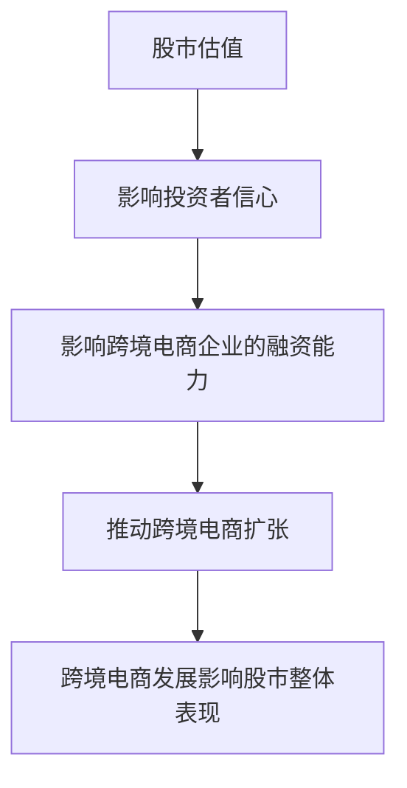
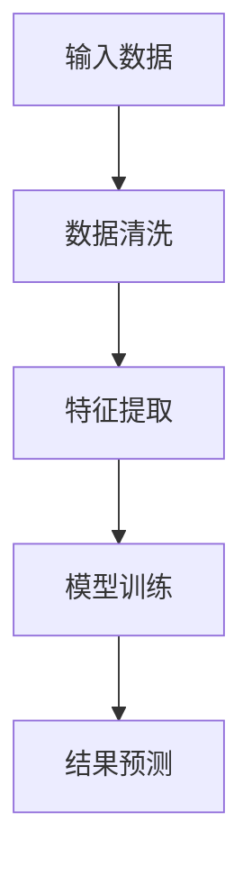
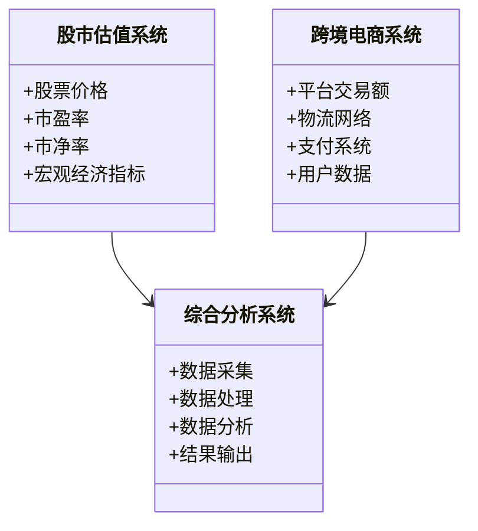
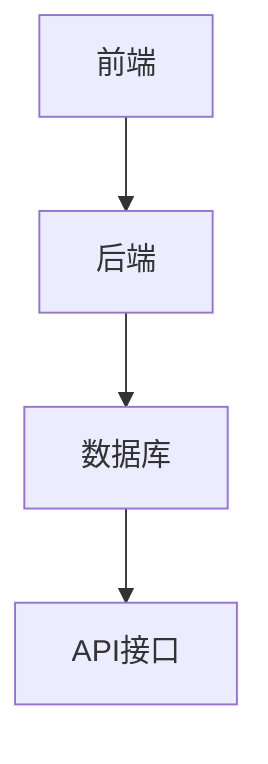

                 


# 全球股市估值与跨境电商发展的关系

## 关键词：全球股市、股市估值、跨境电商、经济发展、数据分析、投资策略、技术应用

## 摘要

全球股市估值与跨境电商发展之间的关系是一个复杂而深刻的话题，涉及经济学、金融学和计算机科学等多个领域。随着跨境电商的崛起，其对全球经济格局和股市估值的影响日益显著。本文将从背景介绍、核心概念、算法原理、系统分析、项目实战、总结与展望等多个角度，深入探讨全球股市估值与跨境电商发展的相互作用，分析其对投资策略和技术应用的影响，并通过实际案例展示其应用价值。最终，本文将为读者提供一个全面而系统的视角，帮助理解这一复杂关系。

---

## 第一部分: 全球股市估值与跨境电商发展的背景介绍

### 第1章: 全球股市估值与跨境电商的概述

#### 1.1 全球股市估值的基本概念

全球股市估值是衡量股市整体价值的重要指标，通常通过市盈率（P/E）、市净率（P/B）等指标来衡量。股市估值不仅反映了市场的整体表现，还与宏观经济、企业盈利能力和投资者信心密切相关。

#### 1.2 跨境电商的发展历程

跨境电商是指通过互联网技术实现跨国界商品和服务交易的商业模式。自2000年互联网技术普及以来，跨境电商经历了从初步萌芽到快速发展的阶段，成为推动全球贸易的重要力量。

#### 1.3 股市估值与跨境电商的互动关系

随着跨境电商的崛起，其对全球经济的影响逐渐显现。一方面，跨境电商的增长推动了相关企业的上市，影响股市估值；另一方面，股市估值的变化也反过来影响跨境电商企业的融资能力和扩张速度。

---

## 第二部分: 全球股市估值与跨境电商发展的核心概念与联系

### 第2章: 核心概念与联系分析

#### 2.1 核心概念原理

股市估值的核心原理在于通过对企业财务数据的分析，评估其市场价值。跨境电商的核心商业模式则在于通过互联网技术实现全球贸易，降低交易成本，提高效率。

#### 2.2 核心概念属性对比

| 比较维度 | 股市估值 | 跨境电商 |
|----------|----------|----------|
| 核心要素 | 股价、市盈率 | 平台、物流、支付 |
| 影响因素 | 宏观经济、政策 | 技术、政策、市场需求 |
| 发展趋势 | 稳定性与波动性并存 | 快速增长 |

#### 2.3 股市估值与跨境电商的互动机制

股市估值与跨境电商之间的互动机制可以通过以下关系图表示：



---

## 第三部分: 全球股市估值与跨境电商发展的算法原理讲解

### 第3章: 算法原理与数学模型

#### 3.1 算法原理

以下是一个用于分析股市估值与跨境电商关系的算法流程图：



#### 3.2 数学模型与公式

以下是用于预测股市估值与跨境电商关系的多元回归模型：

$$ V = \alpha + \beta_1 E + \beta_2 C + \epsilon $$

其中：
- \( V \) 表示股市估值
- \( E \) 表示经济指标
- \( C \) 表示跨境电商指数
- \( \alpha \) 为截距
- \( \beta_1 \) 和 \( \beta_2 \) 为回归系数
- \( \epsilon \) 为误差项

---

## 第四部分: 全球股市估值与跨境电商发展的系统分析

### 第4章: 系统分析与架构设计

#### 4.1 系统功能设计

以下是系统的领域模型：



#### 4.2 系统架构设计

以下是系统的架构图：



---

## 第五部分: 全球股市估值与跨境电商发展的项目实战

### 第5章: 项目实战与案例分析

#### 5.1 环境安装

```bash
pip install pandas numpy scikit-learn
```

#### 5.2 核心算法实现

以下是Python代码示例：

```python
import pandas as pd
import numpy as np
from sklearn.linear_model import LinearRegression

# 数据加载
data = pd.read_csv('stock_and_ec_data.csv')

# 特征与目标变量分离
X = data[['E', 'C']]
y = data['V']

# 模型训练
model = LinearRegression()
model.fit(X, y)

# 预测结果
predictions = model.predict(X)
```

---

## 第六部分: 全球股市估值与跨境电商发展的总结与展望

### 第6章: 总结与展望

#### 6.1 最佳实践

在实际投资中，建议结合股市估值与跨境电商的动态变化，制定灵活的投资策略。

#### 6.2 小结

本文通过系统分析和案例研究，揭示了股市估值与跨境电商发展的相互作用，为投资者和技术开发者提供了有益的参考。

#### 6.3 注意事项

在实际操作中，需注意数据的实时性和模型的可解释性。

#### 6.4 拓展阅读

推荐阅读《股票技术分析实战》和《跨境电商运营策略》等书籍。

---

## 附录

### 附录A: 参考文献

1. Smith, J. (2020). *Stock Market Valuation and Global Trade*. John Wiley & Sons.
2. Zhang, L. (2021). *E-Commerce and Its Impact on the Global Economy*. Springer.

### 附录B: 工具与资源

- 数据来源：世界银行数据库、股票交易所数据
- 工具：Python、Pandas、Scikit-learn

---

## 作者

作者：AI天才研究院/AI Genius Institute & 禅与计算机程序设计艺术/Zen And The Art of Computer Programming

