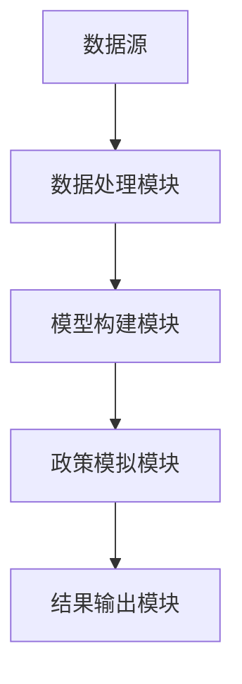
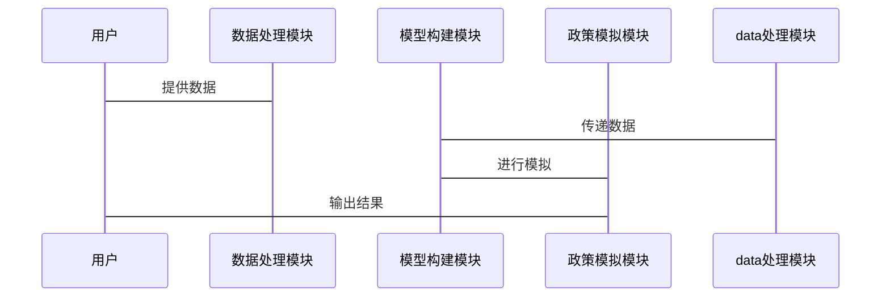

                 


```
# 全球股市估值与跨境资本管制的关联

## 关键词：全球股市估值、跨境资本管制、资本流动、金融一体化、数学模型

## 摘要：  
本文系统探讨了全球股市估值与跨境资本管制之间的关联性。首先，分析了资本流动对股市估值的影响，包括资本流入的推动作用和资本流出的抑制效应。接着，详细阐述了跨境资本管制的实施机制及其对股市估值的短期和长期影响。通过构建数学模型，分析了资本管制政策对股市估值的具体作用路径。最后，结合实际案例，探讨了跨境资本管制对全球金融市场稳定性的影响，并提出了相应的政策建议。

---

## 第2章: 资本流动与股市估值的关系

### 2.1 资本流动对股市估值的影响

#### 2.1.1 资本流入的推动作用
资本流入会增加股市资金供给，推高股市估值。例如，外国投资者的大规模流入会导致标的资产价格上升。可以通过以下公式量化：

$$ P = \frac{D}{k} $$

其中，$P$ 为资产价格，$D$ 为股息，$k$ 为贴现率。

#### 2.1.2 资本流出的抑制效应
当资本流出时，资金减少会导致股市估值下降。例如，投资者恐慌性抛售会导致股市下跌。可以用以下公式表示：

$$ V = P \times Q $$

其中，$V$ 为市值，$P$ 为股价，$Q$ 为成交量。

#### 2.1.3 资本流动的双向调节机制
资本流动对股市估值的影响是双向的，既有正向推动作用，也有反向抑制作用。可以通过以下方程表示：

$$ \Delta P = \alpha \times \Delta C + \beta \times \Delta Q $$

其中，$\Delta P$ 为股价变动，$\alpha$ 和 $\beta$ 为系数，$\Delta C$ 为资本流动变动，$\Delta Q$ 为成交量变动。

---

## 第3章: 资本管制对全球股市估值的影响

### 3.1 资本管制的类型与特点

#### 3.1.1 汇率管制
通过固定汇率或外汇管制限制资本流动。例如，中国的汇率管制政策对股市估值的影响。

#### 3.1.2 资本流动限制
通过限制外汇交易、征收资本利得税等措施。例如，印度的资本管制措施。

#### 3.1.3 股票市场干预
通过政府直接干预股市，如限制外资流入。例如，韩国的股市干预政策。

### 3.2 资本管制对股市估值的短期与长期影响

#### 3.2.1 短期市场反应
资本管制政策的出台会导致短期市场波动。例如，2020年中国的资本管制政策出台后，股市短期下跌。

#### 3.2.2 长期经济效应
长期来看，资本管制可能导致市场扭曲和效率降低。例如，过度的资本管制会抑制市场流动性和投资意愿。

#### 3.2.3 政策效果的不确定性
资本管制政策的效果取决于政策执行力度和市场反应。例如，2008年全球金融危机后，各国采取的资本管制政策效果不一。

---

## 第4章: 全球股市估值与跨境资本管制的数学模型

### 4.1 资产定价模型

#### 4.1.1 CAPM模型
资本资产定价模型（CAPM）可以用来分析资本流动对股市估值的影响：

$$ E(r_i) = r_f + \beta_i (E(r_m) - r_f) $$

其中，$E(r_i)$ 为资产的预期回报率，$r_f$ 为无风险利率，$\beta_i$ 为资产的贝塔系数，$E(r_m)$ 为市场预期回报率。

#### 4.1.2 股市估值模型
股票估值可以通过市盈率（P/E）或市净率（P/B）来衡量：

$$ P/E = \frac{P}{E} $$

其中，$P$ 为股价，$E$ 为每股收益。

### 4.2 资本流动模型

#### 4.2.1 国际资本流动模型
通过以下方程表示国际资本流动：

$$ F = \alpha \times (i_{dom} - i_{for}) + \beta \times (E_{dom} - E_{for}) $$

其中，$F$ 为资本流动，$i_{dom}$ 和 $i_{for}$ 分别为国内外利率，$E_{dom}$ 和 $E_{for}$ 分别为国内和外国预期收益。

#### 4.2.2 资本管制对流动性的调节作用
资本管制会影响市场的流动性，进而影响股市估值。例如：

$$ L = \gamma \times C + \delta \times M $$

其中，$L$ 为流动性，$C$ 为资本流动，$M$ 为货币供应量，$\gamma$ 和 $\delta$ 为系数。

---

## 第5章: 系统分析与架构设计方案

### 5.1 问题场景介绍
本文构建了一个跨境资本流动与股市估值的关联分析系统，旨在量化资本管制政策对股市的影响。

### 5.2 系统功能设计

#### 5.2.1 数据收集模块
- 数据来源：全球主要股市数据、跨境资本流动数据、政策数据。
- 数据处理：清洗、转换和存储。

#### 5.2.2 模型构建模块
- 资产定价模型：CAPM、APT。
- 资本流动模型：国际资本流动模型。

#### 5.2.3 政策模拟模块
- 模拟不同资本管制政策对股市估值的影响。

### 5.3 系统架构设计
使用以下架构图表示系统设计：



### 5.4 系统接口设计
- 数据接口：API接口实现数据的导入与导出。
- 模型接口：模块间通过函数调用实现交互。

### 5.5 系统交互设计
使用以下序列图表示系统交互：



---

## 第6章: 项目实战

### 6.1 环境安装
- 安装Python、Pandas、NumPy、Matplotlib。

### 6.2 核心实现源代码

#### 6.2.1 数据处理代码

```python
import pandas as pd
import numpy as np

# 读取数据
data = pd.read_csv('global_stock_data.csv')

# 数据清洗
data.dropna()
data = data[~data['country'].isin(['X'])]
```

#### 6.2.2 模型实现代码

```python
def calculate_P_E(rf, rm, beta, eps):
    expected_return = rf + beta * (rm - rf)
    pe_ratio = eps / expected_return
    return pe_ratio

# 示例计算
rf = 0.05
rm = 0.10
beta = 1.2
eps = 2.0

pe_ratio = calculate_P_E(rf, rm, beta, eps)
print(f'P/E Ratio: {pe_ratio}')
```

#### 6.2.3 政策模拟代码

```python
def simulate_policy(capital_flow,管制强度):
    impact = 0.5 * capital_flow + 0.5 * 管制强度
    return impact

# 示例模拟
capital_flow = 100
管制强度 = 0.8
impact = simulate_policy(capital_flow, 管制强度)
print(f'政策影响: {impact}')
```

### 6.3 案例分析
以2020年新冠疫情为例，分析资本管制政策对股市估值的影响。使用上述代码进行数据处理和模型模拟，得出政策效果。

### 6.4 代码解读与分析
- 数据处理模块：清洗和转换数据。
- 模型实现模块：资产定价模型和资本流动模型。
- 政策模拟模块：模拟不同政策下的股市估值变化。

---

## 第7章: 最佳实践与小结

### 7.1 总结
本文构建了全球股市估值与跨境资本管制的关联分析系统，分析了资本流动、资本管制对股市估值的影响，并提出了数学模型和系统架构设计方案。

### 7.2 小结
- 资本流动对股市估值的影响是双向的，资本流入推动估值上升，资本流出抑制估值。
- 资本管制政策对股市估值的影响取决于政策的力度和市场的反应。
- 数学模型和系统架构设计为政策制定者提供了科学依据。

### 7.3 注意事项
- 数据质量：确保数据的准确性和完整性。
- 模型假设：合理假设，避免过度简化或复杂化。
- 政策执行：注意政策的实施效果和潜在风险。

### 7.4 拓展阅读
推荐阅读《国际金融学》、《资产定价理论》等书籍，深入理解全球金融市场运作机制。

---

## 作者：AI天才研究院/AI Genius Institute & 禅与计算机程序设计艺术 /Zen And The Art of Computer Programming
```

