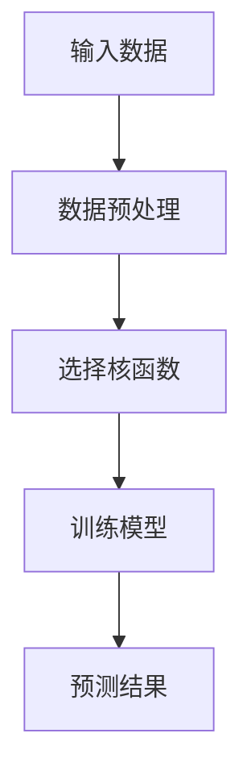
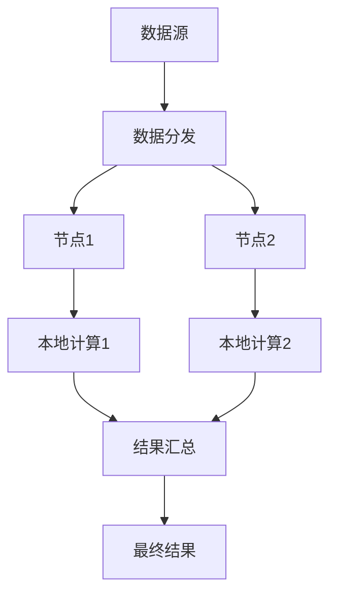
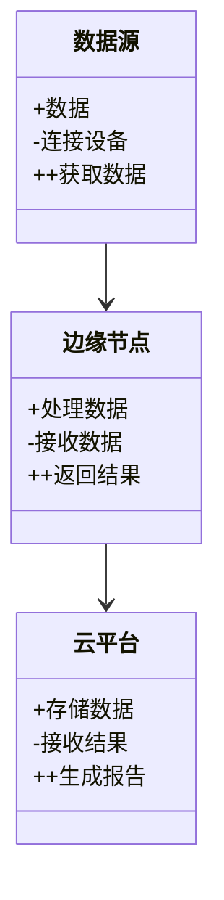
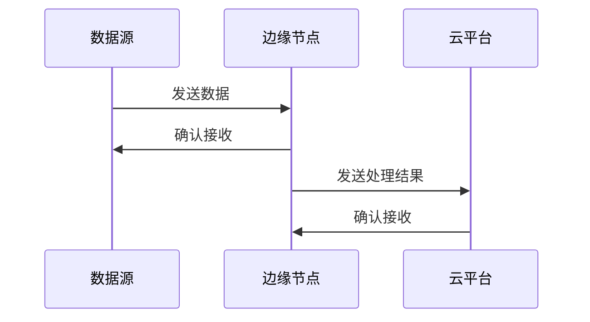

                 


# 全球股市估值与边缘计算在物联网中的应用

> 关键词：全球股市估值、边缘计算、物联网、数据处理、人工智能

> 摘要：本文探讨了全球股市估值的核心方法与边缘计算在物联网中的应用，分析了两者结合的优势与挑战。通过详细讲解边缘计算的基本原理、算法实现、系统架构，以及在股市估值中的实际应用案例，展示了边缘计算如何优化股市数据处理效率和安全性。本文还提供了边缘计算在物联网中的具体实现方案，并展望了未来的研究方向。

---

## 第1章: 全球股市估值概述

### 1.1 股市估值的基本概念

#### 1.1.1 股市估值的定义与意义
股市估值是指通过对公司财务数据、市场环境和行业趋势的分析，确定股票的合理市场价格的过程。其意义在于帮助投资者做出明智的投资决策，避免因市场波动而造成的损失。

#### 1.1.2 股市估值的核心指标
- 市盈率（P/E）：市盈率=股价/每股收益，反映了投资者对公司未来盈利能力的预期。
- 市净率（P/B）：市净率=股价/每股净资产，适用于评估资产密集型行业的公司。
- 股息率：股息率=每股股息/股价，反映了股票的分红能力。

#### 1.1.3 全球股市估值的现状与趋势
随着全球化进程的加速，全球股市估值呈现出多元化和复杂化的趋势。投资者需要考虑的因素包括宏观经济环境、行业竞争格局、政策法规等。

### 1.2 股市估值的主要方法

#### 1.2.1 市盈率（P/E）法
通过比较目标公司与同行业公司的市盈率，判断其股票是否被高估或低估。

#### 1.2.2 市净率（P/B）法
适用于评估资产密集型行业，如银行、房地产等。

#### 1.2.3 股息率法
适用于评估具有稳定分红能力的公司。

#### 1.2.4 内在价值法
通过DCF模型等方法，估算公司未来现金流的现值，确定其内在价值。

### 1.3 股市估值的挑战与解决方案

#### 1.3.1 数据的实时性与准确性
股市数据的实时性和准确性是影响估值结果的重要因素。边缘计算可以通过在本地实时处理数据，提高估值的准确性。

#### 1.3.2 市场波动性对估值的影响
市场波动性会导致股票价格与实际价值出现偏差，边缘计算可以通过分布式数据处理，减少单点故障的影响。

#### 1.3.3 大数据与AI在股市估值中的应用
大数据和人工智能技术可以提高股市估值的效率和精度，例如利用机器学习算法预测股票价格走势。

## 第2章: 边缘计算的基本概念与应用

### 2.1 边缘计算的定义与特点

#### 2.1.1 边缘计算的定义
边缘计算是一种分布式计算模式，将计算能力部署在数据源附近，减少数据传输延迟。

#### 2.1.2 边缘计算的核心特点
- 低延迟：边缘计算可以在本地快速处理数据，减少网络传输的延迟。
- 高实时性：边缘计算能够实时处理数据，适用于需要快速响应的场景。
- 分布式架构：边缘计算通过分布式架构，提高了系统的可靠性和容错能力。

#### 2.1.3 边缘计算与云计算的区别
边缘计算与云计算的主要区别在于数据处理的位置和规模。边缘计算更注重实时性和局部性，而云计算更注重数据的集中处理和大规模计算。

### 2.2 边缘计算的主要技术

#### 2.2.1 边缘计算的架构
边缘计算的架构包括边缘设备、边缘节点和云平台三部分。边缘设备负责数据采集和初步处理，边缘节点负责数据的进一步处理和分析，云平台负责全局数据的协调和管理。

#### 2.2.2 边缘计算的关键技术
- 分布式计算：通过分布式架构，提高系统的可扩展性和可靠性。
- 雾计算：一种介于边缘计算和云计算之间的分布式计算模型，适用于复杂的计算任务。
- 边缘智能：通过在边缘设备上部署人工智能模型，实现本地化的智能决策。

#### 2.2.3 边缘计算的通信协议
边缘计算常用的通信协议包括MQTT、CoAP、HTTP等。这些协议适用于不同场景下的数据传输需求。

### 2.3 边缘计算在物联网中的应用

#### 2.3.1 物联网的基本概念与架构
物联网（IoT）是指通过各种信息传感设备，如传感器、RFID标签等，按照约定的协议，把任何物品与互联网连接起来，进行信息交换和通信。

#### 2.3.2 边缘计算在物联网中的应用场景
- 智能制造：通过边缘计算实时监控生产线的状态，实现智能化生产。
- 智慧城市：通过边缘计算优化交通流量，提高城市管理效率。
- 智慧医疗：通过边缘计算实时分析患者数据，实现快速诊断。

#### 2.3.3 边缘计算对物联网数据处理的优势
- 低延迟：边缘计算可以在本地快速处理数据，减少网络传输的延迟。
- 高实时性：边缘计算能够实时处理数据，适用于需要快速响应的场景。
- 数据隐私保护：边缘计算通过在本地处理数据，减少了数据在传输过程中的隐私泄露风险。

---

## 第3章: 全球股市估值与边缘计算的结合

### 3.1 股市数据的特点与边缘计算的契合点

#### 3.1.1 股市数据的实时性与边缘计算的低延迟优势
股市数据的实时性要求非常高，边缘计算可以通过本地实时处理数据，减少数据传输的延迟。

#### 3.1.2 股市数据的海量性与边缘计算的分布式处理能力
股市数据量大，边缘计算通过分布式架构，可以高效地处理海量数据。

#### 3.1.3 股市数据的安全性与边缘计算的本地化处理特点
股市数据涉及大量敏感信息，边缘计算通过本地化处理数据，可以更好地保护数据隐私。

### 3.2 边缘计算在股市估值中的应用场景

#### 3.2.1 实时数据处理
边缘计算可以实时处理股市数据，帮助投资者快速做出决策。

#### 3.2.2 数据隐私保护
边缘计算通过本地化处理数据，减少了数据在传输过程中的隐私泄露风险。

#### 3.2.3 高效计算
边缘计算通过分布式架构，提高了计算效率，减少了对云平台的依赖。

### 3.3 边缘计算在股市估值中的优势

#### 3.3.1 提高计算效率
边缘计算通过本地化处理数据，减少了数据传输的延迟，提高了计算效率。

#### 3.3.2 提高数据安全性
边缘计算通过本地化处理数据，减少了数据在传输过程中的隐私泄露风险。

#### 3.3.3 提高系统的可扩展性
边缘计算通过分布式架构，提高了系统的可扩展性，适用于大规模数据处理。

---

## 第4章: 边缘计算在股市估值中的算法实现

### 4.1 支持向量机（SVM）算法原理

#### 4.1.1 SVM算法的定义
支持向量机（Support Vector Machine, SVM）是一种监督学习算法，适用于分类和回归问题。

#### 4.1.2 SVM算法的优化目标
SVM算法的目标是找到一个超平面，使得训练数据能够被正确分类，并且最大化分类间隔。

#### 4.1.3 SVM算法的数学模型
$$ \text{优化目标：} \min_{w,b,\xi} \frac{1}{2}\|w\|^2 + C\sum_{i=1}^{n}\xi_i $$
$$ \text{约束条件：} y_i(w \cdot x_i + b) \geq 1 - \xi_i $$
$$ \xi_i \geq 0 $$

#### 4.1.4 SVM算法的流程图


### 4.2 边缘计算中的分布式计算算法

#### 4.2.1 分布式计算的基本原理
分布式计算是指将计算任务分配到多个计算节点上，通过协作完成任务。

#### 4.2.2 分布式计算的实现步骤
1. 数据分发：将数据分配到多个计算节点上。
2. 本地计算：每个计算节点独立处理分配的数据。
3. 结果汇总：将各节点的计算结果汇总，得到最终结果。

#### 4.2.3 分布式计算的流程图


---

## 第5章: 系统分析与架构设计

### 5.1 物联网金融数据监测系统

#### 5.1.1 系统功能设计
- 数据采集：通过传感器采集金融数据。
- 数据处理：通过边缘计算节点处理数据。
- 数据存储：将处理后的数据存储到本地或云端。
- 数据分析：通过数据分析模块，生成估值报告。

#### 5.1.2 系统架构图


#### 5.1.3 系统接口设计
- 数据采集接口：用于接收传感器数据。
- 数据处理接口：用于处理数据并返回结果。
- 数据存储接口：用于存储处理后的数据。

#### 5.1.4 系统交互图


---

## 第6章: 项目实战

### 6.1 环境搭建

#### 6.1.1 系统需求
- 操作系统：Linux或Windows
- 开发工具：Python、Jupyter Notebook
- 依赖库：numpy、pandas、scikit-learn

#### 6.1.2 环境配置
安装必要的依赖库：
```
pip install numpy pandas scikit-learn
```

### 6.2 核心代码实现

#### 6.2.1 数据采集模块
```python
import pandas as pd

def collect_data():
    # 从数据库中获取数据
    data = pd.read_sql("SELECT * FROM stock_data", connection)
    return data
```

#### 6.2.2 数据处理模块
```python
from sklearn.svm import SVC

def process_data(data):
    # 数据预处理
    X = data.drop(columns=['label'])
    y = data['label']
    # 训练SVM模型
    model = SVC()
    model.fit(X, y)
    return model
```

#### 6.2.3 数据分析模块
```python
def analyze_data(model, new_data):
    # 预测结果
    prediction = model.predict(new_data)
    return prediction
```

### 6.3 实际案例分析

#### 6.3.1 案例背景
假设我们有一个股票数据集，包含股票的开盘价、收盘价、最高价、最低价和成交量。

#### 6.3.2 案例实现
```python
import pandas as pd
from sklearn.svm import SVC

# 数据采集
data = pd.read_csv("stock_data.csv")
# 数据处理
X = data.drop(columns=['label'])
y = data['label']
model = SVC()
model.fit(X, y)
# 预测
new_data = pd.read_csv("new_stock_data.csv")
prediction = model.predict(new_data)
print("预测结果：", prediction)
```

#### 6.3.3 案例分析
通过上述代码，我们可以看到边缘计算在股市估值中的实际应用。通过本地训练模型，可以在边缘节点上快速预测股票价格走势，帮助投资者做出决策。

---

## 第7章: 总结与展望

### 7.1 本章总结
本文详细探讨了全球股市估值与边缘计算在物联网中的应用，分析了边缘计算在股市估值中的优势与应用场景。通过实际案例分析，展示了边缘计算在股市估值中的实际应用价值。

### 7.2 未来研究方向
- 研究边缘计算与人工智能的结合，进一步提高股市估值的精度。
- 探索边缘计算在多模态数据处理中的应用，如图像、文本等。
- 研究边缘计算在金融领域的安全性问题，如数据隐私保护。

### 7.3 最佳实践 Tips
- 在实际应用中，建议根据具体需求选择合适的算法和架构。
- 注意数据隐私保护，避免数据泄露风险。
- 定期更新模型，确保系统的准确性和实时性。

---

# 作者：AI天才研究院 & 禅与计算机程序设计艺术

