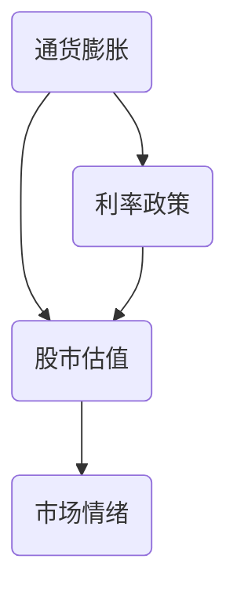
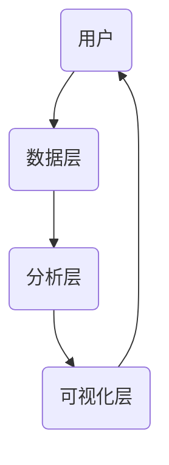

                 


```markdown
# 全球股市估值与通货膨胀预期的关系

> 关键词：全球股市，估值，通货膨胀，预期，关系分析，数学模型，金融学

> 摘要：本文系统地探讨了全球股市估值与通货膨胀预期之间的复杂关系。通过分析通货膨胀对股市估值的影响，构建了量化模型，并结合实际案例进行深入分析。文章结构清晰，内容详实，旨在为投资者和研究者提供理论支持和实践指导。

---

# 第一部分：全球股市估值与通货膨胀预期的背景介绍

## 第1章：问题背景

### 1.1 通货膨胀的定义与影响
- 通货膨胀的定义：物价总水平的持续上升。
- 通货膨胀的影响：消费者购买力下降，企业成本增加，经济不确定性增强。

### 1.2 股市估值的核心概念
- 股市估值：基于企业未来现金流的折现价值。
- 影响股市估值的主要因素：利率、企业盈利、市场情绪。

### 1.3 通货膨胀与股市估值的关系
- 通货膨胀通过影响利率和企业盈利间接影响股市估值。
- 高通胀可能导致股市估值波动加剧。

## 第2章：问题描述

### 2.1 通货膨胀预期的来源
- 货币政策：中央银行的通胀目标。
- 市场预期：投资者对通胀的预期。

### 2.2 股市估值的核心影响因素
- 利率：实际利率下降通常利好股市。
- 企业盈利：通胀对企业利润的影响复杂。

### 2.3 通货膨胀与股市估值的动态关系
- 高通胀初期：企业盈利上升，股市上涨。
- 高通胀后期：利率上升，股市估值下降。

## 第3章：问题解决

### 3.1 如何量化通货膨胀对股市的影响
- 构建回归模型：将通胀率作为自变量，股市收益作为因变量。
- 使用时间序列分析：捕捉通胀与股市的动态关系。

### 3.2 股市估值模型的构建与优化
- 确定关键变量：通胀率、利率、企业盈利。
- 模型优化：引入滞后变量，考虑市场情绪因素。

### 3.3 通货膨胀预期的预测与应用
- 预测方法：ARIMA模型、GARCH模型。
- 应用：指导投资决策，优化资产配置。

## 第4章：边界与外延

### 4.1 通货膨胀与股市估值的边界条件
- 数据范围：选择主要经济体的股市数据。
- 时间范围：短期与长期通胀的影响差异。

### 4.2 相关概念的外延与扩展
- 货币政策：中央银行的政策对通胀的影响。
- 市场情绪：投资者心理对股市的放大效应。

### 4.3 模型的适用范围与限制
- 适用范围：主要适用于成熟市场。
- 限制：忽略小概率事件（如金融危机）的影响。

---

# 第二部分：全球股市估值与通货膨胀预期的关系分析

## 第5章：核心概念与联系

### 5.1 核心概念原理
- 通货膨胀预期的形成机制：市场参与者对未来通胀的预测。
- 股市估值的驱动因素：企业盈利、利率、市场情绪。

### 5.2 概念属性特征对比
- 对比维度：影响程度、时间序列特征、关联强度。
- 对比结果：通胀对股市的影响具有滞后性和非线性特征。

### 5.3 ER实体关系图


---

## 第6章：算法原理讲解

### 6.1 统计模型
- 回归分析：建立通胀与股市收益的回归模型。
- 时间序列分析：使用ARIMA模型捕捉通胀与股市的动态关系。

### 6.2 数学模型
回归模型：
$$ R_t = \beta_0 + \beta_1 I_t + \epsilon_t $$
其中，$R_t$为股市收益，$I_t$为通胀率，$\epsilon_t$为误差项。

### 6.3 Python代码实现
```python
import pandas as pd
import numpy as np
from statsmodels.regression.linear_model import OLS

# 数据加载
data = pd.read_csv('stock_inflation.csv')

# 构建模型
X = data[['inflation']]
y = data['stock_return']
model = OLS(y, X)
result = model.fit()
print(result.summary())
```

---

## 第7章：系统分析与架构设计

### 7.1 系统架构设计


### 7.2 系统功能设计
- 数据收集：获取通胀数据和股市数据。
- 数据分析：构建回归模型，计算相关系数。
- 可视化：绘制通胀与股市收益的关系图。

---

## 第8章：项目实战

### 8.1 环境安装
```bash
pip install numpy pandas matplotlib statsmodels
```

### 8.2 核心代码实现
```python
import matplotlib.pyplot as plt

# 数据加载
data = pd.read_csv('stock_inflation.csv')

# 绘制关系图
plt.scatter(data['inflation'], data['stock_return'])
plt.xlabel('Inflation Rate')
plt.ylabel('Stock Return')
plt.title('Relationship Between Inflation and Stock Return')
plt.show()
```

### 8.3 实际案例分析
- 数据来源：某经济体过去十年的通胀率与股市收益数据。
- 分析结果：通胀率与股市收益呈正相关，但存在非线性关系。

---

## 第9章：最佳实践与总结

### 9.1 最佳实践
- 数据清洗：处理缺失值和异常值。
- 模型验证：使用交叉验证评估模型性能。
- 持续监控：定期更新模型，跟踪最新数据。

### 9.2 小结
本文通过构建回归模型，分析了通货膨胀预期对全球股市估值的影响，为投资者提供了理论依据和实践指导。

### 9.3 注意事项
- 模型假设：假设数据线性相关，实际可能更复杂。
- 数据质量：数据来源和准确性影响模型结果。

### 9.4 拓展阅读
- 《金融市场与经济分析》
- 《时间序列分析与应用》

---

# 结语

本文通过系统化的分析，深入探讨了通货膨胀预期与全球股市估值之间的关系，构建了量化模型，并结合实际案例进行了详细解读。希望本文能为投资者和研究者提供有价值的参考。

---

作者：AI天才研究院/AI Genius Institute & 禅与计算机程序设计艺术 /Zen And The Art of Computer Programming
```

