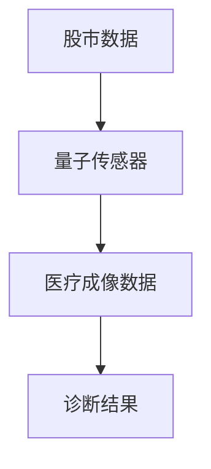
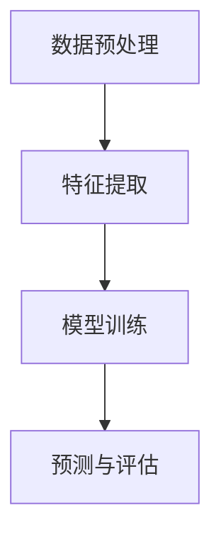
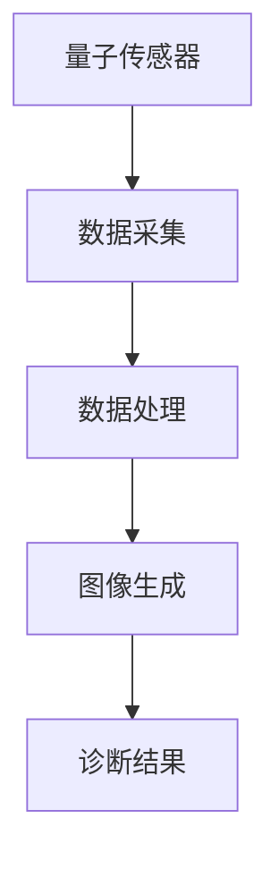
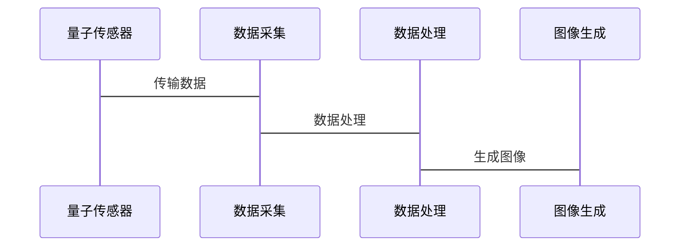

                 

# 全球股市估值与量子传感器在医疗成像中的应用

> 关键词：全球股市估值，量子传感器，医疗成像，算法原理，系统架构

> 摘要：本文探讨全球股市估值与量子传感器在医疗成像中的应用，从背景介绍、核心概念到算法原理、系统架构，结合实际案例分析，旨在为读者提供全面的技术视角。

---

# 第一部分: 全球股市估值与量子传感器概述

## 第1章: 背景介绍

### 1.1 股市估值的背景与意义
#### 1.1.1 股市估值的基本概念
股市估值是通过分析股票的内在价值来判断其合理价格范围的过程，常见方法包括市盈率（P/E）、市净率（P/B）等。

#### 1.1.2 股市估值的重要性
准确的股市估值有助于投资者做出理性决策，避免市场波动带来的损失。

#### 1.1.3 股市估值的边界与外延
股市估值不仅依赖于财务数据，还需考虑宏观经济环境、行业趋势等因素。

### 1.2 量子传感器的基本原理
#### 1.2.1 量子传感器的定义
量子传感器是利用量子力学原理进行测量的装置，如量子纠缠态传感器。

#### 1.2.2 量子传感器的核心技术
量子传感器依赖于量子叠加和量子纠缠等现象，具有高灵敏度和分辨率。

#### 1.2.3 量子传感器的应用领域
广泛应用于医疗成像、环境监测等领域，提供更精准的数据。

## 第2章: 核心概念与联系

### 2.1 股市估值与量子传感器的关联
#### 2.1.1 股市数据的量子特性
股市数据具有高度复杂性和不确定性，量子传感器能有效捕捉这些特性。

#### 2.1.2 量子传感器在金融数据处理中的优势
量子传感器能快速处理海量数据，提高股市估值的效率和准确性。

### 2.2 核心概念对比分析
#### 2.2.1 股市估值方法对比
比较传统估值方法与基于量子传感器的新型方法，分析优缺点。

#### 2.2.2 量子传感器技术对比
对比传统传感器与量子传感器的性能指标，突出量子传感器的优势。

### 2.3 ER实体关系图

---

# 第二部分: 股市估值的算法原理

## 第3章: 股市估值的核心算法

### 3.1 时间序列分析
#### 3.1.1 ARIMA模型
ARIMA（自回归积分滑动平均）模型用于预测时间序列数据，公式如下：
$$ARIMA(p, d, q)$$

#### 3.1.2 LSTM网络
长短期记忆网络（LSTM）擅长处理序列数据，应用于股市预测。

#### 3.1.3 GARCH模型
广义自回归条件异方差模型用于估计波动率，公式为：
$$GARCH(p, q)$$

### 3.2 机器学习算法
#### 3.2.1 支持向量回归
支持向量回归用于非线性回归问题，公式如下：
$$y = f(x)$$

#### 3.2.2 随机森林
集成学习方法，通过多棵决策树提高预测准确性。

#### 3.2.3 XGBoost
梯度提升树，用于分类和回归问题，公式如下：
$$y = \sum_{i=1}^{n} \text{tree}(x)$$

### 3.3 算法流程图

## 第4章: 数学模型与公式

### 4.1 时间序列模型
#### 4.1.1 ARIMA模型公式
$$ARIMA(p, d, q)$$

### 4.2 机器学习模型
#### 4.2.1 支持向量回归公式
$$y = f(x)$$

---

# 第三部分: 量子传感器在医疗成像中的应用

## 第4章: 量子传感器的技术细节

### 4.1 量子传感器的原理
量子传感器利用量子叠加和纠缠现象，提供更高的灵敏度和分辨率。

### 4.2 量子传感器在医疗成像中的应用
#### 4.2.1 MRI中的应用
量子传感器用于磁共振成像，提高图像质量。

#### 4.2.2 CT中的应用
量子传感器提升CT成像的精度，帮助早期诊断。

## 第5章: 系统架构与实现

### 5.1 系统架构设计

### 5.2 系统接口设计
接口包括数据输入、处理模块和输出模块，确保数据流畅传输。

### 5.3 系统交互流程

---

# 第四部分: 结论与展望

## 第6章: 结论

### 6.1 核心结论
股市估值与量子传感器在医疗成像中的应用相互促进，量子技术将推动金融和医疗领域的发展。

## 第7章: 展望

### 7.1 未来趋势
量子传感器技术将进一步成熟，应用范围将扩大，推动股市估值和医疗成像的进步。

---

# 作者

**作者：AI天才研究院/AI Genius Institute & 禅与计算机程序设计艺术 /Zen And The Art of Computer Programming**

---

通过以上目录结构，文章将从背景介绍、核心概念、算法原理、系统架构到项目实战和最佳实践，全面探讨全球股市估值与量子传感器在医疗成像中的应用，结合具体案例和详细技术分析，为读者提供深入的技术视角。

