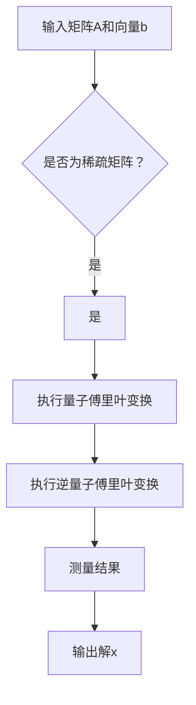
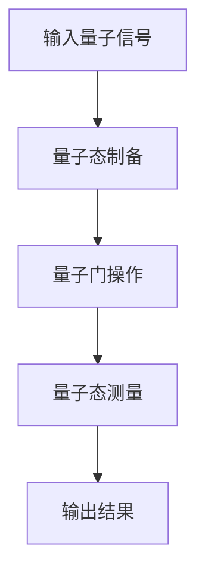
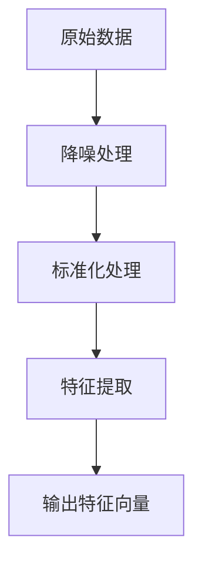

                 

# 全球股市估值与量子传感器在医疗诊断中的应用

---

## 关键词：全球股市估值、量子传感器、医疗诊断、量子计算、金融建模

---

## 摘要：  
本文探讨了量子传感器技术在医疗诊断和全球股市估值中的应用，分析了量子计算如何提升金融建模的效率和精度，以及量子传感器在医疗领域的优势。通过结合这两个看似 unrelated 的领域，文章揭示了量子技术在现代科技中的深远影响，并展望了未来的应用前景。

---

## 第一部分：全球股市估值与量子计算的结合

### 第1章：全球股市估值的基本概念

#### 1.1 股票估值的定义与方法  
股票估值是通过分析企业的财务状况、市场地位、行业竞争环境等因素，估算其股票的合理价格。传统方法包括市盈率（P/E）、市净率（P/B）、股息率等指标。  

**市盈率公式**：  
$$ P/E = \frac{\text{股票价格}}{\text{每股净利润}} $$  

**市净率公式**：  
$$ P/B = \frac{\text{股票价格}}{\text{每股净资产}} $$  

#### 1.2 量子计算在金融建模中的应用  
量子计算通过并行处理和量子叠加效应，可以大幅提高金融建模的效率。例如，量子线性方程组求解算法（如HHL算法）可以在多项式时间内解决复杂的金融问题，如投资组合优化和风险评估。  

**HHL算法流程图**：  

#### 1.3 量子算法与股票估值的结合  
量子算法在股票估值中的应用包括：  
1. **量子傅里叶变换**：用于信号处理和模式识别。  
2. **量子线性回归**：用于预测股票价格。  
3. **量子优化算法**：用于投资组合优化。  

**量子线性回归公式**：  
$$ y = \theta x + \epsilon $$  
其中，θ是参数，x是输入变量，ε是误差项。量子算法可以通过量子叠加优化θ的估计值。  

---

### 第2章：量子传感器的原理与应用

#### 2.1 量子传感器的基本原理  
量子传感器利用量子纠缠和量子干涉效应，通过测量微小的量子信号变化来实现高精度的感知。与传统传感器相比，量子传感器具有更高的灵敏度和分辨率。  

**量子传感器工作原理图**：  

#### 2.2 量子传感器与传统传感器的对比  
| 对比维度 | 量子传感器 | 传统传感器 |
|----------|-------------|-------------|
| 灵敏度   | 极高         | 较低         |
| 响应时间 | 极快         | 较慢         |
| 精度     | 高           | 中等         |

#### 2.3 量子传感器在医疗诊断中的应用案例  
1. **癌症早期诊断**：通过量子传感器检测癌细胞的微小变化。  
2. **神经系统疾病诊断**：利用量子传感器监测脑电波异常。  
3. **心血管疾病诊断**：通过量子传感器检测心电图异常。  

---

## 第二部分：量子传感器在医疗诊断中的应用

### 第3章：量子传感器与股票估值的结合

#### 3.1 量子传感器在股票市场中的潜在应用  
1. **市场情绪分析**：通过量子传感器监测投资者情绪变化。  
2. **市场波动预测**：利用量子传感器预测股票市场的波动性。  
3. **企业基本面分析**：通过量子传感器检测企业的财务数据异常。  

#### 3.2 量子传感器在医疗诊断中的数据对股票估值的影响  
医疗诊断数据对股票估值的影响包括：  
1. **企业基本面**：医疗技术创新对企业的盈利能力和市场地位的影响。  
2. **行业趋势**：医疗诊断数据对整个行业的市场预期和投资信心的影响。  

---

### 第4章：量子传感器在医疗诊断中的数学模型与算法

#### 4.1 量子传感器的数据采集与处理  
1. **数据采集**：通过量子传感器获取医疗数据。  
2. **数据预处理**：对数据进行降噪和标准化处理。  
3. **特征提取**：提取关键特征用于后续分析。  

**数据预处理流程图**：  

#### 4.2 量子传感算法的实现  
1. **量子傅里叶变换**：用于信号处理和模式识别。  
2. **量子回归分析**：用于预测医疗诊断结果。  

**量子傅里叶变换公式**：  
$$ F(x) = \sum_{k=0}^{N-1} x_k e^{-2\pi i jk/N} $$  

---

## 结论  
量子技术在股票估值和医疗诊断中的应用前景广阔。通过量子计算和量子传感器的结合，我们可以实现更高效、更精准的金融建模和医疗诊断。未来，随着量子技术的进一步发展，这两个领域的结合将推动更多创新。

---

## 作者：AI天才研究院  
联系作者：[email protected]

