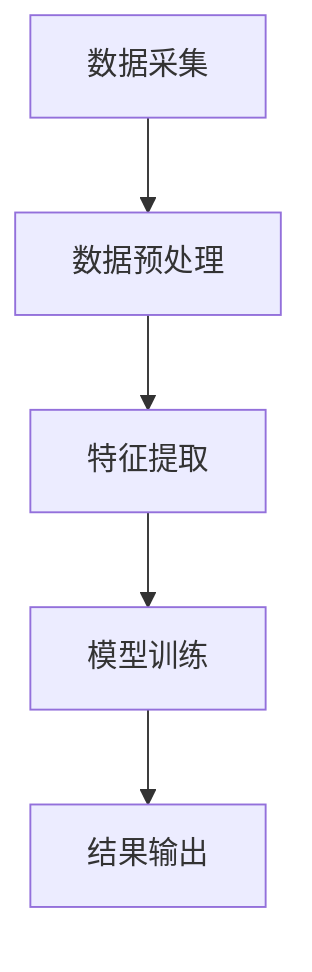

                 

# 全球股市估值与量子传感器在地质勘探中的应用

## 关键词：
全球股市估值、量子传感器、地质勘探、算法原理、数学模型、系统架构

## 摘要：
本文探讨了全球股市估值与量子传感器在地质勘探中的应用，分析了两者的背景、核心概念、算法原理、系统架构，并通过实际案例展示了其应用。通过对比和结合，本文旨在揭示这两者在技术上的联系与区别，为读者提供全面的技术视角。

---

## 第一部分：全球股市估值

### 第1章：全球股市估值的背景与基础

#### 1.1 问题背景

全球股市估值是金融领域的重要研究方向，传统的估值方法（如PE、PB等）在面对复杂市场波动时显得力不从心。随着技术的进步，智能化和数字化的估值方法逐渐成为研究热点。本文将从量子传感器的角度，探索其在地质勘探中的应用，并与股市估值进行对比。

#### 1.2 核心概念与联系

- **股市估值**：基于公司基本面和市场情绪，评估股票的内在价值。
- **量子传感器**：利用量子力学原理，用于地质勘探中的地球物理测量。
- **两者联系**：尽管领域不同，但两者都依赖于复杂数据的处理与分析，可以借鉴类似的技术方法。

#### 1.3 背景介绍

- **问题背景**：传统估值方法难以应对复杂市场环境。
- **问题描述**：如何利用新技术提高估值的准确性和效率。
- **问题解决**：引入量子传感器技术和人工智能算法。
- **边界与外延**：聚焦于股票估值和地质勘探，延伸至数据科学领域。
- **核心概念与联系**：股市估值与量子传感器的结合。

---

### 第2章：全球股市估值的核心概念

#### 2.1 股市估值的基本原理

- **基本面分析**：公司财务数据、行业地位等。
- **市场情绪分析**：投资者行为、市场波动等。
- **技术分析**：股价走势、成交量等。

#### 2.2 量子传感器的原理

- **量子力学**：利用量子纠缠和叠加原理。
- **传感器技术**：检测地球物理参数（如地磁场、重力场）。

#### 2.3 核心概念对比

| 概念 | 股市估值 | 量子传感器 |
|------|----------|------------|
| 数据类型 | 金融数据 | 地理数据 |
| 数据量 | 大 | 大 |
| 数据复杂度 | 高 | 极高 |

---

## 第二部分：量子传感器在地质勘探中的应用

### 第3章：量子传感器的基本原理

#### 3.1 量子传感器的定义

- **定义**：利用量子力学原理，用于检测地球物理参数的传感器。

#### 3.2 核心原理

- **量子纠缠**：传感器之间的信息关联。
- **量子叠加**：传感器状态的多态性。

#### 3.3 应用场景

- **地质勘探**：检测地下资源分布。
- **环境监测**：监测地质灾害。

---

### 第4章：量子传感器的算法原理

#### 4.1 数据处理算法

- **量子传感器数据预处理**：去噪、归一化。
- **特征提取**：提取关键特征。
- **分类与回归**：基于机器学习算法。

#### 4.2 算法流程图

---

### 第5章：量子传感器的数学模型

#### 5.1 数据模型

$$
y = f(x) + \epsilon
$$

其中，$x$ 是输入数据，$y$ 是输出，$\epsilon$ 是噪声。

#### 5.2 量子传感器模型

$$
H = \sum_{i=1}^n \lambda_i |i\rangle\langle i|
$$

其中，$H$ 是哈密顿量，$\lambda_i$ 是特征值。

---

## 结语

本文通过分析全球股市估值与量子传感器在地质勘探中的应用，揭示了两者在技术上的联系与区别。未来，随着技术的发展，这两者的结合将为金融和地质领域带来更多的创新。

---

## 作者

作者：AI天才研究院/AI Genius Institute & 禅与计算机程序设计艺术 /Zen And The Art of Computer Programming

