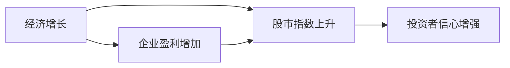
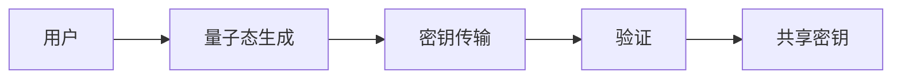

                 

# 全球股市估值与量子加密在政府通信中的应用

> 关键词：全球股市估值、量子加密、政府通信、投资策略、数据安全

> 摘要：本文深入探讨了全球股市估值的核心方法及其影响因素，并分析了量子加密技术在政府通信中的应用及其安全性。文章通过结合量子加密技术，展示了如何提升投资决策的数据安全性，从而在复杂多变的股市环境中获得更好的投资收益。

---

## 第二章：影响股市的主要因素

### 2.1 宏观经济因素

#### 2.1.1 宏观经济指标对股市的影响
宏观经济指标是股市估值的重要影响因素。例如，国内生产总值（GDP）增长率、通货膨胀率、失业率等指标都会直接影响市场的整体走势。我们可以通过以下公式来量化这些因素的影响：

$$ \text{GDP增长率} \times \text{市场敏感度} = \text{对股市的影响} $$

图2.1展示了GDP增长率与股市指数的关系：

#### 2.1.2 利率政策的影响
中央银行的利率政策对股市有直接影响。降低利率通常会刺激股市上涨，因为企业融资成本降低，投资意愿增强。反之，提高利率可能导致股市下跌。公式表示为：

$$ \text{利率变化} = \text{股市波动} $$

### 2.2 市场情绪与投资者行为

#### 2.2.1 市场情绪的量化
市场情绪可以通过投资者情绪指数（Investor Confidence Index）来量化。当市场情绪高涨时，股市可能被高估；反之，情绪低落时，股市可能被低估。公式如下：

$$ \text{市场情绪} = \sum (\text{投资者情绪}) $$

#### 2.2.2 投资者行为分析
投资者行为受多种因素影响，包括风险偏好、投资 horizon 等。量子加密技术可以保护投资者的交易数据，防止情绪被外部因素干扰。

### 2.3 公司基本面与行业动态

#### 2.3.1 公司基本面分析
公司基本面包括盈利能力、财务状况、管理团队等。通过分析这些因素，可以评估公司的内在价值。例如，市盈率（P/E）公式为：

$$ \text{P/E} = \frac{\text{股价}}{\text{每股收益}} $$

#### 2.3.2 行业动态与趋势
行业动态如技术创新、政策变化等会影响公司的估值。量子加密技术可以保护行业敏感数据，防止竞争对手获取关键信息。

---

## 第三章：量子加密技术在政府通信中的应用

### 3.1 量子加密技术的基本原理

#### 3.1.1 量子密钥分发（QKD）
QKD利用量子态的不可克隆性确保密钥的安全传输。公式表示为：

$$ \text{QKD} = \text{密钥生成} + \text{密钥传输} $$

图3.1展示了QKD的基本流程：

#### 3.1.2 量子加密的安全性
量子加密的安全性基于量子力学原理，确保密钥传输过程中无法被窃听。公式为：

$$ \text{安全性} = \text{量子态不可克隆性} $$

### 3.2 量子加密在政府通信中的应用

#### 3.2.1 政府通信的保密需求
政府通信涉及国家安全，需要最高级别的安全性。量子加密技术可以有效防止传统密码学的破解。

#### 3.2.2 量子加密的应用案例
例如，政府机构使用QKD技术进行机密通信，确保信息传输的安全性。

---

## 第四章：量子加密的安全性与挑战

### 4.1 量子加密的安全性分析

#### 4.1.1 量子加密的安全性优势
量子加密技术的安全性基于量子力学的基本原理，具有理论上的不可破解性。

#### 4.1.2 量子加密的挑战
实际应用中，量子加密技术面临技术实现难度大、成本高等问题。

### 4.2 应对量子加密挑战的策略

#### 4.2.1 技术创新
通过不断的技术创新，克服量子加密技术的实现难题。

#### 4.2.2 成本控制
通过规模化应用和技术创新降低成本，推动量子加密技术的普及。

---

## 第五章：量子加密技术的未来发展趋势

### 5.1 量子加密技术的进一步发展

#### 5.1.1 新型量子加密算法
随着量子计算技术的进步，新型量子加密算法将不断涌现。

#### 5.1.2 与人工智能的结合
人工智能技术可以辅助量子加密技术的优化和应用。

### 5.2 量子加密技术在股市中的潜在应用

#### 5.2.1 提高数据安全性
通过量子加密技术，保护投资者的交易数据和市场数据，防止数据泄露和操纵。

#### 5.2.2 增强市场信任
量子加密技术的应用可以提升市场的透明度和信任度，促进股市的健康发展。

---

## 结语

全球股市估值与量子加密技术的结合，不仅提升了投资决策的准确性，还增强了政府通信的安全性。未来，随着量子技术的进一步发展，其在金融和通信领域的应用将更加广泛和深入。

---

## 作者

作者：AI天才研究院/AI Genius Institute & 禅与计算机程序设计艺术 /Zen And The Art of Computer Programming

