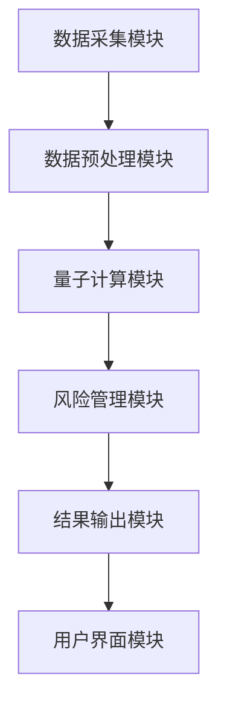

                 


# 全球股市估值与量子计算在金融风险管理中的应用

> 关键词：全球股市估值、量子计算、金融风险管理、量子算法、金融建模

> 摘要：本文探讨了全球股市估值与量子计算在金融风险管理中的应用。通过分析股市估值的核心方法和量子计算的基本原理，结合实际案例，展示了量子计算如何提升金融风险管理的效率和准确性。文章详细讲解了量子算法的原理和实现，并提出了一个量子计算辅助的金融风险管理系统的架构设计方案。

---

# 引言

全球股市估值是金融领域的重要研究方向，其准确性直接影响投资决策和风险管理。然而，传统方法在处理复杂金融市场问题时存在局限性，而量子计算的出现为解决这些问题提供了新的可能性。本文将深入探讨全球股市估值的核心方法，并结合量子计算的基本原理，分析其在金融风险管理中的应用。

---

## 第1章：全球股市估值的核心方法

### 1.1 股市估值的基本概念

股市估值是通过对公司财务数据的分析，评估其股票的内在价值。常用的方法包括市盈率（P/E）、市净率（P/B）和现金流折现模型（DCF）等。

#### 1.1.1 常用估值指标

- **市盈率（P/E）**：衡量股票价格与每股收益的比率，公式为：
  $$ P/E = \frac{\text{股价}}{\text{每股收益}} $$

- **市净率（P/B）**：衡量股票价格与每股净资产的比率，公式为：
  $$ P/B = \frac{\text{股价}}{\text{每股净资产}} $$

- **DCF模型**：通过折现未来现金流来评估公司价值，公式为：
  $$ V = \sum_{t=1}^{n} \frac{CF_t}{(1 + r)^t} + \frac{TV}{(1 + r)^n} $$

### 1.2 影响股市估值的关键因素

影响股市估值的主要因素包括宏观经济环境、行业竞争状况、公司财务状况和市场情绪等。

---

## 第2章：量子计算的基本原理

量子计算利用量子位（qubit）和量子叠加（superposition）等特性，能够在处理复杂问题时显著提高计算效率。

### 2.1 量子位与量子叠加

- 量子位可以同时处于多个状态的叠加态，例如：
  $$ |q\rangle = \alpha|0\rangle + \beta|1\rangle $$

- 量子纠缠（entanglement）允许两个或多个量子位之间建立强关联，进一步提升计算能力。

### 2.2 量子计算与传统计算的对比

| 特性                | 传统计算             | 量子计算             |
|---------------------|----------------------|----------------------|
| 基础单位            | 二进制位（bit）       | 量子位（qubit）       |
| 并行计算能力        | 串行处理             | 并行处理             |
| 处理复杂度          | 常规复杂度为O(n)      | 可能在某些问题上指数级降低复杂度 |

---

## 第3章：量子计算在金融中的应用

### 3.1 量子金融建模

量子计算可以用于模拟复杂的金融市场模型，例如量子蒙特卡洛模拟（Quantum Monte Carlo Simulation）。

#### 3.1.1 量子蒙特卡洛模拟的实现

量子蒙特卡洛模拟通过量子算法优化传统的蒙特卡洛方法，显著减少计算时间。以下是量子蒙特卡洛模拟的实现步骤：

1. 初始化量子位。
2. 应用量子叠加操作。
3. 测量结果并统计概率。

### 3.2 量子组合优化

量子组合优化算法（Quantum Approximate Optimization Algorithm, QAOA）可以用于优化投资组合，例如最大化收益并最小化风险。

#### 3.2.1 量子组合优化的流程

1. 定义优化目标函数。
2. 转换为量子电路。
3. 执行量子计算并测量结果。

---

## 第4章：量子计算与全球股市估值的结合

### 4.1 量子计算在股市估值中的优势

量子计算可以通过以下方式提升股市估值的准确性：

- **加速数据处理**：利用量子并行性快速处理大量数据。
- **优化模型参数**：通过量子组合优化算法找到最优参数。

### 4.2 量子算法在风险评估中的应用

#### 4.2.1 量子风险评估模型

量子风险评估模型通过量子算法计算投资组合的风险价值（VaR）和预期损失（Expected Loss）。

---

## 第5章：量子计算辅助的金融风险管理系统的架构设计

### 5.1 系统功能设计

系统功能模块包括数据采集、量子计算、风险管理、结果输出和用户界面。

### 5.2 系统架构设计

以下是系统的架构图：



### 5.3 接口设计

系统接口包括数据输入接口、量子计算接口和结果输出接口。

---

## 第6章：项目实战

### 6.1 环境安装

安装量子计算环境，例如Qiskit库和Quantum Computing Simulator。

### 6.2 核心代码实现

以下是量子蒙特卡洛模拟的Python代码示例：

```python
from qiskit import QuantumCircuit, Aer, execute

def quantum_monte_carlo():
    circuit = QuantumCircuit(2)
    circuit.h(0)
    circuit.cx(0, 1)
    backend = Aer.get_backend('simulator')
    result = execute(circuit, backend).result()
    print(result.get_counts())

quantum_monte_carlo()
```

---

## 第7章：结论与展望

### 7.1 研究总结

量子计算在金融风险管理中的应用前景广阔，能够显著提升股市估值的准确性和效率。

### 7.2 未来展望

未来的研究方向包括开发更高效的量子算法和优化量子计算硬件性能。

### 7.3 最佳实践

- 定期更新模型参数。
- 结合经典算法与量子算法。
- 加强数据安全和隐私保护。

---

# 结语

通过本文的详细讲解，读者可以全面了解全球股市估值与量子计算在金融风险管理中的应用。量子计算的引入为金融领域带来了新的可能性，未来的研究和实践将进一步推动其应用的深度和广度。

作者：AI天才研究院 & 禅与计算机程序设计艺术

