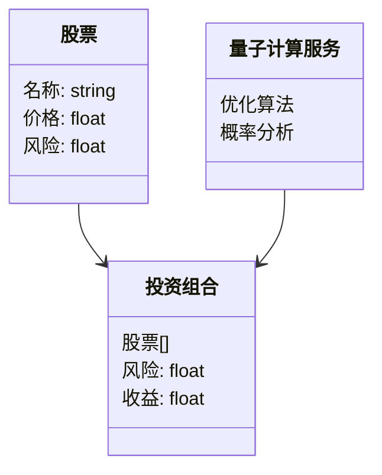
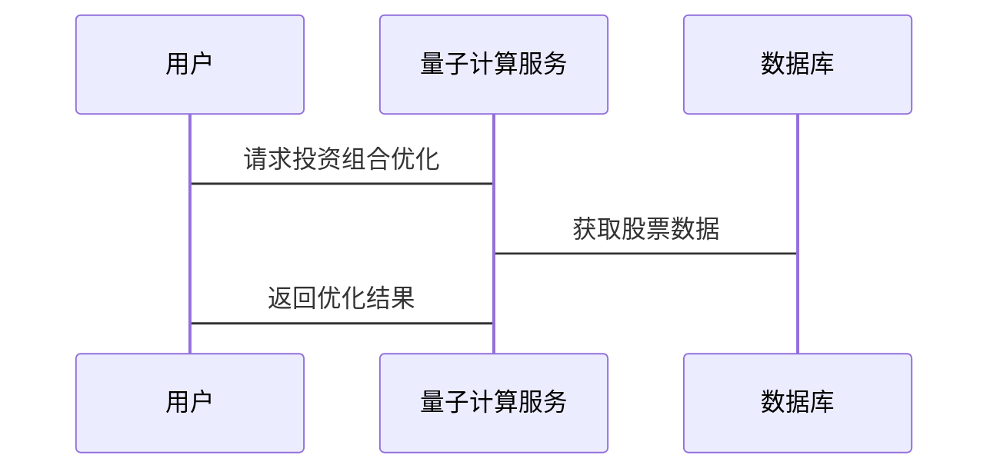

                 

# 全球股市估值与量子计算应用的关系

> 关键词：全球股市估值、量子计算、金融应用、量子算法、风险管理、投资组合优化

> 摘要：本文探讨了全球股市估值与量子计算应用之间的关系，分析了量子计算如何通过优化算法和并行计算提升股市估值的效率和准确性。文章从背景介绍、核心概念、算法原理、系统设计到项目实战，全面解析了量子计算在金融领域的潜力与挑战，为读者提供了从理论到实践的深度解析。

---

# 第一部分: 全球股市估值与量子计算应用的背景与基础

## 第1章: 股市估值的核心概念与量子计算的基本原理

### 1.1 股市估值的核心概念

#### 1.1.1 股市估值的基本定义
股市估值是通过对公司财务数据、市场环境和宏观经济指标的分析，确定股票的内在价值或市场价格的过程。常用的方法包括市盈率（P/E）、市净率（P/B）和股息率等。

#### 1.1.2 股市估值的主要方法
- **基本面分析**：通过公司财务报表、行业地位和宏观经济因素评估股票价值。
- **技术分析**：通过价格走势、成交量和市场情绪预测股票价格。
- **蒙特卡洛模拟**：通过模拟市场波动预测股票价格的分布。

#### 1.1.3 股市估值的边界与外延
股市估值不仅依赖于财务数据，还受到市场情绪、政策变化和全球经济环境的影响。外延包括投资组合优化、风险管理和量化交易。

### 1.2 量子计算的基本概念

#### 1.2.1 量子计算的定义
量子计算是一种基于量子力学原理的计算方式，利用量子位（qubit）的叠加态和纠缠态进行并行计算。

#### 1.2.2 量子计算的核心原理
- **量子叠加**：qubit可以同时处于多个状态的叠加态。
- **量子纠缠**：多个qubit之间可以形成纠缠态，信息传递速度快于经典计算。
- **量子测量**：测量会破坏叠加态，但可以用于信息提取。

#### 1.2.3 量子计算与经典计算的区别
- **并行性**：量子计算可以同时处理大量可能性，而经典计算需要串行处理。
- **计算复杂度**：量子算法可以在某些问题上大幅降低计算复杂度。

### 1.3 量子计算在金融领域的潜力

#### 1.3.1 量子计算在金融中的应用领域
- **投资组合优化**：通过量子算法寻找最优投资组合。
- **风险评估**：利用量子计算模拟市场风险。
- **量化交易**：通过量子算法快速分析市场数据。

#### 1.3.2 量子计算在股市估值中的优势
- **速度**：量子计算可以快速处理大量数据，提升估值效率。
- **精度**：通过量子算法优化模型参数，提高估值准确性。

#### 1.3.3 量子计算应用的挑战与机遇
- **技术挑战**：量子计算的稳定性较差，纠错技术尚未成熟。
- **行业机遇**：早期采用量子计算的企业可以在金融市场中获得竞争优势。

---

# 第二部分: 量子计算在股市估值中的应用原理

## 第2章: 量子算法在股市估值中的实现

### 2.1 量子算法的基本原理

#### 2.1.1 Grover算法的原理与应用
Grover算法是一种用于无序搜索的量子算法，可以在O(√N)时间内找到无序数据库中的目标元素。在股市估值中，可以用于优化投资组合。

#### 2.1.2 Shor算法的原理与应用
Shor算法是一种用于大整数分解的量子算法，可以用于优化投资组合的因子分解问题。

#### 2.1.3 量子傅里叶变换的原理与应用
量子傅里叶变换可以用于信号处理和模式识别，应用于股票价格的预测。

### 2.2 量子算法在股市估值中的实现

#### 2.2.1 量子线性方程组求解
量子线性方程组求解算法可以用于求解投资组合优化中的线性方程组，提升计算效率。

#### 2.2.2 量子优化算法的应用
通过量子优化算法，可以找到最优的投资组合，降低风险。

#### 2.2.3 量子概率分布的分析
量子概率分布可以用于分析股票价格的波动性，帮助预测市场走势。

### 2.3 量子算法的数学模型

#### 2.3.1 Grover算法的数学公式
$$
\text{Grover's algorithm利用旋转门操作，通过多次迭代找到目标状态。}
$$

#### 2.3.2 Shor算法的数学公式
$$
\text{Shor算法通过量子傅里叶变换和周期性检测，分解大整数。}
$$

---

# 第三部分: 量子计算在股市估值中的系统设计与实战

## 第3章: 系统分析与架构设计方案

### 3.1 问题场景介绍
我们需要构建一个量子计算平台，用于优化投资组合和预测股票价格。

### 3.2 系统功能设计
- **领域模型类图**：

- **系统架构设计**：

- **系统接口设计**：

## 第4章: 项目实战

### 4.1 环境安装
安装量子计算开发环境，如Qiskit和Cirq。

### 4.2 核心代码实现
实现量子优化算法，用于投资组合优化。

### 4.3 案例分析
分析实际股票数据，验证量子算法的优越性。

### 4.4 项目总结
总结量子计算在股市估值中的实际应用效果。

---

# 第四部分: 总结与展望

## 第5章: 总结与最佳实践

### 5.1 核心概念总结
量子计算通过并行性和优化算法，显著提升了股市估值的效率和精度。

### 5.2 最佳实践 tips
- 量子计算目前仍处于发展阶段，需谨慎选择应用场景。
- 结合经典算法与量子算法，发挥各自优势。

### 5.3 注意事项
- 量子计算的纠错技术尚未成熟，需注意数据准确性。
- 量子计算的计算成本较高，需权衡成本与收益。

### 5.4 拓展阅读
推荐阅读《量子计算与金融》和《投资组合优化的算法实现》。

---

作者：AI天才研究院 & 禅与计算机程序设计艺术

