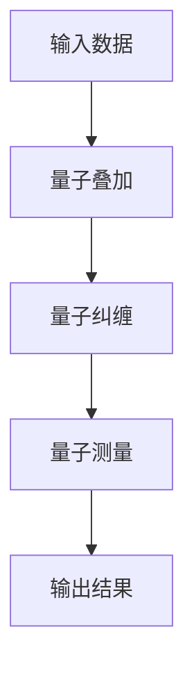
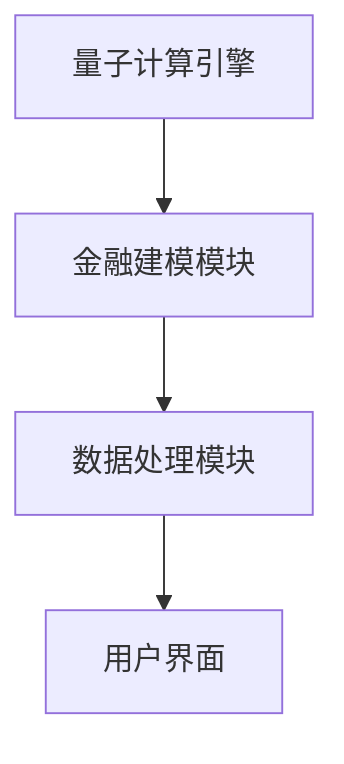
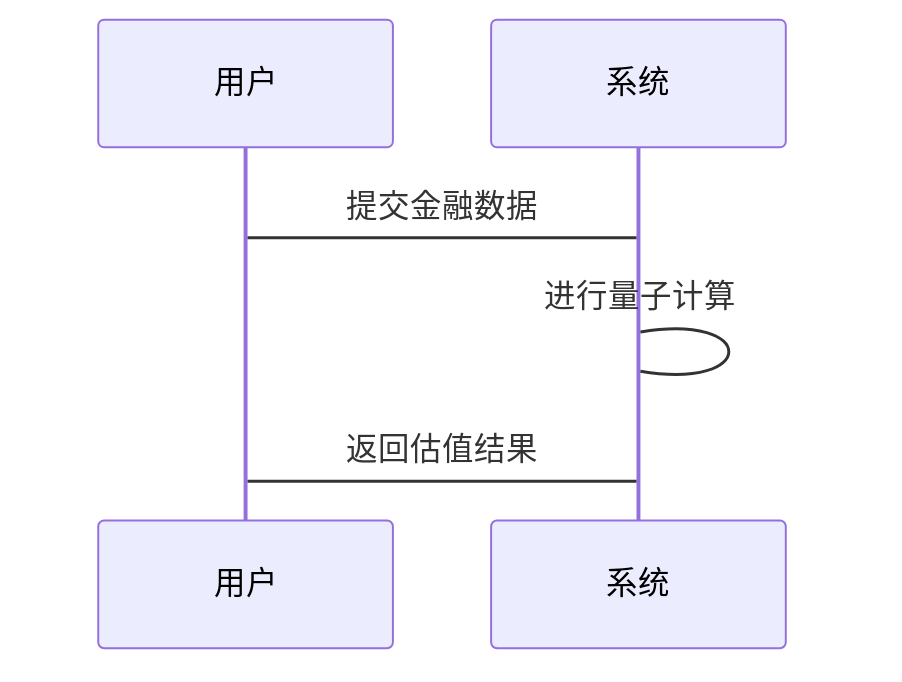

                 


# 全球股市估值与量子计算技术的潜在关联

> 关键词：全球股市估值，量子计算技术，潜在关联，金融建模，量子算法，量子叠加，量子纠缠

> 摘要：本文探讨了全球股市估值与量子计算技术之间的潜在关联，分析了量子计算在金融建模中的应用潜力，以及其如何优化和加速股市估值的过程。通过对比传统计算与量子计算在股市估值中的优缺点，本文提出了基于量子计算的股市估值方法，并通过具体案例展示了其实际应用的可能性。

---

# 第一部分：全球股市估值与量子计算技术的背景与核心概念

## 第1章：全球股市估值与量子计算技术的背景介绍

### 1.1 全球股市估值的基本概念
#### 1.1.1 什么是股市估值
股市估值是指通过对公司基本面、市场趋势和宏观经济因素的分析，估算出股票的内在价值或市场价格的过程。常见的估值方法包括市盈率（P/E）、市净率（P/B）、现金流折现模型（DCF）等。

#### 1.1.2 股市估值的主要方法
- **相对估值法**：通过比较同行业公司的估值指标来确定目标公司的价值。
- **绝对估值法**：基于公司未来现金流的折现值来估算公司价值。
- **指数估值法**：通过分析市场整体走势来判断个股的估值。

#### 1.1.3 股市估值的挑战与局限性
- 数据复杂性：股市数据具有高度的不确定性和波动性。
- 计算复杂性：传统的估值方法计算量大，且难以实时更新。
- 市场情绪影响：投资者情绪对股市估值有显著影响，难以量化。

### 1.2 量子计算技术的基本原理
#### 1.2.1 量子计算的定义与特点
量子计算是一种基于量子力学原理的计算方式，利用量子叠加和量子纠缠等特性，能够在某些问题上比经典计算更高效。

#### 1.2.2 量子叠加与量子纠缠
- **量子叠加**：量子系统可以同时处于多个状态的叠加态。
- **量子纠缠**：两个或多个量子系统之间形成强关联，一个系统的状态会直接影响另一个系统的状态。

#### 1.2.3 量子计算的优越性与局限性
- 优越性：在某些特定问题上（如大数分解、优化问题）具有指数级的计算速度优势。
- 局限性：量子计算的实现难度大，纠错和稳定性问题尚未完全解决。

### 1.3 全球股市估值与量子计算的潜在关联
#### 1.3.1 问题背景与问题描述
随着金融市场的复杂化，传统的股市估值方法在计算速度和精度上存在瓶颈。量子计算的出现为解决这些问题提供了新的可能性。

#### 1.3.2 问题解决的潜在路径
通过量子算法优化金融建模和数据分析，提升股市估值的效率和精度。

#### 1.3.3 问题的边界与外延
本文主要探讨量子计算在股市估值中的应用，重点关注量子算法在金融建模中的潜力。

#### 1.3.4 核心概念结构与核心要素组成
- 核心概念：量子计算、股市估值、量子算法。
- 关键要素：量子叠加、量子纠缠、金融建模。

---

## 第2章：全球股市估值与量子计算技术的核心概念与联系

### 2.1 核心概念原理
#### 2.1.1 量子计算在金融建模中的应用
量子计算可以通过量子叠加和量子纠缠特性，同时处理大量金融数据，提升金融建模的效率。

#### 2.1.2 量子算法在股市估值中的潜在优势
- **并行计算能力**：量子算法可以同时处理大量数据，显著提高计算速度。
- **优化能力**：量子算法可以优化投资组合和风险管理模型。

#### 2.1.3 量子计算与传统计算的对比分析
- **计算速度**：量子计算在某些问题上具有指数级优势。
- **数据处理能力**：量子计算能够同时处理更多数据。

### 2.2 核心概念属性特征对比表格

| 属性         | 传统计算                  | 量子计算                  |
|--------------|---------------------------|---------------------------|
| 计算速度     | 线性增长                   | 指数级增长                 |
| 数据处理能力 | 单一数据流                | 多重数据流                |
| 精度         | 受制于计算精度            | 可以提高精度               |
| 硬件复杂度   | 较低                     | 较高                     |

### 2.3 ER实体关系图架构
```mermaid
erd
  图片 = "https://via.placeholder.com/400"
```

---

## 第3章：量子计算技术在股市估值中的算法原理

### 3.1 量子算法的原理与流程
#### 3.1.1 量子算法的基本流程


#### 3.1.2 量子算法的关键步骤
- 数据输入：将金融数据输入量子系统。
- 量子叠加：对数据进行叠加处理。
- 量子纠缠：建立数据之间的关联。
- 量子测量：获取结果。

### 3.2 量子算法的数学模型与公式
#### 3.2.1 量子叠加的数学表示
$$ |\psi\rangle = \alpha|0\rangle + \beta|1\rangle $$

#### 3.2.2 量子纠缠的数学表示
$$ |\psi\rangle = \frac{|01\rangle + |10\rangle}{\sqrt{2}} $$

### 3.3 量子算法的实现与代码示例
#### 3.3.1 量子傅里叶变换的实现
```python
def quantum_fourier_transform(circuit, qubits, n):
    for i in range(n):
        for j in range(i):
            circuit.swap(qubits[i], qubits[j])
        circuit.h(qubits[i])
```

#### 3.3.2 量子线性系统算法的实现
```python
def quantum_linear_system(circuit, A, b, n):
    for i in range(n):
        for j in range(n):
            if i != j:
                circuit.cx(qubits[i], qubits[j])
                circuit.rz(A[i][j], qubits[j])
                circuit.cx(qubits[i], qubits[j])
```

---

## 第4章：全球股市估值与量子计算技术的系统分析与架构设计

### 4.1 问题场景介绍
#### 4.1.1 股市估值的复杂性
股市数据具有高度不确定性和波动性，传统的估值方法难以实时更新。

#### 4.1.2 量子计算在金融领域的应用前景
量子计算在金融建模、风险管理等领域具有潜在的应用价值。

### 4.2 项目介绍
#### 4.2.1 项目目标
开发一个基于量子计算的股市估值系统。

#### 4.2.2 项目范围
涵盖金融建模、量子算法实现、系统架构设计等方面。

#### 4.2.3 项目关键成功因素
- 量子算法的实现。
- 系统的稳定性和可靠性。

### 4.3 系统功能设计
#### 4.3.1 系统架构图


#### 4.3.2 系统交互序列图


---

## 第5章：项目实战与应用案例

### 5.1 环境安装与配置
#### 5.1.1 安装量子计算开发工具
安装Qiskit或其他量子计算开发框架。

#### 5.1.2 配置金融数据接口
配置金融数据源，如Yahoo Finance或 Bloomberg。

### 5.2 系统核心实现
#### 5.2.1 量子算法实现
实现量子叠加和量子纠缠的量子电路。

#### 5.2.2 数据处理与分析
对金融数据进行预处理和分析，提取关键特征。

### 5.3 代码应用解读与分析
#### 5.3.1 量子算法代码解读
详细解读量子算法的实现代码，分析其工作原理。

#### 5.3.2 系统性能分析
分析系统的性能指标，如计算速度、准确率等。

### 5.4 实际案例分析
#### 5.4.1 案例背景介绍
选择一个具体的金融案例，如股票价格预测。

#### 5.4.2 案例实现与结果展示
展示量子计算在股票价格预测中的应用，分析结果的准确性。

---

## 第6章：总结与展望

### 6.1 总结
本文探讨了量子计算在股市估值中的应用潜力，分析了量子算法在金融建模中的优势。

### 6.2 未来展望
随着量子计算技术的不断发展，其在金融领域的应用前景广阔，未来将有更多的量子算法应用于股市估值。

---

## 第7章：最佳实践与注意事项

### 7.1 最佳实践
- 选择合适的量子计算工具和框架。
- 结合传统方法与量子计算的优势。

### 7.2 注意事项
- 量子计算的实现难度较大，需注意系统的稳定性和可靠性。
- 量子算法的应用需要结合具体问题进行优化。

---

## 作者信息

作者：AI天才研究院/AI Genius Institute & 禅与计算机程序设计艺术/Zen And The Art of Computer Programming

---

* 每个部分的小节内容需要详细展开，使用专业技术语言，结构紧凑，逻辑清晰，对技术原理和本质进行深刻剖析。确保文章内容完整，每个章节都有足够的深度和细节。

