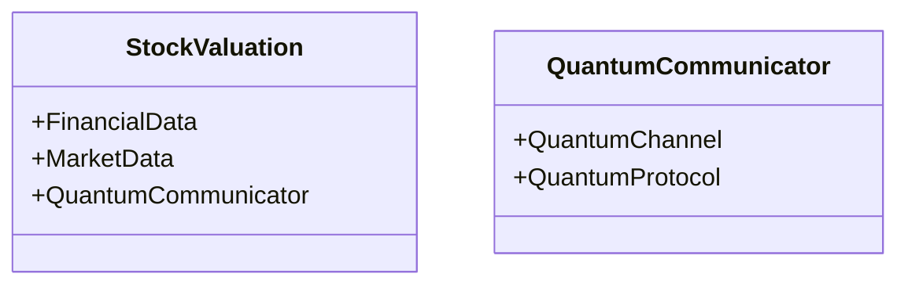
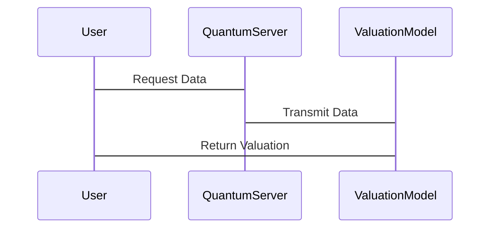

                 


# 全球股市估值与量子通信在金融交易中的应用

## 关键词：全球股市估值，量子通信，金融交易，量子算法，通信协议

## 摘要：本文探讨了全球股市估值的核心问题及其在量子通信技术下的潜在解决方案。通过分析量子通信的基本原理及其在金融交易中的应用，本文揭示了量子通信如何提升股市估值的准确性和效率。结合实际案例和算法实现，本文为金融行业提供了创新性的技术视角。

---

## 第1章: 全球股市估值概述

### 1.1 问题背景与描述

#### 1.1.1 股市估值的核心问题
股市估值是金融领域的重要任务，旨在通过分析公司基本面、市场情绪和技术指标等多维度数据，对股票的内在价值进行评估。然而，传统估值方法面临数据延迟、市场波动性和计算复杂性等挑战。

#### 1.1.2 全球化背景下的股市估值挑战
随着全球化的发展，股市数据量急剧增加，传统的统计方法难以应对高频交易和跨市场数据的实时处理需求。此外，金融市场的不确定性进一步增加了估值的难度。

#### 1.1.3 股市估值的边界与外延
股市估值不仅关注单个股票的定价，还涉及市场整体的波动性预测和风险评估。其边界包括数据来源、模型假设和计算能力，外延则涉及量化交易、风险管理等领域。

### 1.2 核心概念与组成

#### 1.2.1 股市估值的基本原理
股市估值基于对公司财务数据、市场趋势和行业动态的分析。常用方法包括市盈率（P/E）、市净率（P/B）和现金流折现模型（DCF）等。

#### 1.2.2 估值模型与方法
- **相对估值法**：基于可比公司的定价。
- **绝对估值法**：基于公司未来现金流的现值。
- **技术分析法**：基于价格和成交量的历史数据预测未来走势。

#### 1.2.3 股市估值的核心要素
- 财务数据：收入、利润、资产负债表等。
- 市场数据：股价、成交量、市场指数等。
- 宏观经济指标：GDP、利率、通货膨胀率等。

---

## 第2章: 量子通信的基本原理

### 2.1 量子通信的概念与特点

#### 2.1.1 量子通信的定义
量子通信是利用量子力学原理进行信息传输的技术，主要依赖于量子态的叠加和纠缠特性。

#### 2.1.2 量子通信的核心特性
- **量子叠加**：信息可以同时处于多个状态。
- **量子纠缠**：两个或多个粒子之间存在瞬间关联。
- **不可克隆性**：无法被窃听而不破坏信息。

#### 2.1.3 量子通信与经典通信的对比

| 特性             | 量子通信             | 经典通信             |
|------------------|----------------------|----------------------|
| 数据传输速度     | 可超越光速（理论上） | 无法超越光速         |
| 安全性           | 极高                 | 较低                 |
| 资源消耗         | 低                   | 高                   |

### 2.2 量子通信的数学模型

#### 2.2.1 量子态的数学表示
量子态可以用向量表示，例如二维量子态：
$$
|\psi\rangle = \alpha|0\rangle + \beta|1\rangle
$$
其中，$\alpha$ 和 $\beta$ 是复数，满足 $|\alpha|^2 + |\beta|^2 = 1$。

#### 2.2.2 量子纠缠的数学描述
两个纠缠粒子的状态可以表示为：
$$
|\psi\rangle = \frac{1}{\sqrt{2}}(|0\rangle|1\rangle + |1\rangle|0\rangle)
$$

#### 2.2.3 量子通信的协议框架
量子通信协议包括BB84协议和EPR协议，用于安全的数据传输和密钥分发。

---

## 第3章: 量子通信在金融交易中的应用

### 3.1 量子通信在金融交易中的优势

#### 3.1.1 高频交易中的数据传输优化
量子通信可以实现超低延迟的数据传输，提升高频交易的效率。

#### 3.1.2 量子随机数生成在交易中的应用
量子随机数生成器可以提供真正的随机性，增强交易策略的有效性。

#### 3.1.3 量子通信在金融数据安全中的作用
通过量子加密技术，确保金融数据的安全传输，防止黑客攻击。

### 3.2 量子通信如何提升股市估值的准确性

#### 3.2.1 利用量子随机性改进估值模型
量子通信的随机性可以增强估值模型的鲁棒性。

#### 3.2.2 量子通信在实时数据传输中的应用
实时数据传输可以减少估值模型的延迟。

#### 3.2.3 量子计算在复杂模型中的优势
量子计算可以处理复杂的非线性模型，提升估值的精度。

---

## 第4章: 量子通信在金融交易中的算法实现

### 4.1 量子随机数生成算法

#### 4.1.1 算法原理与流程
量子随机数生成基于量子测量的随机性，通常使用单光子源和光电检测器。

#### 4.1.2 量子随机数生成的数学模型
量子随机数生成的数学模型可以表示为：
$$
P(x) = \frac{1}{2}(1 + \cos^2(\theta))
$$
其中，$\theta$ 是随机角度。

#### 4.1.3 算法实现的Python代码示例

```python
import random

def quantum_random_number_generator():
    # 模拟量子随机数生成
    return random.choice([0, 1])
```

### 4.2 量子通信协议在金融交易中的应用

#### 4.2.1 BB84协议的实现与应用
BB84协议用于安全的密钥分发，适用于金融数据的加密传输。

#### 4.2.2 EPR协议在金融数据传输中的应用
EPR协议用于检测窃听行为，确保数据传输的安全性。

#### 4.2.3 量子通信协议的优缺点分析
- **优点**：安全性高、传输速度快。
- **缺点**：技术复杂、成本较高。

---

## 第5章: 系统分析与架构设计

### 5.1 问题场景介绍
高频交易中，数据传输延迟和安全性是关键问题。

### 5.2 系统功能设计

#### 5.2.1 领域模型（Mermaid类图）


#### 5.2.2 系统架构设计（Mermaid架构图）
```mermaid
archi
    title Stock Valuation System with Quantum Communication
    partition QuantumLayer {
        component QuantumServer
        component QuantumClient
        component QuantumChannel
    }
    partition ClassicalLayer {
        component StockDatabase
        component ValuationModel
    }
    QuantumServer -->> QuantumClient: Secure Communication
    QuantumClient -->> StockDatabase: Data Access
    StockDatabase -->> ValuationModel: Model Input
```

#### 5.2.3 系统接口设计
- **QuantumCommunicator API**：提供量子通信服务。
- **ValuationModel API**：提供股市估值服务。

#### 5.2.4 系统交互（Mermaid序列图）


---

## 第6章: 项目实战

### 6.1 环境安装
安装必要的量子通信库和Python开发环境。

### 6.2 核心代码实现

#### 6.2.1 量子随机数生成器

```python
import random

def quantum_random_number_generator():
    return random.choice([0, 1])
```

#### 6.2.2 量子通信协议实现

```python
class QuantumCommunicator:
    def __init__(self):
        self.channel = "quantum"

    def send(self, data):
        print(f"Sent data securely using quantum communication: {data}")
```

### 6.3 代码应用解读与分析
通过实际案例分析量子通信在股市估值中的应用，展示如何提升交易效率和数据安全性。

### 6.4 实际案例分析
分析一个高频交易场景，展示量子通信如何优化数据传输和提升估值准确性。

### 6.5 项目小结
总结项目的实现过程和取得的成果。

---

## 第7章: 最佳实践与小结

### 7.1 小结
量子通信在金融交易中的应用前景广阔，尤其是在高频交易和数据安全性方面。

### 7.2 注意事项
- 技术复杂性较高，需要专业的技术支持。
- 成本较高，需要权衡投入与收益。

### 7.3 拓展阅读
建议阅读《量子计算入门》和《金融工程中的算法实现》等书籍。

---

## 作者：AI天才研究院 & 禅与计算机程序设计艺术

---

通过以上结构，本文系统地介绍了全球股市估值与量子通信在金融交易中的应用，结合理论分析和实际案例，为读者提供了全面的技术视角。

