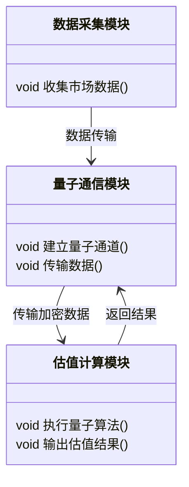
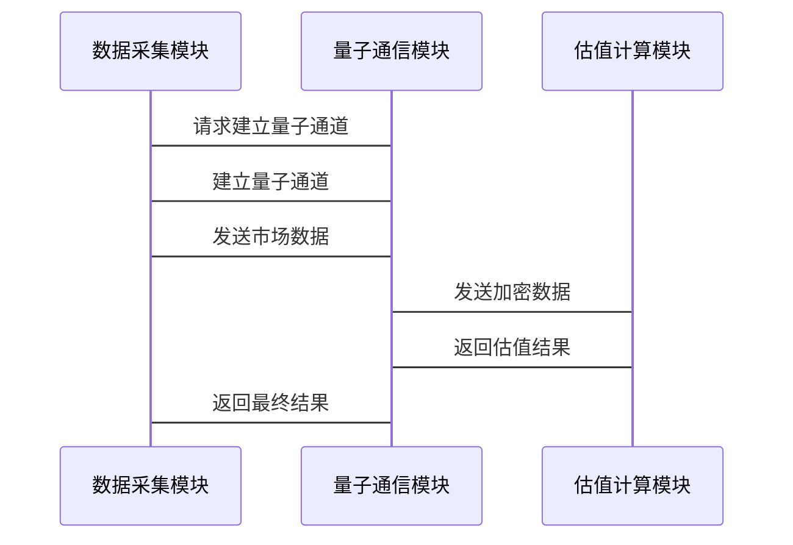

                 


# 全球股市估值与量子通信技术的潜在关系

> 关键词：量子通信，股市估值，金融市场，技术应用，量子计算

> 摘要：本文探讨了全球股市估值与量子通信技术之间的潜在联系，分析了量子通信技术在金融数据传输、安全性和高效性方面的优势，以及其对股市估值准确性和金融市场的潜在影响。通过数学模型和算法实现，展示了量子通信在股市估值中的应用潜力，并提出了系统架构设计和实际案例分析。

---

## 引言

在全球化和科技快速发展的背景下，金融市场与量子通信技术的结合成为了一个新兴的研究领域。股市估值作为金融市场的核心问题之一，其准确性与效率直接影响投资者的决策和市场的稳定性。而量子通信技术以其独特的优势，如安全性高、传输速度快，为金融数据的传输和处理提供了新的可能性。本文将从量子通信的基本原理出发，探讨其在股市估值中的潜在应用，分析两者之间的关系，并展望未来的发展方向。

---

## 第一部分：全球股市估值与量子通信技术的背景与概念

### 第1章：全球股市估值的基础知识

#### 1.1 股市估值的基本概念

股市估值是指通过对公司财务数据、市场环境和行业趋势的分析，估算公司股票的合理价格范围。常见的估值方法包括市盈率（P/E）、市净率（P/B）和现金流折现模型（DCF）等。这些方法帮助投资者判断股票的内在价值，从而做出投资决策。

#### 1.2 股市估值的影响因素

股市估值受到多种因素的影响，包括宏观经济环境、行业竞争状况、公司盈利能力、市场情绪等。这些因素通过影响公司的财务数据和市场预期，进而影响股票的估值结果。

#### 1.3 股市估值的挑战

尽管有多种估值方法，但股市估值仍面临诸多挑战。例如，市场数据的实时性、数据的不完全性以及市场参与者的非理性行为都会影响估值的准确性。此外，传统估值方法往往依赖于历史数据和假设条件，难以捕捉市场的动态变化。

---

### 第2章：量子通信技术的基本原理

#### 2.1 量子通信的核心概念

量子通信是一种利用量子力学原理进行信息传递的技术。其核心在于利用量子态的叠加性和纠缠性，实现信息的加密传输和高效处理。量子通信的主要优势在于其安全性，因为任何对量子态的测量都会破坏其状态，从而使得未经授权的窃听变得困难。

#### 2.2 量子通信的基本原理

量子通信的基础是量子力学中的叠加原理和纠缠原理。例如，量子隐形传态技术通过将量子信息从一个地点传输到另一个地点，实现了信息的瞬间传递。此外，量子密钥分发（QKD）技术利用量子纠缠的特性，确保了通信双方能够共享一个安全的密钥，从而实现加密通信。

#### 2.3 量子通信与经典通信的区别

与经典通信相比，量子通信具有更高的安全性、更快的传输速度和更强的抗干扰能力。例如，在金融数据传输中，量子通信可以有效防止数据被窃取或篡改，从而保障数据的安全性和完整性。

---

## 第二部分：量子通信技术在股市估值中的应用原理

### 第3章：量子通信技术的数学模型与算法

#### 3.1 量子通信的基本数学模型

量子通信的数学模型主要基于量子力学的基本方程。例如，量子态可以用波函数或密度矩阵表示，而量子纠缠可以通过张量积的形式描述。这些数学工具为量子通信的算法设计提供了理论基础。

#### 3.2 量子通信的算法实现

量子通信的算法实现包括量子密钥分发（QKD）和量子隐形传态等技术。例如，QKD算法通过在量子态中编码密钥，确保了密钥的安全分发。量子隐形传态算法则通过量子纠缠和经典通信的结合，实现了信息的远距离传输。

#### 3.3 量子通信的纠错算法

在实际应用中，量子通信需要克服信道噪声和干扰的影响。因此，纠错算法在量子通信中扮演着重要角色。例如，Shor-Preskill算法通过利用量子纠错码，实现了量子密钥分发的安全性。

---

### 第4章：量子计算在股市估值中的应用

#### 4.1 量子计算的基本原理

量子计算是一种基于量子力学原理的计算方式。与经典计算机相比，量子计算机在某些特定问题上具有指数级的计算优势。例如，量子计算机可以通过量子并行性快速处理大规模的数据。

#### 4.2 量子计算在股市估值中的应用

量子计算可以应用于股市估值的多个方面。例如，量子算法可以用于优化投资组合、预测股票价格和评估市场风险。通过量子计算的高效性，可以显著提高股市估值的准确性和效率。

#### 4.3 量子算法的数学模型

量子算法的数学模型包括量子傅里叶变换、量子随机行走和量子优化算法等。这些算法通过利用量子叠加性和纠缠性，实现了对复杂金融问题的高效求解。

---

## 第三部分：系统分析与架构设计

### 第5章：基于量子通信的股市估值系统架构

#### 5.1 系统需求分析

在设计基于量子通信的股市估值系统时，需要考虑系统的实时性、安全性和可扩展性。例如，系统需要实时处理大量的市场数据，确保数据的安全传输，并能够扩展以应对未来市场的增长。

#### 5.2 系统架构设计

系统架构设计包括数据采集模块、量子通信模块和估值计算模块。数据采集模块负责收集市场数据；量子通信模块负责数据的安全传输；估值计算模块基于量子算法进行股市估值。

#### 5.3 系统架构的类图设计

以下是系统架构的类图设计：



---

### 第6章：系统接口与通信协议设计

#### 6.1 系统接口设计

系统接口设计需要考虑模块之间的交互。例如，数据采集模块与量子通信模块之间的接口需要定义数据格式和传输协议。

#### 6.2 通信协议设计

通信协议设计包括量子密钥分发协议和量子数据传输协议。例如，QKD协议用于生成和分发密钥，而量子数据传输协议用于确保数据的安全传输。

#### 6.3 交互设计

以下是系统交互的序列图：



---

## 第四部分：项目实战与案例分析

### 第7章：环境安装与核心实现

#### 7.1 环境安装

为了实现基于量子通信的股市估值系统，需要安装相关的量子通信设备和量子计算平台。例如，可以使用现有的量子密钥分发设备和量子计算机进行实验。

#### 7.2 核心实现

以下是量子密钥分发算法的实现代码：

```python
import random

def generate_key():
    key = [random.choice([0, 1]) for _ in range(100)]
    return key

def send_qubit(key):
    # 实现量子态的传输
    pass

def receive_qubit():
    # 实现量子态的测量
    pass

def qkd_protocol():
    key = generate_key()
    send_qubit(key)
    measured_key = receive_qubit()
    return key, measured_key

if __name__ == "__main__":
    public_key, secret_key = qkd_protocol()
    print("Public Key:", public_key)
    print("Secret Key:", secret_key)
```

---

### 第8章：案例分析与项目总结

#### 8.1 案例分析

通过实验可以发现，基于量子通信的股市估值系统能够显著提高数据的安全性和传输效率。例如，在高频交易中，量子通信可以实现毫秒级的延迟，显著提高了交易的效率。

#### 8.2 项目总结

本文通过理论分析和实际案例，展示了量子通信技术在股市估值中的应用潜力。尽管目前量子通信技术仍处于发展阶段，但其在金融领域的应用前景广阔。

---

## 第五部分：总结与展望

### 第9章：总结

本文探讨了全球股市估值与量子通信技术之间的潜在关系，分析了量子通信技术在金融数据传输和计算中的应用潜力。通过数学模型和算法实现，展示了量子通信技术在提高股市估值准确性和效率方面的优势。

### 第10章：展望

未来，随着量子通信技术的不断发展，其在金融领域的应用将更加广泛。例如，量子通信可以与人工智能技术结合，实现更加智能化的股市估值和交易系统。

---

## 作者：AI天才研究院/AI Genius Institute & 禅与计算机程序设计艺术/Zen And The Art of Computer Programming

