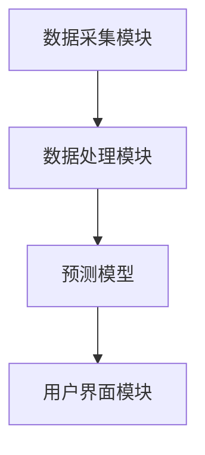
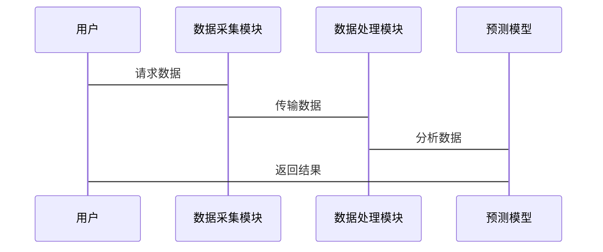

                 

# 全球股市估值与量子雷达在民用领域的应用

---

## 关键词

- 全球股市估值
- 量子雷达
- 金融数据分析
- 量子计算
- 智能监控系统

---

## 摘要

本文探讨了全球股市估值与量子雷达技术在民用领域的应用。首先，我们介绍了全球股市估值的基本概念、主要方法及其影响因素，强调了准确估值对投资者的重要性。接着，我们深入解析了量子雷达的技术原理及其在交通监控和环境监测等领域的广泛应用。最后，我们结合量子雷达与股市估值，展示了如何利用量子技术提升金融数据的采集和分析能力，为投资者提供更精准的决策支持。

---

## 第一部分：全球股市估值概述

### 第1章：全球股市估值的基本概念

#### 1.1 股市估值的定义与重要性

股市估值是指通过对公司财务数据、市场环境和行业趋势等多方面因素的分析，对股票的内在价值进行评估的过程。准确的估值能够帮助投资者做出合理的投资决策，避免因市场波动或信息不对称而造成损失。

#### 1.2 股市估值的主要方法

##### 1.2.1 市盈率（PE）法

市盈率是股票价格与每股收益的比率，公式为：

$$ PE = \frac{\text{股票价格}}{\text{每股收益}} $$

例如，假设某股票价格为50元，每股收益为5元，则其市盈率为10倍，表示投资者愿意为每1元的收益支付10元的价格。

##### 1.2.2 市净率（PB）法

市净率是股票价格与每股净资产的比率，公式为：

$$ PB = \frac{\text{股票价格}}{\text{每股净资产}} $$

例如，某股票价格为30元，每股净资产为10元，则其市净率为3倍，表示该股票的价格是其净资产的3倍。

##### 1.2.3 现金流折现法（DCF）

DCF方法通过将未来现金流折现至当前价值来评估公司价值。公式如下：

$$ V = \sum_{t=1}^{n} \frac{CF_t}{(1 + r)^t} $$

其中，$CF_t$ 是第t年的现金流，$r$ 是折现率，$n$ 是现金流的期限。

#### 1.3 影响股市估值的主要因素

##### 1.3.1 宏观经济因素

宏观经济环境，如GDP增长率、通货膨胀率和利率水平，对股市估值有重要影响。例如，低利率环境通常会推高股市估值。

##### 1.3.2 行业因素

行业发展趋势和竞争格局也会影响股市估值。例如，技术行业的高增长潜力通常会导致较高的市盈率。

##### 1.3.3 公司基本面因素

公司财务状况、盈利能力和发展潜力是影响股市估值的核心因素。例如，高盈利增长的公司通常具有较高的估值。

---

### 第2章：量子雷达技术及其原理

#### 2.1 量子雷达的基本概念与特点

量子雷达是一种利用量子纠缠和量子测量技术的新型雷达系统。与传统雷达相比，量子雷达具有更高的灵敏度和抗干扰能力。

#### 2.2 量子雷达的核心技术

##### 2.2.1 量子纠缠技术

量子纠缠是指两个或多个粒子之间存在特殊的关联，即使相隔遥远，测量其中一个粒子的状态会立即影响另一个粒子的状态。

##### 2.2.2 量子测量技术

量子测量技术通过测量量子系统的状态来获取信息，具有极高的精度和灵敏度。

##### 2.2.3 量子信号处理技术

量子信号处理技术利用量子计算机的超强计算能力，对雷达信号进行实时处理和分析。

---

### 第3章：量子雷达在民用领域的应用

#### 3.1 量子雷达在交通监控中的应用

##### 3.1.1 交通监控的基本需求

交通监控需要实时监测交通流量、检测交通事件并优化交通管理。例如，实时监测可以帮助减少交通拥堵。

##### 3.1.2 量子雷达在交通监控中的应用案例

通过量子雷达实时监测交通流量，优化信号灯控制，提高道路通行效率。

#### 3.2 量子雷达在环境监测中的应用

##### 3.2.1 环境监测的基本需求

环境监测需要实时监测空气质量、水质和森林防火等。例如，实时监测空气质量可以帮助预防雾霾。

##### 3.2.2 量子雷达在环境监测中的应用案例

通过量子雷达实时监测水质污染，提前发出预警。

---

## 第四部分：全球股市估值与量子雷达技术的结合

### 第5章：量子雷达技术在股市估值中的应用

#### 5.1 量子雷达技术在金融数据采集中的应用

##### 5.1.1 高频交易数据采集

量子雷达能够实时采集高频交易数据，为投资者提供实时市场信息。

##### 5.1.2 市场情绪分析

通过分析高频交易数据，量子雷达可以帮助投资者了解市场情绪，做出更准确的投资决策。

##### 5.1.3 金融风险预警

量子雷达可以实时监测市场波动，提前发出金融风险预警。

#### 5.2 量子雷达技术在金融数据分析中的应用

##### 5.2.1 数据挖掘与预测模型构建

量子雷达技术可以利用量子计算的强大能力，快速分析大量数据，构建预测模型。

##### 5.2.2 量子计算在金融数据处理中的应用

通过量子计算，可以快速处理复杂金融数据，提高估值准确性。

##### 5.2.3 量子信号处理技术在金融分析中的应用

量子信号处理技术可以帮助识别金融市场中的隐藏信号，提供更精确的分析结果。

---

## 第五部分：项目实战与系统架构设计

### 第6章：基于量子雷达的股市估值系统

#### 6.1 项目背景与目标

本项目旨在利用量子雷达技术提升股市估值的准确性和实时性。

#### 6.2 系统功能设计

##### 6.2.1 数据采集模块

负责实时采集市场数据，包括股票价格、交易量等。

##### 6.2.2 数据处理模块

利用量子计算技术对数据进行分析，构建预测模型。

##### 6.2.3 用户界面模块

提供直观的可视化界面，展示分析结果。

#### 6.3 系统架构设计

##### 6.3.1 系统架构图

##### 6.3.2 系统接口设计

系统接口包括数据输入接口和数据输出接口，确保数据的实时传输和处理。

##### 6.3.3 系统交互序列图

---

## 第六部分：最佳实践与小结

### 第7章：最佳实践与小结

#### 7.1 关键点总结

- 数据质量是准确估值的基础
- 算法选择直接影响估值结果
- 系统可扩展性决定了长期维护成本

#### 7.2 未来研究方向

- 进一步优化量子雷达的数据处理能力
- 探索更多量子计算在金融领域的应用

#### 7.3 小结

通过结合量子雷达技术和股市估值方法，我们可以显著提升金融数据分析的准确性和效率，为投资者提供更有力的支持。

---

## 作者：AI天才研究院 & 禅与计算机程序设计艺术

---

本文通过详细分析全球股市估值和量子雷达技术的基本概念、原理及其应用，展示了如何利用量子技术提升金融数据分析的能力。希望本文能够为投资者和相关技术研究者提供有价值的参考和启发。

