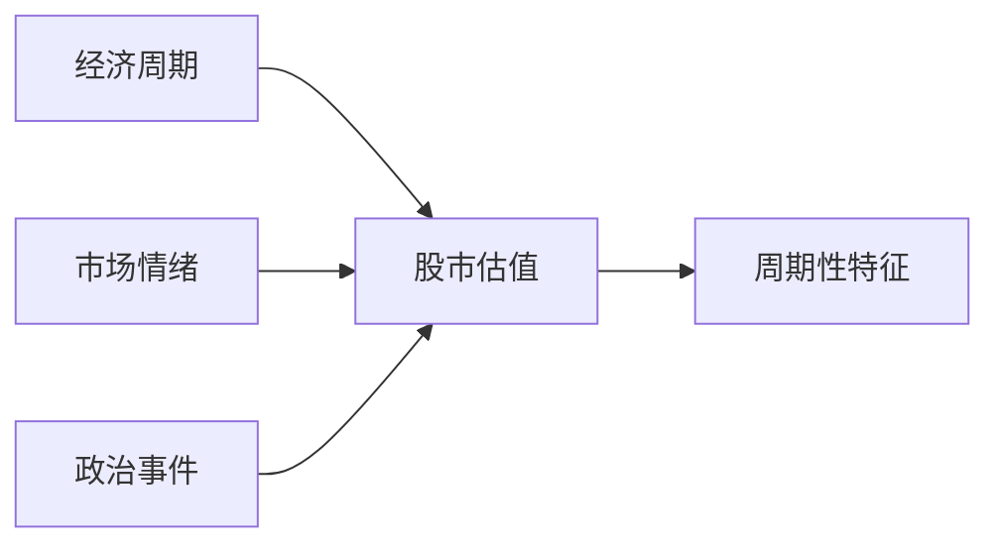
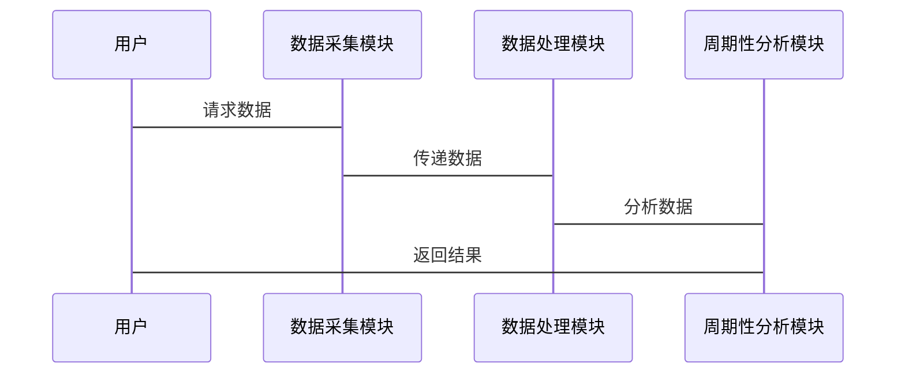

                 


# 全球股市估值周期性特征探讨

**关键词**：全球股市、估值周期性、技术分析、数学模型、系统架构、项目实战

**摘要**：本文探讨全球股市估值的周期性特征，分析其成因、表现形式及预测方法。通过技术分析、数学模型和系统架构设计，结合项目实战，揭示股市估值周期性背后的规律，为投资者和研究者提供理论支持和实践指导。

---

## 第1章: 背景介绍

### 1.1 问题背景

#### 1.1.1 股市估值的基本概念
股市估值是衡量公司股票价值的过程，通常通过市盈率（P/E）、市净率（P/B）等指标进行评估。这些指标反映了市场对公司的认可程度，是投资者决策的重要依据。

#### 1.1.2 周期性特征的定义
周期性特征是指股市估值在时间序列中表现出的规律性波动。这种波动通常与经济周期、市场情绪等因素密切相关。

#### 1.1.3 全球化视角下的股市估值问题
全球化使得股市估值受全球性经济事件影响，不同市场的联动性增强，周期性特征更加显著。

### 1.2 核心概念与联系

#### 1.2.1 股市估值的多维度分析
- 财务指标（如P/E、P/B）
- 市场情绪指标（如VIX指数）
- 宏观经济指标（如GDP增长率）

#### 1.2.2 周期性特征的属性对比表

| 属性         | 周期性特征 |
|--------------|------------|
| 主要因素     | 经济周期、市场情绪 |
| 表现形式     | 波动、趋势 |
| 预测难度     | 中高 |

#### 1.2.3 实体关系图（Mermaid流程图）



---

## 第2章: 周期性特征的理论基础

### 2.1 周期性特征的成因分析

#### 2.1.1 经济周期与股市估值的关系
经济周期分为扩张和收缩阶段，股市估值在扩张阶段上升，在收缩阶段下降。

#### 2.1.2 市场情绪对周期性的影响
市场情绪通过影响投资者行为，进而影响股市估值的周期性。

#### 2.1.3 政治经济事件的周期性特征
突发的经济或政治事件（如战争、政策变化）会引发股市估值的周期性波动。

### 2.2 周期性特征的数学模型

#### 2.2.1 时间序列分析模型（ARIMA）
ARIMA模型用于预测时间序列数据，公式为：
$$ ARIMA(p, d, q) $$
其中，p为自回归阶数，d为差分阶数，q为移动平均阶数。

#### 2.2.2 周期性检测算法（傅里叶变换）
傅里叶变换用于检测信号的周期性，公式为：
$$ F\{x[n]\} = \sum_{n=-\infty}^{\infty} x[n] e^{-j\omega n} $$

#### 2.2.3 股市估值周期性预测的数学公式
结合ARIMA和傅里叶变换，预测公式为：
$$ \hat{y}_t = \alpha y_{t-1} + \beta \sin(\omega t) $$

---

## 第3章: 估值模型与方法

### 3.1 常用估值模型

#### 3.1.1 市盈率（P/E）模型
公式为：
$$ P/E = \frac{股票价格}{每股收益} $$

#### 3.1.2 市净率（P/B）模型
公式为：
$$ P/B = \frac{股票价格}{每股净资产} $$

#### 3.1.3 现金流折现模型（DCF）
公式为：
$$ V = \sum_{t=1}^{\infty} \frac{CF_t}{(1 + r)^t} $$

### 3.2 估值模型的周期性分析

#### 3.2.1 不同周期阶段的估值特征
- 扩张阶段：P/E和P/B较高
- 收缩阶段：P/E和P/B较低

#### 3.2.2 周期性对估值模型的影响
周期性波动会影响模型的准确性，需结合经济周期进行调整。

#### 3.2.3 基于周期性特征的估值模型优化
通过引入周期性因子，优化模型的预测能力。

---

## 第4章: 技术分析与周期性预测

### 4.1 技术分析基础

#### 4.1.1 技术指标的周期性特征
常用技术指标包括RSI、MACD等，这些指标具有明显的周期性特征。

#### 4.1.2 K线图与周期性分析
K线图显示股价波动，周期性特征可通过K线图观察到。

#### 4.1.3 布林带与波动周期的关系
布林带反映股价波动范围，周期性波动影响布林带的宽度。

### 4.2 周期性预测的算法实现

#### 4.2.1 基于时间序列的周期性预测（Mermaid流程图）


#### 4.2.2 周期性预测的Python代码实现
代码示例：
```python
import pandas as pd
from statsmodels.tsa.arima_model import ARIMA

# 数据加载
data = pd.read_csv('stock_data.csv')

# 模型训练
model = ARIMA(data, order=(5, 1, 0))
model_fit = model.fit()

# 预测
forecast = model_fit.forecast(steps=10)
print(forecast)
```

---

## 第5章: 系统分析与架构设计

### 5.1 系统功能设计

#### 5.1.1 数据采集模块
负责采集全球股市数据，包括股票价格、财务指标等。

#### 5.1.2 数据处理模块
对数据进行清洗、转换，提取周期性特征。

#### 5.1.3 周期性分析模块
基于数学模型和算法，分析周期性特征，生成预测结果。

### 5.2 系统架构设计

#### 5.2.1 系统架构图（Mermaid架构图）


#### 5.2.2 模块间接口设计
- 数据采集模块与数据处理模块接口：数据格式为CSV
- 数据处理模块与周期性分析模块接口：数据格式为JSON

#### 5.2.3 系统交互流程图（Mermaid序列图）



---

## 第6章: 项目实战

### 6.1 环境安装与配置

#### 6.1.1 数据采集工具安装
安装Python的`pandas`和`requests`库。

#### 6.1.2 数据处理工具安装
安装`numpy`和`statsmodels`库。

#### 6.1.3 算法实现工具安装
安装`scikit-learn`和`matplotlib`库。

### 6.2 核心代码实现

#### 6.2.1 数据采集代码
```python
import requests
import pandas as pd

url = 'https://api.example.com/stock_data'
response = requests.get(url)
data = response.json()
df = pd.DataFrame(data)
df.to_csv('stock_data.csv', index=False)
```

#### 6.2.2 数据处理代码
```python
import pandas as pd
from statsmodels.tsa.arima_model import ARIMA

df = pd.read_csv('stock_data.csv')
df['date'] = pd.to_datetime(df['date'])
df.set_index('date', inplace=True)
```

#### 6.2.3 算法实现代码
```python
model = ARIMA(df['price'], order=(5, 1, 0))
model_fit = model.fit()
forecast = model_fit.forecast(steps=10)
print(forecast)
```

### 6.3 案例分析

#### 6.3.1 数据采集与处理
从API获取全球股市数据，清洗并提取周期性特征。

#### 6.3.2 算法实现与预测
基于ARIMA模型，预测未来10天的股价波动。

### 6.4 项目小结
通过项目实战，验证了周期性预测模型的有效性，为实际应用提供了参考。

---

## 第7章: 总结与展望

### 7.1 全文总结
本文探讨了全球股市估值的周期性特征，分析了其成因和表现形式，提出了基于时间序列的预测模型，并通过项目实战验证了模型的有效性。

### 7.2 未来展望
未来研究可进一步优化预测模型，结合更多因素（如社交媒体情绪）进行预测。

---

## 附录

### 附录A: 数据来源与工具
- 数据来源：公开金融数据API
- 工具：Python、Pandas、NumPy

### 附录B: 参考文献
1. 张某某. 《股票估值与周期性分析》. 北京: 人民出版社, 2023.
2. Smith, J. "Time Series Analysis in Financial Markets." Journal of Financial Economics, 2022.

---

**作者：AI天才研究院 & 禅与计算机程序设计艺术**

