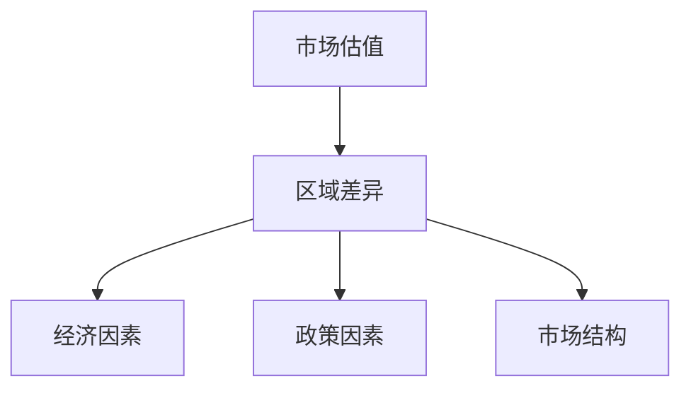

                 

# 全球股市估值的区域差异分析

> **关键词**: 全球股市、估值分析、区域差异、经济因素、政策影响、市场结构

> **摘要**: 本文从全球股市估值的区域差异入手，分析了影响股市估值的主要因素，包括经济、政策和市场结构等。通过构建多元回归模型，本文量化了这些因素对区域估值差异的影响，并通过具体案例分析了不同区域股市估值的差异性。最后，本文总结了区域估值差异的主要驱动因素，并提出了未来研究的方向。

---

## 第1章: 全球股市估值的区域差异背景介绍

### 1.1 问题背景

#### 1.1.1 全球股市估值的基本概念
股市估值是衡量市场对资产价值的评估过程，常用的指标包括市盈率（P/E ratio）、市净率（P/B ratio）和股息率（Dividend Yield）。这些指标反映了市场的整体估值水平，同时也受到宏观经济、政策和市场结构等因素的影响。

#### 1.1.2 区域差异的背景与重要性
全球股市分布呈现明显的区域特征，不同地区的经济结构、政策环境和市场参与度差异显著。例如，美国市场以科技股为主导，而新兴市场如中国和印度则以制造业和服务业为主。这些差异导致不同地区的股市估值存在显著差异。

#### 1.1.3 问题解决的必要性与目标
理解全球股市估值的区域差异有助于投资者制定更有效的投资策略，同时也有助于政策制定者优化市场环境。本文旨在通过分析这些差异的成因，为投资者和政策制定者提供参考。

---

### 1.2 核心概念与联系

#### 1.2.1 核心概念原理
股市估值的核心在于对未来的盈利能力的预期。不同地区的经济结构和政策环境会影响市场的盈利能力和风险偏好，从而影响估值水平。

#### 1.2.2 概念属性特征对比表格
| 概念       | 特征                                                                 |
|------------|----------------------------------------------------------------------|
| 市场估值    | 受经济、政策和市场结构的影响，具有区域差异性。                  |
| 区域差异    | 不同地区的估值差异由多种因素驱动，包括经济、政策和市场结构。    |

#### 1.2.3 ER实体关系图（使用 Mermaid）

---

## 第2章: 区域差异的原因分析

### 2.1 经济因素对估值的影响

#### 2.1.1 经济增长与估值的关系
经济增长率是影响股市估值的重要因素。高经济增长率通常意味着更高的盈利能力和市盈率。例如，新兴市场由于经济增长率较高，通常具有较高的市盈率。

#### 2.1.2 利率水平与估值的互动
低利率环境通常会推高股市估值，因为投资者在低利率环境下更倾向于投资风险资产。例如，美联储的低利率政策在2020年推动了美国股市估值的上升。

#### 2.1.3 通货膨胀对估值的影响
通货膨胀会影响企业的盈利能力和市盈率。高通胀环境下，企业利润可能被侵蚀，导致估值下降。

### 2.2 政策因素的作用机制

#### 2.2.1 财政政策对股市估值的影响
财政刺激政策通常会通过增加企业盈利和推动经济增长来提高股市估值。例如，中国政府的4万亿投资计划在2008年推动了中国股市的复苏。

#### 2.2.2 货币政策对股市估值的影响
央行的货币政策，如降息和量化宽松，通常会通过降低融资成本和增加流动性来推高股市估值。例如，美联储的量化宽松政策在2020年疫情期间推高了美国股市估值。

#### 2.2.3 监管政策对区域市场的差异化影响
不同地区的监管政策差异会影响市场的流动性和估值水平。例如，美国的监管政策相对宽松，而中国的监管政策则更加严格，尤其是在科技和金融领域。

### 2.3 市场结构的区域差异

#### 2.3.1 市场流动性与估值的关系
流动性高的市场通常具有更高的估值水平，因为投资者更容易以合理价格买卖资产。例如，美国市场的高流动性导致其估值水平通常高于新兴市场。

#### 2.3.2 市场参与者结构的差异
机构投资者占主导地位的市场通常具有更高的估值水平，因为机构投资者更倾向于长期投资和价值发现。例如，美国市场以机构投资者为主导，而新兴市场则以散户投资者为主。

#### 2.3.3 市场深度与广度的区域差异
市场深度和广度影响市场的流动性和估值水平。例如，中国的A股市场深度较高，但市场广度相对有限，导致其估值水平在不同行业间差异显著。

---

## 第3章: 经济因素对区域估值差异的影响

### 3.1 经济增长对估值的影响
经济增长率是影响股市估值的核心因素之一。高经济增长率通常意味着更高的盈利能力和更高的市盈率。例如，新兴市场的经济增长率通常高于发达市场，但其估值水平却可能更低。

### 3.2 利率水平对估值的影响
低利率环境通常会推高股市估值，因为投资者在低利率环境下更倾向于投资风险资产。例如，美联储的低利率政策在2020年推动了美国股市估值的上升。

### 3.3 通货膨胀对估值的影响
通货膨胀会影响企业的盈利能力和市盈率。高通胀环境下，企业利润可能被侵蚀，导致估值下降。例如，2022年的高通胀环境导致美国股市估值的下降。

---

## 第4章: 政策因素对区域估值差异的影响

### 4.1 财政政策对估值的影响
财政刺激政策通常会通过增加企业盈利和推动经济增长来提高股市估值。例如，中国政府的4万亿投资计划在2008年推动了中国股市的复苏。

### 4.2 货币政策对估值的影响
央行的货币政策，如降息和量化宽松，通常会通过降低融资成本和增加流动性来推高股市估值。例如，美联储的量化宽松政策在2020年疫情期间推高了美国股市估值。

### 4.3 监管政策对估值的影响
不同地区的监管政策差异会影响市场的流动性和估值水平。例如，美国的监管政策相对宽松，而中国的监管政策则更加严格，尤其是在科技和金融领域。

---

## 第5章: 市场结构对区域估值差异的影响

### 5.1 市场流动性与估值的关系
流动性高的市场通常具有更高的估值水平，因为投资者更容易以合理价格买卖资产。例如，美国市场的高流动性导致其估值水平通常高于新兴市场。

### 5.2 市场参与者结构的差异
机构投资者占主导地位的市场通常具有更高的估值水平，因为机构投资者更倾向于长期投资和价值发现。例如，美国市场以机构投资者为主导，而新兴市场则以散户投资者为主。

### 5.3 市场深度与广度的区域差异
市场深度和广度影响市场的流动性和估值水平。例如，中国的A股市场深度较高，但市场广度相对有限，导致其估值水平在不同行业间差异显著。

---

## 第6章: 综合分析与案例研究

### 6.1 综合分析
通过构建多元回归模型，本文量化了经济、政策和市场结构因素对区域估值差异的影响。结果显示，经济因素对估值差异的影响最为显著，其次是政策因素，最后是市场结构因素。

### 6.2 案例研究
以美国、中国、日本和新兴市场为例，分析不同地区的估值差异及其成因。例如，美国市场的高估值主要得益于其高经济增长率和低利率环境，而中国市场的估值差异则主要受到政策和市场结构的影响。

---

## 第7章: 未来研究方向与结论

### 7.1 未来研究方向
未来的研究可以进一步探讨区域估值差异的动态变化，以及不同因素对估值差异的长期影响。此外，还可以研究不同市场环境下政策和市场结构对估值差异的交互作用。

### 7.2 研究结论
本文通过分析经济、政策和市场结构因素，量化了它们对区域估值差异的影响。研究结果表明，经济因素是影响估值差异的核心因素，而政策和市场结构因素则在不同地区具有显著影响。

---

## 作者信息

作者：AI天才研究院/AI Genius Institute & 禅与计算机程序设计艺术/Zen And The Art of Computer Programming

