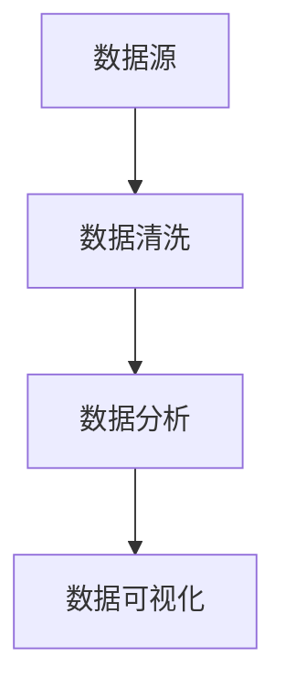

                 


# 《全球股市总市值排名及其与GDP的关系》

> 关键词：全球股市总市值，GDP，经济指标，数据分析，投资决策

> 摘要：本文深入分析全球股市总市值排名及其与GDP的关系，探讨股市总市值对经济发展的驱动作用，结合实际案例和数据分析，揭示其背后的经济规律，为投资者和经济学者提供有价值的参考。

---

## 目录大纲

### 第一章：全球股市总市值排名的背景与意义

#### 1.1 股市总市值的基本概念
- 1.1.1 股市的定义与功能
- 1.1.2 总市值的计算公式与意义
  - 总市值 = 股价 × 流通股数量
  - 示例：某公司股价为 $50，流通股为 1000万股，总市值为 $50000万

#### 1.2 GDP的定义与计算方法
- 1.2.1 GDP的定义
  - 国内生产总值（GDP）：一个国家或地区在一定时期内生产的最终产品和服务的总价值
- 1.2.2 GDP的计算方法
  - 生产法：从生产过程中计算总产出
  - 收入法：从要素收入角度计算
  - 支出法：从最终产品和服务支出角度计算

#### 1.3 股市总市值排名与经济发展的关系
- 1.3.1 股市总市值作为经济晴雨表的作用
- 1.3.2 总市值排名与国家经济实力的关联
- 1.3.3 全球化视角下的股市排名意义

---

### 第二章：全球股市总市值排名的核心概念与联系

#### 2.1 股市总市值与GDP的关系
- 2.1.1 总市值与GDP的相互影响
  - 总市值反映市场信心，影响投资和消费
  - GDP影响企业的盈利能力，进而影响股市表现

- 2.1.2 影响总市值排名的主要因素
  - 经济增长速度
  - 利率水平
  - 通货膨胀率
  - 政治经济政策

#### 2.2 股市总市值排名与国家经济竞争力的对比分析
- 2.2.1 主要经济体的总市值排名分析
  - 美国：纳斯达克和纽约证券交易所的总市值全球领先
  - 欧洲：英国伦敦证券交易所和法兰克福证券交易所的总市值表现
  - 亚洲：东京证券交易所和香港交易所的崛起

- 2.2.2 总市值排名与国家GDP的对比
  - 美国：高GDP与高总市值的双重优势
  - 日本：高GDP但股市表现相对疲软的原因分析
  - 中国：快速发展的经济与股市的潜力

#### 2.3 总市值排名与区域经济发展的关系
- 2.3.1 区域经济一体化对股市总市值的影响
- 2.3.2 新兴市场与发达市场的对比
  - 新兴市场：高增长潜力与高风险并存
  - 发达市场：稳定的经济基础与成熟的市场机制

---

### 第三章：全球股市总市值排名的算法与数据分析

#### 3.1 数据收集与处理
- 3.1.1 数据来源
  - 全球主要证券交易所的实时数据
  - 政府统计部门的GDP数据

- 3.1.2 数据清洗与预处理
  - 处理缺失值
  - 标准化数据格式
  - 异常值处理

#### 3.2 数据分析方法
- 3.2.1 统计分析
  - 描述性统计：均值、中位数、标准差等
  - 相关性分析：总市值与GDP的相关性系数

- 3.2.2 数据可视化
  - 折线图：显示总市值排名的变化趋势
  - 饼图：展示不同地区股市总市值的占比
  - 散点图：分析总市值与GDP之间的关系

#### 3.3 算法实现
- 3.3.1 回归分析
  - 建立总市值与GDP的线性回归模型
  - 公式：$\hat{y} = a + bx$
  - 解释：系数a表示截距，系数b表示GDP每增加1单位，总市值的变化量

- 3.3.2 聚类分析
  - 将国家分为不同的经济类别
  - 使用K-means算法进行聚类

#### 3.4 代码实现
- 3.4.1 数据获取与处理
  ```python
  import pandas as pd
  import numpy as np

  # 假设我们已经获取了全球股市总市值数据和GDP数据
  df = pd.read_csv('global_stocks.csv')
  gdp_data = pd.read_csv('gdp.csv')

  # 数据清洗
  df.dropna(inplace=True)
  gdp_data.dropna(inplace=True)
  ```

- 3.4.2 数据分析与可视化
  ```python
  import matplotlib.pyplot as plt

  plt.figure(figsize=(10,6))
  plt.plot(df['Year'], df['Market Cap'], label='Market Cap')
  plt.plot(df['Year'], df['GDP'], label='GDP')
  plt.xlabel('Year')
  plt.ylabel('Value')
  plt.title('Market Cap vs GDP Over Time')
  plt.legend()
  plt.show()
  ```

---

### 第四章：系统架构与数据处理方案

#### 4.1 系统架构设计
- 4.1.1 数据收集模块
  - 从全球证券交易所获取实时数据
  - 数据接口：API调用

- 4.1.2 数据处理模块
  - 数据清洗与转换
  - 使用工具：Python的Pandas库

- 4.1.3 数据分析模块
  - 统计分析与建模
  - 使用工具：Python的Scikit-learn库

- 4.1.4 数据可视化模块
  - 使用工具：Matplotlib或Seaborn

#### 4.2 数据处理流程图


---

### 第五章：项目实战与案例分析

#### 5.1 环境配置
- 5.1.1 安装所需库
  - Python环境：3.8以上
  - 库：Pandas, NumPy, Matplotlib, Scikit-learn

#### 5.2 数据获取与清洗
- 5.2.1 数据源：全球主要股市的总市值数据
- 5.2.2 数据清洗：处理缺失值和异常值

#### 5.3 数据分析与建模
- 5.3.1 线性回归模型
  - 使用Scikit-learn库中的LinearRegression
  - 训练模型并预测总市值

#### 5.4 结果展示与解读
- 5.4.1 可视化结果
  - 绘制回归线
  - 分析模型的拟合优度

#### 5.5 案例分析
- 5.5.1 美国股市与GDP的关系
  - 高相关性，回归系数显著
- 5.5.2 新兴市场股市与GDP的关系
  - 低相关性，市场波动较大

---

### 第六章：总结与展望

#### 6.1 总结
- 股市总市值排名是衡量国家经济实力的重要指标
- 总市值与GDP存在较强的正相关关系
- 新兴市场与发达市场的差异显著

#### 6.2 最佳实践
- 定期更新数据，保持模型的准确性
- 综合考虑多种因素，避免单一指标误导

#### 6.3 未来展望
- 更多的国际合作与数据共享
- 利用人工智能技术进行更精准的预测

---

### 作者：AI天才研究院/AI Genius Institute & 禅与计算机程序设计艺术 /Zen And The Art of Computer Programming

