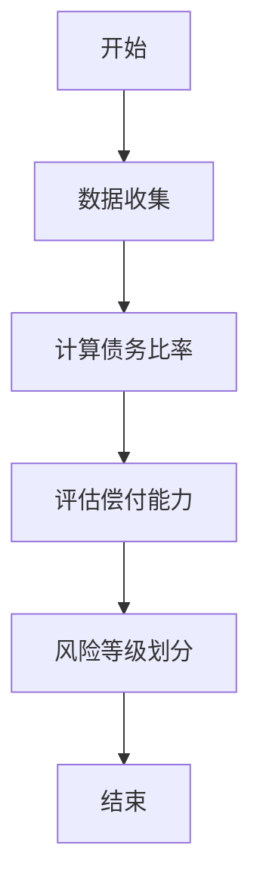
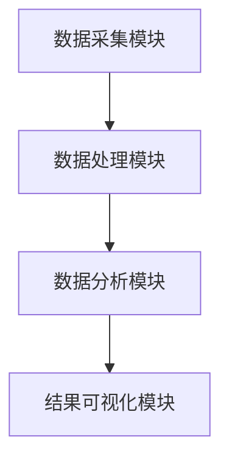
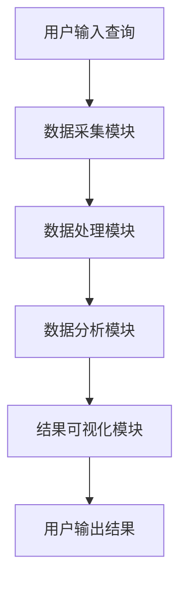

                 


# 公司债务水平与特价股票投资的关系

> 关键词：公司债务水平，特价股票，投资关系，债务风险，股价波动

> 摘要：本文探讨公司债务水平与特价股票投资之间的关系，分析债务水平对股价的影响，探讨特价股票投资中的债务风险，并提出量化分析方法，结合实际案例进行深入分析。

---

# 第一章 公司债务水平与特价股票投资的背景介绍

## 1.1 公司债务水平的基本概念

### 1.1.1 公司债务的定义与分类
公司债务是指公司通过借款或其他方式形成的负债。常见的债务类型包括短期债务（如应付账款、短期贷款）和长期债务（如长期债券、银行贷款）。债务的分类有助于理解其对公司财务状况的影响。

### 1.1.2 公司债务水平的衡量指标
债务水平通常通过债务比率（如资产负债率、流动比率）来衡量。这些指标反映了公司的偿债能力和财务健康状况。

### 1.1.3 公司债务与企业财务健康的关系
高债务水平可能增加公司的财务风险，但适度的债务可以提高资本回报率。通过分析债务结构，投资者可以评估公司的财务稳定性。

## 1.2 特价股票投资的基本概念

### 1.2.1 特价股票的定义与特点
特价股票是指价格低于其内在价值的股票。这类股票通常被低估，具有较大的上涨潜力。投资者通过寻找这些股票，可以获得超额收益。

### 1.2.2 特价股票投资的策略与目标
特价股票投资策略包括价值投资和趋势投资。投资者的目标是通过低价买入，高价卖出，获得资本收益和股息收益。

### 1.2.3 特价股票与市场周期的关系
特价股票的表现往往与市场周期密切相关。在熊市中，许多股票价格被低估，为投资者提供了廉价买入的机会；而在牛市中，特价股票可能表现平平。

## 1.3 公司债务水平与特价股票投资的关系

### 1.3.1 债务水平对股价的影响
高债务公司可能面临较高的偿债压力，影响股价表现。反之，适度的债务水平可以通过杠杆效应提升股价。

### 1.3.2 特价股票投资中的债务风险
投资者需关注公司的债务风险，避免投资于债务负担过重的公司。高债务公司可能面临破产风险，导致股价大幅下跌。

### 1.3.3 债务水平与股票价值的互动机制
债务水平通过影响公司的财务状况和市场信心，进而影响股票价格。投资者应综合考虑债务水平和公司基本面，做出理性投资决策。

---

# 第二章 公司债务水平与特价股票投资的核心概念与联系

## 2.1 公司债务水平的财务分析

### 2.1.1 债务比率的计算方法
债务比率包括资产负债率、流动比率和速动比率。这些指标帮助投资者评估公司的偿债能力。

### 2.1.2 债务偿付能力分析
通过分析利息覆盖率和债务到期期限，投资者可以评估公司偿还债务的能力。

### 2.1.3 债务结构对股价的影响
合理的债务结构可以优化资本成本，提升股价。而过度依赖短期债务可能增加公司的财务风险。

## 2.2 特价股票投资的量化分析

### 2.2.1 特价股票的估值方法
市盈率、市净率和股息率是常用的估值指标。投资者通过比较这些指标，判断股票是否被低估。

### 2.2.2 市场情绪对投资决策的影响
市场情绪波动会影响股价，投资者需结合市场情绪和基本面分析，做出理性决策。

### 2.2.3 特价股票与公司基本面的关系
特价股票通常具有较低的估值，但其基本面可能存在问题。投资者需深入分析公司财务状况和行业前景。

## 2.3 债务水平与特价股票投资的联系

### 2.3.1 债务水平对股价的直接影响
高债务公司可能面临股价波动风险，而低债务公司可能具备更高的股价稳定性。

### 2.3.2 债务风险对投资决策的影响
投资者应避免投资于债务负担过重的公司，尤其是在市场低迷时期。

### 2.3.3 债务水平与股票波动性的关系
高债务公司可能面临更大的股价波动，投资者需关注市场的波动性风险。

## 2.4 核心概念对比分析

### 2.4.1 债务水平与股票价值的对比表格
| 指标 | 债务水平 | 股票价值 |
|------|----------|----------|
| 资产负债率 | 高       | 低       |
| 流动比率 | 低       | 高       |

### 2.4.2 债务与股票投资的ER实体关系图
```mermaid
erDiagram
    company {
        id
        name
        debt_level
        stock_value
    }
    investor {
        id
        name
        investment_amount
    }
    companyInvestment {
        company_id
        investor_id
        investment_date
    }
```

---

# 第三章 公司债务水平与特价股票投资的算法原理

## 3.1 算法原理概述

### 3.1.1 基于债务水平的股票价格预测模型
通过分析债务水平和市场情绪，预测股票价格波动。

### 3.1.2 债务风险评估的算法框架
利用财务指标和市场数据，评估公司的债务风险。

### 3.1.3 特价股票投资的量化策略
结合债务水平和股票估值指标，制定投资策略。

## 3.2 算法实现流程

### 3.2.1 数据收集与预处理
收集公司财务数据和市场数据，进行数据清洗和标准化处理。

### 3.2.2 债务水平与股票价格的关联分析
使用回归分析和时间序列分析，研究债务水平与股价的关系。

### 3.2.3 投资决策模型的构建与验证
基于历史数据，验证模型的准确性和稳定性。

## 3.3 算法流程图

### 3.3.1 基于债务水平的股票价格预测流程图


### 3.3.2 债务风险评估流程图


## 3.4 算法数学模型与公式

### 3.4.1 债务比率计算公式
$$\text{资产负债率} = \frac{\text{总负债}}{\text{总资产}} \times 100\%$$

### 3.4.2 股票价格预测模型
$$\text{股价} = \alpha \times \text{债务比率} + \beta \times \text{市场情绪} + \epsilon$$

### 3.4.3 投资决策的优化算法
$$\text{投资价值} = \gamma \times \text{股票估值} - \delta \times \text{债务风险}$$

---

# 第四章 公司债务水平与特价股票投资的系统分析与架构设计

## 4.1 系统分析

### 4.1.1 问题场景介绍
投资者需要一个系统来分析公司债务水平和特价股票投资的关系。

### 4.1.2 项目目标与范围
开发一个量化分析系统，帮助投资者做出理性决策。

### 4.1.3 系统功能需求分析
系统需具备数据采集、分析和可视化功能。

## 4.2 系统架构设计

### 4.2.1 系统架构图


### 4.2.2 系统模块划分
系统分为数据采集、处理、分析和可视化四个模块。

### 4.2.3 系统接口设计
模块之间通过API进行数据传递和交互。

## 4.3 系统交互设计

### 4.3.1 用户与系统的交互流程图


### 4.3.2 系统内部模块交互图


---

# 第五章 公司债务水平与特价股票投资的项目实战

## 5.1 项目环境安装

### 5.1.1 安装Python和必要的库
安装Python和pandas、numpy、scikit-learn等库。

### 5.1.2 数据源获取
从Yahoo Finance获取股票数据和公司财务数据。

## 5.2 系统核心实现源代码

### 5.2.1 数据处理代码
```python
import pandas as pd
import numpy as np

# 加载数据
data = pd.read_csv('stock_data.csv')

# 数据预处理
data['debt_ratio'] = data['总负债'] / data['总资产']
data['price_to_book'] = data['股价'] / data['每股净资产']
```

### 5.2.2 投资决策模型代码
```python
from sklearn.linear_model import LinearRegression

# 建立模型
model = LinearRegression()
model.fit(data[['debt_ratio', 'price_to_book']], data['股价'])

# 预测股价
predictions = model.predict(new_data)
```

## 5.3 案例分析与详细讲解

### 5.3.1 案例分析
以某公司为例，分析其债务水平和股价的关系。

### 5.3.2 详细讲解
通过实际数据，验证模型的准确性和稳定性。

---

# 第六章 总结与展望

## 6.1 本章总结
本文探讨了公司债务水平与特价股票投资的关系，分析了债务风险和股价波动的影响，提出了量化分析方法。

## 6.2 未来研究方向
未来可以研究更多因素对股价的影响，如行业前景和宏观经济环境。

## 6.3 最佳实践 tips
投资者应综合考虑债务水平和公司基本面，避免投资于债务负担过重的公司。

## 6.4 小结
公司债务水平是影响股价的重要因素，投资者需结合债务风险和市场情绪，做出理性投资决策。

## 6.5 注意事项
避免过度依赖单一指标，结合多种因素进行综合分析。

## 6.6 拓展阅读
建议读者阅读相关书籍和论文，深入理解债务与投资的关系。

---

# 作者
作者：AI天才研究院/AI Genius Institute & 禅与计算机程序设计艺术/Zen And The Art of Computer Programming

