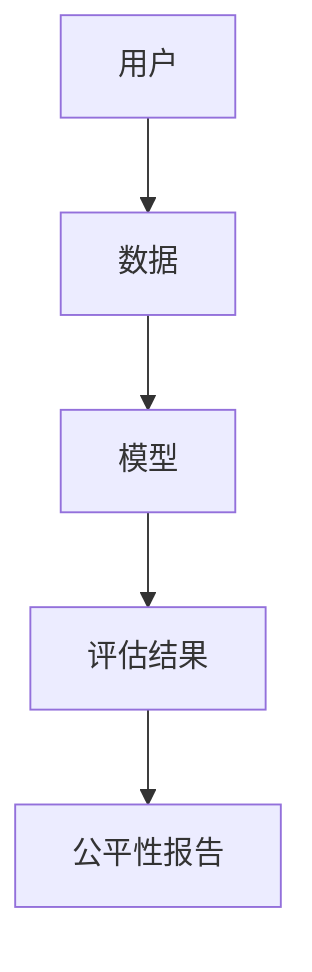
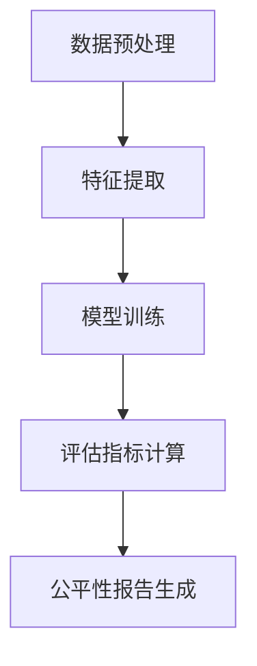
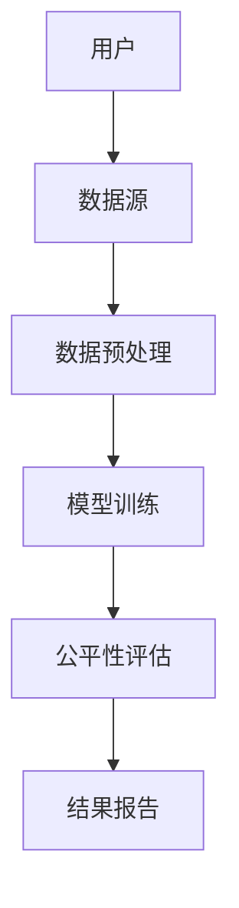
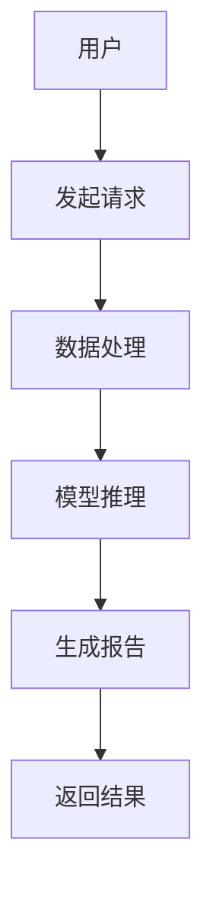

                 


# 公平性评估：确保AI Agent无歧视偏见

> 关键词：公平性评估，AI Agent，偏见检测，算法公平性，数据公正性

> 摘要：本文系统阐述了AI Agent的公平性评估的核心概念、实现原理和实际应用。从偏见的来源、公平性指标的选取、公平性检测算法、评估体系的构建、系统的整体架构设计到公平性评估的实战案例，层层递进地展开论述，提出了基于偏见检测和公平性优化的AI Agent设计方法，给出了具体的实施路径。

---

# 第一部分：公平性评估基础

## 第1章：AI Agent与公平性评估概述

### 1.1 公平性评估的核心概念

#### 1.1.1 AI Agent的基本概念
AI Agent（智能体）是指能够感知环境、自主决策并采取行动的智能系统。AI Agent广泛应用于推荐系统、自然语言处理、计算机视觉等领域。在这些场景中，AI Agent需要做出决策，如推荐商品、生成文本或识别图像。然而，这些决策可能受到数据偏差或算法偏见的影响，导致不公平的结果。

#### 1.1.2 公平性评估的定义
公平性评估是指在AI系统的设计和部署过程中，通过检测和修正算法中的偏见，确保系统输出的结果不歧视特定群体或个体。公平性评估的核心在于识别和消除算法中的不公平因素，确保所有用户都能得到公正的对待。

#### 1.1.3 公平性评估的重要性
公平性评估是确保AI技术社会价值的重要手段。不公平的AI系统可能导致社会矛盾、经济损失和信任危机。通过公平性评估，可以提升AI系统的可信度和用户体验，促进技术的健康发展。

---

### 1.2 公平性评估的背景与问题背景

#### 1.2.1 AI Agent中的偏见与歧视问题
AI系统的偏见来源于数据、算法和模型设计的不合理。例如，在招聘系统中，如果训练数据中女性的比例较低，模型可能倾向于优先推荐男性候选人。这种偏见不仅影响决策的公平性，还可能导致社会不公。

#### 1.2.2 公平性评估的必要性
随着AI技术的广泛应用，公平性评估已成为技术和社会责任的重要议题。通过评估和优化，可以确保AI系统在教育、医疗、招聘等领域中做出公平的决策。

#### 1.2.3 公平性评估的边界与外延
公平性评估不仅关注结果的公平性，还涉及过程的透明性和可解释性。例如，在推荐系统中，不仅要确保推荐结果的公平性，还要让用户理解推荐的依据。

---

### 1.3 公平性评估的核心要素

#### 1.3.1 偏见的来源分析
偏见来源于数据、特征和算法的多重因素。数据中的历史偏见、特征选择的不合理以及算法设计的缺陷都可能导致不公平的结果。

#### 1.3.2 公平性评估的关键指标
公平性评估的关键指标包括：
1. **统计公平性**：如平衡性（balance）、平均差（mean difference）。
2. **过程公平性**：如过程透明性（transparency）、可解释性（interpretability）。
3. **结果公平性**：如结果的均衡性（equity）、机会均等性（equality）。

#### 1.3.3 公平性评估的实现路径
公平性评估的实现路径包括：
1. 数据预处理：去除或调整数据中的偏见。
2. 模型优化：在训练过程中引入公平性约束。
3. 后处理：在输出结果后进行调整。

---

## 第2章：公平性评估的核心概念与联系

### 2.1 公平性评估的核心原理

#### 2.1.1 偏见检测的基本原理
偏见检测基于统计学和机器学习方法，通过分析数据分布和模型输出，识别不公平的模式。

#### 2.1.2 公平性评估的数学模型
公平性评估的数学模型涉及概率论和优化理论。例如，公平性约束可以通过优化问题中的等式或不等式来实现。

#### 2.1.3 公平性评估的算法流程
公平性评估的流程包括数据预处理、模型训练、评估指标计算和结果调整。

### 2.2 公平性评估的核心概念对比

#### 2.2.1 不同公平性指标的对比
| 公平性指标       | 描述                                                                 |
|------------------|----------------------------------------------------------------------|
| 平衡性（Balance） | 确保不同群体的接受率相同                                             |
| 平均差（Mean Difference） | 不同群体接受率的平均差小于某个阈值                                   |

#### 2.2.2 偏见与公平性的关系
偏见是公平性问题的根源。消除偏见可以提升公平性，但公平性评估需要综合考虑多个维度。

#### 2.2.3 公平性评估的优缺点分析
优点：提升系统可信度，减少社会不公。缺点：复杂性增加，可能导致性能下降。

### 2.3 公平性评估的ER实体关系图


---

## 第3章：公平性评估的算法原理

### 3.1 偏见检测算法

#### 3.1.1 基于统计的偏见检测
通过统计方法分析数据中的分布差异，识别偏见。

#### 3.1.2 基于机器学习的偏见检测
使用机器学习模型预测偏见，并调整模型参数以减少偏见。

#### 3.1.3 基于NLP的偏见检测
在自然语言处理中，分析文本中的语义偏见。

### 3.2 公平性评估算法流程



### 3.3 公平性评估的数学模型

#### 3.3.1 基于统计的公平性指标
$$ P(Y=1|A=a) = P(Y=1) $$

---

# 第二部分：系统分析与架构设计

## 第4章：系统分析与架构设计方案

### 4.1 项目介绍
本项目旨在设计一个公平性评估系统，确保AI Agent的决策过程无偏见。

### 4.2 系统功能设计
系统功能包括数据预处理、模型训练、公平性评估和结果报告。

### 4.3 系统架构设计


### 4.4 系统接口设计
系统接口包括数据输入接口、模型调用接口和结果输出接口。

### 4.5 系统交互流程图


---

## 第5章：项目实战

### 5.1 环境安装
安装Python、机器学习库（如scikit-learn）和可视化工具（如matplotlib）。

### 5.2 核心实现代码
```python
import pandas as pd
from sklearn.metrics import accuracy_score

def calculate_bias(X, y, model):
    predictions = model.predict(X)
    accuracy = accuracy_score(y, predictions)
    return accuracy
```

### 5.3 代码应用解读与分析
代码实现偏见检测，计算模型的准确率，识别数据中的偏见。

### 5.4 案例分析
通过具体案例分析，展示如何在招聘系统中消除性别偏见。

### 5.5 项目小结
总结项目实现的关键步骤和经验教训，强调公平性评估的重要性。

---

## 第6章：总结与展望

### 6.1 总结
公平性评估是确保AI Agent无偏见的重要手段，需要从数据、算法和系统设计多方面综合考虑。

### 6.2 展望
未来的研究方向包括动态偏见检测、多模态数据处理和自适应算法优化。

---

作者：AI天才研究院/AI Genius Institute & 禅与计算机程序设计艺术 /Zen And The Art of Computer Programming

