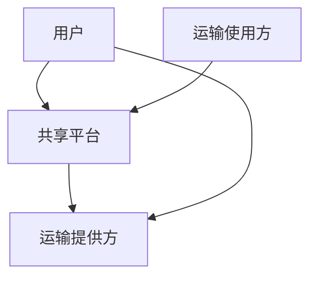

                 

# 共享经济模式对传统行业的影响与投资机会

## 关键词：
共享经济，传统行业，投资机会，系统架构，商业模式，风险管理

## 摘要：
共享经济作为一种新兴的经济模式，正在对传统行业产生深远的影响。本文将分析共享经济的核心概念，探讨其对制造业和物流业的具体影响，并通过系统架构设计和算法原理的讲解，揭示共享经济的运作机制。最后，本文将总结共享经济的投资机会，帮助投资者把握未来趋势。

---

## 第一部分: 共享经济模式的背景与核心概念

### 第1章: 共享经济模式的定义与特点

#### 1.1 共享经济的定义与核心要素
共享经济是一种基于闲置资源优化配置的经济模式，通过数字化平台实现资源供需的高效匹配。其核心要素包括：
1. **资源池**：整合分散的资源，形成资源池。
2. **平台角色**：作为供需匹配的中介，提供撮合服务。
3. **用户参与**：用户既是资源提供者，也是资源使用者。

共享经济与传统经济的主要区别在于资源的使用权和所有权分离，强调使用权最大化。

#### 1.2 共享经济的起源与发展
共享经济起源于21世纪初，随着互联网和移动技术的发展，共享经济平台如Airbnb和Uber的出现，标志着共享经济的兴起。其发展得益于技术进步和人们对效率和灵活性的需求。

#### 1.3 共享经济的全球化发展趋势
共享经济已从单一领域扩展到多个行业，包括交通、住宿、办公空间等，展现出全球化趋势。例如，滴滴出行将共享经济模式扩展到全球多个城市。

### 第2章: 共享经济模式对传统行业的背景影响

#### 2.1 传统行业的现状与痛点
传统行业面临资源浪费、效率低下、成本高昂等问题。例如，制造业的生产设备利用率不足，物流业的运输资源闲置。

#### 2.2 共享经济模式的形成与问题背景
共享经济的形成源于资源供需匹配的低效，通过平台化方式解决资源闲置问题，降低交易成本。

#### 2.3 共享经济对传统行业的潜在影响
共享经济通过提高资源利用率，降低成本，提升效率，对传统行业产生颠覆性影响。

---

## 第二部分: 共享经济模式对传统行业的具体影响

### 第4章: 制造业与共享经济

#### 4.1 制造业的传统模式与共享经济的结合
制造业共享经济通过共享生产设备和生产能力，降低企业的固定成本，提高资源利用率。

#### 4.2 制造业共享经济的系统分析与架构设计
##### 4.2.1 问题场景介绍
某制造企业设备闲置，希望通过共享经济模式优化资源配置。

##### 4.2.2 系统功能设计
设计一个共享制造平台，整合设备资源，提供在线预约和管理功能。

##### 4.2.3 系统架构设计

### 第5章: 物流与共享经济

#### 5.1 物流行业的共享经济模式
物流共享经济通过整合运输资源，优化配送路径，降低物流成本。

#### 5.2 物流共享经济的系统分析与架构设计
##### 5.2.1 问题场景介绍
某物流公司希望优化配送资源，降低运输成本。

##### 5.2.2 系统功能设计
设计一个共享物流平台，整合运输资源，提供在线调度功能。

##### 5.2.3 系统架构设计

---

## 第三部分: 共享经济的系统分析与架构设计

### 第6章: 共享经济的系统分析

#### 6.1 共享经济的商业模式
共享经济的商业模式包括平台佣金、会员订阅等，通过降低交易成本实现盈利。

#### 6.2 共享经济的技术支撑
技术支撑包括大数据分析、人工智能算法和区块链技术，确保资源供需匹配和交易安全。

#### 6.3 共享经济的法律与风险管理
共享经济面临法律合规、数据安全和隐私保护等风险，需制定相应的风险管理策略。

---

## 第四部分: 共享经济的投资机会

### 第7章: 共享经济的投资机会分析

#### 7.1 制造业共享经济的投资机会
制造业共享经济具有巨大的市场潜力，可通过投资共享平台和技术研发获取收益。

#### 7.2 物流共享经济的投资机会
物流共享经济通过优化运输资源，降低物流成本，具有较高的投资回报率。

#### 7.3 共享经济的技术赋能投资
投资大数据分析和人工智能技术，提升共享经济平台的智能化水平，增强竞争力。

---

## 第五部分: 总结与展望

### 第8章: 总结与未来展望
共享经济对传统行业的影响深远，未来将通过技术进步和模式创新进一步拓展其应用领域，创造更多投资机会。

---

## 附录

### 附录A: 共享经济相关案例分析
分析Airbnb和滴滴出行的成功案例，探讨其对传统行业的颠覆性影响。

### 附录B: 共享经济系统架构图
提供共享经济平台的系统架构图，展示各模块的功能和交互关系。

### 附录C: 共享经济相关数据与图表
展示共享经济平台的运营数据和市场趋势图表。

---

## 作者：AI天才研究院/AI Genius Institute & 禅与计算机程序设计艺术 /Zen And The Art of Computer Programming

