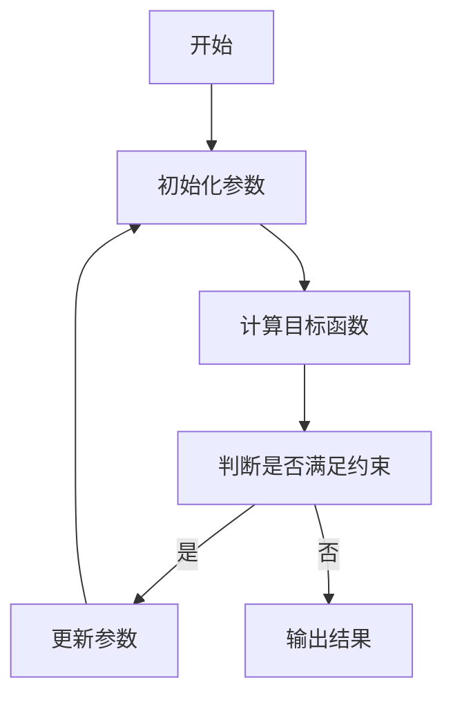
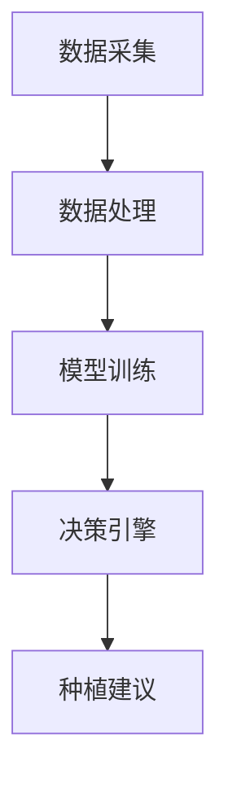
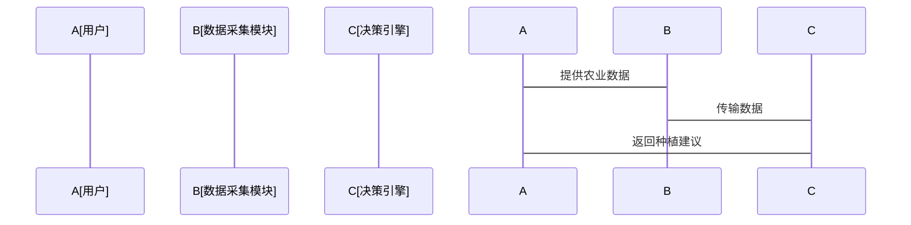

                 


# 农业AI Agent：优化种植决策与资源分配

---

## 关键词

- 农业AI Agent
- 农业优化决策
- 资源分配
- 优化算法
- 农业系统架构

---

## 摘要

农业AI Agent是一种利用人工智能技术优化种植决策和资源分配的智能化系统。通过分析农业数据，农业AI Agent能够帮助农民做出科学的种植决策，提高资源利用效率，降低成本，并实现可持续的农业生产。本文将详细探讨农业AI Agent的核心概念、算法原理、系统架构，并通过实际案例展示其在农业种植中的应用价值。

---

# 第一部分：农业AI Agent的背景与核心概念

## 第1章：农业AI Agent的背景与问题背景

### 1.1 农业AI Agent的定义与核心概念

#### 1.1.1 农业AI Agent的定义

农业AI Agent（Artificial Intelligence Agent）是一种基于人工智能技术的智能系统，用于优化农业种植过程中的决策和资源分配。它能够通过收集和分析农业数据，结合历史信息和预测模型，提供最优的种植建议。

#### 1.1.2 农业AI Agent的核心要素

- **数据源**：包括气象数据、土壤数据、作物数据、市场价格等。
- **决策机制**：基于优化算法，提供种植计划、资源分配建议等。
- **知识库**：包含农业专业知识和经验，用于辅助决策。
- **实时反馈**：根据环境变化和作物生长情况，动态调整决策。

#### 1.1.3 农业AI Agent的边界与外延

农业AI Agent的应用范围包括种植规划、资源优化、病虫害防治等，但不包括具体的农业机械操作和农资采购。

---

### 1.2 农业种植中的问题背景

#### 1.2.1 农业种植面临的挑战

- **资源浪费**：水、化肥、农药等资源的过度使用导致浪费和环境污染。
- **决策滞后**：传统种植决策依赖经验，缺乏科学依据，容易因环境变化导致失败。
- **效率低下**：人工管理效率低，难以应对大规模种植的需求。

#### 1.2.2 资源分配的效率问题

- 农业资源的分配需要考虑多种因素，如气候、土壤、市场价格等，传统方法难以实现最优配置。
- 资源分配的不均衡可能导致作物减产或浪费。

#### 1.2.3 决策优化的必要性

- 通过优化算法，农业AI Agent可以帮助农民做出科学的决策，提高种植效率和产量。

---

## 第2章：农业AI Agent的核心概念与联系

### 2.1 农业AI Agent的核心原理

#### 2.1.1 数据流与决策机制

- **数据采集**：通过传感器、卫星等获取农业数据。
- **数据处理**：清洗、融合和分析数据，提取有用信息。
- **决策生成**：基于优化算法，生成种植计划和资源分配建议。

#### 2.1.2 模型训练与优化算法

- **模型训练**：使用历史数据训练机器学习模型，预测作物生长情况。
- **优化算法**：如遗传算法、模拟退火等，用于优化种植计划。

#### 2.1.3 农业知识图谱的构建

- **知识图谱**：将农业知识结构化，便于AI Agent理解和推理。

---

### 2.2 核心概念属性对比表格

| 核心概念 | 属性特征 | 描述 |
|----------|----------|------|
| 数据源   | 多样性    | 包括气象、土壤、作物数据等 |
| 模型     | 可解释性  | 农业决策需要可解释性 |
| 决策机制 | 实时性    | 需要快速响应环境变化 |

---

### 2.3 ER实体关系图

```mermaid
erd
    title 农业AI Agent ER图
    章节
    章节 -> 农业数据: 包含
    农业数据 -> 气象数据: 组成
    农业数据 -> 土壤数据: 组成
    农业数据 -> 作物数据: 组成
    农业数据 -> 决策建议: 输出
```

---

## 第3章：农业AI Agent的算法原理

### 3.1 优化算法概述

#### 3.1.1 遗传算法

- **原理**：模拟自然选择，通过交叉、变异等操作生成新的解。
- **流程**：
  1. 初始化种群。
  2. 计算适应度。
  3. 选择优秀个体。
  4. 进行交叉和变异。
  5. 重复迭代，直到满足条件。

#### 3.1.2 模拟退火算法

- **原理**：通过模拟金属退火过程，逐步降低温度，找到全局最优解。
- **流程**：
  1. 初始化当前解。
  2. 计算目标函数值。
  3. 生成新解，计算其目标函数值。
  4. 根据温度参数，决定是否接受新解。
  5. 降低温度，重复迭代。

#### 3.1.3 线性规划

- **原理**：通过建立线性目标函数和约束条件，求解最优解。
- **应用**：用于资源分配问题，如最大化产量或最小化成本。

---

### 3.2 数学模型与公式

#### 3.2.1 目标函数

$$ \text{最大化/最小化} \quad f(x) $$

#### 3.2.2 约束条件

$$ g(x) \leq 0 $$
$$ h(x) = 0 $$

---

### 3.3 算法实现步骤



---

## 第4章：系统

### 4.1 系统设计概述

#### 4.1.1 问题场景介绍

- **目标**：优化种植计划，提高资源利用效率。
- **输入**：气象数据、土壤数据、作物数据。
- **输出**：种植计划、资源分配建议。

#### 4.1.2 系统功能设计

- **数据采集模块**：收集农业数据。
- **模型训练模块**：训练机器学习模型。
- **决策引擎模块**：生成种植建议。

---

### 4.2 系统架构设计



---

### 4.3 系统接口设计

- **输入接口**：接收农业数据。
- **输出接口**：输出种植建议。

---

### 4.4 系统交互流程



---

## 第5章：项目实战

### 5.1 环境安装

- **工具**：Python、TensorFlow、Scikit-learn。
- **安装命令**：
  ```bash
  pip install numpy pandas scikit-learn
  ```

---

### 5.2 代码实现

```python
import numpy as np
from sklearn import linear_model

# 数据预处理
X = np.array([[1, 2], [3, 4], [5, 6]])
y = np.array([7, 8, 9])

# 训练模型
model = linear_model.LinearRegression()
model.fit(X, y)

# 预测结果
print(model.predict([[7, 8]]))
```

---

### 5.3 案例分析

- **案例背景**：某农场种植水稻，需要优化灌溉和施肥计划。
- **实施步骤**：
  1. 收集气象、土壤数据。
  2. 训练模型，预测最佳灌溉时间。
  3. 生成种植建议。

---

## 第6章：最佳实践与小结

### 6.1 最佳实践

- **数据质量**：确保数据准确、完整。
- **算法选择**：根据问题选择合适的算法。
- **系统维护**：定期更新模型，确保系统稳定运行。

---

### 6.2 小结

农业AI Agent通过优化算法和数据驱动的方法，帮助农民做出科学的种植决策，提高资源利用效率，降低成本，实现可持续的农业生产。未来，随着人工智能技术的不断发展，农业AI Agent将在农业领域发挥更大的作用。

---

## 作者

作者：AI天才研究院/AI Genius Institute & 禅与计算机程序设计艺术 /Zen And The Art of Computer Programming

