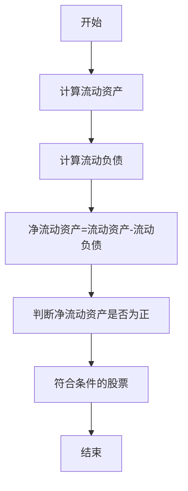
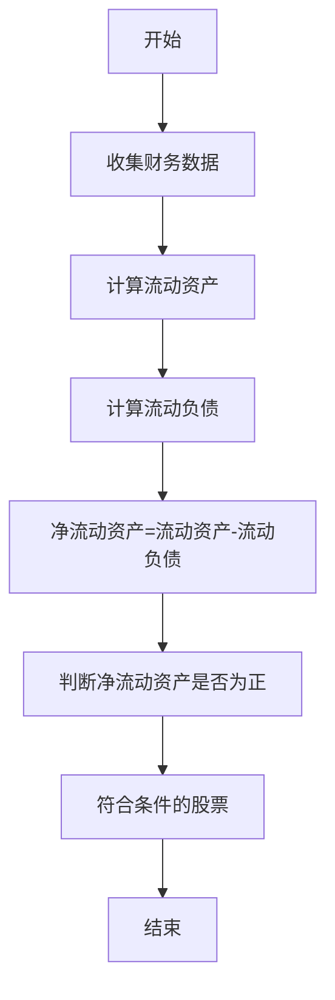

                 


# 净流动资产价值在股票选择中的重要性

> 关键词：净流动资产、股票选择、财务指标、投资决策、流动性分析、财务健康、风险控制

> 摘要：本文探讨了净流动资产在股票选择中的重要性，通过详细分析净流动资产的定义、计算方法、在企业财务健康中的作用，以及如何通过净流动资产的视角进行股票筛选。文章结合数学模型、算法流程图和实际案例，系统地介绍了净流动资产在投资决策中的应用，帮助读者更好地理解其价值和实际应用。

---

# 第1章 净流动资产的背景与概念

## 1.1 什么是净流动资产

### 1.1.1 流动资产的定义与分类
流动资产是指企业在一年内可以转化为现金的资产，包括现金、应收账款、存货等。这些资产具有较强的流动性，能够快速变现以应对短期债务。

### 1.1.2 净流动资产的计算公式
净流动资产 = 流动资产 - 流动负债

### 1.1.3 净流动资产与流动负债的关系
净流动资产反映了企业短期偿债能力。当净流动资产为正时，企业有足够的流动资产来偿还流动负债；反之，企业可能面临短期流动性风险。

---

## 1.2 净流动资产在企业财务健康中的作用

### 1.2.1 企业短期偿债能力的晴雨表
净流动资产是衡量企业短期偿债能力的重要指标。正的净流动资产表明企业有足够的流动资产来偿还短期债务，而负的净流动资产则表明企业可能面临流动性危机。

### 1.2.2 净流动资产与企业运营效率
净流动资产的变动反映了企业运营效率的变化。例如，增加的净流动资产可能表明企业销售增加或成本控制得当。

### 1.2.3 净流动资产与企业风险控制
净流动资产为企业提供了风险缓冲。在市场波动或突发事件中，充足的净流动资产能够帮助企业维持运营并抓住投资机会。

---

## 1.3 股票选择中的财务指标体系

### 1.3.1 财务指标在股票选择中的重要性
投资者通常关注市盈率、市净率、ROE等指标，但净流动资产同样是一个关键的财务指标。

### 1.3.2 净流动资产在选股中的位置
净流动资产是衡量企业财务健康的重要指标之一，尤其适用于那些依赖流动资产的行业，如制造业和批发零售业。

### 1.3.3 其他相关财务指标的对比分析
与流动比率、速动比率等其他财务指标相比，净流动资产更能直接反映企业的短期偿债能力。

---

# 第2章 净流动资产的核心概念与属性

## 2.1 净流动资产的属性特征

### 2.1.1 流动性
净流动资产的流动性是指其能够迅速转化为现金的能力。高流动性意味着企业在短期内更容易获得资金。

### 2.1.2 周转性
净流动资产的周转性反映了其在企业运营中的使用效率。周转快的资产能够更快地支持企业的日常运营。

### 2.1.3 偿债性
净流动资产的偿债性是其最重要的属性之一，直接关系到企业的短期偿债能力。

---

## 2.2 净流动资产与其他财务指标的关系

### 2.2.1 与流动比率的关系
流动比率 = 流动资产 / 流动负债  
净流动资产 = 流动资产 - 流动负债  
因此，净流动资产与流动比率密切相关。

### 2.2.2 与速动比率的关系
速动比率 = (流动资产 - 存货) / 流动负债  
净流动资产为正时，速动比率通常也会较高。

### 2.2.3 与经营活动现金流的关系
净流动资产的变动通常会影响经营活动现金流。正的净流动资产表明经营活动现金流可能为正。

---

## 2.3 净流动资产的实体关系图

### 2.3.1 ER图中的实体关系
- 实体：流动资产、流动负债、净流动资产
- 关系：流动资产和流动负债通过净流动资产联系在一起。

```mermaid
erd
actor 流动资产;
actor 流动负债;
flow 流动资产 --> 净流动资产
flow 流动负债 --> 净流动资产
```

### 2.3.2 流动资产与流动负债的关联
流动资产和流动负债是计算净流动资产的两个关键部分，它们的差额直接决定了企业的短期偿债能力。

### 2.3.3 净流动资产的计算流程图



---

# 第3章 净流动资产价值的算法与数学模型

## 3.1 净流动资产计算的数学模型

### 3.1.1 净流动资产的公式推导
$$\text{净流动资产} = \text{流动资产} - \text{流动负债}$$

### 3.1.2 流动资产的计算公式
$$\text{流动资产} = \text{现金} + \text{应收账款} + \text{存货} + \text{其他流动资产}$$

### 3.1.3 流动负债的计算公式
$$\text{流动负债} = \text{应付账款} + \text{短期借款} + \text{其他应付款}$$

---

## 3.2 基于净流动资产的选股算法

### 3.2.1 算法步骤分解
1. 收集目标公司的财务报表数据。
2. 计算流动资产和流动负债。
3. 计算净流动资产。
4. 根据净流动资产的正负筛选股票。
5. 结合其他财务指标进一步筛选。

### 3.2.2 算法流程图



---

## 3.3 数学公式与实际应用

### 3.3.1 实际案例分析
假设某公司2023年的财务数据如下：
- 流动资产：500万元
- 流动负债：300万元
- 净流动资产 = 500 - 300 = 200万元（正）

这意味着该公司有足够的流动资产来偿还短期债务，是值得考虑的股票。

### 3.3.2 代码实现

```python
def calculate_net_current_assets(current_assets, current_liabilities):
    return current_assets - current_liabilities

# 示例数据
current_assets = 500  # 万元
current_liabilities = 300  # 万元
net_current_assets = calculate_net_current_assets(current_assets, current_liabilities)
print(f"净流动资产为：{net_current_assets}万元")
```

---

# 第4章 净流动资产在股票选择中的应用

## 4.1 系统分析与架构设计

### 4.1.1 问题场景介绍
投资者需要通过分析企业的净流动资产来判断其财务健康状况，从而做出投资决策。

### 4.1.2 系统功能设计
- 数据采集：获取企业的财务报表数据。
- 数据处理：计算净流动资产。
- 数据分析：筛选符合条件的股票。
- 结果展示：输出筛选结果。

### 4.1.3 系统架构图


---

## 4.2 项目实战

### 4.2.1 环境安装
需要安装Python和相关的数据分析库（如Pandas、NumPy）。

### 4.2.2 核心代码实现

```python
import pandas as pd

# 假设我们有以下财务数据
data = {
    '公司': ['A', 'B', 'C'],
    '流动资产': [600, 400, 500],
    '流动负债': [300, 200, 250]
}

df = pd.DataFrame(data)

# 计算净流动资产
df['净流动资产'] = df['流动资产'] - df['流动负债']

print(df)
```

### 4.2.3 实际案例分析
以某公司为例，分析其净流动资产，并根据结果进行投资决策。

### 4.2.4 代码解读与分析
上述代码展示了如何使用Pandas进行数据处理和计算净流动资产。通过数据框的形式，投资者可以快速筛选出净流动资产为正的公司。

---

## 4.3 最佳实践

### 4.3.1 小结
净流动资产是衡量企业短期偿债能力的重要指标，投资者在选择股票时应重点关注这一指标。

### 4.3.2 注意事项
- 净流动资产为正并不意味着企业一定财务健康，还需结合其他指标分析。
- 不同行业对净流动资产的需求不同，投资者应根据行业特点进行分析。

### 4.3.3 拓展阅读
建议阅读《财务报表分析》和《价值投资入门》等书籍，深入了解财务指标的综合应用。

---

# 作者：AI天才研究院/AI Genius Institute & 禅与计算机程序设计艺术/Zen And The Art of Computer Programming

