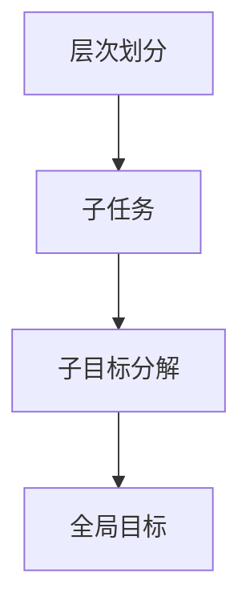
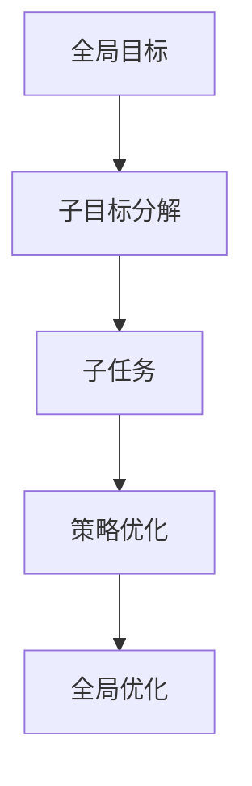
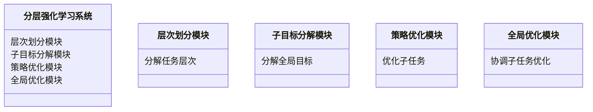
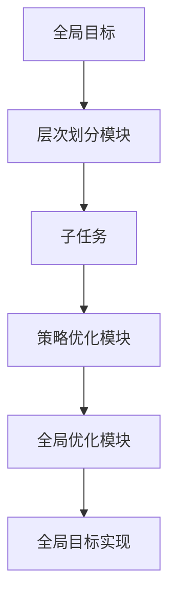

                 


# 分层强化学习：处理复杂任务的AI Agent策略

---

## 关键词：分层强化学习、AI代理、复杂任务、层次分解、子目标分解、系统架构

---

## 摘要：  
分层强化学习（HRL）是一种通过层次化分解复杂任务来提高AI代理决策效率和效果的方法。本文从分层强化学习的基本概念出发，详细探讨了其核心原理、算法实现、系统架构设计以及实际应用案例。通过层次化分解，AI代理能够更高效地处理复杂任务，本文将结合数学模型和实际项目案例，全面解析分层强化学习的优势与挑战。

---

## 第一部分: 分层强化学习引论

### 第1章: 分层强化学习的背景与问题描述

#### 1.1 分层强化学习的背景介绍  
在AI领域，强化学习（Reinforcement Learning, RL）是一种通过试错机制让代理在环境中学习最优策略的方法。然而，随着任务复杂性的增加，传统的强化学习方法在处理大规模、多阶段的复杂任务时，效率和效果逐渐下降。为了应对这一挑战，分层强化学习（HRL）应运而生。HRL通过将复杂任务分解为多个层次的子任务，从而降低了任务的复杂性，提高了学习效率。

#### 1.2 分层强化学习的问题描述  
复杂任务的特点包括：  
1. **多阶段性**：任务需要经过多个步骤才能完成。  
2. **多层次性**：任务可以分解为多个子任务，每个子任务之间存在依赖关系。  
3. **目标多样性**：不同层次的目标可能不同，且需要协调一致。  

分层强化学习的目标是通过层次化分解，将复杂任务分解为多个子任务，每个子任务由特定的策略或价值函数来处理。HRL的核心问题在于如何有效地分解任务层次，并在不同层次之间进行协调。

#### 1.3 分层强化学习的核心概念与联系  
分层强化学习的核心概念包括：  
1. **层次划分**：将任务分解为多个层次，每个层次对应不同的子任务。  
2. **子目标分解**：将全局目标分解为局部目标，通过局部目标的优化实现全局目标的优化。  

分层强化学习与传统强化学习的主要区别在于其层次化的分解方式。HRL通过将任务分解为多个层次，能够在处理复杂任务时提高效率和效果。以下是分层强化学习与传统强化学习的对比表格：

| **对比维度**       | **传统强化学习**                | **分层强化学习**                |
|--------------------|---------------------------------|---------------------------------|
| 任务分解           | 单层次，任务整体处理            | 多层次，任务分解为子任务        |
| 策略复杂性         | 策略复杂，难以处理大规模任务    | 策略分解，降低复杂性            |
| 学习效率           | 效率较低，任务复杂时学习速度慢   | 效率较高，通过层次分解提高效率  |

此外，以下是分层强化学习的核心概念的ER实体关系图（使用 Mermaid）：



---

## 第二部分: 分层强化学习的核心原理

### 第2章: 分层强化学习的核心概念

#### 2.1 分层强化学习的层次结构  
分层强化学习的层次结构包括以下几个方面：  
1. **层次划分**：将任务分解为多个层次，每个层次对应不同的子任务。  
2. **子目标分解**：将全局目标分解为局部目标，通过局部目标的优化实现全局目标的优化。  

层次划分的方法多种多样，常用的包括：  
1. **自顶向下分解**：从全局目标出发，逐步分解为子任务。  
2. **自底向上分解**：从底层任务出发，逐步构建上层任务。  

子目标分解的目标是将复杂任务分解为多个可管理的子任务，每个子任务由特定的策略或价值函数来处理。

---

#### 2.2 分层强化学习的核心原理  
分层强化学习的核心原理在于通过层次化分解，将复杂任务分解为多个子任务，每个子任务由特定的策略或价值函数来处理。以下是分层强化学习的算法流程图（使用 Mermaid）：



分层强化学习的核心算法包括：  
1. **HRL算法**：通过层次化分解，将任务分解为多个子任务，并为每个子任务设计特定的策略或价值函数。  
2. **价值函数分解**：通过分解价值函数，将复杂任务分解为多个子任务，并为每个子任务设计特定的策略或价值函数。  

以下是一个简单的分层强化学习算法的Python实现示例：

```python
def hrl_algorithm(global_goal):
    # 分解全局目标为子目标
    sub_goals = decompose(global_goal)
    
    # 优化每个子目标
    optimized_sub_goals = [optimize(sub_goal) for sub_goal in sub_goals]
    
    # 组合子目标，实现全局目标
    return combine(optimized_sub_goals)
```

---

## 第三部分: 分层强化学习的系统架构设计

### 第3章: 分层强化学习的系统架构设计

#### 3.1 问题场景介绍  
在实际应用中，分层强化学习常用于处理复杂任务，例如机器人控制、自动驾驶、游戏AI等。以下是分层强化学习在机器人控制中的应用示例：

1. **全局目标**：机器人需要完成特定任务（如导航到目标点）。  
2. **子目标分解**：任务分解为路径规划、避障、路径跟踪等多个子任务。  
3. **子任务处理**：每个子任务由特定的策略或价值函数来处理。  
4. **全局优化**：通过协调各子任务的优化，实现全局目标的最优。  

#### 3.2 系统功能设计  
分层强化学习的系统功能设计包括：  
1. **层次划分模块**：将任务分解为多个层次，每个层次对应不同的子任务。  
2. **子目标分解模块**：将全局目标分解为局部目标，通过局部目标的优化实现全局目标的优化。  
3. **策略优化模块**：为每个子任务设计特定的策略或价值函数。  
4. **全局优化模块**：通过协调各子任务的优化，实现全局目标的最优。  

以下是分层强化学习的系统功能设计类图（使用 Mermaid）：



#### 3.3 系统架构设计  
分层强化学习的系统架构设计包括：  
1. **问题场景**：机器人需要完成特定任务（如导航到目标点）。  
2. **系统架构**：通过层次化分解，将任务分解为路径规划、避障、路径跟踪等多个子任务。  
3. **系统交互**：机器人通过协调各子任务的优化，实现全局目标的最优。  

以下是分层强化学习的系统架构设计图（使用 Mermaid）：



---

## 第四部分: 分层强化学习的项目实战

### 第4章: 分层强化学习的项目实战

#### 4.1 项目环境安装  
要实现分层强化学习，首先需要安装以下环境：  
1. **Python**：建议使用 Python 3.8 或更高版本。  
2. **库依赖**：安装 `numpy`、`matplotlib`、`gym` 等库。  

以下是环境安装代码：

```bash
pip install numpy matplotlib gym
```

#### 4.2 项目核心代码实现  
以下是分层强化学习的Python实现代码示例：

```python
import numpy as np
import gym

def decompose(global_goal):
    # 分解全局目标为子目标
    return [sub_goal_1, sub_goal_2, sub_goal_3]

def optimize(sub_goal):
    # 优化子任务
    return optimized_sub_goal

def combine(sub_goals):
    # 组合子目标，实现全局目标
    return global_optimization

env = gym.make('CartPole-v1')
env.seed(42)

global_goal = 'balance the pole'
sub_goals = decompose(global_goal)
optimized_sub_goals = [optimize(sub_goal) for sub_goal in sub_goals]
global_optimization = combine(optimized_sub_goals)
```

#### 4.3 代码解读与分析  
1. **分解全局目标**：`decompose` 函数将全局目标分解为多个子目标。  
2. **优化子任务**：`optimize` 函数对每个子目标进行优化。  
3. **全局优化**：`combine` 函数将优化后的子目标组合起来，实现全局目标的最优。  

#### 4.4 实际案例分析  
以下是一个简单的分层强化学习应用案例：  

**案例分析：机器人导航**  
1. **全局目标**：机器人需要导航到目标点。  
2. **子目标分解**：任务分解为路径规划、避障、路径跟踪等多个子任务。  
3. **子任务处理**：每个子任务由特定的策略或价值函数来处理。  
4. **全局优化**：通过协调各子任务的优化，实现全局目标的最优。  

---

## 第五部分: 分层强化学习的高级主题

### 第5章: 分层强化学习的高级主题

#### 5.1 多智能体分层强化学习  
在多智能体环境中，分层强化学习可以用于协调多个智能体的行为，实现全局目标的最优。  

#### 5.2 分层强化学习与深度学习的结合  
通过结合深度学习，分层强化学习可以在处理大规模、高维数据时表现出色。  

#### 5.3 分层强化学习的前沿技术  
当前，分层强化学习的前沿技术包括：  
1. **神经符号分层学习**：结合符号推理和神经网络，提高分层强化学习的表达能力。  
2. **自适应分层学习**：根据环境动态自适应地调整层次结构。  

---

## 第六部分: 分层强化学习的最佳实践

### 第6章: 分层强化学习的最佳实践

#### 6.1 最佳实践 tips  
1. **任务分解**：在实际应用中，任务分解是分层强化学习的关键步骤。建议根据任务特点选择合适的分解方法。  
2. **层次协调**：在处理复杂任务时，需要协调不同层次的目标，确保全局目标的实现。  
3. **算法优化**：在实际应用中，需要根据具体任务优化分层强化学习算法，提高学习效率和效果。  

#### 6.2 小结  
分层强化学习通过层次化分解，能够有效处理复杂任务，提高AI代理的决策效率和效果。  

#### 6.3 注意事项  
1. **任务分解的合理性**：任务分解需要合理，确保每个子任务能够独立优化。  
2. **层次协调的复杂性**：在协调不同层次的目标时，可能会遇到复杂性问题。  
3. **算法优化的挑战性**：在优化分层强化学习算法时，可能会面临较高的挑战。  

#### 6.4 拓展阅读  
1. 研究论文：《分层强化学习：一种处理复杂任务的新方法》  
2. 技术书籍：《分层强化学习：AI Agent策略设计与实现》  

---

## 第七部分: 分层强化学习的未来展望

### 第7章: 分层强化学习的未来展望

#### 7.1 分层强化学习的前沿技术  
当前，分层强化学习的前沿技术包括：  
1. **神经符号分层学习**：结合符号推理和神经网络，提高分层强化学习的表达能力。  
2. **自适应分层学习**：根据环境动态自适应地调整层次结构。  

#### 7.2 分层强化学习的研究方向  
未来，分层强化学习的研究方向包括：  
1. **多智能体分层学习**：研究如何在多智能体环境中应用分层强化学习。  
2. **分层强化学习与深度学习的结合**：探索如何将分层强化学习与深度学习结合，提高处理复杂任务的能力。  

#### 7.3 分层强化学习的应用前景  
分层强化学习在机器人控制、自动驾驶、游戏AI等领域具有广阔的应用前景。未来，随着技术的进步，分层强化学习将在更多领域得到应用。

---

## 作者：AI天才研究院/AI Genius Institute & 禅与计算机程序设计艺术 /Zen And The Art of Computer Programming

