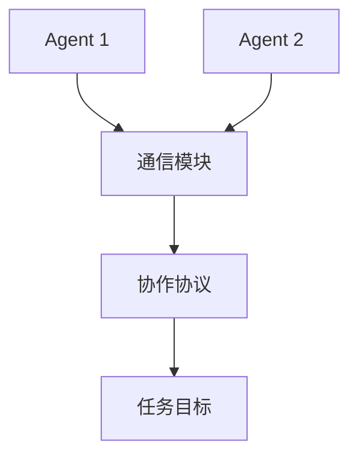

                 

# 分布式AI Agent系统：设计与实现

## 关键词：分布式AI，多智能体协作，一致性算法，通信协议，系统架构，AI Agent

## 摘要：  
分布式AI Agent系统是一种由多个智能体组成的协作系统，旨在通过分布式计算和智能体之间的协作完成复杂任务。本文从背景、核心概念、算法原理、系统架构、项目实战等多个维度深入探讨分布式AI Agent系统的设计与实现。通过详细分析分布式AI Agent的核心要素、算法机制、系统架构以及实际应用案例，本文为读者提供了一个全面理解分布式AI Agent系统的视角。文章还结合实际项目，给出了系统设计的实践经验和最佳实践。

---

# 第1章: 分布式AI Agent系统背景与概念

## 1.1 分布式AI Agent的基本概念

### 1.1.1 什么是分布式AI Agent

分布式AI Agent（Distributed AI Agent）是指在分布式环境中运行的智能体，能够通过自主决策和协作完成特定任务。与传统单体智能体不同，分布式AI Agent强调多智能体之间的协作与通信，能够适应复杂的动态环境。

### 1.1.2 分布式AI Agent的特点

分布式AI Agent具有以下特点：
- **自主性**：每个智能体能够独立决策。
- **协作性**：多个智能体通过协作完成共同目标。
- **分布式计算**：智能体分布在不同的计算节点上，通过网络通信进行协作。
- **动态性**：环境动态变化，智能体需要实时调整策略。

### 1.1.3 分布式AI Agent的应用场景

分布式AI Agent广泛应用于以下场景：
- **自动驾驶**：多个车辆在道路上协作，避免碰撞，提高交通效率。
- **机器人协作**：工业机器人在生产线上协作完成复杂任务。
- **分布式推荐系统**：多个智能体协同推荐个性化内容。
- **智能城市**：城市中的各种设备和系统通过协作实现智能化管理。

## 1.2 分布式AI Agent系统的问题背景

### 1.2.1 当前AI Agent发展的挑战

随着AI技术的快速发展，单体AI Agent已经难以满足复杂场景的需求，分布式AI Agent系统成为研究和应用的热点。然而，分布式环境下的协作问题、通信问题以及任务分配问题带来了新的挑战。

### 1.2.2 分布式环境下的协作问题

在分布式环境中，智能体需要通过通信和协作完成任务，面临以下问题：
- **通信延迟**：网络延迟可能影响协作效率。
- **一致性问题**：多个智能体之间的状态需要保持一致。
- **任务分配**：如何高效地分配任务给智能体。

### 1.2.3 系统设计的核心问题

分布式AI Agent系统设计的核心问题包括：
- **通信机制设计**：如何高效地进行智能体之间的通信。
- **协作协议设计**：如何确保智能体之间的协作高效且正确。
- **任务分配算法**：如何动态分配任务以提高系统效率。

## 1.3 分布式AI Agent的定义与外延

### 1.3.1 核心概念的定义

分布式AI Agent系统是由多个智能体组成的协作系统，通过通信和协作完成特定任务。每个智能体具有自主性、反应性和社交能力。

### 1.3.2 系统的边界与限制

分布式AI Agent系统的边界包括：
- **计算能力**：系统需要分布式计算能力支持。
- **网络条件**：通信网络的质量影响协作效率。
- **环境动态性**：环境的动态变化对系统的实时性要求较高。

### 1.3.3 相关领域的对比

与传统AI系统相比，分布式AI Agent系统具有以下特点：
- **分布式计算**：与单体AI系统相比，分布式AI Agent系统需要考虑分布式计算的问题。
- **协作性**：与单体智能体相比，分布式AI Agent系统强调协作。
- **动态性**：与静态系统相比，分布式AI Agent系统需要适应动态环境。

## 1.4 本章小结

本章介绍了分布式AI Agent系统的背景、核心概念、特点以及应用场景，并分析了当前系统设计的核心问题和挑战。接下来的章节将深入探讨分布式AI Agent系统的组成部分和实现细节。

---

# 第2章: 分布式AI Agent的组成与关系

## 2.1 AI Agent的类型与属性

### 2.1.1 单体AI Agent与分布式AI Agent的对比

单体AI Agent与分布式AI Agent的主要区别如下：

| 属性 | 单体AI Agent | 分布式AI Agent |
|------|--------------|----------------|
| 结构 | 单一计算节点 | 多个计算节点 |
| 通信 | 无 | 需要通信机制 |
| 协作 | 单体决策 | 多智能体协作 |

### 2.1.2 分布式AI Agent的分类

分布式AI Agent可以根据不同的标准进行分类：
- **按智能体类型**：分为简单反应式智能体、基于模型的反射式智能体等。
- **按任务类型**：分为任务协作型、数据协作型等。
- **按环境类型**：分为静态环境、动态环境等。

### 2.1.3 各类AI Agent的特征对比

各类AI Agent的特征对比如下：

| 类型 | 特征 |
|------|------|
| 简单反应式智能体 | 基于当前感知做出反应，无内部状态 |
| 基于模型的反射式智能体 | 具有内部状态和目标，能够推理 |
| 目标驱动智能体 | 以目标为导向，主动采取行动 |
| 社会智能体 | 具备社交能力，能够与其它智能体协作 |

### 2.2 分布式AI Agent系统中的实体关系

#### 2.2.1 实体关系表格

| 实体 | 关系 | 描述 |
|------|------|------|
| Agent | 属于 | 属于同一个系统 |
| Agent | 通信 | 通过通信模块进行交互 |
| Agent | 协作 | 通过协作协议完成任务 |
| Agent | 任务分配 | 通过任务分配算法分配任务 |

#### 2.2.2 实体关系图（Mermaid）

### 2.3 分布式AI Agent的核心要素

#### 2.3.1 通信机制

通信机制是分布式AI Agent系统的核心要素之一，主要通过以下方式实现：
- **消息传递**：智能体之间通过消息传递信息。
- **广播机制**：一个智能体向所有其他智能体发送消息。
- **点对点通信**：智能体之间通过点对点通信进行交互。

#### 2.3.2 协作协议

协作协议是分布式AI Agent系统中的另一个核心要素，主要通过以下方式实现：
- **协商协议**：智能体之间通过协商确定任务分工。
- **共识算法**：通过一致性算法确保多个智能体的状态一致。
- **任务分配协议**：通过任务分配算法动态分配任务。

#### 2.3.3 任务分配与负载均衡

任务分配与负载均衡是分布式AI Agent系统中的重要问题，主要通过以下方式实现：
- **负载均衡算法**：根据当前负载情况动态分配任务。
- **任务优先级**：根据任务的优先级进行任务分配。
- **资源分配**：根据资源情况动态分配任务。

## 2.4 本章小结

本章详细介绍了分布式AI Agent系统的组成与关系，包括AI Agent的类型与属性、分布式AI Agent的分类、各类AI Agent的特征对比以及系统中的实体关系。接下来的章节将深入探讨分布式AI Agent系统的算法原理和系统架构设计。

