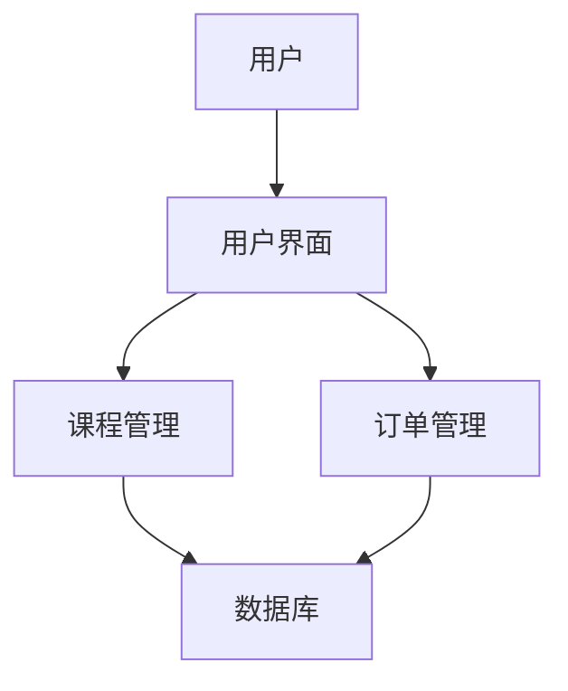
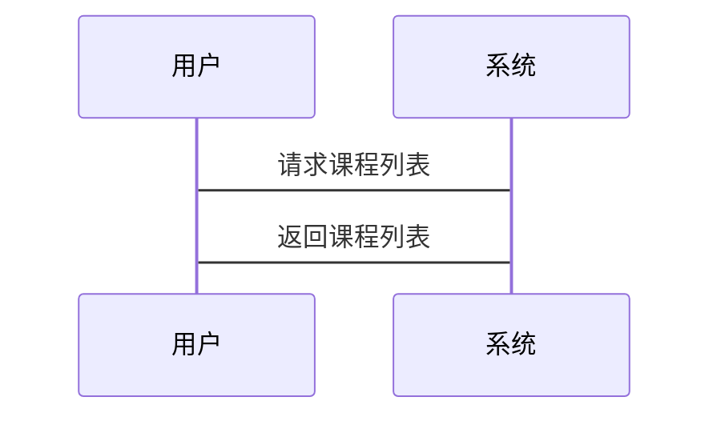

                 


# 创新与持续改进

> **关键词**：创新，持续改进，技术发展，敏捷开发，PDCA循环，系统设计

> **摘要**：本文探讨了创新与持续改进在技术领域的重要性，通过分析创新的核心概念、持续改进的方法论，以及实际项目中的应用，展示了如何在快速变化的技术环境中推动创新和优化流程。文章结合理论与实践，提供了丰富的案例和工具，帮助读者更好地理解和应用这些理念。

---

## 第1章：创新与持续改进的背景与意义

### 1.1 创新的定义与重要性

创新是技术进步的核心动力。在IT领域，创新不仅意味着开发新技术，还包括优化现有流程、改进产品和服务。创新的定义可以分为技术创新、管理创新和服务创新。技术创新包括新技术的开发和现有技术的改进；管理创新涉及流程优化、组织结构调整；服务创新则关注用户体验和商业模式的创新。

### 1.2 持续改进的定义与特点

持续改进是一种通过不断发现问题、解决问题来提升质量的方法。其核心在于PDCA循环：计划（Plan）、执行（Do）、检查（Check）、处理（Act）。这种方法强调在每个阶段发现问题并进行优化，确保过程不断改进。持续改进的特点包括系统性、迭代性和全员参与。

### 1.3 创新与持续改进的背景分析

在当前全球化和技术迅速发展的背景下，企业必须不断创新以保持竞争力。持续改进则帮助企业在这个快速变化的环境中保持稳定和高效。例如，敏捷开发方法结合了创新和持续改进的理念，通过迭代开发和客户反馈不断优化产品。

---

## 第2章：创新的核心概念与方法论

### 2.1 创新类型与特征对比

| 类型       | 定义                         | 重点领域         |
|------------|------------------------------|------------------|
| 技术创新   | 开发新技术或改进现有技术     | 技术性能         |
| 管理创新   | 优化管理流程或组织结构       | 管理效率         |
| 服务创新   | 改进服务模式或用户体验       | 用户满意度       |

### 2.2 创新与相关概念的实体关系图

使用 Mermaid 绘制创新与相关概念的 ER 图：

```mermaid
er
  actor 创新者
  actor 创新过程
  actor 创新成果
  actor 创新环境
  relation 参与
  relation 产生
  relation 依赖
```

---

## 第3章：持续改进的原理与方法

### 3.1 持续改进的原理

PDCA循环是持续改进的核心方法。通过计划、执行、检查和处理四个阶段，企业可以系统地发现问题并进行优化。例如，企业在开发新软件时，可以通过PDCA循环不断优化代码质量。

### 3.2 敏捷开发中的持续改进

敏捷开发是一种以迭代和增量的方式进行软件开发的方法。它强调通过持续反馈和调整来优化开发过程。例如，Scrum框架中的Sprint回顾会议就是一种持续改进的实践，团队在每次迭代后总结经验并优化流程。

### 3.3 持续改进工具

常用的持续改进工具包括检查表、因果图和控制图。检查表用于记录问题发生的情况，因果图帮助分析问题的根本原因，控制图则用于监控过程的稳定性。

---

## 第4章：创新与持续改进的工具与技术

### 4.1 创新工具

| 工具       | 描述                         | 应用场景         |
|------------|------------------------------|------------------|
| 头脑风暴   | 集思广益，激发创意           | 产品设计         |
| 思维导图   | 组织和可视化思路             | 战略规划         |

### 4.2 持续改进工具

| 工具       | 描述                         | 应用场景         |
|------------|------------------------------|------------------|
| 检查表     | 记录问题发生情况             | 质量控制         |
| 因果图     | 分析问题的根本原因           | 质量改进         |

---

## 第5章：项目实战：创新与持续改进的系统设计

### 5.1 系统分析

以一个在线教育平台为例，系统分析包括需求分析、功能分析和约束条件。需求分析包括用户需求和业务需求，功能分析包括课程管理、用户管理等模块。

### 5.2 系统架构设计

使用 Mermaid 绘制系统架构图：



### 5.3 系统接口设计

接口设计包括API的设计和交互设计。例如，课程管理模块的API接口设计需要考虑数据格式和调用方式。

### 5.4 交互设计

使用 Mermaid 绘制交互序列图：



---

## 第6章：创新文化与领导力

### 6.1 创新文化的建设

创新文化强调开放沟通、鼓励冒险和容忍失败。领导者在推动创新时，需要营造一个支持性的环境，鼓励员工提出新想法。

### 6.2 领导者的角色

领导者在持续改进中起到关键作用，包括设定目标、提供资源和支持，以及协调团队合作。

---

## 第7章：未来趋势与挑战

### 7.1 技术趋势

人工智能和大数据正在改变创新和持续改进的方式。例如，AI可以帮助预测问题并提出解决方案，从而优化持续改进的过程。

### 7.2 挑战

快速变化的技术环境和全球化竞争给企业和组织带来了巨大的挑战。企业需要不断学习和适应，才能在竞争中立于不败之地。

---

## 第8章：总结与展望

### 8.1 总结

创新与持续改进是技术进步的双轮驱动。通过创新，企业可以开发新技术和新产品；通过持续改进，企业可以优化流程和提高效率。

### 8.2 展望

未来，创新和持续改进将更加依赖于数据和技术。企业需要结合数据分析和自动化工具，进一步提升创新和改进的效率。

---

## 附录

### 术语表

- 创新：开发新技术或改进现有技术。
- 持续改进：通过PDCA循环不断优化过程。

### 参考文献

1. 约翰·科特，《变革管理》
2. 纽曼，《系统工程》

---

**作者：AI天才研究院/AI Genius Institute & 禅与计算机程序设计艺术 /Zen And The Art of Computer Programming**

