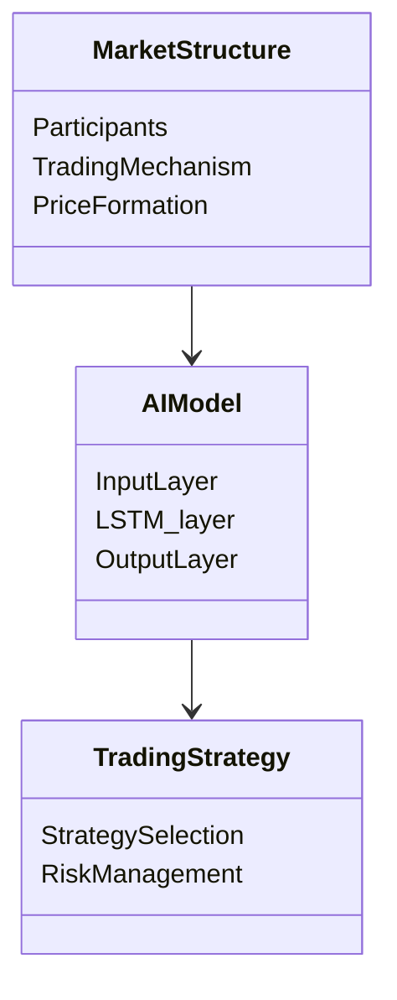

                 


# 利用AI构建动态市场微观结构模型：优化交易策略

> 关键词：动态市场微观结构模型，AI，交易策略优化，机器学习，金融建模

> 摘要：本文详细探讨了如何利用人工智能技术构建动态市场微观结构模型，并通过该模型优化交易策略。文章从市场微观结构的基本概念出发，逐步分析了AI在模型构建中的作用，详细讲解了动态模型的核心概念、算法原理、系统架构设计以及项目实战。通过丰富的案例分析和代码实现，展示了如何利用AI技术提升交易策略的优化能力。

---

# 第一部分: 利用AI构建动态市场微观结构模型概述

## 第1章: 市场微观结构模型基础

### 1.1 市场微观结构的基本概念

#### 1.1.1 市场微观结构的定义
市场微观结构（Market Microstructure）是指金融市场中交易的基础设施和规则，包括市场参与者、交易机制、价格形成机制等。它是金融市场的运行机制的具体表现。

#### 1.1.2 市场微观结构的核心要素
市场微观结构的核心要素包括：
- 市场参与者：机构投资者、散户、做市商等。
- 交易机制：订单簿、撮合规则、交易费用等。
- 价格形成机制：买卖价差、订单流对价格的影响等。
- 时间序列数据：高频交易数据、订单簿数据等。

#### 1.1.3 市场微观结构与宏观结构的关系
市场微观结构与宏观结构的关系是局部与整体的关系。微观结构决定了宏观市场的流动性和价格波动，而宏观市场的波动又反过来影响微观结构的运行。

---

### 1.2 动态市场微观结构模型的必要性

#### 1.2.1 传统静态模型的局限性
传统市场微观结构模型通常是静态的，无法捕捉市场的实时变化。例如，静态模型无法适应市场参与者行为的变化或外部环境的变化。

#### 1.2.2 动态模型的优势
动态模型能够实时更新市场参与者的策略和市场环境的变化，从而更准确地捕捉市场的动态特征。

#### 1.2.3 动态模型的应用场景
动态模型适用于高频交易、算法交易、风险管理等领域，能够帮助交易者快速响应市场变化。

---

## 第2章: AI在市场微观结构建模中的作用

### 2.1 AI技术的基本概念

#### 2.1.1 人工智能的定义
人工智能（AI）是指通过计算机模拟人类智能的技术，包括学习、推理、自我改进等能力。

#### 2.1.2 机器学习的定义
机器学习是一种人工智能技术，通过数据训练模型，使其能够从数据中学习规律并进行预测或分类。

#### 2.1.3 深度学习的定义
深度学习是一种机器学习技术，通过多层神经网络提取数据的高层次特征。

---

### 2.2 AI在金融领域的应用

#### 2.2.1 AI在金融分析中的应用
AI可以用于股票价格预测、风险评估、市场情绪分析等。

#### 2.2.2 AI在风险管理中的应用
AI可以帮助识别市场风险、信用风险等，并提供实时监控。

#### 2.2.3 AI在交易策略优化中的应用
AI可以通过分析历史数据和市场行为，优化交易策略，提高交易效率。

---

### 2.3 AI在动态市场微观结构建模中的优势

#### 2.3.1 数据处理能力
AI能够处理海量的高频交易数据，提取有用的特征。

#### 2.3.2 模型自适应性
AI模型能够自适应市场环境的变化，实时更新模型参数。

#### 2.3.3 高效计算能力
AI技术可以利用并行计算和分布式系统，快速处理复杂任务。

---

# 第二部分: 动态市场微观结构模型的核心概念

## 第3章: 动态市场微观结构模型的构建

### 3.1 模型构建的基本步骤

#### 3.1.1 数据收集与预处理
- 数据来源：高频交易数据、订单簿数据、市场参与者行为数据等。
- 数据清洗：去除噪声数据，处理缺失值。
- 数据标准化：归一化处理，确保不同特征的可比性。

#### 3.1.2 模型设计与选择
- 模型选择：根据问题特点选择合适的AI模型，如强化学习、深度学习等。
- 模型设计：设计神经网络结构，如LSTM用于时间序列数据。

#### 3.1.3 模型训练与优化
- 训练数据：使用历史数据训练模型。
- 超参数优化：调整学习率、批量大小等参数，提高模型性能。
- 模型验证：使用验证集评估模型性能，防止过拟合。

#### 3.1.4 模型验证与评估
- 评估指标：准确率、召回率、F1值等。
- 模型调优：根据评估结果进一步优化模型。

---

### 3.2 模型的核心要素

#### 3.2.1 市场参与者的角色
- 做市商：提供流动性，维护订单簿。
- 投资者：根据市场信息进行交易决策。

#### 3.2.2 价格形成机制
- 买卖价差：买价和卖价之间的差异。
- 市场深度：订单簿中的订单数量和价格分布。

#### 3.2.3 交易行为分析
- 交易频率：高频交易、低频交易。
- 交易策略：套利策略、趋势策略等。

#### 3.2.4 时间序列分析
- 时间依赖性：价格变化的时间相关性。
- 季节性波动：市场在特定时间的周期性变化。

---

## 第4章: 算法原理

### 4.1 强化学习在动态模型中的应用

#### 4.1.1 强化学习的基本原理
- 状态空间：市场的当前状态，如价格、订单簿等。
- 行动空间：交易策略，如买入、卖出、持有。
- 奖励函数：衡量交易收益的函数。

#### 4.1.2 强化学习的算法选择
- Q-Learning：基于状态-动作的值函数。
- DQN（Deep Q-Network）：使用深度神经网络近似Q值函数。

#### 4.1.3 强化学习的训练过程
- 环境与智能体的交互：智能体根据状态选择动作，环境返回奖励和新的状态。
- 神经网络的训练：通过经验回放和梯度下降优化网络参数。

---

### 4.2 深度学习在动态模型中的应用

#### 4.2.1 LSTM网络的原理
- 长短期记忆网络（LSTM）：用于捕捉时间序列中的长期依赖关系。
- LSTM单元结构：包括输入门、遗忘门、输出门。

#### 4.2.2 LSTM网络的实现
- 输入层：处理市场数据，如价格、订单数据。
- LSTM层：提取时间序列特征。
- 全连接层：预测下一步的价格或交易信号。

---

### 4.3 算法的数学模型

#### 4.3.1 强化学习的数学模型
$$ Q(s, a) = r + \gamma \max_a Q(s', a') $$
其中，\( Q(s, a) \) 是状态 \( s \) 下动作 \( a \) 的Q值，\( r \) 是奖励，\( \gamma \) 是折扣因子，\( s' \) 是下一个状态。

#### 4.3.2 LSTM的数学模型
$$ \text{遗忘门：} f_t = \sigma(W_f x_t + U_f h_{t-1} + b_f) $$
$$ \text{输入门：} i_t = \sigma(W_i x_t + U_i h_{t-1} + b_i) $$
$$ \text{细胞状态：} c_t = f_t c_{t-1} + i_t \tilde{c}_t $$
$$ \text{输出门：} o_t = \sigma(W_o x_t + U_o h_{t-1} + b_o) $$
$$ \text{隐藏状态：} h_t = o_t \tanh(c_t) $$

---

## 第5章: 系统分析与架构设计

### 5.1 系统功能设计

#### 5.1.1 领域模型（mermaid类图）


---

### 5.2 系统架构设计（mermaid架构图）


---

### 5.3 系统接口设计

- 数据接口：从市场数据源获取数据，如Kafka、数据库。
- 模型接口：AI模型的输入和输出接口。
- 交易接口：与交易系统对接，执行交易指令。

---

## 第6章: 项目实战

### 6.1 环境配置

```bash
pip install numpy pandas keras tensorflow matplotlib
```

---

### 6.2 核心代码实现

#### 6.2.1 数据预处理

```python
import pandas as pd
import numpy as np

# 加载数据
data = pd.read_csv('market_data.csv')

# 数据清洗
data = data.dropna()
data = data.iloc[:1000]

# 标准化处理
from sklearn.preprocessing import StandardScaler
scaler = StandardScaler()
data_scaled = scaler.fit_transform(data)
```

---

#### 6.2.2 LSTM模型实现

```python
from tensorflow.keras.models import Sequential
from tensorflow.keras.layers import LSTM, Dense, Dropout

model = Sequential()
model.add(LSTM(64, input_shape=(timesteps, features)))
model.add(Dropout(0.2))
model.add(Dense(1))
model.compile(loss='mean_squared_error', optimizer='adam')
```

---

#### 6.2.3 模型训练

```python
model.fit(X_train, y_train, epochs=10, batch_size=32, validation_split=0.2)
```

---

### 6.3 案例分析

#### 6.3.1 数据分析
- 数据可视化：使用 matplotlib 绘制价格走势和模型预测结果。

#### 6.3.2 模型评估
- 计算预测精度：比较实际价格和预测价格的差异。
- 回测分析：模拟交易策略的收益和风险。

---

## 第7章: 最佳实践与总结

### 7.1 最佳实践

- 数据质量：确保数据的完整性和准确性。
- 模型选择：根据具体问题选择合适的算法。
- 系统优化：优化模型的计算效率和资源利用率。

---

### 7.2 小结

本文详细介绍了如何利用AI技术构建动态市场微观结构模型，并通过该模型优化交易策略。通过理论分析和实践案例，展示了AI在金融市场中的强大应用潜力。

---

作者：AI天才研究院/AI Genius Institute & 禅与计算机程序设计艺术 /Zen And The Art of Computer Programming

