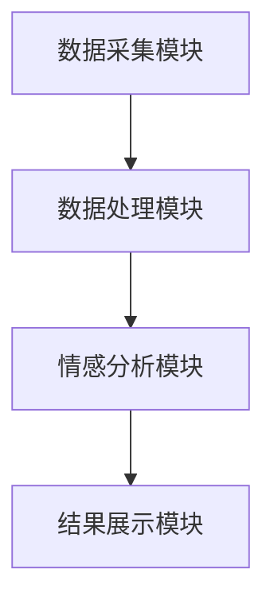
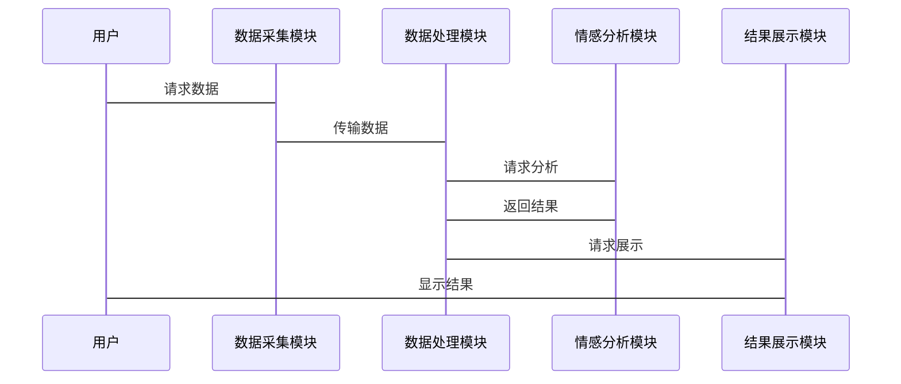

                 


# 利用多智能体系统构建动态市场情绪指标：把握市场脉搏

> 关键词：多智能体系统，市场情绪指标，动态市场情绪，金融数据分析，情感分析，协同学习

> 摘要：本文详细探讨了利用多智能体系统构建动态市场情绪指标的方法，从市场情绪指标的定义与重要性入手，结合多智能体系统的原理与优势，深入分析了动态市场情绪指标的构建背景、核心概念、算法原理、系统架构设计以及实际项目实战案例。通过详细阐述多智能体系统在市场情绪分析中的应用，本文为金融市场的动态情绪分析提供了新的视角和解决方案。

---

## 第1章: 多智能体系统与市场情绪指标概述

### 1.1 市场情绪指标的定义与重要性

#### 1.1.1 市场情绪指标的定义
市场情绪指标是用来量化金融市场参与者情绪的工具，反映了市场参与者对当前市场趋势的乐观或悲观程度。它通常基于新闻、社交媒体、交易数据等多种数据源进行分析。

#### 1.1.2 市场情绪指标的重要性
市场情绪指标在金融市场的研究和投资决策中起着重要作用。通过分析市场情绪，投资者可以更好地理解市场的波动性，预测市场趋势，并做出更明智的投资决策。

#### 1.1.3 多智能体系统在市场情绪分析中的作用
传统的市场情绪分析方法通常依赖于单一的智能体进行数据处理和分析。然而，随着市场数据的复杂性和多样性的增加，单一智能体的处理能力变得有限。多智能体系统通过分布式计算和协同学习，能够更高效地处理大规模数据，并提供更精准的市场情绪分析结果。

### 1.2 多智能体系统的基本概念

#### 1.2.1 多智能体系统的定义
多智能体系统（Multi-Agent System, MAS）是由多个相互作用的智能体组成的系统，这些智能体能够通过通信和协作完成复杂任务。

#### 1.2.2 多智能体系统的特征
- **自主性**：每个智能体都能独立决策和行动。
- **反应性**：智能体能够感知环境并实时响应。
- **协作性**：多个智能体通过通信和协作共同完成任务。
- **分布式性**：智能体分布在不同的位置，通过网络进行通信。

#### 1.2.3 多智能体系统与传统单智能体系统的对比

| 特性            | 单智能体系统      | 多智能体系统      |
|-----------------|------------------|------------------|
| 处理能力        | 中央处理         | 分布式处理       |
| 协作能力        | 无               | 高               |
| 灵活性          | 低               | 高               |

### 1.3 动态市场情绪指标的构建背景

#### 1.3.1 当前市场情绪分析的挑战
- 数据多样性：市场数据来源广泛，包括新闻、社交媒体、交易数据等，处理难度大。
- 数据实时性：市场情绪需要实时更新，对系统的响应速度提出更高要求。
- 数据复杂性：市场情绪受多种因素影响，单一模型难以捕捉所有信息。

#### 1.3.2 多智能体系统的优势
- 高效性：多智能体系统能够并行处理大规模数据，提高分析效率。
- 精准性：通过协同学习，多智能体系统能够更准确地捕捉市场情绪的变化。
- 灵活性：可以根据市场变化动态调整分析策略。

#### 1.3.3 动态市场情绪指标的应用场景
- 实时市场监控：金融机构可以通过动态市场情绪指标实时监控市场情绪变化。
- 投资决策支持：投资者可以根据市场情绪指标做出更明智的投资决策。
- 风险管理：动态市场情绪指标可以帮助金融机构更好地识别和管理市场风险。

### 1.4 本章小结
本章介绍了市场情绪指标的定义和重要性，详细讲解了多智能体系统的概念和特征，并分析了动态市场情绪指标的构建背景及其应用场景。接下来的章节将深入探讨多智能体系统在市场情绪分析中的具体应用。

---

## 第2章: 多智能体系统的核心概念与原理

### 2.1 多智能体系统的体系结构

#### 2.1.1 分布式多智能体系统
分布式多智能体系统中，多个智能体分布在不同的节点上，通过通信协议进行交互。这种结构具有高扩展性和灵活性。

#### 2.1.2 集中式多智能体系统
集中式多智能体系统中，有一个中央节点负责协调和管理所有智能体的活动。这种结构适用于需要高度协调的任务。

#### 2.1.3 混合式多智能体系统
混合式多智能体系统结合了分布式和集中式结构，适用于任务复杂且需要部分集中管理的场景。

### 2.2 多智能体系统的通信与协作

#### 2.2.1 通信机制
多智能体系统中的智能体需要通过通信机制共享信息。常用的通信机制包括发布-订阅模型和请求-响应模型。

#### 2.2.2 协作策略
协作策略是多智能体系统中智能体如何协同工作的规则。常用的协作策略包括任务分配、资源分配和冲突解决。

#### 2.2.3 冲突解决
在多智能体系统中，智能体之间可能会出现冲突。冲突解决机制需要通过协商或仲裁来解决冲突，确保系统的稳定运行。

### 2.3 多智能体系统的智能体设计

#### 2.3.1 智能体的属性与行为
智能体的属性包括状态、目标和能力。智能体的行为是其为了达到目标而采取的行动。

#### 2.3.2 智能体的决策模型
智能体的决策模型是其根据感知的信息做出决策的规则。常用的决策模型包括基于规则的决策和基于模型的决策。

#### 2.3.3 智能体的学习机制
智能体可以通过学习算法不断优化其决策模型。常用的学习机制包括强化学习和监督学习。

### 2.4 本章小结
本章详细介绍了多智能体系统的体系结构、通信与协作机制以及智能体设计。这些内容为后续章节中动态市场情绪指标的构建奠定了基础。

---

## 第3章: 市场情绪指标的构建与数据处理

### 3.1 市场情绪指标的构建框架

#### 3.1.1 数据来源与特征
市场情绪指标的构建需要多种数据来源，包括新闻数据、社交媒体数据、交易数据等。数据特征包括情感倾向、关键词频率、市场波动性等。

#### 3.1.2 数据预处理与特征工程
数据预处理包括清洗数据、标准化数据和去除异常值。特征工程包括选择关键特征、提取特征和降维。

#### 3.1.3 模型构建与训练
模型构建包括选择合适的算法、设计模型结构和训练模型。常用的算法包括支持向量机、随机森林和神经网络。

### 3.2 多智能体系统的数据流分析

#### 3.2.1 数据输入与输出
多智能体系统需要从多个数据源获取数据，并将分析结果输出到用户界面或下游系统。

#### 3.2.2 数据的分布式处理
多智能体系统通过分布式计算高效处理大规模数据，每个智能体负责处理部分数据。

#### 3.2.3 数据融合与分析
多智能体系统通过协同学习，将各个智能体的分析结果融合，得到更全面的市场情绪指标。

### 3.3 本章小结
本章详细介绍了市场情绪指标的构建框架和数据处理流程，重点讲解了多智能体系统在数据处理中的应用。

---

## 第4章: 多智能体系统的算法原理

### 4.1 协同学习算法

#### 4.1.1 协同学习的基本原理
协同学习是一种多智能体协作学习的算法，多个智能体通过共享知识和经验共同完成学习任务。

#### 4.1.2 协同学习的优势
协同学习可以提高学习效率和准确性，通过多个智能体的协作，可以更好地捕捉数据中的复杂模式。

#### 4.1.3 协同学习的实现步骤
1. 初始化：设置智能体的初始状态和目标。
2. 通信：智能体之间共享数据和知识。
3. 协作：智能体协同完成学习任务。
4. 优化：根据反馈优化学习策略。

### 4.2 情感分析算法

#### 4.2.1 情感分析的基本原理
情感分析是对文本中的情感倾向进行分类，通常分为正面、负面和中性。

#### 4.2.2 基于多智能体的情感分析
多智能体系统可以分别负责不同的情感分析任务，通过协同学习提高分析的准确性和全面性。

#### 4.2.3 情感分析的数学模型
$$ P(positive | text) = \frac{P(text | positive)}{P(text)} $$

### 4.3 本章小结
本章详细介绍了多智能体系统的算法原理，重点讲解了协同学习和情感分析算法的应用。

---

## 第5章: 系统架构设计

### 5.1 问题场景介绍
市场情绪指标的构建需要一个高效的系统架构，能够处理大规模数据并实时更新市场情绪。

### 5.2 系统功能设计

#### 5.2.1 数据采集模块
数据采集模块负责从多个数据源获取数据，包括新闻、社交媒体和交易数据。

#### 5.2.2 数据处理模块
数据处理模块负责对数据进行预处理、特征提取和数据融合。

#### 5.2.3 情感分析模块
情感分析模块负责对数据进行情感分析，生成市场情绪指标。

#### 5.2.4 结果展示模块
结果展示模块负责将分析结果以可视化的方式展示给用户。

### 5.3 系统架构图


### 5.4 系统接口设计
系统接口设计包括数据接口、智能体通信接口和用户界面接口。

### 5.5 系统交互流程图


### 5.6 本章小结
本章详细介绍了系统架构设计，包括功能设计、架构图和交互流程图。

---

## 第6章: 项目实战

### 6.1 环境安装
需要安装Python、numpy、pandas、scikit-learn和Flask框架。

### 6.2 核心代码实现

#### 6.2.1 数据采集模块
```python
import requests
from bs4 import BeautifulSoup

def fetch_news():
    url = "https://www.example.com"
    response = requests.get(url)
    soup = BeautifulSoup(response.text, 'html.parser')
    articles = soup.find_all('article')
    return [article.text for article in articles]
```

#### 6.2.2 情感分析模块
```python
from sklearn.feature_extraction.text import TfidfVectorizer
from sklearn.svm import SVC

def sentiment_analysis(texts):
    vectorizer = TfidfVectorizer()
    X = vectorizer.fit_transform(texts)
    model = SVC()
    model.fit(X, labels)
    return model.predict(X)
```

### 6.3 案例分析与代码解读
通过实际案例分析，展示如何利用多智能体系统构建动态市场情绪指标。

### 6.4 本章小结
本章通过项目实战，详细讲解了如何利用多智能体系统构建动态市场情绪指标。

---

## 第7章: 案例分析与扩展

### 7.1 案例分析
通过实际案例分析，展示多智能体系统在市场情绪分析中的应用效果。

### 7.2 模型扩展
介绍如何进一步优化模型，包括引入更复杂的情感分析算法和增强系统的实时性。

### 7.3 本章小结
本章通过案例分析和模型扩展，展示了多智能体系统在动态市场情绪指标构建中的潜力。

---

## 第8章: 总结与展望

### 8.1 全文总结
总结全文内容，强调多智能体系统在市场情绪分析中的优势。

### 8.2 未来展望
展望未来的研究方向，包括更高效的学习算法和更智能的系统架构。

---

## 作者
作者：AI天才研究院 & 禅与计算机程序设计艺术

---

以上是文章的完整目录和部分章节内容，您可以根据需要进一步扩展每个章节的具体内容。

