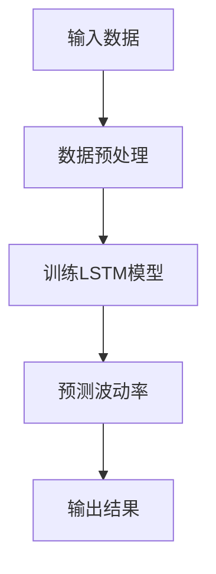
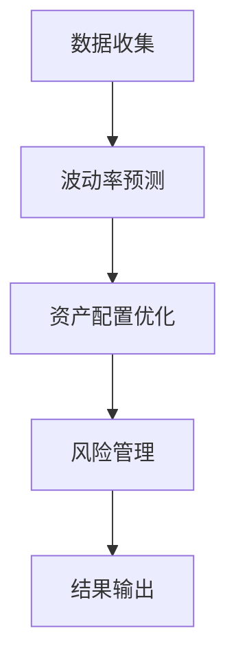
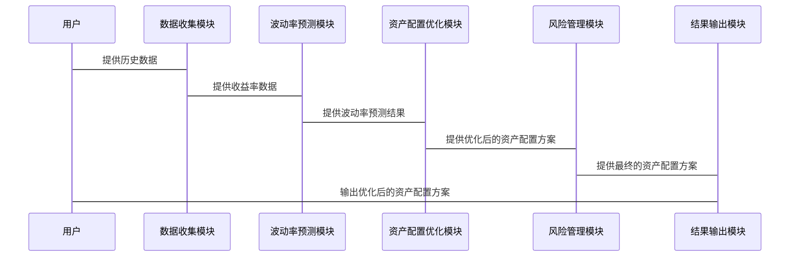

                 


# 利用市场波动重新平衡资产配置的策略

## 关键词：
- 市场波动、资产配置、再平衡策略、风险管理、投资组合优化、动态资产配置

## 摘要：
本文探讨了如何利用市场波动重新平衡资产配置的策略。通过分析市场波动的来源和特征，结合资产配置的核心原理，提出了基于波动率的动态调整方法。文章详细介绍了均值-方差优化模型和风险平价策略，探讨了机器学习在波动预测中的应用，并通过实际案例展示了策略的实施过程。最后，总结了风险管理的重要性，并展望了未来的研究方向。

---

## 第1章: 市场波动与资产配置概述

### 1.1 市场波动的定义与特征
#### 1.1.1 市场波动的定义
市场波动是指资产价格在短期内偏离其长期趋势的频繁变动。波动率是衡量市场波动程度的重要指标，通常通过资产价格的标准差或波动率模型（如GARCH）来计算。

#### 1.1.2 市场波动的特征
- **周期性**：市场波动往往呈现周期性，与经济周期密切相关。
- **非对称性**：市场的上涨和下跌幅度通常不对称，下跌幅度往往更大。
- **传染性**：市场波动可能从一个市场传染到另一个市场，尤其是在全球化背景下。

#### 1.1.3 市场波动对资产配置的影响
市场波动会影响资产的预期收益和风险，从而影响资产配置的决策。波动率较高的资产通常具有较高的风险溢价，但也可能带来较高的收益。

### 1.2 资产配置的基本原理
#### 1.2.1 资产配置的定义
资产配置是指将投资组合分配到不同的资产类别（如股票、债券、房地产等）中，以实现风险分散和收益最大化。

#### 1.2.2 资产配置的核心要素
- **投资目标**：明确的投资目标是资产配置的基础，包括收益目标和风险承受能力。
- **资产类别**：选择不同的资产类别以分散风险。
- **权重分配**：根据资产的风险和收益特征，确定各资产类别的权重。

#### 1.2.3 资产配置与投资目标的关系
资产配置需要根据投资目标进行调整。例如，风险厌恶型投资者可能更倾向于配置债券，而风险偏好型投资者可能更倾向于配置股票。

### 1.3 市场波动与资产配置的关系
#### 1.3.1 市场波动对资产配置的影响
市场波动会改变资产的收益和风险特征，从而影响资产配置的决策。例如，当市场波动率上升时，投资者可能需要减少高风险资产的配置，转而增加低风险资产的配置。

#### 1.3.2 资产配置在市场波动中的作用
资产配置可以帮助投资者在市场波动中保持投资组合的稳定性，通过分散投资降低风险。

#### 1.3.3 市场波动与资产配置的动态平衡
资产配置需要根据市场波动的变化进行动态调整，以保持投资组合的风险收益平衡。

---

## 第2章: 市场波动的分析与预测

### 2.1 市场波动的来源
#### 2.1.1 宏观经济因素
宏观经济因素如GDP增长率、通货膨胀率、利率变化等都会影响市场波动。

#### 2.1.2 市场情绪与投资者行为
投资者情绪的变化（如恐慌、贪婪）会导致市场波动。行为金融学研究表明，投资者情绪往往会导致市场波动加剧。

#### 2.1.3 行业与公司特定因素
某些行业或公司特有的事件（如并购、重组、业绩不佳等）也可能引发市场波动。

### 2.2 市场波动的特征分析
#### 2.2.1 波动率的计算方法
波动率通常通过资产价格的收益率的标准差来计算。例如，股票价格的收益率序列的标准差即为波动率。

$$ \text{波动率} = \sqrt{\frac{1}{n}\sum_{i=1}^{n}(r_i - \bar{r})^2} $$

其中，\( r_i \) 是第i个时期的收益率，\( \bar{r} \) 是平均收益率，\( n \) 是时期数量。

#### 2.2.2 市场波动的周期性
市场波动通常与经济周期密切相关，波动率在经济衰退期间往往较高。

#### 2.2.3 市场波动的非对称性
市场的下跌波动通常比上涨波动更为剧烈，这被称为波动的非对称性。

### 2.3 市场波动的预测方法
#### 2.3.1 时间序列分析
时间序列分析是一种常用的方法，如ARIMA模型可以用于预测市场波动。

#### 2.3.2 机器学习在波动预测中的应用
机器学习算法（如随机森林、神经网络）可以用于预测市场波动，但需要大量的历史数据和特征变量。

#### 2.3.3 市场情绪指标的应用
通过分析市场情绪指标（如恐慌指数VIX）可以预测市场波动。

---

## 第3章: 资产配置策略的核心概念与联系

### 3.1 资产配置策略的核心要素
#### 3.1.1 投资目标与风险承受能力
投资目标和风险承受能力是资产配置的基础，决定了资产配置的具体方案。

#### 3.1.2 资产类别与权重分配
根据资产的风险和收益特征，确定各资产类别的权重。例如，股票的权重可能为60%，债券为30%，现金为10%。

#### 3.1.3 再平衡策略的实施
再平衡是指定期调整投资组合的权重，以保持与预定目标一致。例如，每年年初调整一次。

### 3.2 资产配置的数学模型
#### 3.2.1 均值-方差优化模型
均值-方差优化模型是资产配置的经典模型，目标是在给定风险下实现最大收益。

$$ \text{目标函数：} \min_w \sigma^2 \quad \text{约束条件：} \sum_{i=1}^{n} w_i = 1, \quad \sum_{i=1}^{n} w_i r_i = R $$

其中，\( w_i \) 是第i个资产的权重，\( r_i \) 是第i个资产的预期收益率，\( R \) 是投资组合的预期收益率，\( \sigma^2 \) 是投资组合的方差。

#### 3.2.2 风险平价策略
风险平价策略是指将投资组合的总风险在各资产类别之间平均分配。

$$ \sum_{i=1}^{n} w_i \sigma_i = \text{常数} $$

其中，\( \sigma_i \) 是第i个资产的风险（波动率）。

#### 3.2.3 情景分析法
情景分析法是通过模拟不同市场环境下的资产表现，选择最优资产配置方案。

### 3.3 资产配置与市场波动的关系
#### 3.3.1 波动率对资产配置的影响
波动率高的资产通常具有较高的风险溢价，但也会增加投资组合的风险。

#### 3.3.2 资产配置对波动的缓冲作用
通过分散投资，资产配置可以降低投资组合的波动率。

#### 3.3.3 动态资产配置的数学模型
动态资产配置需要根据市场波动的变化实时调整资产权重。

$$ w_t = f(\text{波动率}_t) $$

其中，\( w_t \) 是第t个时期的资产权重，\( \text{波动率}_t \) 是第t个时期的波动率。

---

## 第4章: 风险管理与资产配置的再平衡

### 4.1 风险管理的核心原则
风险管理是资产配置的重要组成部分，旨在降低投资组合的波动性和潜在损失。

#### 4.1.1 价值-at-风险（VaR）
VaR是衡量投资组合潜在损失的一种方法，通常用于风险管理和资本分配。

$$ \text{VaR} = \text{损失的金额} \quad \text{在一定置信水平下} $$

#### 4.1.2 条件VaR（CVaR）
CVaR是VaR的扩展，考虑了在VaR水平下的平均损失。

#### 4.1.3 压力测试
压力测试用于评估投资组合在极端市场条件下的表现。

### 4.2 资产配置的再平衡策略
再平衡策略是动态调整资产配置的重要手段，可以通过定期调整或根据波动率变化进行调整。

#### 4.2.1 定期再平衡
定期再平衡是指按照预定的时间间隔进行调整，例如每年或每季度。

#### 4.2.2 动态再平衡
动态再平衡是根据市场波动实时调整资产权重，例如根据波动率的变化调整股票和债券的比例。

---

## 第5章: 利用机器学习预测市场波动与资产配置

### 5.1 机器学习在市场波动预测中的应用
机器学习算法（如LSTM、随机森林）可以用于预测市场波动。

#### 5.1.1 LSTM模型
LSTM（长短期记忆网络）是一种有效的序列模型，可以捕捉市场波动的时间依赖性。

```python
import tensorflow as tf
from tensorflow.keras.layers import LSTM, Dense

model = tf.keras.Sequential()
model.add(LSTM(64, input_shape=(timesteps, features)))
model.add(Dense(1))
model.compile(loss='mean_squared_error', optimizer='adam')
```

#### 5.1.2 算法流程图


### 5.2 基于机器学习的资产配置策略
基于机器学习的资产配置策略可以根据波动率预测结果动态调整资产权重。

#### 5.2.1 波动率预测与资产配置的关系
波动率预测结果用于指导资产配置，例如在预测波动率上升时减少高风险资产的配置。

### 5.3 代码实现与应用
以下是一个简单的波动率预测代码示例：

```python
import numpy as np
import pandas as pd
from sklearn.metrics import mean_squared_error
from tensorflow.keras.models import Sequential
from tensorflow.keras.layers import LSTM, Dense

# 示例数据：假设我们有n天的收益率数据
n = 100
timesteps = 30
features = 5

# 创建随机数据
X = np.random.randn(n, timesteps, features)
y = np.random.randn(n, 1)

# 模型定义
model = Sequential()
model.add(LSTM(64, input_shape=(timesteps, features)))
model.add(Dense(1))
model.compile(loss='mean_squared_error', optimizer='adam')

# 训练模型
model.fit(X, y, epochs=10, batch_size=32)

# 预测波动率
predicted = model.predict(X)
actual = y
rmse = np.sqrt(mean_squared_error(predicted, actual))
print(f"RMSE: {rmse}")
```

### 5.4 实战案例分析
通过实际市场数据验证模型的有效性，例如使用历史数据训练模型，并预测未来的波动率，然后根据波动率调整资产配置。

---

## 第6章: 系统设计与架构方案

### 6.1 系统设计概述
系统设计包括数据收集、波动率预测、资产配置优化、风险管理和结果输出。

#### 6.1.1 数据收集模块
数据收集模块负责收集历史市场数据，包括收益率、波动率等。

#### 6.1.2 波动率预测模块
波动率预测模块使用机器学习模型预测未来的波动率。

#### 6.1.3 资产配置优化模块
资产配置优化模块根据波动率预测结果优化资产配置。

#### 6.1.4 风险管理模块
风险管理模块用于评估和管理投资组合的风险。

#### 6.1.5 结果输出模块
结果输出模块将优化后的资产配置方案输出，供投资者参考。

### 6.2 系统架构设计


### 6.3 系统接口设计
系统接口设计包括数据接口、模型接口和用户接口，确保系统的模块化和可扩展性。

### 6.4 系统交互流程


---

## 第7章: 总结与展望

### 7.1 总结
本文探讨了如何利用市场波动重新平衡资产配置的策略，提出了基于波动率的动态调整方法，并通过机器学习模型进行了验证。

### 7.2 展望
未来的研究可以进一步探讨以下方向：
1. 更复杂的机器学习模型（如深度学习）在波动预测中的应用。
2. 多因子模型在资产配置中的应用。
3. 更精确的风险管理方法，如动态VaR模型。

---

## 作者：AI天才研究院/AI Genius Institute & 禅与计算机程序设计艺术 /Zen And The Art of Computer Programming

