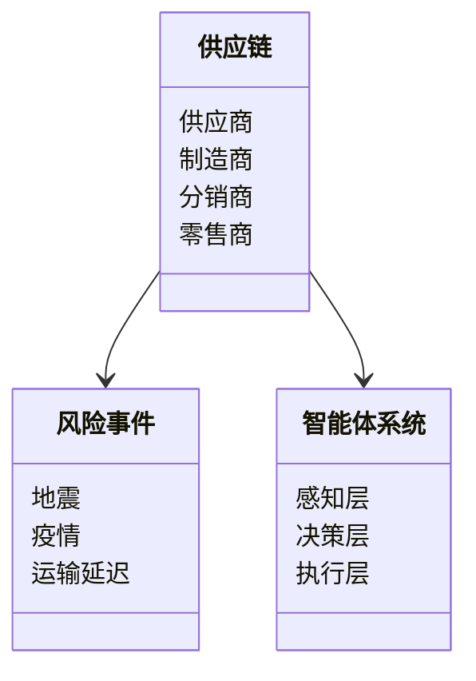
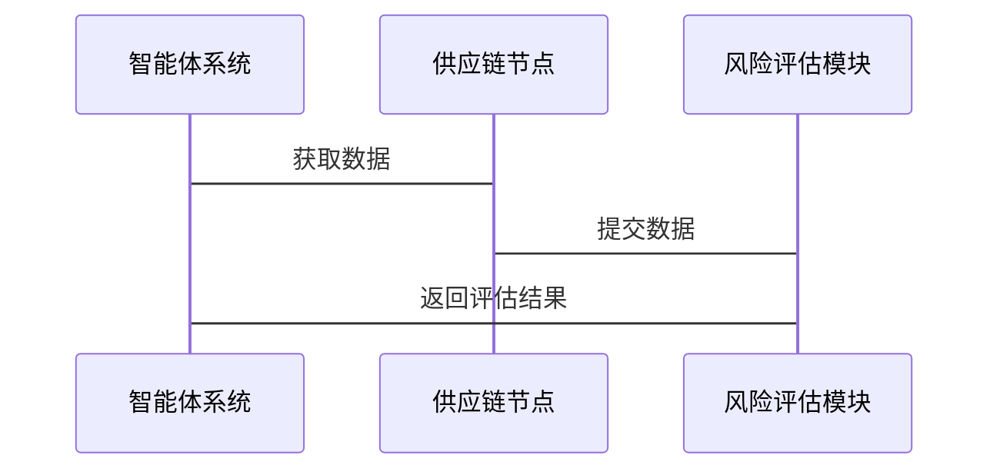

                 


# 利用智能体系统进行全面的供应链韧性评估

> 关键词：供应链韧性评估, 智能体系统, 供应链管理, 智能算法, 供应链优化

> 摘要：  
> 在当今全球化和高度互联的商业环境中，供应链的韧性和稳定性对于企业生存和成功至关重要。本文探讨了如何利用智能体系统（Intelligent Agent Systems）进行全面的供应链韧性评估。通过分析智能体系统的核心原理、算法实现、系统架构设计及实际应用场景，本文旨在为企业提供一种高效、动态的供应链风险管理方法。文章内容涵盖供应链韧性评估的背景与挑战、智能体系统的定义与优势、基于智能体的算法实现、系统架构设计、项目实战案例分析以及最佳实践建议。通过本篇文章，读者将深入了解如何利用智能体系统提升供应链的弹性和应对复杂风险的能力。

---

# 第一部分：供应链韧性评估的背景与挑战

## 第1章：供应链韧性评估的背景与意义

### 1.1 供应链的基本概念

#### 1.1.1 供应链的定义
供应链是指从原材料采购到产品交付给最终客户的整个流程中，所有参与企业、物流、信息流和资金流的整合系统。供应链的核心目标是实现高效的产品交付和服务。

#### 1.1.2 供应链的主要组成部分
- **供应商**：提供原材料或零部件的企业。
- **制造商**：负责产品生产的主体。
- **分销商**：负责产品分发和物流的企业。
- **零售商**：面向最终消费者的销售端。
- **客户**：最终消费者或企业用户。

#### 1.1.3 供应链的重要性与作用
- 提高企业运营效率。
- 降低成本。
- 提升客户满意度。
- 支持企业的全球化扩展。

### 1.2 供应链韧性评估的背景

#### 1.2.1 供应链韧性的定义
供应链韧性是指在面对外部干扰（如自然灾害、疫情、经济波动等）时，供应链能够快速恢复并保持稳定运营的能力。

#### 1.2.2 当前供应链面临的挑战
- **外部风险**：如自然灾害、疫情、地缘政治冲突等。
- **内部风险**：如生产瓶颈、库存积压、信息孤岛。
- **技术风险**：如数据安全、系统故障。

#### 1.2.3 供应链韧性评估的意义
- 提高供应链的抗风险能力。
- 优化资源分配。
- 提升企业的市场竞争力。

### 1.3 智能体系统在供应链管理中的应用

#### 1.3.1 智能体系统的定义
智能体系统是由多个智能体（Agent）组成的分布式系统，每个智能体能够感知环境、自主决策并执行任务。

#### 1.3.2 智能体系统在供应链管理中的优势
- **分布式决策**：智能体能够自主决策，减少对中心节点的依赖。
- **动态适应性**：智能体能够实时感知变化并调整策略。
- **高效协作**：多个智能体能够协同工作，优化供应链的整体效率。

#### 1.3.3 智能体系统与传统供应链管理的对比

| 特性                | 智能体系统          | 传统供应链管理      |
|---------------------|---------------------|---------------------|
| 决策模式            | 分布式决策          | 中心化决策          |
| 灵活性              | 高                  | 中                  |
| 反应速度            | 快                  | 较慢                |
| 技术依赖性          | 高                  | 中                  |

### 1.4 本章小结
本章介绍了供应链的基本概念、供应链韧性评估的重要性以及智能体系统在供应链管理中的优势。通过对比分析，我们可以看出智能体系统在供应链管理中的独特价值。

---

# 第二部分：智能体系统的核心原理与架构

## 第2章：智能体系统的核心概念与原理

### 2.1 智能体系统的定义与特点

#### 2.1.1 智能体的定义
智能体是一种能够感知环境、自主决策并执行任务的实体。它可以是一个软件程序、一个机器人，甚至是一个团队。

#### 2.1.2 智能体的核心特点
- **自主性**：智能体能够自主决策，无需外部干预。
- **反应性**：能够实时感知环境变化并做出反应。
- **协作性**：多个智能体可以协同工作，共同完成任务。
- **学习能力**：能够通过经验改进自己的决策能力。

### 2.2 智能体系统的架构设计

#### 2.2.1 分层架构的定义
智能体系统的架构通常采用分层设计，包括感知层、决策层和执行层。

#### 2.2.2 分层架构的组成部分
- **感知层**：负责收集环境数据。
- **决策层**：负责分析数据并制定决策。
- **执行层**：负责执行决策并输出结果。

#### 2.2.3 分层架构的优缺点

| 特性                | 优点                  | 缺点                  |
|---------------------|-----------------------|-----------------------|
| 可扩展性            | 高                    | 有限                  |
| 复杂性              | 低                    | 较高                  |
| 维护成本            | 低                    | 高                    |

### 2.3 智能体系统的核心算法

#### 2.3.1 分布式算法的定义
分布式算法是指在分布式系统中，多个节点协作完成任务的算法。

#### 2.3.2 分布式算法的特点
- **并行性**：多个节点同时执行任务。
- **容错性**：能够容忍节点故障。
- **一致性**：确保系统状态的一致性。

#### 2.3.3 分布式算法的应用场景
- 网络流量控制
- 分布式数据库一致性
- 多智能体协作

### 2.4 本章小结
本章详细介绍了智能体系统的核心概念、架构设计和分布式算法的基本原理，为后续的算法实现和系统设计奠定了基础。

---

# 第三部分：智能体系统的算法实现与数学模型

## 第3章：智能体系统的算法实现

### 3.1 分布式算法的实现步骤

#### 3.1.1 算法初始化
智能体系统启动时，需要初始化各个智能体的状态和参数。

#### 3.1.2 信息传递与处理
智能体之间通过消息传递共享信息，并基于这些信息进行决策。

#### 3.1.3 结果汇总与输出
所有智能体完成任务后，汇总结果并输出最终的评估报告。

### 3.2 分布式算法的数学模型

#### 3.2.1 概率分布模型
供应链韧性评估中，风险事件的概率可以通过概率分布模型进行建模。

$$ P(X = k) = \frac{1}{k!} \cdot \frac{e^{-\lambda} \lambda^k}{n} $$

其中，$\lambda$ 是风险事件的平均发生率，$k$ 是事件发生的次数。

#### 3.2.2 贝叶斯网络模型
贝叶斯网络可以用于评估供应链中多个风险事件之间的依赖关系。

$$ P(A|B) = \frac{P(B|A)P(A)}{P(B)} $$

其中，$P(A|B)$ 是在事件B发生的条件下，事件A发生的概率。

### 3.3 本章小结
本章通过数学模型和算法实现，详细介绍了如何利用分布式算法进行供应链韧性评估。

---

# 第四部分：系统分析与架构设计方案

## 第4章：系统分析与架构设计

### 4.1 问题场景介绍

#### 4.1.1 供应链韧性评估的场景
假设我们有一个全球化的供应链，涉及多个供应商、制造商和分销商。我们需要评估这些节点在面对自然灾害时的韧性。

### 4.2 系统功能设计

#### 4.2.1 领域模型
领域模型展示了供应链中的主要实体及其关系。



### 4.3 系统架构设计


### 4.4 系统交互设计



### 4.5 本章小结
本章通过系统分析和架构设计，展示了如何利用智能体系统进行供应链韧性评估。

---

# 第五部分：项目实战与案例分析

## 第5章：项目实战

### 5.1 环境安装

#### 5.1.1 系统需求
- 操作系统：Linux/Windows/MacOS
- 开发工具：Python、Jupyter Notebook
- 依赖库：numpy、pandas、networkx

#### 5.1.2 安装步骤
1. 安装Python
2. 安装依赖库
3. 下载源代码

### 5.2 核心代码实现

#### 5.2.1 智能体类

```python
class Agent:
    def __init__(self, id):
        self.id = id
        self.data = {}
    
    def perceive(self, environment):
        self.data = environment
    
    def decide(self):
        # 示例决策逻辑
        if self.data['risk'] > 0.5:
            return 'high'
        else:
            return 'low'
```

#### 5.2.2 分布式算法实现

```python
def distributed_algorithm(agents):
    results = []
    for agent in agents:
        agent.perceive(current_environment())
        results.append(agent.decide())
    return results
```

### 5.3 代码应用解读与分析
通过上述代码，我们可以看到每个智能体如何感知环境并做出决策。最终的结果可以用于评估供应链的韧性。

### 5.4 实际案例分析
以某汽车制造企业的供应链为例，分析如何利用智能体系统进行韧性评估。

### 5.5 本章小结
本章通过实际案例分析和代码实现，展示了如何利用智能体系统进行供应链韧性评估。

---

# 第六部分：最佳实践与总结

## 第6章：最佳实践与总结

### 6.1 最佳实践 tips

#### 6.1.1 系统设计
- 确保系统的可扩展性和灵活性。
- 定期更新风险模型。

#### 6.1.2 数据管理
- 确保数据的实时性和准确性。
- 建立数据安全机制。

#### 6.1.3 团队协作
- 建立跨部门协作机制。
- 提高团队的技术能力。

### 6.2 本章小结
通过本文的分析，我们可以看出，利用智能体系统进行供应链韧性评估是一种高效、动态的方法。未来，随着人工智能技术的不断发展，智能体系统将在供应链管理中发挥更大的作用。

---

# 作者：AI天才研究院 & 禅与计算机程序设计艺术

---

**本文通过系统地分析供应链韧性评估的背景、智能体系统的原理、算法实现、系统架构设计以及实际案例，为读者提供了一种全新的供应链风险管理方法。通过本文的学习，读者可以深入了解如何利用智能体系统提升供应链的弹性和应对复杂风险的能力。**

