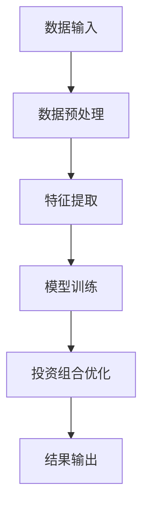
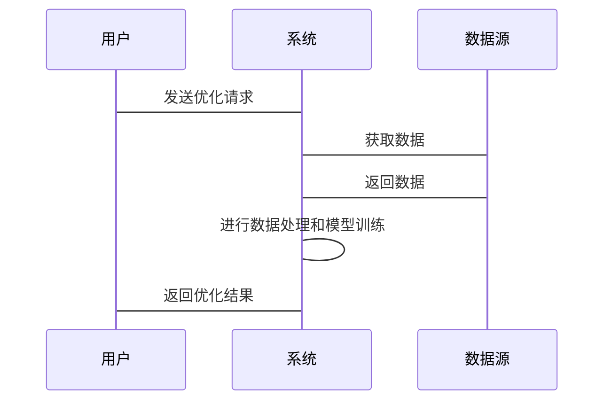

                 


# 《利用机器学习优化投资组合分配策略》

---

## 关键词：
- 机器学习
- 投资组合优化
- 算法原理
- 系统架构
- 项目实战

---

## 摘要：
本文深入探讨了机器学习在投资组合优化中的应用，结合数学模型、算法原理和系统架构，通过实际案例分析，展示了如何利用机器学习技术优化投资组合分配策略。文章从背景介绍到算法实现，再到系统设计，层层递进，为读者提供了一个全面的技术视角。

---

# 第一部分: 利用机器学习优化投资组合分配策略的背景与基础

## 第1章: 机器学习与投资组合优化概述

### 1.1 机器学习的基本概念

#### 1.1.1 机器学习的定义与核心概念
- 机器学习是一种人工智能技术，通过数据训练模型，使其能够从数据中学习并做出预测或决策。
- 核心概念包括：监督学习、无监督学习、半监督学习和强化学习。

#### 1.1.2 投资组合优化的基本原理
- 投资组合优化是指在给定风险和收益的目标下，选择最优的资产配置。
- 常见模型包括均值-方差模型和现代投资组合理论（MPT）。

#### 1.1.3 机器学习在投资组合优化中的应用前景
- 机器学习能够处理海量数据，发现传统方法难以捕捉的模式和趋势。
- 在风险预测、资产分配和市场预测等领域具有广泛应用潜力。

### 1.2 投资组合优化的数学模型

#### 1.2.1 均值-方差模型
- 目标函数：最小化投资组合的方差（风险）。
- 约束条件：资产权重之和为1。

#### 1.2.2 现代投资组合理论（MPT）
- 强调资产之间的协方差矩阵，优化风险-收益曲线。
- 通过分散投资降低风险。

#### 1.2.3 风险与收益的权衡
- 风险-收益曲线展示了不同风险水平下的最优收益。
- 通过调整模型参数，实现风险与收益的最佳平衡。

### 1.3 机器学习与投资组合优化的结合

#### 1.3.1 机器学习在金融中的应用领域
- 风险预测、资产定价、市场情绪分析等。

#### 1.3.2 投资组合优化中的机器学习方法
- 使用回归模型预测资产回报，利用聚类分析识别资产类别。

#### 1.3.3 机器学习的优势与局限性
- 优势：高效处理复杂数据，发现非线性关系。
- 局限性：模型解释性差，市场变化可能导致模型失效。

### 1.4 本章小结
- 介绍了机器学习和投资组合优化的基本概念。
- 阐述了机器学习在投资组合优化中的应用前景和挑战。

---

# 第二部分: 机器学习在投资组合优化中的核心算法与原理

## 第2章: 投资组合优化的数学模型与算法

### 2.1 投资组合优化的数学模型

#### 2.1.1 均值-方差模型的公式推导
- 目标函数：
  $$ \text{目标函数} = \min_{w} \frac{1}{2}w^T \Sigma w $$
- 约束条件：
  $$ \sum_{i=1}^n w_i = 1 $$

#### 2.1.2 现代投资组合理论（MPT）的实现
- 通过协方差矩阵计算资产之间的相关性，优化投资组合。

#### 2.1.3 风险-收益曲线的绘制
- 使用优化后的权重，绘制风险-收益曲线。

### 2.2 机器学习算法在投资组合优化中的应用

#### 2.2.1 支持向量机（SVM）在风险预测中的应用
- SVM用于分类和回归，预测资产违约风险。

#### 2.2.2 随机森林在资产分配中的应用
- 使用随机森林进行资产收益预测，优化投资组合。

#### 2.2.3 神经网络在投资组合优化中的应用
- 使用深度学习模型预测市场趋势，优化资产配置。

### 2.3 算法的比较与选择

#### 2.3.1 不同算法的优缺点对比
| 算法       | 优点                     | 缺点                     |
|------------|--------------------------|--------------------------|
| SVM        | 高维数据表现好           | 调参复杂                 |
| 随机森林   | 鲁棒性强，易于解释        | 对特征工程依赖较大       |
| 神经网络    | 高精度，适合复杂模式       | 训练时间长，解释性差       |

#### 2.3.2 算法选择的依据与策略
- 数据量和复杂度：数据量大时选择神经网络，数据量小时选择随机森林。
- 解释性需求：需要解释性时选择随机森林或SVM。

#### 2.3.3 算法性能的评估指标
- 准确率、召回率、F1值、均方误差（MSE）。

### 2.4 本章小结
- 介绍了几种常用的机器学习算法及其在投资组合优化中的应用。
- 分析了不同算法的优缺点和适用场景。

---

# 第三部分: 投资组合优化的系统架构与实现

## 第3章: 投资组合优化系统的架构设计

### 3.1 系统需求分析

#### 3.1.1 系统功能需求
- 数据采集、清洗、特征提取、模型训练、投资组合优化、结果展示。

#### 3.1.2 系统性能需求
- 高效处理大规模数据，快速响应用户请求。

#### 3.1.3 系统接口需求
- 提供API接口，支持与外部数据源和前端系统的交互。

### 3.2 系统架构设计

#### 3.2.1 分层架构设计
- 数据层：数据存储和管理。
- 业务逻辑层：模型训练和优化。
- 表现层：结果展示和用户交互。

#### 3.2.2 模块化设计
- 数据处理模块、特征提取模块、模型训练模块、优化模块、结果展示模块。

#### 3.2.3 系统架构图（Mermaid）



### 3.3 系统接口设计

#### 3.3.1 数据接口
- 输入接口：接收原始数据。
- 输出接口：返回优化后的投资组合权重。

#### 3.3.2 API设计
- GET /api/optimize：触发优化过程。
- POST /api/train：上传数据并训练模型。

### 3.4 系统交互流程（Mermaid）



### 3.5 本章小结
- 描述了投资组合优化系统的架构设计和接口设计。
- 使用Mermaid图展示了系统的整体架构和交互流程。

---

# 第四部分: 项目实战与高级主题

## 第4章: 投资组合优化的项目实战

### 4.1 项目环境安装

#### 4.1.1 安装Python和相关库
- Python：3.8+
- 库：pandas、numpy、scikit-learn、plotly。

### 4.2 系统核心实现源代码

#### 4.2.1 数据处理代码
```python
import pandas as pd
import numpy as np

# 数据加载
data = pd.read_csv('assets.csv')

# 数据清洗
data.dropna()
```

#### 4.2.2 特征提取代码
```python
# 特征提取
features = data[['return', 'volatility', 'market_cap']]
```

#### 4.2.3 模型训练代码
```python
from sklearn.ensemble import RandomForestRegressor

# 模型训练
model = RandomForestRegressor()
model.fit(features, data['target'])
```

#### 4.2.4 投资组合优化代码
```python
import numpy as np

# 定义目标函数
def portfolio_optimization(weights, returns):
    return np.mean(returns.dot(weights))  # 简单示例，实际应更复杂

# 使用遗传算法优化权重
from sklearn.model_selection import GridSearchCV
from sklearn.metrics import mean_squared_error

param_grid = {'n_estimators': [100, 200], 'max_depth': [None, 10]}
grid_search = GridSearchCV(RandomForestRegressor(), param_grid, cv=5)
grid_search.fit(features, data['target'])
best_model = grid_search.best_estimator_
```

#### 4.2.5 结果展示代码
```python
import plotly.express as px

# 绘制优化后的风险-收益曲线
optimal_risk = ...  # 计算得到的最优风险
optimal_return = ...  # 计算得到的最优收益

fig = px.scatter(data, x='volatility', y='return', color='cluster')
fig.show()
```

### 4.3 项目小结
- 展示了如何在实际项目中应用机器学习优化投资组合。
- 通过代码示例，详细讲解了数据处理、特征提取、模型训练和结果展示的全过程。

### 4.4 最佳实践 tips

#### 4.4.1 数据处理
- 确保数据的完整性和准确性，进行充分的特征工程。

#### 4.4.2 模型选择
- 根据数据量和复杂度选择合适的算法，进行交叉验证优化模型。

#### 4.4.3 系统设计
- 模块化设计便于扩展和维护，确保系统的高效性和可扩展性。

#### 4.4.4 结果分析
- 对优化结果进行深入分析，确保投资组合的风险和收益达到最佳平衡。

### 4.5 本章小结
- 通过实际案例展示了机器学习在投资组合优化中的应用。
- 提供了完整的代码实现和项目实战经验。

---

## 第5章: 高级主题与未来展望

### 5.1 鲁棒优化与多目标优化
- 鲁棒优化：考虑模型的稳健性，应对不确定性和噪声。
- 多目标优化：在多个目标之间进行权衡，如风险、收益和流动性。

### 5.2 机器学习与传统金融模型的结合
- 将机器学习与CAPM、APT等传统模型结合，提升预测精度和解释性。

### 5.3 未来研究方向
- 更复杂的模型：如深度学习、强化学习。
- 多模态数据：结合文本、图像等多源数据进行预测。
- 实时优化：开发实时响应的投资组合优化系统。

### 5.4 本章小结
- 展望了机器学习在投资组合优化中的未来发展方向。
- 强调了多模态数据和实时优化的重要性。

---

## 作者：AI天才研究院/AI Genius Institute & 禅与计算机程序设计艺术 /Zen And The Art of Computer Programming

---

以上是一个详细的技术博客文章框架，涵盖了从基础概念到实际应用的各个方面，结合了数学公式、图表和代码示例，确保内容的深度和可读性。

