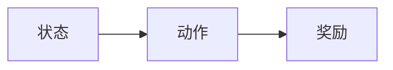
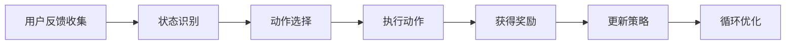
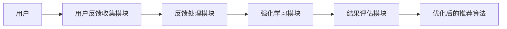
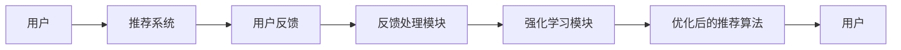

                 


# 利用用户反馈改进AI Agent的方法

## 关键词：用户反馈，AI Agent，强化学习，反馈处理，系统优化

## 摘要：本文详细探讨了如何利用用户反馈改进AI Agent的方法。首先介绍了用户反馈与AI Agent的基本概念及其关系，然后分析了用户反馈的收集与处理方法，接着深入讲解了基于用户反馈的强化学习算法及其实现，最后通过系统分析与架构设计、项目实战和最佳实践等方面，全面阐述了利用用户反馈改进AI Agent的具体步骤和应用案例。

---

# 第一部分：用户反馈与AI Agent概述

## 第1章：用户反馈的定义与分类

### 1.1 用户反馈的定义与分类

用户反馈是指用户在与AI Agent交互过程中提供的各种意见、评价或行为数据。这些反馈可以是显式的（如评分、点赞、点击）或隐式的（如停留时间、浏览路径）。用户反馈是改进AI Agent性能的重要依据，能够帮助AI Agent更好地理解用户需求、优化行为策略并提升用户体验。

#### 1.1.1 用户反馈的定义

用户反馈是指用户在与AI Agent交互过程中提供的各种意见、评价或行为数据。这些反馈可以是显式的（如评分、点赞、点击）或隐式的（如停留时间、浏览路径）。用户反馈是改进AI Agent性能的重要依据，能够帮助AI Agent更好地理解用户需求、优化行为策略并提升用户体验。

#### 1.1.2 用户反馈的分类与特点

用户反馈可以根据其形式、来源和用途进行分类：

1. **显式反馈**：用户主动提供的直接评价或意见，如评分（1-5分）、点赞、打分等。
2. **隐式反馈**：通过用户的间接行为推断出的偏好或需求，如停留时间、点击频率、浏览路径等。
3. **实时反馈**：在用户与AI Agent交互过程中实时收集的反馈。
4. **延迟反馈**：在用户完成某项任务后收集的反馈。

### 1.2 AI Agent的基本概念

AI Agent（人工智能代理）是一种能够感知环境、自主决策并执行任务的智能实体。AI Agent可以通过传感器获取信息，通过推理和学习做出决策，并通过执行器与环境交互。

#### 1.2.1 AI Agent的定义

AI Agent是指能够感知环境、自主决策并执行任务的智能实体。AI Agent可以通过传感器获取信息，通过推理和学习做出决策，并通过执行器与环境交互。

#### 1.2.2 AI Agent的核心功能与特点

AI Agent的核心功能包括感知、决策、执行和学习。其特点包括：

1. **自主性**：能够在没有外部干预的情况下自主运行。
2. **反应性**：能够实时感知环境并做出反应。
3. **学习能力**：能够通过经验或反馈不断优化自身行为。
4. **适应性**：能够适应不同的环境和任务需求。

### 1.3 用户反馈与AI Agent的关系

用户反馈与AI Agent的关系是相互依存的。用户通过反馈表达对AI Agent行为的满意度或建议，而AI Agent则通过反馈不断优化自身的行为策略，以更好地满足用户需求。

#### 1.3.1 用户反馈如何影响AI Agent的行为

用户反馈可以作为AI Agent优化行为的依据。例如，如果用户对某个推荐结果不满意，AI Agent可以根据反馈调整推荐算法，以提高推荐的相关性。

#### 1.3.2 用户反馈在AI Agent优化中的作用

用户反馈在AI Agent优化中的作用包括：

1. **指导优化方向**：用户反馈可以指导AI Agent优化的目标，例如提高推荐准确性或减少错误率。
2. **评估优化效果**：通过用户反馈，可以评估AI Agent优化的效果，例如用户满意度的提升。

## 第2章：用户反馈的收集与处理方法

### 2.1 用户反馈的收集渠道

用户反馈可以通过多种渠道进行收集，具体选择哪种渠道取决于应用场景和用户需求。

#### 2.1.1 常见的用户反馈收集方式

1. **在线表单**：通过网页或移动应用中的表单收集用户反馈。
2. **社交媒体**：通过社交媒体平台收集用户的评价或评论。
3. **客户支持**：通过客服渠道收集用户的反馈。
4. **数据分析**：通过分析用户的日志数据或行为数据，间接获取反馈信息。

#### 2.1.2 不同场景下的用户反馈收集策略

在不同场景下，用户反馈的收集策略有所不同。例如，在电子商务场景中，可以通过用户评分和评论收集反馈；在教育场景中，可以通过学生的学习数据和教师的评价收集反馈。

#### 2.1.3 用户反馈收集的挑战与解决方案

用户反馈收集的挑战包括：

1. **反馈量不足**：如何在大规模用户中收集足够的反馈。
2. **反馈质量低**：如何确保反馈的准确性和有用性。

解决方案包括：

1. **激励机制**：通过奖励或优惠券等方式激励用户提供反馈。
2. **自动化工具**：利用自然语言处理技术自动提取反馈信息。

### 2.2 用户反馈的预处理与分析

用户反馈的预处理与分析是利用用户反馈改进AI Agent的关键步骤。

#### 2.2.1 用户反馈的清洗与标准化

用户反馈的清洗与标准化包括：

1. **去噪**：去除无关信息或噪声。
2. **标准化**：将反馈数据转化为统一的形式，便于后续分析。

#### 2.2.2 用户反馈的情感分析与分类

情感分析是将用户反馈分为正面、负面或中性。分类是将反馈分为不同的类别，例如推荐、功能、界面等。

#### 2.2.3 用户反馈的特征提取与表示

特征提取与表示是将用户反馈转换为计算机可以处理的形式，例如文本表示为向量或词袋模型。

### 2.3 用户反馈的存储与管理

用户反馈的存储与管理是确保反馈能够被有效利用的重要环节。

#### 2.3.1 用户反馈数据库的设计

用户反馈数据库的设计需要考虑数据的结构和存储效率。例如，可以设计一个包含用户ID、反馈内容、反馈时间等字段的数据库。

#### 2.3.2 用户反馈的存储结构与优化

存储结构优化包括：

1. **索引优化**：通过索引提高查询效率。
2. **压缩优化**：通过压缩技术减少存储空间占用。

#### 2.3.3 用户反馈的版本控制与更新

版本控制与更新包括：

1. **版本控制**：记录反馈的版本，确保历史数据的可追溯性。
2. **实时更新**：及时更新反馈数据，确保AI Agent能够基于最新的反馈进行优化。

---

# 第二部分：基于用户反馈改进AI Agent的核心算法与实现

## 第3章：用户反馈驱动的强化学习算法

### 3.1 强化学习基础

强化学习是一种通过试错方法使智能体在环境中通过不断试错来学习策略的方法。

#### 3.1.1 强化学习的基本概念

强化学习的基本概念包括：

1. **状态（State）**：环境的当前情况。
2. **动作（Action）**：智能体在某个状态下做出的行为。
3. **奖励（Reward）**：智能体做出动作后获得的反馈，用于评估动作的好坏。
4. **策略（Policy）**：智能体选择动作的概率分布。

#### 3.1.2 状态、动作、奖励的定义与关系

状态、动作、奖励的关系可以用图1表示：



### 3.2 用户反馈在强化学习中的应用

用户反馈可以作为强化学习中的奖励信号，指导智能体优化其行为策略。

#### 3.2.1 基于用户反馈的奖励函数设计

奖励函数设计是强化学习的核心，用户反馈可以作为奖励函数的重要组成部分。例如，当用户对推荐结果满意时，奖励函数会给予正向奖励。

#### 3.2.2 用户反馈驱动的策略优化

策略优化是通过用户反馈不断调整策略，以最大化累积奖励。例如，可以使用Q-Learning算法，基于用户反馈更新Q值表。

#### 3.2.3 探索与利用策略

探索与利用策略是平衡探索新动作和利用已知好动作的策略。例如，可以使用ε-greedy策略，在一定概率下选择探索动作，其余情况下选择利用动作。

### 3.3 基于用户反馈的强化学习实现

基于用户反馈的强化学习实现需要结合用户反馈的特点，设计合适的算法和策略。

#### 3.3.1 算法流程图

基于用户反馈的强化学习流程图可以用图2表示：



#### 3.3.2 Python代码实现

以下是基于用户反馈的强化学习算法的Python代码示例：

```python
import numpy as np

class Agent:
    def __init__(self, state_space, action_space):
        self.state_space = state_space
        self.action_space = action_space
        self.Q = np.zeros((state_space, action_space))

    def take_action(self, state, epsilon=0.1):
        if np.random.random() < epsilon:
            action = np.random.randint(self.action_space)
        else:
            action = np.argmax(self.Q[state])
        return action

    def update_Q(self, state, action, reward):
        self.Q[state, action] = self.Q[state, action] * 0.9 + reward
```

### 3.4 数学模型与公式

强化学习的核心是通过不断试错更新Q值表，以最大化累积奖励。Q值表的更新公式为：

$$ Q(s, a) = Q(s, a) \times \alpha + \alpha \times r $$

其中，α是学习率，r是奖励值。

---

## 第4章：系统分析与架构设计

### 4.1 项目场景介绍

在本项目中，我们将设计一个基于用户反馈的AI Agent优化系统，用于改进推荐算法。

### 4.2 系统功能设计

系统功能设计包括：

1. **用户反馈收集模块**：收集用户的反馈数据。
2. **反馈处理模块**：对反馈数据进行清洗、分析和分类。
3. **强化学习模块**：基于反馈数据优化推荐算法。
4. **结果评估模块**：评估优化后的算法效果。

### 4.3 系统架构设计

系统架构设计可以用图3表示：



### 4.4 系统接口设计

系统接口设计包括：

1. **用户反馈接口**：用于收集用户的反馈数据。
2. **算法优化接口**：用于与强化学习模块交互，更新策略。
3. **结果展示接口**：用于展示优化后的推荐结果。

### 4.5 系统交互设计

系统交互可以用图4表示：



---

## 第5章：项目实战

### 5.1 环境安装与配置

安装必要的Python库，例如numpy、pandas、scikit-learn等。

### 5.2 核心代码实现

以下是基于用户反馈的强化学习算法的核心代码：

```python
import numpy as np

class Agent:
    def __init__(self, state_space, action_space):
        self.state_space = state_space
        self.action_space = action_space
        self.Q = np.zeros((state_space, action_space))

    def take_action(self, state, epsilon=0.1):
        if np.random.random() < epsilon:
            action = np.random.randint(self.action_space)
        else:
            action = np.argmax(self.Q[state])
        return action

    def update_Q(self, state, action, reward):
        self.Q[state, action] = self.Q[state, action] * 0.9 + reward
```

### 5.3 案例分析与结果解读

通过具体案例分析，展示基于用户反馈的强化学习算法在改进推荐系统中的应用效果。

---

## 第6章：总结与展望

### 6.1 总结

本文详细探讨了利用用户反馈改进AI Agent的方法，涵盖了用户反馈的收集与处理、基于用户反馈的强化学习算法以及系统设计与实现等内容。

### 6.2 展望

未来的研究方向包括：

1. **多模态反馈处理**：结合文本、语音等多种形式的用户反馈。
2. **实时反馈优化**：实现更快速的反馈处理和策略更新。
3. **个性化反馈机制**：根据用户个性化需求设计反馈处理策略。

---

# 作者：AI天才研究院/AI Genius Institute & 禅与计算机程序设计艺术 /Zen And The Art of Computer Programming

