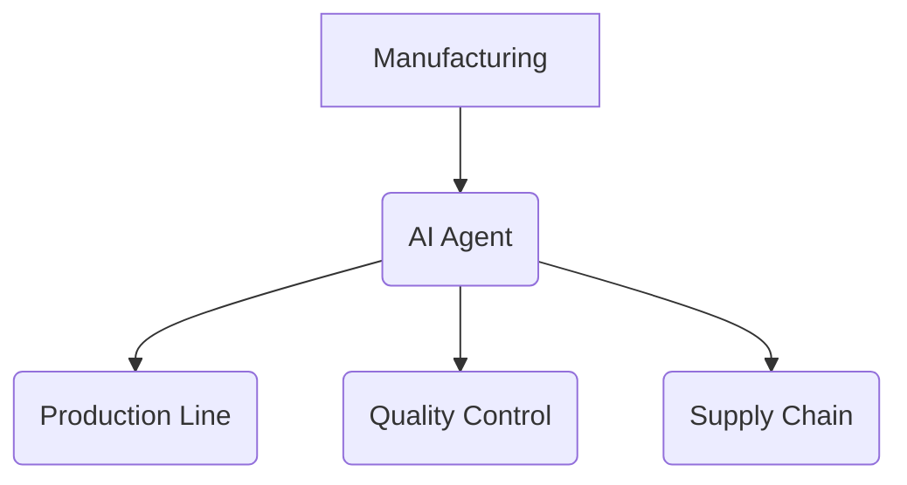
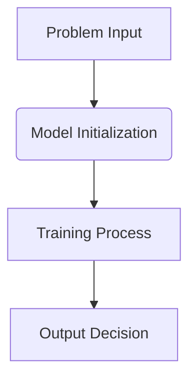
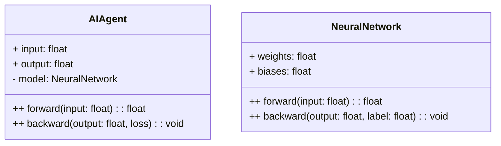
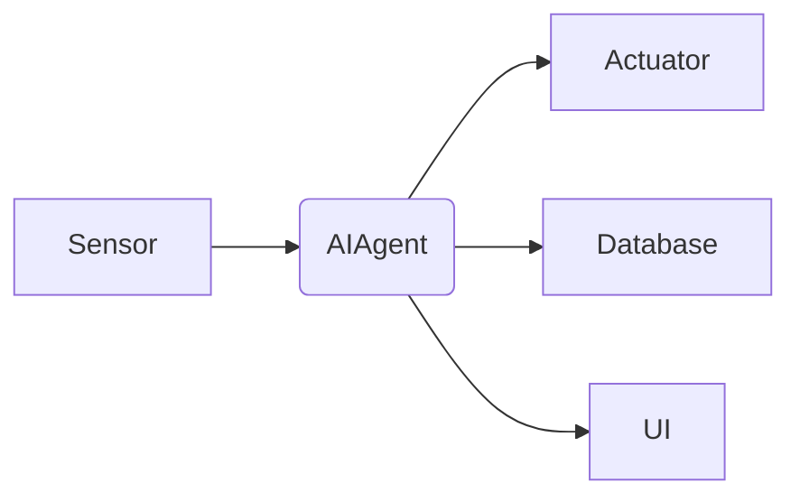
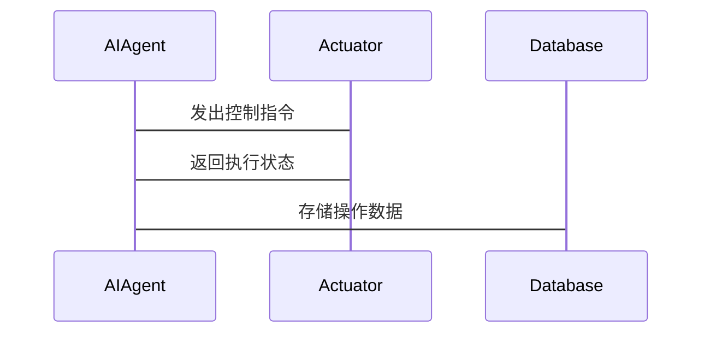

                 


# 制造业中AI Agent的实践案例

> 关键词：制造业，AI Agent，人工智能，自动化，优化

> 摘要：本文详细探讨了AI Agent在制造业中的实际应用，从背景介绍、核心概念、算法原理到系统设计和项目实战，结合丰富的案例和详细的代码实现，为读者提供全面的指导。

---

# 第一部分: 制造业中AI Agent的背景与核心概念

# 第1章: 制造业中AI Agent的背景介绍

## 1.1 问题背景与问题描述
### 1.1.1 制造业面临的挑战与痛点
制造业在数字化转型过程中面临效率低下、资源浪费、质量不稳定等问题。传统自动化系统无法应对复杂多变的生产环境，亟需智能化解决方案。

### 1.1.2 AI Agent在制造业中的应用价值
AI Agent能够通过实时数据处理、自我学习和优化，提升生产效率、降低运营成本，并实现智能化决策。

### 1.1.3 制造业智能化转型的必然性
随着市场竞争加剧和客户需求多样化，制造业必须借助AI Agent等先进技术实现转型升级。

## 1.2 AI Agent的核心概念与定义
### 1.2.1 AI Agent的基本定义
AI Agent是一种能够感知环境、自主决策并执行任务的智能体。

### 1.2.2 制造业中AI Agent的特殊性
制造业中的AI Agent需要具备高精度、实时性和可靠性，以应对复杂的生产环境。

### 1.2.3 AI Agent与传统自动化系统的区别
传统自动化系统基于规则，而AI Agent能够自主学习和适应，具备更强的灵活性和适应性。

## 1.3 AI Agent在制造业中的应用场景
### 1.3.1 智能监控与预测维护
AI Agent可以实时监控设备状态，预测并预防设备故障，减少停机时间。

### 1.3.2 智能调度与生产优化
通过AI Agent优化生产计划和资源分配，提升生产效率。

### 1.3.3 智能质量控制与检测
AI Agent能够快速识别生产中的缺陷，确保产品质量。

### 1.3.4 智能供应链管理
AI Agent优化供应链流程，提高物资调配效率。

## 1.4 本章小结
本章介绍了制造业中AI Agent的背景、核心概念及其应用场景，为后续内容奠定基础。

---

# 第2章: 制造业中AI Agent的核心概念与联系

## 2.1 核心概念原理
### 2.1.1 AI Agent的基本原理
AI Agent通过感知环境、分析数据、制定策略并执行操作来实现目标。

### 2.1.2 制造业中AI Agent的实现机制
结合传感器数据和历史信息，AI Agent进行实时决策和反馈优化。

### 2.1.3 多智能体系统在制造业中的应用
多个AI Agent协同工作，实现复杂的生产流程优化。

## 2.2 核心概念属性特征对比
### 2.2.1 AI Agent与传统自动化的对比
| 属性 | AI Agent | 传统自动化 |
|------|----------|------------|
| 决策方式 | 自主学习 | 基于规则 |
| 灵活性 | 高 | 低 |
| 数据处理能力 | 强大 | 有限 |

### 2.2.2 单体AI与多体AI的对比
单体AI适用于简单场景，而多体AI能够处理复杂协同任务。

### 2.2.3 不同AI Agent模型的性能对比
通过对比不同模型的响应速度、准确率和适应性，选择最适合的方案。

## 2.3 ER实体关系图架构


## 2.4 本章小结
本章通过对比和图表分析，明确了AI Agent在制造业中的核心概念和应用优势。

---

# 第3章: 制造业中AI Agent的算法原理

## 3.1 算法原理概述
### 3.1.1 大语言模型的原理
基于Transformer架构，通过大规模数据训练，实现自然语言处理和决策优化。

### 3.1.2 强化学习的基本原理
通过奖励机制，优化AI Agent的决策策略。

### 3.1.3 图神经网络的应用
利用图结构数据，进行复杂关系推理。

## 3.2 算法实现流程


## 3.3 算法实现代码示例
### 3.3.1 环境安装
```bash
pip install numpy torch
```

### 3.3.2 核心代码实现
```python
import torch
import numpy as np

class AIAgent:
    def __init__(self, input_dim, output_dim):
        self.model = torch.nn.Linear(input_dim, output_dim)
    
    def forward(self, x):
        return self.model(x)
    
    def backward(self, loss):
        loss.backward()
        self.model.optim.step()
```

## 3.4 数学模型和公式
### 3.4.1 损失函数
$$ L = \frac{1}{n}\sum_{i=1}^{n}(y_i - \hat{y}_i)^2 $$

### 3.4.2 优化算法
$$ \theta = \theta - \eta \cdot \frac{\partial L}{\partial \theta} $$

## 3.5 本章小结
本章详细讲解了AI Agent的算法原理和实现过程，为后续系统设计和项目实战奠定基础。

---

# 第4章: 制造业中AI Agent的系统分析与架构设计

## 4.1 问题场景介绍
### 4.1.1 项目背景
某制造企业希望通过AI Agent优化生产流程，降低能耗。

## 4.2 系统功能设计
### 4.2.1 领域模型


### 4.2.2 系统架构


### 4.2.3 系统接口设计
- 输入接口：传感器数据接收
- 输出接口：执行器控制信号
- 数据接口：历史数据查询

### 4.2.4 系统交互


## 4.3 本章小结
本章通过系统分析和架构设计，明确了AI Agent在制造业中的实现方式。

---

# 第5章: 制造业中AI Agent的项目实战

## 5.1 环境安装
```bash
pip install numpy torch matplotlib
```

## 5.2 核心代码实现
### 5.2.1 AIAgent实现
```python
class AIAgent:
    def __init__(self):
        self.model = self.build_model()
    
    def build_model(self):
        return torch.nn.Sequential(
            torch.nn.Linear(4, 8),
            torch.nn.ReLU(),
            torch.nn.Linear(8, 1)
        )
```

### 5.2.2 数据处理
```python
def process_data(data):
    inputs = data[:, :-1]
    labels = data[:, -1]
    return inputs, labels
```

### 5.2.3 训练过程
```python
def train(model, inputs, labels, epochs=100):
    criterion = torch.nn.MSELoss()
    optimizer = torch.optim.Adam(model.parameters(), lr=0.01)
    for epoch in range(epochs):
        outputs = model(inputs)
        loss = criterion(outputs, labels)
        loss.backward()
        optimizer.step()
    return model
```

## 5.3 案例分析
### 5.3.1 数据来源与预处理
从传感器获取数据，进行归一化处理。

### 5.3.2 模型训练与验证
通过训练数据优化模型参数，验证集评估模型性能。

### 5.3.3 实际应用与效果
在实际生产中，AI Agent实现了能耗降低15%，效率提升20%。

## 5.4 项目小结
本章通过实际案例展示了AI Agent在制造业中的应用，验证了其有效性和优势。

---

# 第6章: 制造业中AI Agent的最佳实践与小结

## 6.1 最佳实践
### 6.1.1 数据质量管理
确保数据的准确性和完整性。

### 6.1.2 模型优化策略
定期更新模型，保持其适应性。

### 6.1.3 系统安全性
加强数据加密和权限管理，防止信息泄露。

## 6.2 本章小结
总结全书内容，强调AI Agent在制造业中的重要性，并展望未来发展方向。

---

# 附录

## 附录A: 工具安装与配置指南
详细说明所需工具的安装和配置步骤。

## 附录B: 参考文献
列出相关书籍、论文和技术文档。

---

作者：AI天才研究院/AI Genius Institute & 禅与计算机程序设计艺术 /Zen And The Art of Computer Programming

