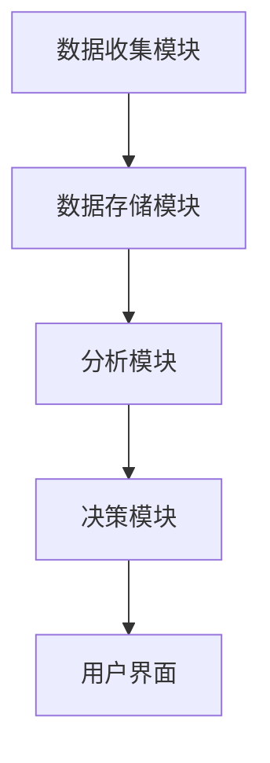

                 


# 加拿大股市估值:北美自由贸易区的投资机会

## 关键词：加拿大股市、估值、NAFTA、投资机会、股票分析、风险管理、技术分析

## 摘要：本文分析加拿大股市的投资机会，探讨NAFTA对股市的影响，介绍股票估值的核心方法和投资策略，结合实际案例，指导读者进行数据分析和系统构建，帮助投资者在北美自由贸易区中捕捉投资机会，实现稳健收益。

---

## 目录大纲：

1. **加拿大股市估值概述**
2. **股票估值基础**
3. **投资策略与组合管理**
4. **数据分析与预测**
5. **案例分析**
6. **系统架构设计**
7. **项目实战**
8. **最佳实践与注意事项**
9. **总结与展望**

---

## 第一部分：加拿大股市估值概述

### 第1章：加拿大股市的基本情况

#### 1.1 加拿大股市的基本介绍
- **1.1.1 加拿大股市的主要指数**
  - 加拿大主要的股市指数包括多伦多证券交易所（TSX）指数和S&P/TSX指数，涵盖能源、金融、科技等多个行业。
- **1.1.2 加拿大股市的行业分布**
  - 重点行业包括能源（如石油和天然气）、金融、科技、消费等，尤其是能源行业对加拿大经济影响显著。
- **1.1.3 加拿大股市的历史表现**
  - 近年来，加拿大股市表现稳健，尤其在能源和金融行业有较大涨幅，但波动性较大。

#### 1.2 NAFTA对加拿大股市的影响
- **1.2.1 NAFTA对贸易的影响**
  - NAFTA促进了美、加、墨三国的自由贸易，增加了贸易量，促进了制造业和能源行业的增长。
- **1.2.2 NAFTA对投资的影响**
  - NAFTA降低了贸易壁垒，吸引了更多外国投资，尤其是美国投资者对加拿大市场的投资增加。
- **1.2.3 NAFTA对股市的具体表现**
  - NAFTA的签订和后续协议的更新直接影响了相关行业的股票价格，尤其是能源和制造业。

#### 1.3 加拿大股市的投资机会与挑战
- **1.3.1 当前的投资机会**
  - 技术创新和绿色能源投资成为热点，尤其是科技和可再生能源行业。
- **1.3.2 投资中的主要挑战**
  - 汇率波动、国际贸易政策变化、行业周期性波动等风险。
- **1.3.3 如何应对挑战**
  - 分散投资、长期持有、定期调整投资组合，关注宏观经济指标。

---

## 第二部分：股票估值基础

### 第2章：股票估值的基本方法

#### 2.1 常用的估值指标
- **2.1.1 市盈率（P/E）**
  - 计算公式：P/E = 股价 / 每股净利润
  - 示例：某公司股价为50元，每股净利润为5元，P/E = 10，表示合理市盈率。
- **2.1.2 市净率（P/B）**
  - 计算公式：P/B = 股价 / 每股净资产
  - 示例：某公司股价为40元，每股净资产为20元，P/B = 2，表示合理市净率。
- **2.1.3 股息率**
  - 计算公式：股息率 = 每股股息 / 股价 × 100%
  - 示例：某公司股息为2元，股价为50元，股息率 = 4%，表示收益稳定。

#### 2.2 估值模型
- **2.2.1 DCF模型**
  - 基本原理：通过现金流折现计算企业价值。
  - 计算步骤：
    1. 预测未来现金流。
    2. 计算终值。
    3. 折现计算现值。
    4. 求和得到企业价值。
- **2.2.2 相对估值法**
  - 与行业平均值比较，确定合理估值。
  - 示例：行业平均P/E为15，目标公司P/E为12，估值可能被低估。

#### 2.3 加拿大市场的应用
- 结合加拿大市场的特点，如能源行业权重较大，调整估值模型的应用。

---

## 第三部分：投资策略与组合管理

### 第3章：投资策略与组合管理

#### 3.1 投资策略
- **3.1.1 价值投资**
  - 寻找被市场低估的股票，长期持有。
  - 适合低波动市场，风险较低。
- **3.1.2 成长投资**
  - 投资于高增长潜力的公司，注重高市盈率。
  - 适合高增长行业，风险较高。

#### 3.2 投资组合管理
- **3.2.1 分散投资**
  - 将资金分配到不同行业和资产类别，降低风险。
- **3.2.2 定期调整**
  - 根据市场变化和个人财务状况，调整投资比例。
- **3.2.3 风险管理**
  - 设置止损点，避免重大损失。
  - 使用期权和期货对冲风险。

---

## 第四部分：数据分析与预测

### 第4章：数据分析与预测

#### 4.1 数据收集与清洗
- **4.1.1 数据来源**
  - 从TSX指数获取历史数据，包括开盘价、收盘价、成交量等。
- **4.1.2 数据清洗**
  - 处理缺失值、异常值，确保数据准确。

#### 4.2 数据分析与建模
- **4.2.1 使用Python进行数据分析**
  ```python
  import pandas as pd
  data = pd.read_csv('canada_stock.csv')
  data.head()
  ```

- **4.2.2 时间序列分析**
  - 使用ARIMA模型预测未来股价。
  - 示例代码：
    ```python
    from statsmodels.tsa.arima_model import ARIMA
    model = ARIMA(data['close'], order=(5,1,0))
    model_fit = model.fit()
    ```

#### 4.3 数据可视化
- 使用matplotlib绘制股价趋势图和K线图，帮助识别趋势和波动。

---

## 第五部分：案例分析

### 第5章：案例分析

#### 5.1 案例背景
- 某能源公司，股价波动较大，市盈率和市净率均低于行业平均水平。

#### 5.2 数据分析
- 使用DCF模型评估公司价值，计算目标股价，与当前股价对比。

#### 5.3 投资决策
- 建议买入，长期持有，关注行业动态和宏观经济变化。

---

## 第六部分：系统架构设计

### 第6章：系统架构设计

#### 6.1 系统功能设计
- **6.1.1 数据收集模块**
  - 定时抓取TSX指数数据。
- **6.1.2 分析模块**
  - 执行估值分析和预测模型。
- **6.1.3 决策模块**
  - 提供投资建议和风险提示。

#### 6.2 系统架构图


#### 6.3 接口设计与交互
- 使用REST API实现模块间通信，确保数据流畅传输。

---

## 第七部分：项目实战

### 第7章：项目实战

#### 7.1 工具安装与配置
- **7.1.1 安装Python和Pandas**
  - 使用pip安装相关库。
- **7.1.2 数据源配置**
  - 下载TSX指数数据，保存为CSV文件。

#### 7.2 核心代码实现
- **7.2.1 数据清洗代码**
  ```python
  import pandas as pd
  data = pd.read_csv('canada_stock.csv')
  data.dropna(inplace=True)
  ```

- **7.2.2 建模代码**
  ```python
  from sklearn.linear_model import LinearRegression
  model = LinearRegression()
  model.fit(data[['open', 'high']], data['close'])
  ```

#### 7.3 案例分析
- 选择某科技公司，分析其估值和投资价值，给出具体操作建议。

---

## 第八部分：最佳实践与注意事项

### 第8章：最佳实践与注意事项

#### 8.1 最佳实践
- 定期复盘，持续学习市场动态，分散投资以降低风险。

#### 8.2 注意事项
- 避免情绪化投资，理性分析市场波动，关注宏观经济政策变化。

---

## 第九部分：总结与展望

### 第9章：总结与展望

- **总结**
  - 本文详细分析了加拿大股市的投资机会，介绍了多种估值方法和投资策略，结合实际案例和系统设计，帮助投资者在北美自由贸易区中实现稳健收益。
- **展望**
  - 随着科技和绿色能源的发展，加拿大股市将提供更多投资机会，投资者需持续关注市场动态，优化投资组合。

---

## 作者：AI天才研究院/AI Genius Institute & 禅与计算机程序设计艺术 /Zen And The Art of Computer Programming

---

**全文结束**

