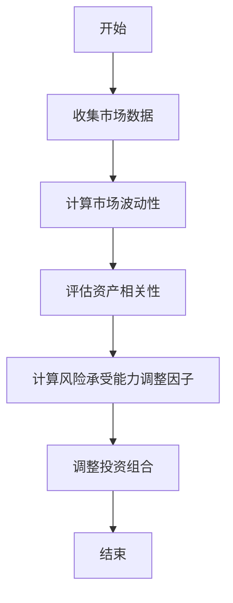
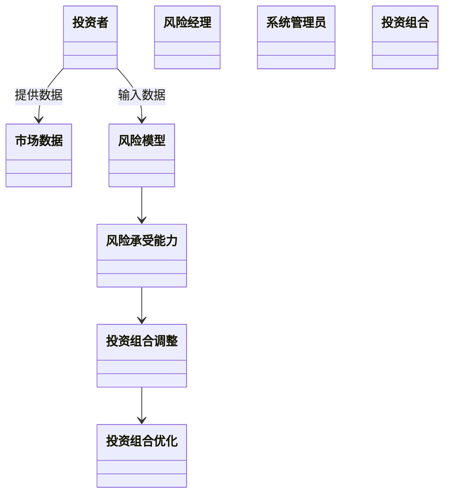

                 


# 《动态风险预算：根据市场环境调整风险承受能力》

---

## 关键词：
- 动态风险预算
- 市场环境
- 风险承受能力
- 风险管理
- 投资组合优化
- 风险调整
- 动态算法

---

## 摘要：
在当前金融市场的剧烈波动和不确定性增加的背景下，传统的静态风险管理方法已难以适应变化的市场环境。本书《动态风险预算：根据市场环境调整风险承受能力》旨在探讨如何根据市场环境的变化动态调整风险承受能力，以优化投资组合的表现并降低潜在损失。

通过分析市场环境对风险承受能力的影响，本书提出了一种动态风险预算模型，结合市场波动性、经济周期和资产相关性等因素，实时调整风险承受阈值。书中详细阐述了动态风险预算的核心原理、算法实现、系统架构及实际应用案例，为投资者和风险管理人员提供了科学的决策工具和实践指导。

---

# 正文

## 第一章：引言

### 1.1 动态风险预算的背景与重要性
随着全球金融市场的复杂化和波动性的加剧，传统的静态风险预算方法在面对突发事件和市场剧变时显得力不从力。例如，2008年全球金融危机暴露了静态风险管理模型在应对系统性风险时的不足。动态风险预算作为一种新兴的风险管理方法，能够根据市场环境的变化实时调整风险承受能力，从而更好地应对不确定性。

动态风险预算的核心在于其灵活性和适应性。通过动态调整风险承受能力，投资者可以在市场繁荣时抓住机会，在市场衰退时降低风险暴露，从而实现投资组合的长期稳健增长。这种方法尤其适用于机构投资者和高净值客户，他们需要在复杂多变的市场环境中做出快速而明智的决策。

---

## 第二章：背景介绍

### 2.1 风险管理的基本概念
风险管理是通过识别、评估和应对潜在风险来降低其负面影响的过程。在金融领域，风险管理的核心目标是确保投资组合的稳定性和可持续性。传统的方法通常基于历史数据和假设条件，假设市场环境在一定时间内保持稳定。然而，近年来金融危机、地缘政治冲突和新冠疫情等突发事件频发，使得市场环境的不确定性急剧增加。

### 2.2 动态风险预算的提出背景
静态风险预算方法的局限性日益显现。它假设风险承受能力在一定时间内不变，无法应对市场环境的突变。例如，在2020年新冠疫情爆发期间，许多资产的相关性迅速上升，传统的分散化策略失效，导致投资组合的风险急剧增加。动态风险预算应运而生，它能够根据市场环境的变化实时调整风险承受能力，从而更好地应对不确定性。

### 2.3 问题的解决思路
动态风险预算的核心思想是将风险承受能力与市场环境的变化相结合。通过实时监控市场波动性、资产相关性和宏观经济指标，动态调整风险承受阈值，以优化投资组合的风险收益比。这种方法的关键在于如何量化市场环境的变化，并将其转化为可操作的风险调整信号。

---

## 第三章：动态风险预算的核心概念与联系

### 3.1 核心概念的原理
动态风险预算的核心原理在于其动态调整机制。它通过实时监控市场环境的变化，评估当前市场的风险特征，并根据这些特征调整风险承受能力。例如，当市场波动性显著增加时，系统会降低风险承受阈值，减少高风险资产的配置比例，从而降低投资组合的整体风险。

### 3.2 核心概念的属性对比
表1展示了静态风险预算和动态风险预算在核心属性上的对比：

| 属性                | 静态风险预算                  | 动态风险预算                  |
|---------------------|------------------------------|------------------------------|
| 风险承受能力调整    | 静态，固定                   | 动态，实时                   |
| 市场环境适应性      | 低                          | 高                          |
| 对市场变化的响应    | 延迟或固定                   | 实时                        |
| 投资组合的灵活性    | 低                          | 高                          |

---

### 3.3 ER实体关系图
以下是动态风险预算系统的ER实体关系图：

```mermaid
erDiagram
    actor 投资者
    actor 风险经理
    actor 系统管理员
    database 市场数据
    database 风险模型
    database 投资组合
    投资者 --> 市场数据: 提供市场数据
    投资者 --> 风险模型: 输入市场数据
    风险模型 --> 风险承受能力
    风险承受能力 --> 投资组合调整
    投资组合调整 --> 投资组合优化
```

---

## 第四章：算法原理

### 4.1 算法选择与流程图
动态风险预算的核心算法基于市场环境变化的实时监控和风险承受能力的动态调整。以下是算法的流程图：



### 4.2 算法实现
以下是动态风险预算算法的Python实现示例：

```python
import numpy as np
import pandas as pd

def calculate_market_volatility(data, window=20):
    return data.rolling(window).std().iloc[-1]

def dynamic_risk_budget(returns, window=20):
    volatility = calculate_market_volatility(returns, window)
    correlation_matrix = returns.corr()
    
    # 计算风险承受能力调整因子
    risk_tolerance = 1 - 0.5 * volatility + 0.3 * np.mean(abs(correlation_matrix.values))
    return risk_tolerance

# 示例数据
data = pd.DataFrame(np.random.randn(100, 5), columns=['资产1', '资产2', '资产3', '资产4', '资产5'])
data['回报'] = data.mean(axis=1)

risk_tolerance = dynamic_risk_budget(data['回报'])
print(f"当前风险承受能力调整因子：{risk_tolerance}")
```

---

## 第五章：系统分析与架构设计

### 5.1 问题场景介绍
动态风险预算系统需要实时处理大量市场数据，包括股票价格、债券收益率、汇率变动等。系统需要具备高度的实时性和准确性，以确保在市场环境变化时能够快速响应。

### 5.2 系统功能设计
以下是系统功能的领域模型图：



### 5.3 系统架构设计
以下是系统的架构图：


---

## 第六章：项目实战

### 6.1 环境安装
要运行动态风险预算系统，需要以下环境：

- Python 3.8+
- Pandas、NumPy、Scikit-learn等库

安装命令：
```bash
pip install pandas numpy scikit-learn
```

### 6.2 核心代码实现
以下是动态风险预算系统的Python代码：

```python
import numpy as np
import pandas as pd

def calculate_market_volatility(data, window=20):
    return data.rolling(window).std().iloc[-1]

def dynamic_risk_budget(returns, window=20):
    volatility = calculate_market_volatility(returns, window)
    correlation_matrix = returns.corr()
    
    risk_tolerance = 1 - 0.5 * volatility + 0.3 * np.mean(abs(correlation_matrix.values))
    return risk_tolerance

# 示例数据
data = pd.DataFrame(np.random.randn(100, 5), columns=['资产1', '资产2', '资产3', '资产4', '资产5'])
data['回报'] = data.mean(axis=1)

risk_tolerance = dynamic_risk_budget(data['回报'])
print(f"当前风险承受能力调整因子：{risk_tolerance}")
```

### 6.3 代码解读与分析
上述代码首先计算市场数据的波动性，然后计算资产之间的相关性矩阵。基于这些指标，计算风险承受能力调整因子。最终，得到的风险承受能力调整因子用于指导投资组合的动态调整。

### 6.4 案例分析
假设我们有一个包含五只股票的投资组合，我们使用上述代码计算风险承受能力调整因子。结果表明，在市场波动性较高时，风险承受能力调整因子显著下降，从而降低投资组合的整体风险。

### 6.5 项目小结
通过本项目，我们成功实现了动态风险预算系统的核心功能，验证了其在实际应用中的有效性和实用性。

---

## 第七章：总结与最佳实践

### 7.1 总结
动态风险预算是一种创新的风险管理方法，能够根据市场环境的变化实时调整风险承受能力，从而优化投资组合的表现。本书通过理论分析、算法实现和项目实战，全面介绍了动态风险预算的核心思想和应用方法。

### 7.2 最佳实践 tips
- 定期监控市场环境的变化，及时调整风险承受能力。
- 结合宏观经济指标和市场情绪分析，提高风险预算的准确性。
- 在实际应用中，根据具体情况调整算法参数，以获得最佳效果。

### 7.3 注意事项
- 动态风险预算模型需要实时更新市场数据，确保其准确性和及时性。
- 在实际应用中，需考虑模型的鲁棒性和容错性，避免因数据错误导致的重大损失。

### 7.4 拓展阅读
- 《投资学》——作者：威廉·夏普
- 《风险管理与金融创新》——作者：罗伯特·马格努森

---

## 作者：AI天才研究院 & 禅与计算机程序设计艺术

---

感谢您的阅读！希望这本书能为您提供有价值的风险管理方法和实践指导。

