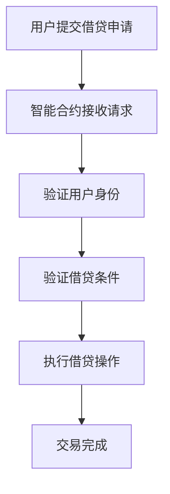
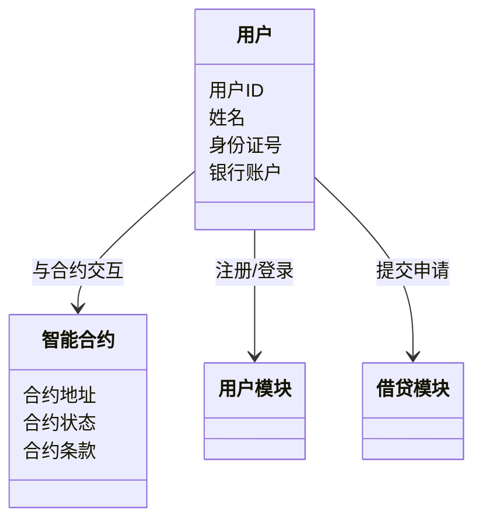

                 


# 区块链驱动的P2P借贷平台设计

> 关键词：区块链、P2P借贷、智能合约、分布式系统、去中心化

> 摘要：本文探讨如何利用区块链技术构建一个高效、透明且安全的P2P借贷平台。通过分析区块链的核心概念、算法原理、系统架构和项目实战，我们展示了如何设计一个去中心化的借贷系统，解决传统金融体系中的信任和透明度问题。

---

## 第一部分：背景介绍

### 第1章：区块链驱动的P2P借贷平台背景

#### 1.1 问题背景与描述

传统的P2P借贷平台存在多重痛点。首先，中介平台收取高额费用，增加了借贷成本。其次，平台可能涉及资金池操作，存在资金挪用风险。最后，中心化机构的存在可能导致信息不透明，用户信任度下降。

区块链技术的出现为P2P借贷提供了新的解决方案。通过去中心化的方式，区块链能够消除中间人，降低交易成本，同时提高透明度和安全性。

#### 1.2 区块链技术的解决方案

区块链技术的应用带来了多方面的改进：

1. **去中心化**：通过区块链，借贷交易直接在用户之间进行，无需依赖中心化机构。
2. **透明性**：所有交易记录在区块链上，公开可查，增加了透明度。
3. **安全性**：利用智能合约和加密技术，确保借贷过程的安全性。
4. **可追溯性**：区块链上的交易可以被追踪，有助于防止欺诈行为。

#### 1.3 系统边界与外延

系统边界包括：

- 用户身份验证：确保借贷双方的身份真实性。
- 智能合约执行：自动执行借贷协议。
- 资金流转：确保资金安全流转。

系统外延功能包括：

- 法律合规性：确保平台符合当地法律法规。
- 风险评估：智能合约可以根据信用评分自动判断借贷资格。

#### 1.4 核心概念与要素

系统的核心要素包括：

- 用户：分为借款人和出借人。
- 智能合约：自动执行借贷协议。
- 区块链：提供分布式账本和共识机制。

---

## 第二部分：核心概念与联系

### 第2章：区块链与P2P借贷的核心概念

#### 2.1 区块链技术原理

区块链是一种分布式账本技术，具有以下特点：

- **分布式**：数据分布在多个节点上，避免单点故障。
- **不可篡改**：数据一旦上链，难以被修改。
- **共识机制**：通过共识算法确保数据一致性。

#### 2.2 智能合约与P2P借贷

智能合约是区块链上的自动执行程序，用于管理借贷协议。当借贷条件满足时，智能合约自动执行，例如释放资金或收取利息。

#### 2.3 实体关系分析

使用Mermaid绘制的实体关系图展示了系统中的主要实体及其关系：

```mermaid
erDiagram
    user [借款人] 
    user2 [出借人] 
    contract [借贷协议] 
    transaction [资金流转]
    user -> transaction : 提交借贷申请
    user2 -> transaction : 提供资金
    contract -> transaction : 监控还款情况
```

---

## 第三部分：算法原理讲解

### 第3章：区块链共识机制与智能合约

#### 3.1 共识机制分析

在P2P借贷中，选择共识机制是关键。常见的共识算法包括：

- **工作量证明（PoW）**：安全性高，但效率较低。
- **权益证明（PoS）**：效率高，但依赖质押权益。
- ** delegated Proof of Stake (DPoS) **：通过选举节点进行验证，适合去中心化应用。

经过分析，DPoS机制在P2P借贷中表现最佳，因为其效率高且去中心化程度高。

#### 3.2 智能合约执行流程

智能合约的执行流程如下：

1. **编译**：将合约代码编译为 bytecode。
2. **部署**：将合约部署到区块链上。
3. **调用**：用户触发合约功能，如发起借贷请求。
4. **执行**：合约自动执行预设逻辑，如验证身份、转移资金。

使用Mermaid绘制的流程图如下：



#### 3.3 数学模型与公式

智能合约的安全性依赖于密码学算法，常见的数学模型包括：

- 哈希函数：用于生成唯一标识，如 SHA-256。
- 数字签名：确保数据完整性和真实性，使用椭圆曲线加密。

例如，哈希函数的计算过程：

$$
H(m) = \text{hash}(m)
$$

其中，$m$ 是输入数据，$H(m)$ 是其哈希值。

---

## 第四部分：系统分析与架构设计

### 第4章：P2P借贷平台系统架构

#### 4.1 问题场景分析

系统需要处理以下场景：

- 用户注册与身份验证
- 借贷申请提交
- 资金流转与还款监控

#### 4.2 系统功能设计

系统功能模块包括：

- 用户模块：用户注册、登录、个人信息管理。
- 借贷模块：借贷申请、条件设定、协议签订。
- 资金模块：资金转移、利息计算、还款提醒。

使用Mermaid绘制的领域模型类图：



#### 4.3 系统架构设计

系统架构采用分层设计：

1. **数据层**：区块链节点存储交易数据。
2. **业务逻辑层**：智能合约处理借贷逻辑。
3. **用户交互层**：前端界面供用户操作。

使用Mermaid绘制的架构图：


---

## 第五部分：项目实战

### 第5章：区块链驱动的P2P借贷平台实现

#### 5.1 环境搭建

搭建开发环境，安装必要的工具：

- 区块链平台：以太坊测试网
- 开发工具：Remix IDE、MetaMask

#### 5.2 核心代码实现

以下是智能合约的代码示例：

```solidity
// SPDX-License-Identifier: MIT
pragma solidity ^0.8.0;

contract P2PLoan {
    struct Loan {
        address borrower;
        address lender;
        uint amount;
        uint duration;
        bool isRepaid;
    }

    Loan[] public loans;

    function requestLoan(uint amount, uint duration) external payable {
        loans.push(Loan(msg.sender, address(0), amount, duration, false));
    }

    function fundLoan(uint loanIndex) external payable {
        Loan storage loan = loans[loanIndex];
        require(!loan.isRepaid, "Loan already repaid");
        require(msg.sender == loan.lender, "Not the lender");
        loan.isRepaid = true;
        // 转账逻辑
    }
}
```

#### 5.3 案例分析

以用户A借款1000美元，用户B提供资金为例，智能合约自动处理借贷流程，确保资金安全流转。

---

## 第六部分：总结与展望

### 第6章：最佳实践与注意事项

1. **法律合规性**：确保平台符合当地法律法规。
2. **安全性**：选择可靠的共识机制和加密算法。
3. **用户体验**：优化界面和流程，提升用户体验。

### 第7章：小结

通过区块链技术，我们成功构建了一个高效、透明的P2P借贷平台，解决了传统金融体系中的痛点。

### 第8章：注意事项

- 定期更新智能合约，修复潜在漏洞。
- 监控系统运行状态，及时处理异常情况。

### 第9章：拓展阅读

- 推荐书籍：《区块链：技术与应用》
- 推荐文章：区块链在金融领域的应用

---

作者：AI天才研究院 & 禅与计算机程序设计艺术

