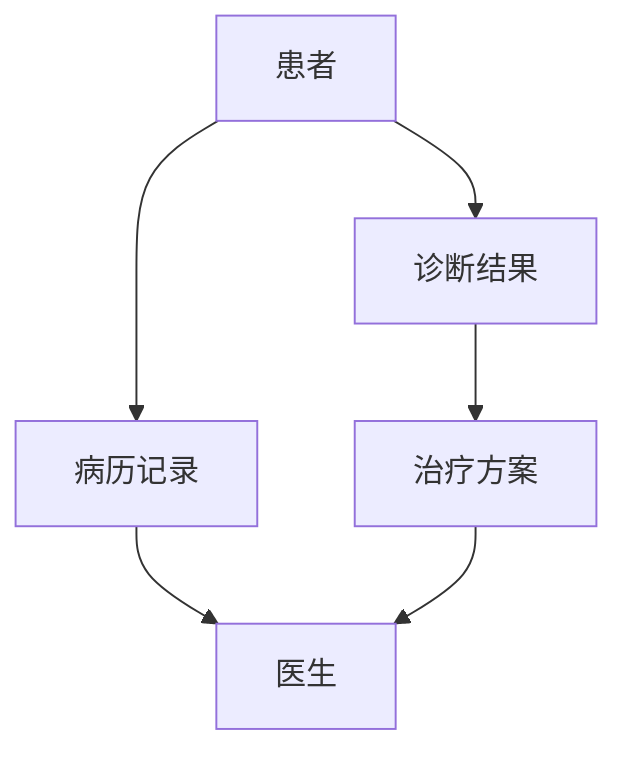
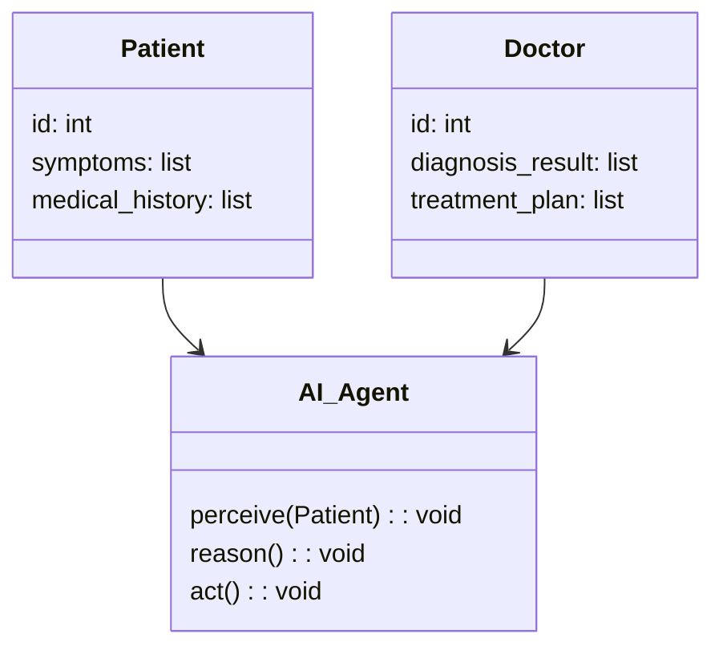
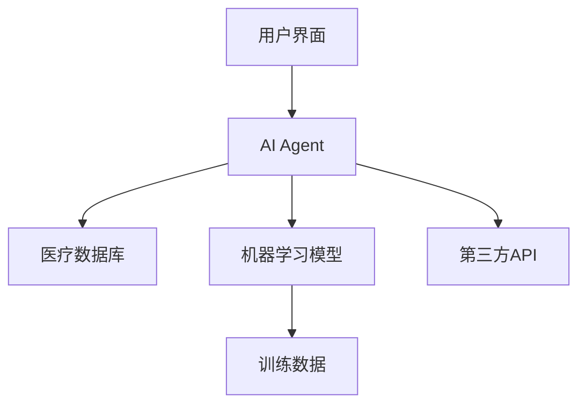
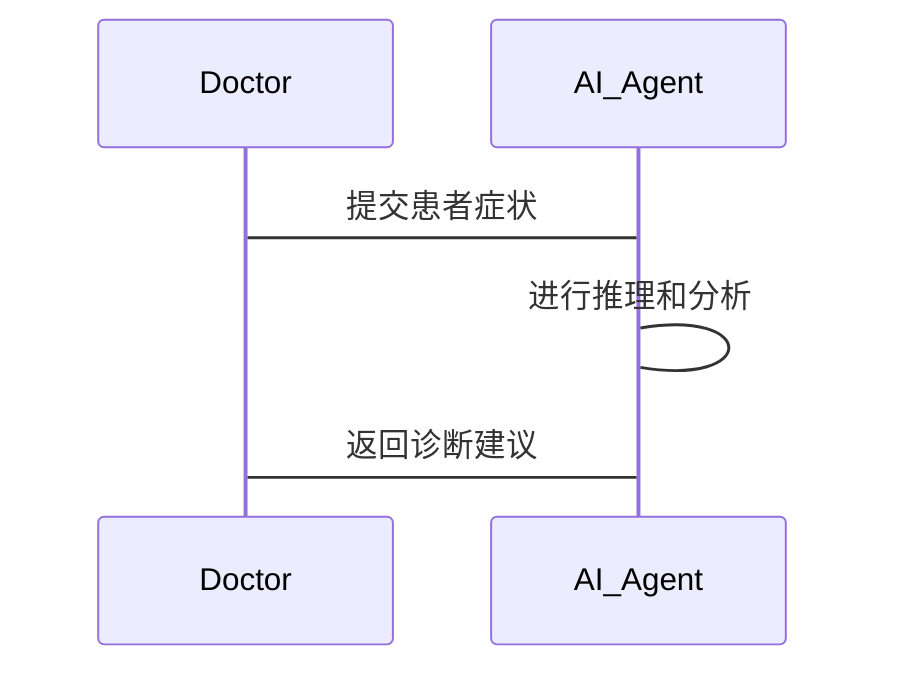

                 


# 医疗健康AI Agent：开发难点与突破

> **关键词**：医疗AI Agent, AI算法, 系统架构, 项目实战, 最佳实践

> **摘要**：医疗健康AI Agent作为人工智能技术在医疗领域的应用，正逐步改变传统的医疗模式。本文将详细探讨医疗AI Agent的核心概念、算法原理、系统架构、项目实战以及最佳实践，旨在揭示其开发难点并提出突破方法。

---

## 第一部分: 医疗AI Agent的背景与核心概念

### 第1章: 医疗AI的发展现状与挑战

#### 1.1 医疗AI的演进历程
医疗AI从传统的医疗信息化逐步演变为AI驱动的智能化应用。近年来，AI技术在医疗影像识别、疾病预测和个性化治疗方案制定等领域取得了显著进展。

#### 1.2 医疗AI的核心技术背景
- **大数据在医疗领域的应用**：医疗数据的多样性和海量性为AI提供了丰富的训练素材。
- **自然语言处理在医疗文本分析中的作用**：通过NLP技术，AI能够从电子健康记录中提取关键信息。
- **机器学习在医疗诊断中的应用**：监督学习、无监督学习和强化学习等算法在医疗诊断中的应用越来越广泛。

#### 1.3 医疗AI Agent的定义与问题描述
医疗AI Agent是一种能够理解和执行医疗相关任务的智能体，旨在辅助医生进行诊断、治疗方案制定和患者管理。

#### 1.4 医疗AI Agent的核心难点
- **数据隐私与安全问题**：医疗数据的敏感性要求AI Agent必须具备严格的数据安全保护机制。
- **医疗知识的复杂性与不确定性**：医疗领域的知识体系复杂且不断更新，AI Agent需要具备高度的灵活性和适应性。
- **多模态数据的整合与处理**：医疗数据通常包括文本、影像、基因组数据等多种形式，整合这些数据并进行有效分析是AI Agent面临的挑战。

---

### 第2章: 医疗AI Agent的核心概念与联系

#### 2.1 AI Agent的基本原理
AI Agent通过感知、推理和执行三个模块完成任务：
1. **感知模块**：接收来自环境的输入数据，如患者病历、影像数据等。
2. **推理模块**：基于感知到的数据，结合医疗知识库进行推理，生成诊断建议或治疗方案。
3. **执行模块**：将推理结果转化为具体行动，如生成报告或提醒医生关注异常情况。

#### 2.2 AI Agent的类型对比
以下是几种常见AI Agent类型的对比：

| 类型         | 基于规则 | 基于模型 | 基于强化学习 |
|--------------|----------|----------|--------------|
| 定义         | 预先定义好的规则驱动 | 基于机器学习模型进行决策 | 通过试错和奖励机制优化行为 |
| 优点         | 实现简单，易于解释 | 高度灵活，适应性强 | 能够在动态环境中优化决策 |
| 缺点         | 难以应对复杂和不确定的场景 | 黑箱问题，解释性较差 | 需要大量数据和时间进行训练 |

#### 2.3 医疗数据的实体关系图
以下是一个医疗数据的实体关系图，展示了医疗AI Agent可能涉及的主要实体及其关系：



---

## 第二部分: 医疗AI Agent的算法原理

### 第3章: 监督学习算法

#### 3.1 监督学习的原理与流程
1. **数据准备**：收集和标注医疗数据，如患者的症状、影像数据和诊断结果。
2. **模型训练**：使用训练数据训练分类器，如随机森林、支持向量机（SVM）或深度神经网络。
3. **模型评估**：通过测试数据评估模型的准确率、召回率和F1分数。

#### 3.2 算法实现示例：使用Python的Scikit-learn库进行分类
以下是使用Scikit-learn库进行医疗诊断分类的代码示例：

```python
from sklearn.model_selection import train_test_split
from sklearn.ensemble import RandomForestClassifier
from sklearn.metrics import accuracy_score

# 假设X为输入特征，y为标签（诊断结果）
X_train, X_test, y_train, y_test = train_test_split(X, y, test_size=0.2)

# 初始化模型
model = RandomForestClassifier()

# 训练模型
model.fit(X_train, y_train)

# 预测
y_pred = model.predict(X_test)

# 评估准确率
print("Accuracy:", accuracy_score(y_test, y_pred))
```

#### 3.3 数学公式：随机森林的决策树模型
随机森林是一种集成学习方法，其核心公式为：
$$
y = \sum_{i=1}^{n} \text{tree}_i(x)
$$
其中，$n$ 是决策树的数量，$\text{tree}_i$ 是第$i$棵决策树的预测结果。

---

### 第4章: 强化学习算法

#### 4.1 强化学习的原理与流程
1. **状态定义**：定义AI Agent在医疗场景中的状态，如患者的当前健康状况。
2. **动作选择**：AI Agent根据当前状态选择一个动作，如建议进行某种检查或治疗。
3. **奖励机制**：根据动作的结果给予奖励或惩罚，优化AI Agent的决策策略。

#### 4.2 算法实现示例：使用Deep Q-Network（DQN）进行医疗决策
以下是使用Keras和TensorFlow实现DQN的代码示例：

```python
import keras
from keras.layers import Dense
from keras.models import Sequential
import numpy as np

# 初始化神经网络
model = Sequential()
model.add(Dense(32, activation='relu', input_dim=10))
model.add(Dense(1, activation='linear'))

# 编译模型
model.compile(optimizer='adam', loss='mean_squared_error')

# 训练模型
for episode in range(1000):
    state = np.random.random((1, 10))
    action = model.predict(state)[0]
    reward = calculate_reward(action)
    # 更新模型权重
    model.fit(state, np.array([reward]), epochs=1, verbose=0)
```

---

## 第三部分: 系统分析与架构设计

### 第5章: 系统分析

#### 5.1 问题场景介绍
医疗AI Agent需要处理多种任务，如患者咨询、诊断辅助和健康管理。以下是一个典型的医疗场景：

- 患者通过AI Agent输入症状，AI Agent根据症状和患者病史提供初步诊断建议。

#### 5.2 领域模型设计
以下是一个医疗AI Agent的领域模型类图：



---

### 第6章: 系统架构设计

#### 6.1 系统架构设计
以下是医疗AI Agent的系统架构图：



#### 6.2 接口设计与交互流程
以下是AI Agent与医生交互的序列图：



---

## 第四部分: 项目实战

### 第7章: 环境安装与核心实现

#### 7.1 开发环境安装
安装必要的Python库，如Keras、TensorFlow、Scikit-learn等。

#### 7.2 核心代码实现
以下是医疗诊断分类的核心代码：

```python
import numpy as np
from sklearn.ensemble import RandomForestClassifier

# 假设X为输入特征，y为标签（诊断结果）
X = np.array([[40, 1], [42, 0], [45, 1], [48, 1]])
y = np.array([0, 1, 1, 2])

# 初始化模型
model = RandomForestClassifier()

# 训练模型
model.fit(X, y)

# 预测
new_patient = np.array([[43, 1]])
print("诊断结果:", model.predict(new_patient)[0])
```

#### 7.3 代码解读与分析
上述代码通过随机森林模型对患者症状进行分类，预测患者的诊断结果。

---

### 第8章: 实际案例分析

#### 8.1 案例背景
某医院希望使用AI Agent辅助诊断糖尿病患者。

#### 8.2 数据分析与处理
- 收集糖尿病患者的症状、血糖值和家族史等数据。
- 对数据进行预处理，如标准化和归一化。

#### 8.3 模型训练与评估
使用训练数据训练随机森林模型，并在测试数据上评估模型的准确率。

---

## 第五部分: 最佳实践与小结

### 第9章: 最佳实践

#### 9.1 数据隐私与安全
确保医疗数据的隐私和安全，遵循相关法律法规。

#### 9.2 模型解释性
提高AI Agent的可解释性，增强医生和患者的信任。

#### 9.3 模型泛化能力
通过迁移学习和数据增强技术，提高模型的泛化能力。

---

### 第10章: 项目小结与未来展望

医疗AI Agent的开发涉及多个方面的技术和挑战。通过本文的探讨，我们了解了医疗AI Agent的核心概念、算法原理和系统架构设计。未来，随着AI技术的不断发展，医疗AI Agent将在医疗领域发挥越来越重要的作用。

---

**作者：AI天才研究院/AI Genius Institute & 禅与计算机程序设计艺术 /Zen And The Art of Computer Programming**

