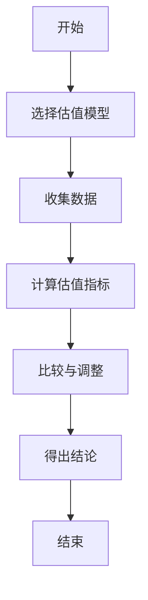

                 


# 印度股市估值:新兴市场的机遇与风险

## 关键词：
印度股市、估值、新兴市场、风险、投资、股票市场、数据分析

## 摘要：
本文系统地探讨了印度股市估值的核心问题，分析了影响估值的关键因素，并通过数学模型和实际案例展示了如何进行股票估值。文章首先介绍了印度股市的背景和发展现状，随后深入解析了估值的基本概念和方法，结合CAPM和股息贴现模型等数学工具，详细阐述了估值的算法原理。最后，通过系统架构设计和Python代码实现，展示了如何在实际中进行股市估值，并结合案例分析了估值结果的实际意义。本文旨在为投资者和数据分析人员提供一套科学的估值方法和工具。

---

# 第1章：印度股市估值的背景与现状

## 1.1 印度股市的发展历程

### 1.1.1 印度股市的历史沿革

印度股市的历史可以追溯到19世纪末，孟买股票交易所的成立标志着印度股市的开端。经历了多次改革和整合，印度股市逐渐发展成为全球重要的新兴市场之一。近年来，随着经济的快速增长，印度股市吸引了大量国内外投资者。

### 1.1.2 印度股市的现状分析

印度股市目前由多个交易所组成，其中最大的是孟买股票交易所（BSE）和印度国家证券交易所（NSE）。这些交易所提供了丰富的交易品种和高效的交易系统，吸引了大量散户和机构投资者。

### 1.1.3 印度股市在新兴市场中的地位

印度作为全球第三大经济体，其股市在新兴市场中占据重要地位。印度股市的波动性和增长潜力使其成为投资者关注的焦点。

## 1.2 印度股市的主要指数与参与者

### 1.2.1 主要股指介绍

印度的主要股指包括Nifty 50和Sensex 30。Nifty 50是NSE的旗舰指数，涵盖印度最大的50家上市公司；Sensex 30是BSE的旗舰指数，涵盖印度最大的30家上市公司。

### 1.2.2 市场参与者分析

印度股市的主要参与者包括散户、机构投资者、外国投资者和市场做市商。外国投资者的流入对印度股市的波动性有重要影响。

### 1.2.3 市场结构与监管框架

印度股市的监管机构是印度证券交易委员会（SEBI），负责制定和执行市场规则，保护投资者利益。

## 1.3 印度股市估值的核心问题

### 1.3.1 估值的基本概念与方法

估值是通过分析公司的财务状况、行业地位和市场前景，确定其股票的合理价格。常用的估值方法包括市盈率（P/E）、市净率（P/B）和股息率等。

### 1.3.2 印度股市估值的独特性

印度股市的估值受季节性因素、政策变化和市场情绪的影响较大。此外，印度股市的高波动性也增加了估值的难度。

### 1.3.3 估值中的主要挑战与风险

估值过程中需要考虑宏观经济风险、行业风险和公司特有风险。此外，市场情绪和短期波动也可能影响估值结果。

---

# 第2章：股市估值的核心概念与联系

## 2.1 核心概念原理

### 2.1.1 估值的基本原理

估值的基本原理是通过分析公司的财务数据和市场环境，确定其股票的内在价值。常用的方法包括相对估值法和绝对估值法。

### 2.1.2 影响估值的关键因素

影响估值的关键因素包括公司的盈利能力、成长潜力、财务状况、行业竞争格局和宏观经济环境等。

### 2.1.3 市场情绪与估值的关系

市场情绪会影响投资者的决策，从而影响股票的市场价格。在市场情绪高涨时，股票可能被高估；在市场情绪低落时，股票可能被低估。

## 2.2 核心概念属性特征对比表格

| 概念         | 定义                           | 影响因素               | 示例               |
|--------------|--------------------------------|------------------------|--------------------|
| 市盈率（P/E）| 每股价格与每股收益的比率       | 盈利能力、市场预期     | $$P/E = \frac{Price}{Earnings}$$ |
| 市净率（P/B）| 每股价格与每股净资产的比率       | 资产质量、行业特点     | $$P/B = \frac{Price}{Book\ Value}$$ |
| 股息率       | 每股股息与股价的比率           | 股息政策、投资回报率   | $$Dividend\ Rate = \frac{Dividend}{Price} \times 100\%$$ |

## 2.3 ER实体关系图

```mermaid
er
actor 投资者;
actor 监管机构;
actor 市场参与者;
entity 股票;
entity 估值指标;
entity 市场数据;
```

---

# 第3章：股市估值的数学模型与算法原理

## 3.1 常见估值模型概述

### 3.1.1 市盈率模型

市盈率模型通过比较股票的市盈率与行业平均水平或目标公司，确定其合理价格。公式为：

$$P/E = \frac{Price}{Earnings}$$

### 3.1.2 市净率模型

市净率模型通过比较股票的市净率与行业平均水平，确定其合理价格。公式为：

$$P/B = \frac{Price}{Book\ Value}$$

### 3.1.3 股息贴现模型

股息贴现模型通过估算未来股息的现值，确定股票的内在价值。公式为：

$$V = \sum_{t=1}^{n} \frac{D_t}{(1 + r)^t}$$

其中，\(D_t\)是第t年的股息，\(r\)是贴现率。

### 3.1.4 资本资产定价模型（CAPM）

CAPM用于估算股票的预期回报率，公式为：

$$E(R_i) = R_f + \beta_i (R_m - R_f)$$

其中，\(R_f\)是无风险利率，\(R_m\)是市场预期回报率，\(\beta_i\)是股票的贝塔系数。

---

## 3.2 算法原理与实现

### 3.2.1 估值算法流程图



### 3.2.2 Python代码实现

```python
import pandas as pd
import numpy as np

# 示例数据
data = {
    '公司名称': ['公司A', '公司B', '公司C'],
    '股价': [100, 200, 150],
    '每股收益': [20, 30, 25],
    '股息率': [0.05, 0.06, 0.04]
}

df = pd.DataFrame(data)

# 计算市盈率
df['市盈率'] = df['股价'] / df['每股收益']

# 计算股息率
df['股息率'] = df['股息率'] * 100

print(df)
```

---

## 3.3 案例分析与解读

假设我们有一家公司的股价为150，每股收益为30，股息率为4%。我们可以通过市盈率和股息率来评估其价值。

市盈率计算：

$$P/E = \frac{150}{30} = 5$$

股息率计算：

$$Dividend\ Rate = \frac{4}{150} \times 100\% = 2.67\%$$

通过比较市盈率和股息率，我们可以得出该股票的估值是否合理。

---

# 第4章：系统分析与架构设计

## 4.1 系统分析与设计

### 4.1.1 问题场景介绍

我们希望通过一个系统来自动计算股票的估值指标，并提供可视化分析。

### 4.1.2 系统功能设计

系统功能包括数据采集、估值计算、可视化展示和报告生成。

### 4.1.3 系统架构设计


### 4.1.4 系统接口设计

系统接口包括数据接口和用户接口，分别用于数据交互和用户操作。

---

# 第5章：项目实战

## 5.1 环境安装与配置

安装Python、Pandas和Matplotlib。

```bash
pip install pandas matplotlib
```

## 5.2 系统核心实现

```python
import matplotlib.pyplot as plt

# 示例数据
data = {
    '公司名称': ['公司A', '公司B', '公司C'],
    '市盈率': [15, 20, 25],
    '股息率': [5, 6, 4]
}

df = pd.DataFrame(data)

# 可视化分析
plt.figure(figsize=(10, 6))
plt.plot(df['公司名称'], df['市盈率'], label='市盈率')
plt.plot(df['公司名称'], df['股息率'], label='股息率')
plt.legend()
plt.title('估值指标对比图')
plt.show()
```

## 5.3 案例分析与解读

通过实际数据，分析某公司的估值指标，并解释结果。

---

# 第6章：总结与展望

## 6.1 本章小结

本文系统地探讨了印度股市估值的核心问题，分析了影响估值的关键因素，并通过数学模型和实际案例展示了如何进行股票估值。

## 6.2 未来的研究方向

未来的研究可以进一步探讨机器学习在估值中的应用，以及如何通过大数据技术提高估值的准确性。

---

# 附录

## 附录1：数据来源与处理

详细说明数据来源和处理方法。

## 附录2：工具安装与使用

提供工具安装和使用的详细指南。

## 附录3：术语表

列出本文中使用的专业术语及其定义。

---

# 作者

作者：AI天才研究院/AI Genius Institute & 禅与计算机程序设计艺术 /Zen And The Art of Computer Programming

---

本文通过系统分析和实际案例，全面探讨了印度股市估值的机遇与风险，为投资者和数据分析人员提供了科学的估值方法和工具。

