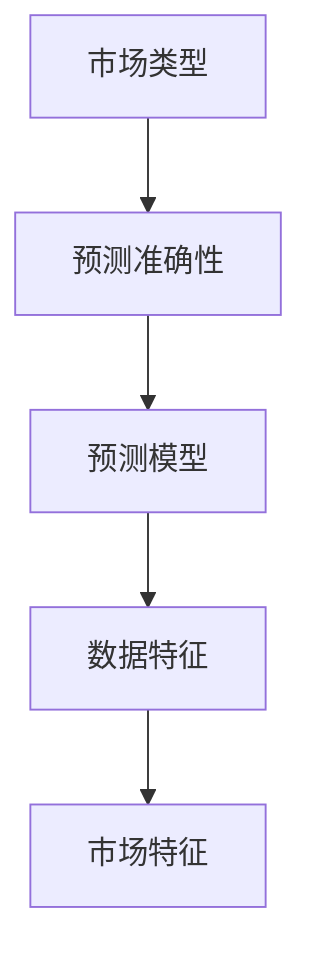
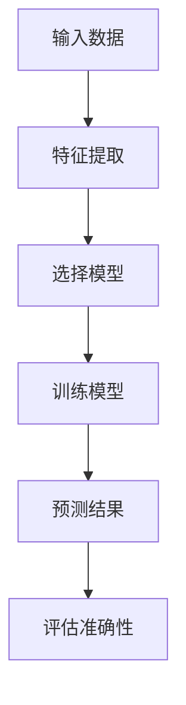
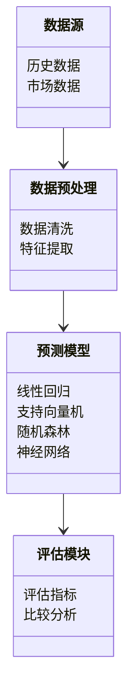
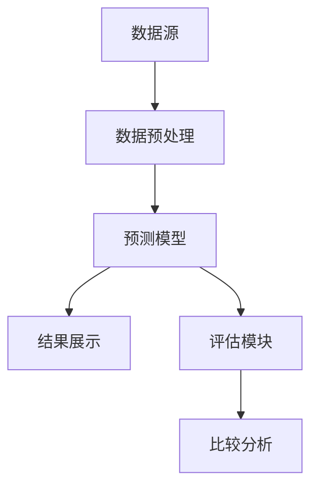

                 


# 发达市场vs新兴市场:预测准确性比较

> 关键词：发达市场，新兴市场，预测准确性，机器学习，经济分析，数据驱动决策

> 摘要：本文通过分析发达市场与新兴市场在经济预测中的差异，探讨如何利用机器学习算法和数学模型提高预测准确性。文章从背景介绍、核心概念、算法原理、数学模型、系统架构到项目实战，全面解析预测准确性比较的各个方面。

---

## 第一部分: 发达市场与新兴市场预测准确性比较的背景与核心概念

### 第1章: 问题背景与问题描述

#### 1.1 问题背景

##### 1.1.1 经济全球化与市场划分

在全球化背景下，世界经济被划分为发达市场和新兴市场。发达市场（Developed Markets）如美国、欧洲和日本等，具有高度发达的经济体系、完善的基础设施和成熟的金融系统。新兴市场（Emerging Markets）如中国、印度和巴西等，经济增长速度快，但市场体系和基础设施仍在快速发展中。

##### 1.1.2 发达市场与新兴市场的定义

- **发达市场**：GDP高，人均收入高，市场成熟，消费者行为稳定。
- **新兴市场**：GDP增长快，市场潜力大，但存在较大的波动性和不确定性。

##### 1.1.3 预测准确性的重要性

在经济预测中，无论是发达市场还是新兴市场，预测准确性都至关重要。对于企业决策、投资策略和政策制定，高精度的预测可以带来显著的经济利益。

#### 1.2 问题描述

##### 1.2.1 市场预测的复杂性

市场预测涉及多个变量，如经济指标、政策变化、国际环境等，这些变量相互影响，增加了预测的复杂性。

##### 1.2.2 发达市场与新兴市场的差异

发达市场和新兴市场在经济结构、政策环境、市场参与度等方面存在显著差异，这些差异影响预测模型的选择和效果。

##### 1.2.3 预测准确性比较的挑战

不同市场的数据分布、波动性和影响因素不同，导致预测模型在两者中的表现差异显著。如何在两者之间找到平衡点，是预测准确性比较的核心挑战。

### 第2章: 核心概念与联系

#### 2.1 核心概念原理

##### 2.1.1 预测准确性定义

预测准确性是指预测值与实际值之间的接近程度，通常用误差指标（如均方误差、R²值）来衡量。

##### 2.1.2 发达市场与新兴市场的核心特征

| 特征               | 发达市场         | 新兴市场         |
|--------------------|------------------|------------------|
| 经济增长率           | 低但稳定         | 高但波动大       |
| 市场成熟度           | 高              | 中              |
| 消费者行为           | 稳定            | 多样且变化快     |
| 政策环境           | 稳定            | 不稳定          |
| 金融体系           | 完善            | 不完善          |

##### 2.1.3 预测准确性比较的边界与外延

预测准确性比较需要考虑数据的时间范围、预测目标、模型选择和评价指标等因素。

#### 2.2 ER实体关系图架构



---

## 第二部分: 预测准确性比较的算法原理与数学模型

### 第3章: 常见预测模型与算法

#### 3.1 算法原理

##### 3.1.1 线性回归

线性回归通过最小化预测值与实际值的平方差之和来拟合数据。

##### 3.1.2 支持向量机

支持向量机通过找到一个超平面，将数据分为两类，适用于非线性可分的问题。

##### 3.1.3 随机森林

随机森林通过集成多个决策树模型，提高预测的准确性和鲁棒性。

##### 3.1.4 神经网络

神经网络通过多层感知机模拟复杂的非线性关系，适用于高维数据的预测。

#### 3.2 算法流程图



### 第4章: 数学模型与公式详细讲解

#### 4.1 回归分析

##### 4.1.1 线性回归公式

$$ y = \beta_0 + \beta_1x + \epsilon $$

其中，$$y$$ 是预测值，$$x$$ 是自变量，$$\beta_0$$ 和 $$\beta_1$$ 是回归系数，$$\epsilon$$ 是误差项。

##### 4.1.2 逻辑回归公式

$$ \ln\left(\frac{p}{1-p}\right) = \beta_0 + \beta_1x $$

其中，$$p$$ 是概率，$$x$$ 是自变量，$$\beta_0$$ 和 $$\beta_1$$ 是回归系数。

---

## 第三部分: 系统分析与架构设计方案

### 第5章: 问题场景与系统功能设计

#### 5.1 问题场景介绍

本文旨在通过机器学习算法，比较发达市场与新兴市场在经济预测中的准确性，设计一个预测系统，实现对不同市场的预测和比较。

#### 5.2 系统功能设计

##### 5.2.1 领域模型



##### 5.2.2 系统架构设计



---

## 第四部分: 项目实战与代码实现

### 第6章: 项目实战

#### 6.1 环境配置

安装必要的库：

```bash
pip install numpy pandas scikit-learn matplotlib
```

#### 6.2 核心实现

##### 数据预处理

```python
import pandas as pd
import numpy as np

# 加载数据
data = pd.read_csv('market_data.csv')

# 数据清洗
data = data.dropna()
data = pd.get_dummies(data)
```

##### 训练预测模型

```python
from sklearn.model_selection import train_test_split
from sklearn.linear_model import LinearRegression
from sklearn.metrics import mean_squared_error

# 划分训练集和测试集
X_train, X_test, y_train, y_test = train_test_split(data.drop('target', axis=1), data['target'], test_size=0.2)

# 训练模型
model = LinearRegression()
model.fit(X_train, y_train)

# 预测结果
y_pred = model.predict(X_test)

# 评估准确性
 mse = mean_squared_error(y_test, y_pred)
 print(f'Mean Squared Error: {mse}')
```

#### 6.3 案例分析

以实际市场数据为例，训练模型并比较发达市场与新兴市场的预测准确性。

#### 6.4 代码解读与分析

详细解读上述代码，解释每一步的功能和作用。

---

## 第五部分: 总结与注意事项

### 第7章: 总结与注意事项

#### 7.1 总结

本文通过分析发达市场与新兴市场的差异，探讨了如何利用机器学习算法提高预测准确性。通过实际案例分析和代码实现，展示了预测系统的设计与实现。

#### 7.2 注意事项

- 数据质量对预测准确性影响重大，需确保数据清洗和特征提取的准确性。
- 不同市场的数据分布不同，需调整模型参数或选择合适的算法。
- 预测结果需结合实际市场环境进行解读，避免机械套用模型。

#### 7.3 最佳实践

- 在实际应用中，建议结合多种模型进行预测，并通过交叉验证选择最优模型。
- 定期更新模型和数据，以应对市场环境的变化。

#### 7.4 拓展阅读

- 《机器学习实战》
- 《数据驱动的决策》

---

作者：AI天才研究院/AI Genius Institute & 禅与计算机程序设计艺术/Zen And The Art of Computer Programming

