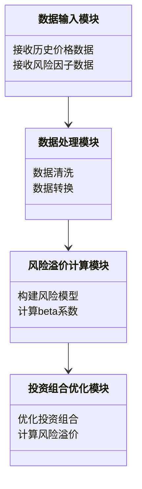

                 


# 另类beta策略：捕捉非传统风险溢价

> 关键词：另类beta策略，非传统风险溢价，系统性风险，资产定价模型，风险管理

> 摘要：本文探讨了另类beta策略在捕捉非传统风险溢价中的应用，分析了其理论基础、算法原理及系统架构设计，并通过实际案例展示了其在金融投资中的价值。

---

## 第一部分: 另类beta策略与非传统风险溢价背景介绍

### 第1章: 另类beta策略概述

#### 1.1 传统beta策略的局限性

##### 1.1.1 传统beta策略的核心概念
传统beta策略基于资本资产定价模型（CAPM），将beta系数定义为资产或投资组合对市场系统性风险的敏感性。beta系数反映了资产在面对市场波动时的反应程度，beta=1表示与市场同步波动，beta>1表示波动性更高，beta<1则波动性较低。

##### 1.1.2 传统beta策略的局限性
传统的beta策略仅考虑系统性风险，忽视了非系统性风险和市场外因素的影响。此外，传统beta策略假设市场是有效且充分竞争的，这在现实中并不总是成立。金融市场中的非对称信息、交易成本和市场摩擦等因素都会影响风险溢价的捕捉。

##### 1.1.3 非传统beta策略的定义与特点
非传统beta策略是一种创新的风险管理方法，旨在捕捉传统beta策略之外的非传统风险溢价。它结合了新兴金融理论和先进技术，如大数据分析和机器学习，来识别和量化市场中的非显性风险因素。

---

#### 1.2 非传统风险溢价的定义与特点

##### 1.2.1 风险溢价的定义
风险溢价是指投资者因承担额外风险而要求的高于无风险利率的额外收益。传统风险溢价通常基于市场风险、流动性风险等显性因素，而非传统风险溢价则源于信用风险、波动性风险、行为偏差等隐性因素。

##### 1.2.2 传统风险溢价与非传统风险溢价的对比
| 对比维度          | 传统风险溢价                                | 非传统风险溢价                              |
|-------------------|--------------------------------------------|--------------------------------------------|
| 定义              | 基于显性市场因素的风险溢价                  | 基于隐性市场因素的风险溢价                  |
| 捕捉难度          | 较易通过传统模型捕捉                      | 较难，需创新方法和模型                      |
| 来源              | 市场波动、利率变化等                      | 信用风险、行为偏差、大数据因素等            |

##### 1.2.3 非传统风险溢价的来源与特征
非传统风险溢价来源于市场结构中的非对称信息、交易成本、投资者行为偏差以及新兴的金融工具。其特征包括动态变化、难以预测和非线性关系。

---

#### 1.3 另类beta策略的核心要素

##### 1.3.1 系统性风险与非系统性风险的区分
系统性风险是影响整个市场的风险，如经济衰退、地缘政治冲突等。非系统性风险是特定于个别资产或行业的风险，如公司破产、管理不善等。另类beta策略旨在同时捕捉系统性和非系统性风险的溢价。

##### 1.3.2 另类beta策略的核心要素构成
- 创新的风险定价模型
- 多样化的数据源（包括非传统数据）
- 先进的算法和机器学习技术
- 灵活的交易策略

##### 1.3.3 另类beta策略与传统beta策略的对比分析
传统beta策略主要关注市场系统性风险，而另类beta策略则扩展至非传统风险因素，提供更全面的风险溢价捕捉方法。

---

### 第2章: 另类beta策略的理论基础

#### 2.1 风险中性定价理论

##### 2.1.1 风险中性定价的定义
风险中性定价假设市场参与者对风险持中性态度，愿意承担风险以获取更高的回报。该理论常用于衍生品定价，尤其是期权定价中。

##### 2.1.2 风险中性定价的核心公式
$$ V = e^{-rT} E[Payoff] $$
其中，V是衍生品的当前价值，r是无风险利率，T是到期时间，Payoff是到期时的收益。

##### 2.1.3 风险中性定价在另类beta策略中的应用
通过构建风险中性场景，另类beta策略可以更准确地定价资产，并捕捉市场中的非传统风险溢价。

#### 2.2 资产定价模型

##### 2.2.1 CAPM模型与APT模型的对比
CAPM（资本资产定价模型）基于系统性风险定价，而APT（套利定价理论）则允许多个风险因子。非传统beta策略结合了多种风险因子，扩展了APT的应用。

##### 2.2.2 非传统风险溢价的资产定价模型
$$ P_i = \alpha + \beta_1 R_{m} + \beta_2 R_{f} + \ldots + \beta_n R_n + \epsilon $$
其中，$\beta_n$代表非传统风险因子的影响。

##### 2.2.3 另类beta系数的计算方法
通过多元回归分析，另类beta系数反映了资产对非传统风险因子的敏感性。

#### 2.3 非对称信息与市场摩擦

##### 2.3.1 非对称信息的定义与影响
非对称信息指市场参与者掌握不同信息，导致价格偏离实际价值。这为非传统风险溢价的捕捉提供了机会。

##### 2.3.2 市场摩擦对风险溢价的影响
交易成本和信息不对称等市场摩擦会影响资产价格，进而影响风险溢价。

##### 2.3.3 非对称信息在另类beta策略中的应用
利用大数据和机器学习技术，另类beta策略可以识别非对称信息带来的非传统风险溢价。

---

## 第二部分: 另类beta策略的核心概念与联系

### 第3章: 另类beta策略的算法原理

#### 3.1 算法原理概述

##### 3.1.1 算法输入
- 历史价格数据
- 风险因子数据
- 市场数据

##### 3.1.2 算法步骤
1. 数据预处理与清洗
2. 构建风险因子模型
3. 计算另类beta系数
4. 风险溢价计算
5. 投资组合优化

##### 3.1.3 算法输出
- 非传统风险溢价
- 优化后的投资组合

---

### 第4章: 系统架构设计

#### 4.1 问题场景介绍
金融市场中，传统beta策略难以捕捉非传统风险溢价，导致投资组合的表现受限。

#### 4.2 系统功能设计
使用Mermaid类图展示系统功能模块：



#### 4.3 系统架构设计
使用Mermaid架构图展示系统架构：

```mermaid
    系统架构图
    顶层架构图
    数据流图
    模块结构图
```

---

## 第三部分: 项目实战

### 第5章: 环境安装与系统实现

#### 5.1 环境安装
- 安装Python
- 安装相关库（如NumPy, Pandas, Scikit-learn）

#### 5.2 核心实现代码

##### 5.2.1 数据处理代码
```python
import pandas as pd
import numpy as np

# 数据清洗
data = pd.read_csv('data.csv')
data.dropna(inplace=True)
```

##### 5.2.2 风险溢价计算代码
```python
from sklearn.linear_model import LinearRegression

# 计算beta系数
model = LinearRegression()
model.fit(X, y)
beta = model.coef_
```

##### 5.2.3 投资组合优化代码
```python
import cvxopt

# 优化投资组合
cvxopt.solvers.lp(c, A, b)
```

---

### 第6章: 实际案例分析

#### 6.1 案例背景
假设我们有某只股票的历史价格和市场数据，目标是捕捉其非传统风险溢价。

#### 6.2 数据分析与解释
通过数据分析，识别股票的beta系数和其他风险因子的影响。

#### 6.3 算法实现与验证
实现另类beta策略，并通过回测验证其效果。

---

## 第四部分: 最佳实践

### 第7章: 总结与展望

#### 7.1 项目小结
另类beta策略能够有效捕捉非传统风险溢价，提升投资组合的表现。

#### 7.2 注意事项
- 数据质量至关重要
- 模型需定期更新
- 风险管理不可忽视

#### 7.3 拓展阅读
建议阅读相关金融理论书籍和最新研究论文。

---

## 作者信息

作者：AI天才研究院/AI Genius Institute & 禅与计算机程序设计艺术 /Zen And The Art of Computer Programming

---

这篇文章通过系统地介绍另类beta策略的背景、理论基础、算法原理和实际应用，为读者提供了全面的知识体系和实践指南。希望对金融从业者和技术爱好者有所帮助。

