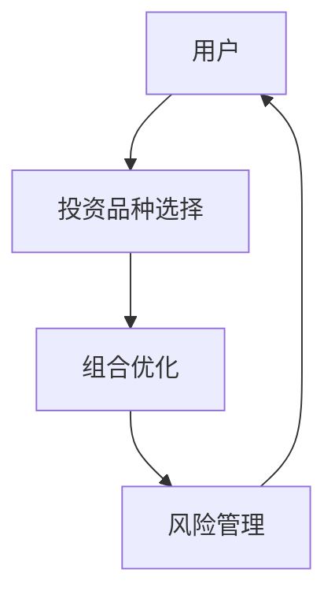

                 


# 另类投资品种：对冲通胀的有效工具

## 关键词：
- 另类投资、对冲通胀、通货膨胀、投资组合、风险管理

## 摘要：
本文深入探讨了在通货膨胀环境下，另类投资品种如何成为有效的对冲工具。通过分析传统投资的局限性，介绍了另类投资的核心概念、数学模型、系统架构以及实际案例，帮助投资者理解如何利用这些工具构建稳健的投资组合，实现财富保值和增值。

---

## 目录

1. [背景介绍](#背景介绍)
2. [核心概念与联系](#核心概念与联系)
3. [数学模型与算法原理](#数学模型与算法原理)
4. [系统分析与架构设计](#系统分析与架构设计)
5. [项目实战](#项目实战)
6. [总结与展望](#总结与展望)

---

## 1. 背景介绍

### 1.1 通货膨胀与投资背景

#### 1.1.1 通货膨胀的定义与影响
通货膨胀是指物价总水平在一段时间内持续上涨，导致货币购买力下降。它对经济和个人财富有深远影响，尤其是在固定收益资产方面，通货膨胀会侵蚀实际收益。

#### 1.1.2 传统投资工具的局限性
传统的股票、债券和现金在通胀期间表现不佳，尤其是债券，其固定利率难以跟上通胀步伐，导致实际收益下降。

#### 1.1.3 另类投资的兴起
随着通胀压力的增加，投资者转向另类投资品种，如房地产、大宗商品和私募股权，以寻求更好的对冲通胀工具。

### 1.2 另类投资的兴起

#### 1.2.1 另类投资的定义
另类投资指传统证券之外的资产类别，包括房地产、大宗商品、私募股权和对冲基金等。

#### 1.2.2 另类投资的分类
- **房地产投资**：通过购买房地产或房地产信托基金（REITs）。
- **大宗商品**：黄金、原油等。
- **私募股权和风险投资**：投资于未上市公司。
- **对冲基金**：使用复杂的策略进行投资。

---

## 2. 核心概念与联系

### 2.1 另类投资的核心原理

#### 2.1.1 另类投资与通货膨胀的关系
另类资产通常与通胀相关联，如房地产和大宗商品在通胀期间表现较好，因其价值会随通胀上升而上升。

#### 2.1.2 另类投资品种的属性特征对比
| 属性       | 股票 | 债券 | 商品 | 房地产 |
|------------|------|------|------|--------|
| 流动性     | 高   | 中   | 低   | 中     |
| 风险       | 高   | 低   | 中   | 高     |
| 收益率     | 变动 | 固定 | 变动 | 变动   |
| 抗通胀能力 | 一般 | 低   | 高   | 高     |

---

## 3. 数学模型与算法原理

### 3.1 通货膨胀的数学模型

#### 3.1.1 通胀预期的计算公式
通胀预期可以通过以下公式计算：
$$ E[\pi] = \alpha + \beta \cdot E[\pi]_{prev} $$
其中，$\alpha$ 是常数项，$\beta$ 是自回归系数，$E[\pi]_{prev}$ 是前期通胀预期。

#### 3.1.2 投资回报与通胀的关系
$$ R = (1 + \pi) \cdot r $$
其中，$R$ 是实际回报，$\pi$ 是通胀率，$r$ 是名义回报。

### 3.2 投资组合优化

#### 3.2.1 最优化投资组合的数学模型
使用CAPM模型评估资产的风险调整回报：
$$ R_i = R_f + \beta_i (R_m - R_f) $$
其中，$R_i$ 是资产i的预期回报，$R_f$ 是无风险利率，$\beta_i$ 是资产i的贝塔系数，$R_m$ 是市场预期回报。

---

## 4. 系统分析与架构设计

### 4.1 系统功能设计

#### 4.1.1 投资品种选择系统
- **输入**：用户需求、通胀预期。
- **处理**：评估各类资产的风险和回报。
- **输出**：推荐的另类投资品种。

#### 4.1.2 投资组合优化系统
- **输入**：资产列表、风险偏好。
- **处理**：使用数学模型优化组合。
- **输出**：最优投资组合。

### 4.2 系统架构设计

#### 4.2.1 系统架构图


---

## 5. 项目实战

### 5.1 环境安装

#### 5.1.1 工具安装
- Python环境
- Pandas、NumPy、Matplotlib库

### 5.2 核心实现源代码

#### 5.2.1 通胀预期计算
```python
def calculate_inflation_expectation(previous_inflation, alpha, beta):
    return alpha + beta * previous_inflation
```

#### 5.2.2 投资回报计算
```python
def compute_return(inflation_rate, nominal_return):
    return (1 + inflation_rate) * nominal_return
```

### 5.3 案例分析

#### 5.3.1 黄金投资
- 投资金额：$10,000
- 通胀率：5%
- 名义回报：10%
- 实际回报：$$ (1 + 0.05) \cdot 0.10 = 0.105 \text{ 或 } 10.5\% $$

---

## 6. 总结与展望

### 6.1 总结
另类投资品种在对冲通胀方面具有重要作用，通过合理选择和组合，投资者可以有效管理通胀风险。

### 6.2 展望
随着金融市场的变化，另类投资将继续发展，提供更多工具帮助投资者应对通胀挑战。

---

## 作者：AI天才研究院/AI Genius Institute & 禅与计算机程序设计艺术/Zen And The Art of Computer Programming

---

这篇文章系统地探讨了另类投资在对冲通胀中的作用，结合理论分析、数学模型和实际案例，为投资者提供了实用的指导。

