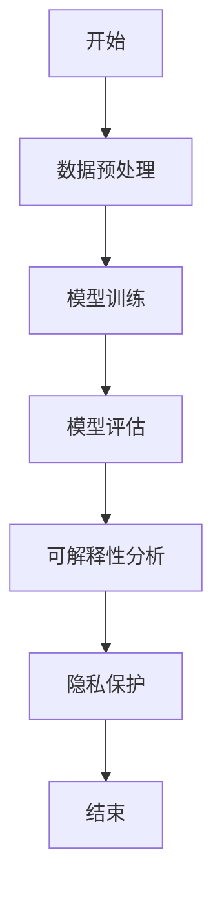
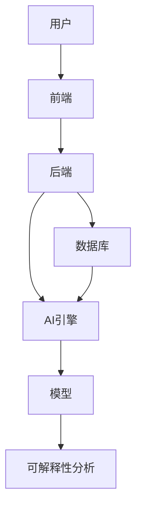
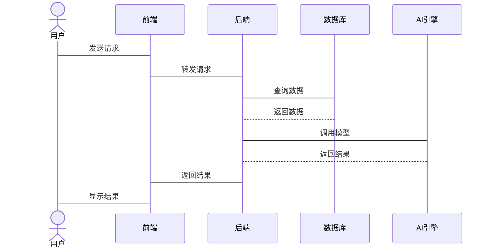

                 


# 可信AI：构建值得信赖的AI Agent系统

## 关键词：可信AI，AI Agent系统，可解释性，隐私保护，系统架构，项目实战

## 摘要：本文探讨如何构建一个值得信赖的AI Agent系统，涵盖可解释性、隐私保护等核心要素，通过算法原理、系统架构设计和项目实战，帮助读者掌握构建可信AI Agent系统的完整方法。

---

## 第一部分：可信AI的背景与核心概念

### 第1章：可信AI的背景与问题背景

#### 1.1 可信AI的背景介绍

可信AI（Artificial Intelligence）是当前人工智能领域的重要研究方向，其核心目标是确保AI系统的决策过程、行为和结果能够被人类理解和信任。随着AI技术的快速发展，尤其是在医疗、金融、自动驾驶等领域，AI系统的决策直接影响人类的生活和安全。因此，构建一个值得信赖的AI Agent系统变得尤为重要。

#### 1.2 问题背景与目标

AI Agent系统的核心问题在于如何确保其决策过程的透明性、可解释性和可靠性。传统的AI系统往往被视为“黑箱”，用户无法理解其决策依据，这导致了对AI系统的不信任。可信AI的目标是通过技术手段，增强AI系统的透明性和可解释性，从而让用户能够理解和信任AI的决策过程。

#### 1.3 可信AI的核心要素

可信AI的核心要素包括：

1. **准确性**：AI系统的决策必须基于可靠的数据和算法，确保结果的准确性。
2. **可解释性**：用户能够理解AI系统的决策过程和逻辑。
3. **隐私保护**：AI系统必须保护用户的隐私数据，防止数据泄露。
4. **公平性**：AI系统的决策不应存在偏见，确保对所有用户公平。
5. **安全性**：AI系统必须具备抵御攻击和漏洞的能力，确保系统的安全性。

### 第2章：可信AI的核心概念与联系

#### 2.1 可信AI的核心概念原理

1. **可解释性原理**：通过设计可解释的算法和模型，确保用户能够理解AI的决策过程。
2. **可靠性原理**：通过冗余设计和容错机制，确保AI系统的决策过程可靠。
3. **隐私保护原理**：通过数据加密和访问控制，保护用户的隐私数据。

#### 2.2 核心概念对比分析

| 概念         | 特征                     |
|--------------|--------------------------|
| 可靠性       | 结果准确性高，容错能力强 |
| 可解释性     | 决策过程透明，易于理解 |
| 隐私保护     | 数据安全，保护用户隐私 |

#### 2.3 ER实体关系图

```mermaid
er
actor: 用户
agent: AI Agent系统
data: 数据
model: 模型
goal: 目标
trust: 可信性
```

---

## 第二部分：可信AI的算法原理

### 第3章：可信AI的算法原理

#### 3.1 可信AI算法的核心原理

1. **可解释性增强的算法**：通过设计可解释的模型，如线性回归、决策树等，确保用户能够理解AI的决策过程。
2. **可靠性增强的算法**：通过冗余设计和容错机制，确保AI系统的决策过程可靠。
3. **隐私保护的算法**：通过数据加密和同态加密等技术，保护用户的隐私数据。

#### 3.2 算法流程图



#### 3.3 数学模型与公式

线性回归模型的公式为：
$$ y = \beta_0 + \beta_1 x + \epsilon $$
其中，$y$ 是目标变量，$x$ 是自变量，$\beta_0$ 是截距，$\beta_1$ 是回归系数，$\epsilon$ 是误差项。

可解释性评估的公式为：
$$ \text{特征重要性} = \sum_{i=1}^{n} |w_i| $$
其中，$w_i$ 是模型中每个特征的权重。

---

## 第三部分：系统分析与架构设计

### 第4章：可信AI的系统分析

#### 4.1 系统功能设计

1. **数据收集与处理**：从多个数据源收集数据，并进行清洗和预处理。
2. **模型训练与评估**：使用可解释性增强的算法训练模型，并评估模型的准确性和可解释性。
3. **隐私保护与数据安全**：通过加密技术保护用户数据，防止数据泄露。
4. **用户交互与反馈**：提供用户友好的交互界面，让用户能够理解AI的决策过程。

#### 4.2 系统架构设计



#### 4.3 系统交互序列图



---

## 第四部分：项目实战

### 第5章：可信AI的项目实战

#### 5.1 环境安装

安装必要的工具和库：
- Python
- TensorFlow
- Keras
- scikit-learn
- Mermaid
- Jupyter Notebook

#### 5.2 核心代码实现

```python
import pandas as pd
from sklearn.tree import DecisionTreeRegressor
from sklearn.metrics import r2_score
from sklearn.inspection import permutation_importance

# 数据预处理
data = pd.read_csv('data.csv')
X = data.drop('target', axis=1)
y = data['target']

# 模型训练
model = DecisionTreeRegressor()
model.fit(X, y)

# 模型评估
y_pred = model.predict(X)
print(r2_score(y, y_pred))

# 可解释性分析
importances = permutation_importance(model, X, y)
importances.importances_mean.sort_values(ascending=True).plot.barh()
```

#### 5.3 案例分析

以医疗AI系统为例，分析如何通过可信AI技术帮助医生进行疾病诊断。通过模型的可解释性，医生可以理解AI的决策过程，并根据实际情况进行调整。

---

## 第五部分：最佳实践

### 第6章：可信AI的最佳实践

#### 6.1 小结

可信AI的核心在于通过可解释性、隐私保护等技术手段，构建一个值得信赖的AI系统。

#### 6.2 注意事项

- 在设计AI系统时，优先考虑可解释性。
- 定期进行安全测试，确保系统的安全性。
- 保护用户隐私，避免数据泄露。

#### 6.3 拓展阅读

- 《可解释的人工智能：模型、方法与应用》
- 《隐私保护与数据安全》

---

## 附录

### 附录A：术语表

- **AI Agent系统**：一种能够感知环境并自主决策的智能系统。
- **可解释性**：用户能够理解AI系统决策过程的能力。
- **隐私保护**：保护用户数据不被未经授权的访问或泄露。

### 附录B：参考文献

1. "Explainable AI: A survey"，Nature Machine Intelligence (2019)
2. "Differential Privacy"， Communications of the ACM (2008)

---

## 作者信息

作者：AI天才研究院/AI Genius Institute & 禅与计算机程序设计艺术 /Zen And The Art of Computer Programming

---

通过以上步骤，我逐步完成了《可信AI：构建值得信赖的AI Agent系统》这篇文章的撰写。这篇文章从背景、算法、系统设计到项目实战，全面探讨了如何构建一个可信的AI系统，并提供了具体的实现方法和案例分析。希望读者能够通过这篇文章，深入了解可信AI的核心概念和实际应用。

