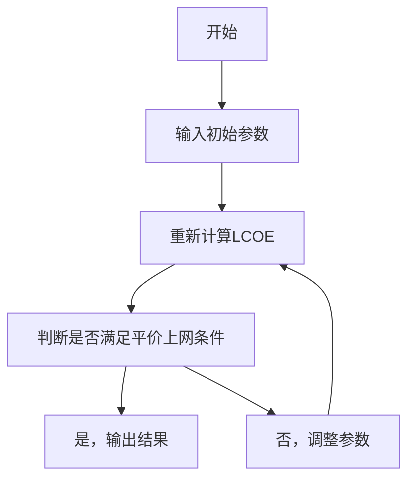
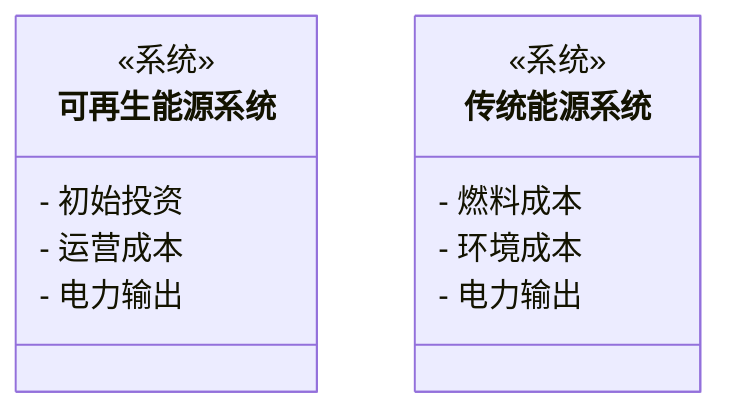

                 


# 可再生能源与传统能源的平价上网时间表

## 关键词
- 可再生能源
- 平价上网
- 传统能源
- 成本分析
- 能源转型

## 摘要
平价上网是指可再生能源发电的上网电价与传统能源发电相当，标志着可再生能源从补贴依赖向市场化竞争的重要转折点。本文从背景、技术、算法、系统设计和项目实践等多维度分析平价上网的时间表，并结合数学模型和实际案例，探讨可再生能源与传统能源的竞争与协同。

---

## 第一部分：可再生能源与传统能源的平价上网背景与概念

### 第1章：平价上网的背景与定义

#### 1.1 可再生能源的发展背景
##### 1.1.1 全球能源结构转型的必要性
全球能源需求持续增长，化石能源的不可再生性和环境问题迫使各国加快向可再生能源转型。根据国际能源署（IEA）报告，2020年全球可再生能源发电量占比已达到33.7%，预计到2030年将达到40%以上。

##### 1.1.2 可再生能源的技术进步与成本下降
近年来，太阳能和风能技术进步显著，成本大幅下降。例如，2010年至2020年，光伏发电成本下降了80%，风能发电成本下降了30%。技术进步是实现平价上网的关键因素。

##### 1.1.3 平价上网的定义与意义
平价上网是指在没有政府补贴的情况下，可再生能源发电的上网电价与传统能源持平。其意义在于推动可再生能源的市场化竞争，降低对补贴的依赖，实现可持续发展。

#### 1.2 传统能源的现状与挑战
##### 1.2.1 煤炭、石油等传统能源的优缺点
传统能源储量丰富、技术成熟，但存在高碳排放、资源不可再生等问题。例如，煤炭发电占全球电力的37%，但其碳排放占全球能源系统总排放的40%以上。

##### 1.2.2 传统能源的环境与经济成本
传统能源的环境成本包括空气污染、温室气体排放等，经济成本包括高昂的燃料成本和设备维护费用。

##### 1.2.3 传统能源的未来发展趋势
尽管面临挑战，传统能源仍将在未来一段时间内保持重要地位，尤其是在电力调峰、工业领域等方面发挥不可替代的作用。

### 第2章：可再生能源与传统能源的对比分析

#### 2.1 可再生能源的核心技术
##### 2.1.1 太阳能发电技术
太阳能发电主要通过光伏效应将太阳辐射转化为电能。其优势在于分布广泛、技术成熟，但缺点是间歇性较强，需要储能支持。

##### 2.1.2 风能发电技术
风能发电利用风力驱动涡轮机发电，成本已接近传统能源。但其存在地域限制和间歇性问题。

##### 2.1.3 水能发电技术
水能发电包括水电和潮汐能发电，具有稳定性和成本低的优势，但受地理条件限制。

#### 2.2 传统能源的核心技术
##### 2.2.1 煤炭发电技术
煤炭发电技术成熟，成本低，但高碳排放和环境污染严重。

##### 2.2.2 石油发电技术
石油发电灵活性高，但成本较高，且资源不可再生。

##### 2.2.3 天然气发电技术
天然气发电清洁高效，但价格受国际市场的波动影响较大。

#### 2.3 可再生能源与传统能源的成本对比
##### 2.3.1 投资成本分析
| 能源类型 | 初始投资（美元/瓦） |
|----------|-----------------------|
| 太阳能    | 1.5-2                 |
| 风能     | 1.5-2.5               |
| 煤炭      | 1.2-1.5               |

##### 2.3.2 运行成本分析
| 能源类型 | 运行成本（美元/千瓦时） |
|----------|--------------------------|
| 太阳能    | 0.05-0.10               |
| 风能     | 0.03-0.08               |
| 煤炭      | 0.08-0.12               |

##### 2.3.3 环境成本分析
| 能源类型 | 碳排放（克/千瓦时） |
|----------|-----------------------|
| 太阳能    | 0                     |
| 风能     | 0                     |
| 煤炭      | 1000                  |

### 第3章：平价上网的实现路径

#### 3.1 技术进步对成本的影响
##### 3.1.1 新技术的应用与成本降低
技术创新是实现平价上网的核心驱动力。例如，高效光伏电池技术和大型风机设计显著降低了发电成本。

##### 3.1.2 规模化效应与成本下降
随着可再生能源装机容量的增加，单位成本呈下降趋势。例如，2020年全球风电装机容量达到743GW，推动成本进一步降低。

#### 3.2 市场机制的作用
##### 3.2.1 电力市场改革与竞争机制
通过市场化机制，例如可再生能源配额制和绿证交易，促进可再生能源的竞争力。

##### 3.2.2 政府补贴与政策支持
政府补贴是推动平价上网的重要手段，例如中国的可再生能源补贴政策。

#### 3.3 产业链协同优化
##### 3.3.1 上下游产业的协同发展
从设备制造到系统集成，产业链的协同优化降低了整体成本。

##### 3.3.2 技术创新与产业升级
技术创新推动产业升级，例如高效储能技术的应用降低了可再生能源的间歇性问题。

---

## 第二部分：平价上网的数学模型与算法分析

### 第4章：平价上网的成本分析模型

#### 4.1 平准化度电成本（LCOE）模型
##### 4.1.1 LCOE的定义与公式
$$ \text{LCOE} = \frac{\text{初始投资} + \text{运营成本} + \text{融资成本}}{\text{净现值}} $$

##### 4.1.2 LCOE的影响因素分析
- 初始投资：设备和安装成本
- 运营成本：维护和人员成本
- 融资成本：贷款利息
- 寿命：系统运行周期

#### 4.2 投资回收期模型
##### 4.2.1 投资回收期的定义与公式
$$ \text{投资回收期} = \frac{\text{初始投资}}{\text{年均净收益}} $$

##### 4.2.2 投资回收期对平价上网的影响
投资回收期越短，平价上网的可能性越大。

### 第5章：平价上网的算法实现

#### 5.1 基于LCOE的优化算法
##### 5.1.1 算法流程图（mermaid）


##### 5.1.2 算法实现的Python代码
```python
def calculate_lcoe(initial_cost, operating_cost, life, discount_rate):
    lcoe = (initial_cost + operating_cost) / (1 - (1 + discount_rate)**-life)
    return lcoe

initial_cost = 1000  # 美元/千瓦
operating_cost = 100   # 美元/千瓦/年
life = 20             # 年
discount_rate = 0.08   # 折现率

lcoe = calculate_lcoe(initial_cost, operating_cost, life, discount_rate)
print(f"平准化度电成本为：{lcoe:.2f} 美元/千瓦时")
```

#### 5.2 算法实现的数学模型
通过优化算法，可以找到最优的参数组合，使得LCOE达到最低，从而实现平价上网。例如，使用线性回归模型预测不同参数下的LCOE值。

---

## 第三部分：系统分析与架构设计

### 第6章：系统分析与架构设计

#### 6.1 项目场景介绍
一个可再生能源发电项目的规划与实施，包括选址、设备选型、系统设计等。

#### 6.2 系统功能设计
##### 6.2.1 领域模型类图（mermaid）


#### 6.3 系统架构设计
##### 6.3.1 系统架构图（mermaid）
```mermaid
container 可再生能源系统 {
    component 太阳能电池板
    component 风力涡轮机
    component 储能系统
}
container 传统能源系统 {
    component 煤炭锅炉
    component 石油发电机
    component 天然气涡轮机
}
```

---

## 第四部分：项目实战

### 第7章：项目实战

#### 7.1 环境安装
安装必要的软件，例如Python、NumPy、Pandas等。

#### 7.2 系统核心实现源代码
```python
import numpy as np

def calculate_lcoe(initial_cost, operating_cost, life, discount_rate):
    return (initial_cost + operating_cost) / (1 - (1 + discount_rate)**-life)

initial_cost = 1000  # 美元/千瓦
operating_cost = 100  # 美元/千瓦/年
life = 20             # 年
discount_rate = 0.08   # 折现率

lcoe = calculate_lcoe(initial_cost, operating_cost, life, discount_rate)
print(f"平准化度电成本为：{lcoe:.2f} 美元/千瓦时")
```

#### 7.3 实际案例分析
以某地区太阳能发电项目为例，分析其LCOE，判断是否达到平价上网条件。

---

## 第五部分：总结与展望

### 第8章：总结与展望

#### 8.1 本章总结
平价上网是可再生能源发展的关键里程碑，技术进步和政策支持是其实现的重要保障。

#### 8.2 未来研究方向
- 更高效的储能技术
- 智能电网的建设
- 可再生能源与传统能源的协同优化

#### 8.3 注意事项
- 平价上网不等于完全市场化，仍需政策支持
- 技术创新是降低成本的核心

#### 8.4 拓展阅读
- 《可再生能源技术与经济分析》
- 《能源转型的挑战与机遇》

---

## 作者
作者：AI天才研究院/AI Genius Institute  
作者：禅与计算机程序设计艺术/Zen And The Art of Computer Programming

