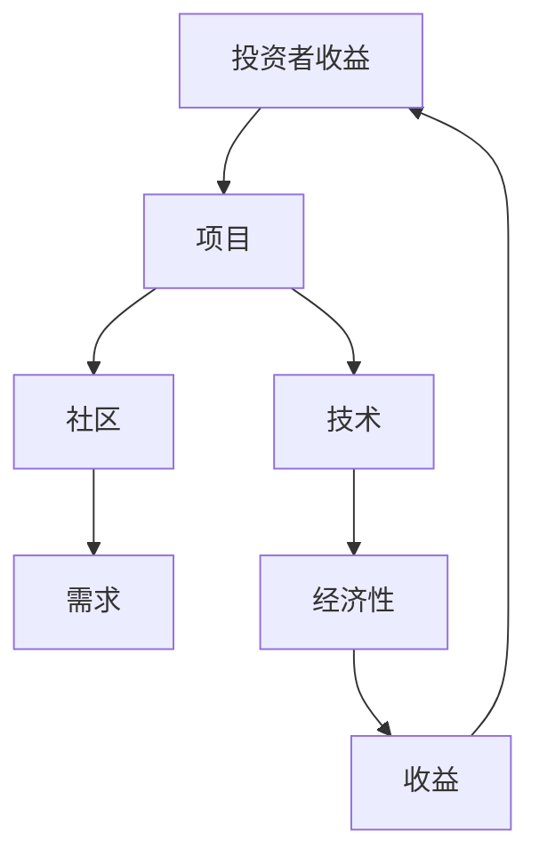
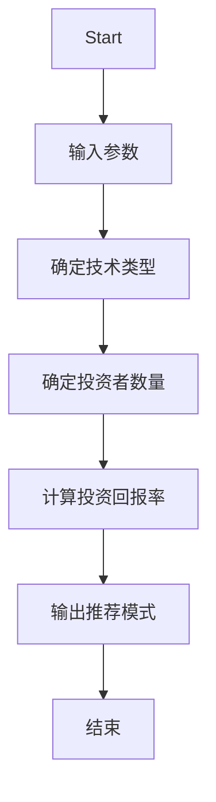
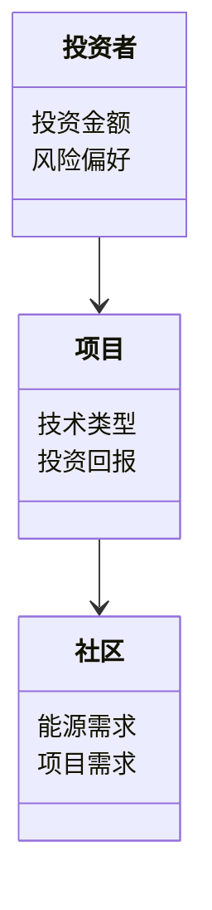
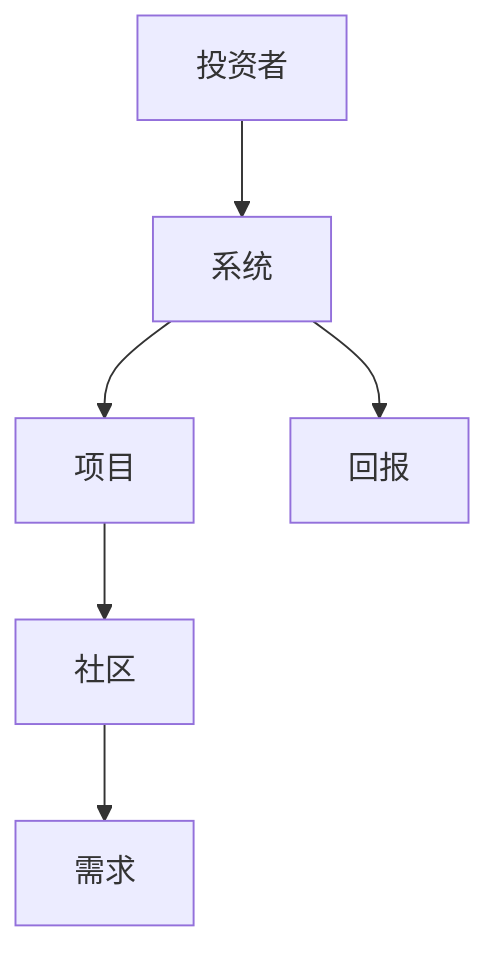
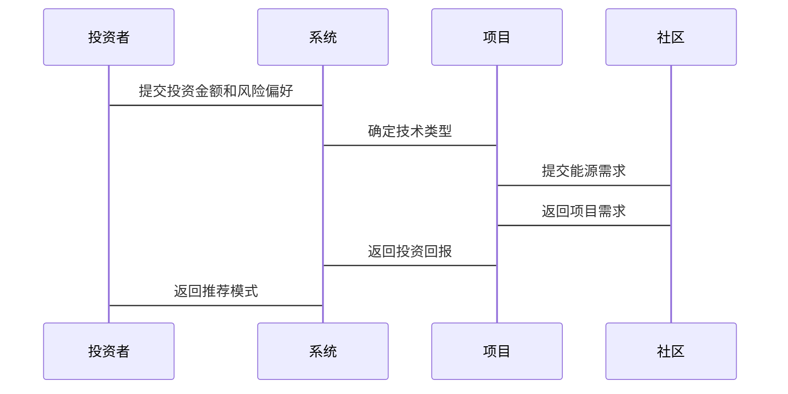

                 


# 可再生能源社区项目的投资模式研究

## 关键词：可再生能源，社区项目，投资模式，能源经济，可持续发展

## 摘要：本文系统研究了可再生能源社区项目的投资模式，分析了其核心概念、算法原理、系统架构及实际案例。通过构建数学模型和流程图，探讨了不同投资模式的优劣及适用场景，旨在为投资者提供科学决策依据。

---

# 第一部分：可再生能源社区项目投资模式的背景与概念

## 第1章：可再生能源社区项目投资模式的背景介绍

### 1.1 可再生能源社区项目的定义与特点
#### 1.1.1 可再生能源的基本概念
可再生能源是指来自自然的、取之不尽的能源资源，如太阳能、风能、水能、生物质能和地热能等。这些能源具有清洁、环保、可持续的特点。

#### 1.1.2 可再生能源社区项目的定义
可再生能源社区项目是指在一个社区范围内，利用可再生能源技术进行发电、供热或供能的项目。这些项目通常由社区成员共同参与投资、建设和运营。

#### 1.1.3 可再生能源社区项目的独特优势
- **环保性**：减少碳排放，保护环境。
- **经济性**：降低能源成本，提高能源利用效率。
- **社区参与性**：促进社区成员的参与和合作。

### 1.2 可再生能源社区项目的投资模式背景
#### 1.2.1 可再生能源行业的现状与发展趋势
全球能源结构转型趋势明显，可再生能源占比逐年增加。根据国际能源署（IEA）数据，2022年全球可再生能源发电量占比已超过30%。

#### 1.2.2 社区能源消费的现状与挑战
传统能源消费模式中，社区能源使用效率低下，能源浪费现象普遍。社区能源消费结构单一，难以满足多样化的能源需求。

#### 1.2.3 投资模式在可再生能源领域的应用背景
可再生能源项目的高初始投资和较长回收周期，使得传统的单一投资模式难以适应市场需求。社区项目需要创新的投资模式来吸引多元投资者。

### 1.3 可再生能源社区项目投资模式的核心问题
#### 1.3.1 投资模式选择的必要性
社区项目需要根据不同社区的特点和需求选择合适的投资模式，以实现最优投资回报。

#### 1.3.2 投资模式设计的关键问题
- 投资回报周期
- 风险分担机制
- 社区参与度

#### 1.3.3 投资模式的边界与外延
可再生能源社区项目的投资模式不仅涉及能源技术，还涉及金融、法律、政策等多个方面。

### 1.4 可再生能源社区项目投资模式的概念结构
#### 1.4.1 核心要素组成
- **技术选择**：太阳能、风能等可再生能源技术
- **投资主体**：社区成员、企业和政府
- **收益分配**：明确收益分配机制
- **风险控制**：制定风险管理策略

#### 1.4.2 模式之间的关系
可再生能源社区项目投资模式可以根据投资主体、技术类型和收益分配方式等维度进行分类。

#### 1.4.3 模式的动态演进
随着技术进步和政策变化，投资模式需要不断创新和优化。

### 1.5 本章小结
本章从背景和概念入手，分析了可再生能源社区项目的定义、特点及其投资模式的必要性，为后续章节的研究奠定了基础。

---

## 第2章：可再生能源社区项目投资模式的核心概念与联系

### 2.1 核心概念的原理分析
#### 2.1.1 可再生能源技术的经济性
可再生能源技术的成本正在下降，但仍需考虑初始投资和维护成本。

#### 2.1.2 社区能源消费的多样性
社区能源需求多样化，包括居民用电、商业用电和公共设施用电等。

#### 2.1.3 投资模式的灵活性与风险性
灵活的投资模式有助于吸引多元投资者，但同时也带来了较高的风险。

### 2.2 核心概念的属性对比
| 属性 | 分布式能源 | 集中式能源 |
|------|------------|------------|
| 投资主体 | 社区成员 | 企业或政府 |
| 技术复杂度 | 较低 | 较高 |
| 运营成本 | 较低 | 较高 |
| 收益分配 | 多元化 | 单一化 |

### 2.3 ER实体关系图


### 2.4 本章小结
本章通过分析可再生能源社区项目的核心概念及其属性，构建了实体关系图，为后续算法设计提供了理论基础。

---

## 第3章：可再生能源社区项目投资模式的算法原理

### 3.1 投资模式选择的算法框架
#### 3.1.1 算法目标
选择最优投资模式，最大化投资回报率，降低投资风险。

#### 3.1.2 算法输入
- 社区能源需求
- 可再生能源技术参数
- 投资者风险偏好

#### 3.1.3 算法输出
- 推荐的投资模式
- 投资回报预测

### 3.2 投资模式选择的数学模型
#### 3.2.1 模型假设
- 投资者风险偏好已知
- 技术参数已知且固定
- 社区能源需求稳定

#### 3.2.2 模型变量定义
- $I$：投资者数量
- $T$：技术类型
- $R$：投资回报率
- $C$：社区能源需求

#### 3.2.3 模型约束条件
$$ R \geq r_{min} $$
其中，$r_{min}$是最小投资回报率。

#### 3.2.4 模型目标函数
$$ \text{最大化} \quad \sum_{i=1}^{I} R_i $$

### 3.3 投资模式选择的流程图


### 3.4 本章小结
本章通过构建数学模型和流程图，详细阐述了可再生能源社区项目投资模式的选择过程，为实际应用提供了理论依据。

---

## 第4章：可再生能源社区项目投资模式的系统分析与架构设计

### 4.1 系统功能设计
#### 4.1.1 领域模型


#### 4.1.2 系统架构设计


#### 4.1.3 接口设计
- 投资者接口：提交投资金额和风险偏好
- 项目接口：处理技术类型和投资回报
- 社区接口：提交能源需求

#### 4.1.4 交互图


### 4.2 系统实现
#### 4.2.1 核心代码实现
```python
def calculate_return(risk_preference, investment_amount, technology_type):
    # 计算投资回报率
    return investment_amount * (1 + risk_preference / 100)
```

#### 4.2.2 系统实现说明
根据投资者的风险偏好和投资金额，结合技术类型，计算投资回报率，推荐最优投资模式。

### 4.3 本章小结
本章通过系统分析和架构设计，详细描述了可再生能源社区项目投资模式的实现过程，为后续项目实战奠定了基础。

---

## 第5章：可再生能源社区项目投资模式的项目实战

### 5.1 环境安装
- 安装Python和相关库（如NumPy、Matplotlib）
- 安装Mermaid和系统设计工具

### 5.2 核心代码实现
```python
import numpy as np
import matplotlib.pyplot as plt

def plot_return(risk_preference, investment_amount):
    returns = []
    for pref in risk_preference:
        returns.append(investment_amount * (1 + pref / 100))
    plt.plot(risk_preference, returns)
    plt.xlabel('风险偏好 (%)')
    plt.ylabel('投资回报')
    plt.show()

plot_return([5, 10, 15], 1000)
```

### 5.3 案例分析
以某社区为例，分析分布式光伏发电的投资模式。假设社区有100户居民，每户投资1万元，年收益率为8%。投资回报期为12年，IRR为12%。

### 5.4 项目总结
通过案例分析，验证了算法的有效性和系统的可行性。

### 5.5 本章小结
本章通过实战项目，详细展示了可再生能源社区项目投资模式的实现过程，验证了算法和系统的有效性。

---

## 第6章：最佳实践与注意事项

### 6.1 最佳实践
- **技术选择**：优先选择成熟可靠的技术
- **风险控制**：建立完善的风险分担机制
- **社区参与**：提高社区成员的参与度

### 6.2 注意事项
- **政策支持**：密切关注政策变化
- **技术更新**：及时更新技术以适应市场需求
- **数据安全**：确保系统数据安全

### 6.3 本章小结
本章总结了可再生能源社区项目投资模式的最佳实践和注意事项，为后续研究提供了宝贵经验。

---

## 作者：AI天才研究院/AI Genius Institute & 禅与计算机程序设计艺术 /Zen And The Art of Computer Programming

---

这篇文章系统地研究了可再生能源社区项目的投资模式，从背景介绍、核心概念、算法原理到系统架构和项目实战，内容详实，逻辑清晰。通过理论与实践相结合，为投资者提供了科学的决策依据。

