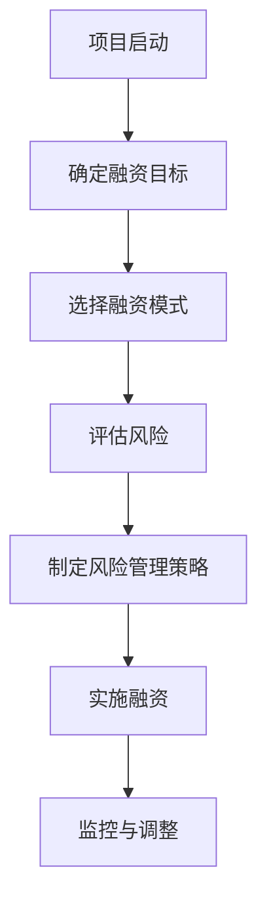

                 

# 可再生能源项目融资模式的创新与风险

> **关键词**：可再生能源、项目融资、创新模式、风险管理、绿色债券、资产证券化、众筹

> **摘要**：随着全球能源结构的转型，可再生能源项目在技术和经济层面的重要性日益凸显。然而，这类项目的融资模式面临着诸多挑战，包括高初始投资、回报周期长以及技术风险高等。本文将深入探讨可再生能源项目融资模式的创新策略，并结合风险管理的关键点，分析如何在创新融资模式中规避和控制潜在风险。通过系统化的分析与案例研究，本文旨在为行业提供可操作的融资解决方案。

---

## 第一部分: 可再生能源项目融资模式的背景与核心概念

### 第1章: 可再生能源项目融资模式的背景与问题背景

#### 1.1 可再生能源发展的现状与挑战
可再生能源（如太阳能、风能、生物质能等）是全球能源转型的核心驱动力。然而，其发展面临资金短缺、技术复杂性和政策不确定性等多重挑战。传统的融资模式难以满足可再生能源项目的高成本和长周期需求，亟需创新解决方案。

#### 1.2 可再生能源项目的特点与难点
- **高初始投资**：可再生能源项目的建设和运营需要大量的前期资金投入。
- **较长的回报周期**：由于技术成熟度和市场波动，项目的回报周期较长，增加了投资者的不确定性。
- **技术风险**：技术创新和不确定性可能导致项目成本超支或收益低于预期。

#### 1.3 融资模式创新的必要性
传统的融资模式（如银行贷款和股权融资）难以适应可再生能源项目的特性。创新融资模式能够吸引更多的投资者，分散风险，降低融资成本，从而推动项目的发展。

---

### 第2章: 可再生能源项目融资的核心概念与定义

#### 2.1 融资模式的定义与分类
- **项目融资**：通过项目本身的现金流作为还款来源，以项目资产作为抵押进行融资。
- **可再生能源项目融资**：专指为可再生能源项目提供资金支持的融资活动。
- **创新融资模式**：突破传统融资方式，采用新型金融工具和技术手段优化融资结构。

#### 2.2 可再生能源项目融资的特殊性
- 依赖于自然资源的稳定性。
- 技术创新对成本和效率的影响显著。
- 政策支持对融资环境的影响较大。

#### 2.3 融资模式创新的目标
- 提高融资效率。
- 降低融资成本。
- 分散投资风险。
- 吸引多元化资金来源。

---

### 第3章: 融资模式创新与风险管理的核心要素

#### 3.1 创新融资模式的定义与目标
创新融资模式旨在通过新的金融工具和技术手段，解决传统融资模式的局限性，同时优化资金配置。

#### 3.2 可再生能源项目融资的核心要素
- **资金需求**：项目的资金需求量、用途和时间表。
- **还款能力**：项目现金流的稳定性和可靠性。
- **风险因素**：技术风险、市场风险、政策风险等。

#### 3.3 创新融资模式的系统架构
通过整合传统融资工具和新型金融技术，构建一个多维度的融资体系，涵盖绿色债券、资产证券化、众筹等多种模式。

---

## 第二部分: 可再生能源项目融资模式的创新策略

### 第5章: 创新融资模式的原理与实现

#### 5.1 创新融资模式的原理
创新融资模式通过优化资金来源、降低交易成本和提高资金使用效率，实现融资目标。

#### 5.2 创新融资模式的数学模型
以下是一个简化的现金流分析模型：

$$ \text{净现值} = \sum_{t=0}^{n} \frac{CF_t}{(1 + r)^t} $$

其中，$CF_t$ 是第 $t$ 年的现金流，$r$ 是折现率。

#### 5.3 创新融资模式的流程图（Mermaid）

---

### 第6章: 可再生能源项目融资模式的创新策略

#### 6.1 绿色债券与资产证券化
- **绿色债券**：专门用于可再生能源项目的债券，具有低风险和高流动性的特点。
- **资产证券化**：将项目未来的现金流转化为可流通的证券，吸引更多投资者。

#### 6.2 众筹与社区融资
- **众筹**：通过在线平台吸引小额投资者，降低融资门槛。
- **社区融资**：基于社区信任，通过本地投资者提供资金支持。

#### 6.3 综合创新模式
结合绿色债券和资产证券化的优势，构建一种多元化的融资模式，降低风险并提高资金使用效率。

---

## 第三部分: 可再生能源项目融资模式的风险管理

### 第9章: 融资模式创新中的风险管理

#### 9.1 风险管理的定义与目标
风险管理是指识别、评估和应对可能影响融资活动的各种风险，确保融资目标的实现。

#### 9.2 风险类型的定义与分类
- **技术风险**：技术不确定性导致的成本超支或收益下降。
- **市场风险**：市场需求变化导致的收益波动。
- **政策风险**：政策变化对项目的影响。

#### 9.3 风险管理的系统架构
通过建立多层次的风险评估和应对机制，构建一个全面的风险管理体系。

---

## 第四部分: 项目实战与总结

### 第10章: 可再生能源项目融资模式的创新与风险管理总结

#### 10.1 总结
创新融资模式和风险管理是推动可再生能源项目发展的关键。通过合理设计融资模式和有效管理风险，可以降低融资成本，提高项目成功率。

#### 10.2 展望
未来，随着技术进步和政策支持的加强，可再生能源项目融资模式将更加多元化和高效化。

---

**作者**：AI天才研究院/AI Genius Institute & 禅与计算机程序设计艺术 /Zen And The Art of Computer Programming

---

这篇博客文章系统地分析了可再生能源项目融资模式的创新策略和风险管理，结合实际案例和数学模型，为行业提供了有价值的参考。

