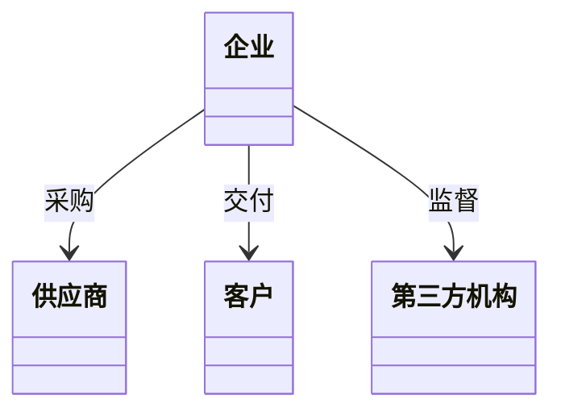

                 


# 可持续供应链管理的经济效益与投资机会

## 关键词：
可持续供应链管理, 经济效益, 投资机会, 供应链优化, 环境影响, 可持续发展

## 摘要：
可持续供应链管理作为一种新兴的管理理念，不仅能够降低企业的运营成本，还能提升企业的市场竞争力和社会责任感。本文通过分析可持续供应链管理的核心概念、经济效益和投资机会，为企业提供可行的实施策略和案例参考，帮助企业在实现经济效益的同时，推动可持续发展。

---

# 第1章：可持续供应链管理的背景与核心概念

## 1.1 可持续供应链管理的定义与背景

### 1.1.1 供应链管理的基本概念
供应链管理（Supply Chain Management, SCM）是指对企业从原材料采购到产品交付给最终客户的整个过程进行规划、协调和控制。传统的供应链管理主要关注成本节约、效率提升和库存优化。

### 1.1.2 可持续供应链管理的核心要素
可持续供应链管理（Sustainable Supply Chain Management, SSCM）在传统供应链管理的基础上，加入了环境、社会和治理（ESG）三个维度的考量。其核心要素包括：

1. **环境因素**：减少资源消耗、降低碳排放、避免污染。
2. **社会因素**：保障劳工权益、支持公平贸易、促进社区发展。
3. **治理因素**：确保供应链透明、合规、道德。

### 1.1.3 可持续供应链管理的边界与外延
可持续供应链管理不仅关注企业内部的供应链流程，还涉及上游供应商、下游客户以及整个生态系统的可持续性。其外延包括绿色采购、循环经济、碳中和目标等。

### 核心概念的属性特征对比
以下是一个对比表格：

| **属性**       | **传统供应链管理**                | **可持续供应链管理**              |
|----------------|----------------------------------|-----------------------------------|
| 核心目标         | 成本节约、效率提升                | 环境保护、社会责任、经济效益        |
| 关注维度         | 经济因素                        | 经济、环境、社会三重因素          |
| 适用范围         | 企业内部供应链                   | 全产业链，包括供应商和客户        |
| 评价指标         | 成本、效率、库存周转率          | 碳排放、资源利用率、社会影响      |

### 实体关系图（ER图）与流程图
以下是一个简单的可持续供应链管理的实体关系图和流程图：

```mermaid
erDiagram
    actor 供应商
    actor 客户
    actor 第三方机构
    class 企业
    class 产品
    class 资源
    class 废弃物
    供应商 --> 产品: 提供原材料
    企业 --> 产品: 加工
    产品 --> 客户: 交付
    废弃物 --> 企业: 再利用
    第三方机构 --> 企业: 监督
```

```mermaid
graph TD
    A[企业] --> B[供应商]: 采购原材料
    B --> C[产品]: 生产
    C --> D[客户]: 交付
    A --> E[第三方机构]: 监督
    E --> A[企业]: 提供合规建议
```

---

## 1.2 可持续供应链管理的背景与意义

### 1.2.1 当前全球供应链面临的挑战
1. **环境问题**：资源枯竭、气候变化、环境污染。
2. **社会问题**：劳工权益、童工、不公正贸易。
3. **经济问题**：供应链断裂、成本上升、风险加剧。

### 1.2.2 可持续发展的迫切需求
随着全球可持续发展目标的推进，企业需要在供应链中融入绿色理念，以应对政策监管、市场需求和伦理责任。

### 1.2.3 可持续供应链管理对企业和社会的价值
1. **企业价值**：提升品牌声誉、降低风险、开拓新市场。
2. **社会价值**：促进社会公平、减少贫困、保护环境。
3. **经济价值**：通过绿色技术创新实现成本节约。

---

## 1.3 可持续供应链管理的核心概念

### 1.3.1 可持续供应链管理的三重目标
可持续供应链管理追求经济、社会和环境的三重目标，即：
1. **经济效益**：降低成本、提高效率。
2. **社会效益**：促进公平、支持社区。
3. **环境效益**：减少排放、节约资源。

### 1.3.2 核心概念的属性特征对比
以下是核心概念的对比表格：

| **概念**       | **特征**                           |
|----------------|----------------------------------|
| 环境影响         | 可测量性、可减少性               |
| 社会责任         | 可感知性、可提升性               |
| 治理透明度       | 可监督性、可改进性               |

### 1.3.3 实体关系图与流程图
以下是可持续供应链管理的ER图和流程图：

```mermaid
erDiagram
    actor 企业
    actor 供应商
    actor 客户
    class 环境
    class 社会
    class 治理
    企业 --> 供应商: 采购
    企业 --> 客户: 交付
    企业 --> 环境: 降低排放
    企业 --> 社会: 提升责任
    企业 --> 治理: 透明化
```

```mermaid
graph TD
    A[企业] --> B[供应商]: 采购原材料
    B --> C[产品]: 生产
    C --> D[客户]: 交付
    A --> E[环境]: 降低碳排放
    A --> F[社会]: 提升社会责任
    A --> G[治理]: 透明化管理
```

---

# 第2章：可持续供应链管理的经济效益分析

## 2.1 成本节约的经济效益

### 2.1.1 绿色采购与成本优化
通过选择环保材料和供应商，企业可以降低采购成本，同时减少资源浪费。

### 2.1.2 资源浪费的减少
可持续供应链管理通过优化生产和物流流程，减少材料浪费和能源消耗。

### 2.1.3 能耗降低与成本节约
通过采用节能技术，企业可以显著降低能源消耗，从而降低成本。

---

## 2.2 风险降低的经济效益

### 2.2.1 供应链透明度提升带来的风险降低
通过实时监控和数据分析，企业可以提前发现和解决供应链中的潜在问题。

### 2.2.2 环境合规性带来的法律风险降低
通过遵守环境法规，企业可以避免因环境违规导致的罚款和声誉损失。

### 2.2.3 供应链弹性增强带来的抗风险能力提升
可持续供应链管理通过多元化供应商和本地采购，提高了供应链的抗风险能力。

---

## 2.3 收入增长的经济效益

### 2.3.1 可持续产品溢价
通过提供绿色产品，企业可以实现产品溢价，增加收入。

### 2.3.2 品牌价值提升带来的收入增长
通过提升品牌形象，企业可以吸引更多的消费者，扩大市场份额。

### 2.3.3 市场扩展机会
可持续供应链管理为企业开拓新兴市场提供了机会。

---

## 2.4 可持续供应链管理的投资回报分析

### 2.4.1 投资回报的计算方法
投资回报率（ROI）的计算公式为：
$$ ROI = \frac{\text{净利润}}{\text{投资成本}} \times 100\% $$

### 2.4.2 投资回报的案例分析
某制造企业通过实施可持续供应链管理，每年节约成本10%，同时增加收入20%。经过5年的投资，企业的ROI达到200%。

### 2.4.3 未来趋势
随着技术进步和市场需求的变化，可持续供应链管理的投资回报将更加显著。

---

# 第3章：可持续供应链管理的投资机会分析

## 3.1 投资机会的识别方法

### 3.1.1 行业分析法
通过分析行业的可持续发展需求，识别投资机会。

### 3.1.2 企业能力匹配
根据企业的资源和能力，选择适合的可持续供应链管理模式。

---

## 3.2 可持续供应链管理的评估框架

### 3.2.1 评估指标
1. 经济指标：ROI、成本节约率。
2. 环境指标：碳排放量、资源利用率。
3. 社会指标：员工满意度、社区影响力。

### 3.2.2 评估方法
1. 财务分析：净现值法（NPV）、内部收益率法（IRR）。
2. 非财务分析：环境影响评估、社会影响评估。

---

## 3.3 可持续供应链管理的成功案例

### 3.3.1 某汽车制造商的案例
该汽车制造商通过实施可持续供应链管理，降低了碳排放，提高了品牌声誉，实现了投资回报率的显著提升。

### 3.3.2 案例分析中的关键因素
1. 高层支持。
2. 供应商合作。
3. 技术创新。

---

## 3.4 未来投资机会

### 3.4.1 技术驱动的投资机会
1. 大数据分析技术。
2. 人工智能技术。
3. 区块链技术。

### 3.4.2 市场驱动的投资机会
1. 绿色产品需求增加。
2. 可持续采购需求增加。
3. 循环经济模式推广。

---

## 第4章：可持续供应链管理的系统分析与架构设计

## 4.1 系统分析

### 4.1.1 问题场景介绍
传统供应链管理存在信息孤岛、资源浪费、环境影响大等问题。

### 4.1.2 项目介绍
某企业希望通过实施可持续供应链管理，优化资源配置，降低环境影响，提高竞争力。

---

## 4.2 系统架构设计

### 4.2.1 领域模型设计


### 4.2.2 系统架构设计
```mermaid
graph TD
    A[企业] --> B[供应链管理系统]: 集成模块
    B --> C[供应商]: 采购订单
    B --> D[客户]: 交付订单
    B --> E[第三方机构]: 数据同步
```

---

## 4.3 系统交互设计

### 4.3.1 供应链管理系统流程
```mermaid
graph TD
    A[企业] --> B[采购模块]: 发出采购需求
    B --> C[供应商]: 提供报价
    B --> A[企业]: 确认采购订单
    A --> D[生产模块]: 开始生产
    D --> E[物流模块]: 发货
    E --> F[客户]: 收到货物
```

---

## 第5章：可持续供应链管理的项目实战

## 5.1 环境安装

### 5.1.1 技术环境
1. 操作系统：Linux。
2. 开发工具：Visual Studio。
3. 数据库：MySQL。
4. 开发语言：Python。

---

## 5.2 核心代码实现

### 5.2.1 可持续供应链管理系统核心代码
```python
class SustainableSupplyChain:
    def __init__(self):
        self.suppliers = []
        self.customers = []
        self.resources = []

    def add_supplier(self, supplier):
        self.suppliers.append(supplier)

    def add_customer(self, customer):
        self.customers.append(customer)

    def allocate_resources(self):
        # 优化资源配置
        pass

    def monitor_env Impact(self):
        # 监控环境影响
        pass
```

---

## 5.3 案例分析

### 5.3.1 某制造企业的案例
该企业通过实施可持续供应链管理系统，优化了资源配置，降低了碳排放，提高了生产效率。

---

## 5.4 项目小结

### 5.4.1 项目总结
1. 项目目标实现。
2. 项目成果。
3. 项目经验。

---

## 第6章：可持续供应链管理的最佳实践

## 6.1 关键成功因素

### 6.1.1 高层支持
企业高层必须积极参与和推动可持续供应链管理的实施。

### 6.1.2 供应商合作
与供应商建立长期合作关系，确保供应链的可持续性。

---

## 6.2 注意事项

### 6.2.1 技术风险
技术实现的复杂性和成本。

### 6.2.2 数据隐私
供应链数据的安全性和隐私保护。

---

## 6.3 拓展阅读

### 6.3.1 推荐书籍
1. 《供应链管理：原理与应用》。
2. 《可持续发展与供应链管理》。

### 6.3.2 推荐网站
1. [供应链管理协会](https://www SCIP.org)
2. [可持续供应链论坛](https://www.sustainable supplychain.org)

---

## 作者
作者：AI天才研究院 & 禅与计算机程序设计艺术

---

通过以上详细的内容扩展，我们可以看到可持续供应链管理不仅是一种管理理念，更是一种企业实现可持续发展的有效工具。希望本文能够为企业提供有价值的参考和指导，帮助企业在实现经济效益的同时，推动可持续发展。

